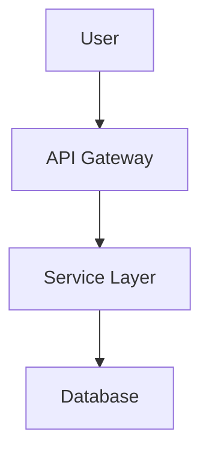
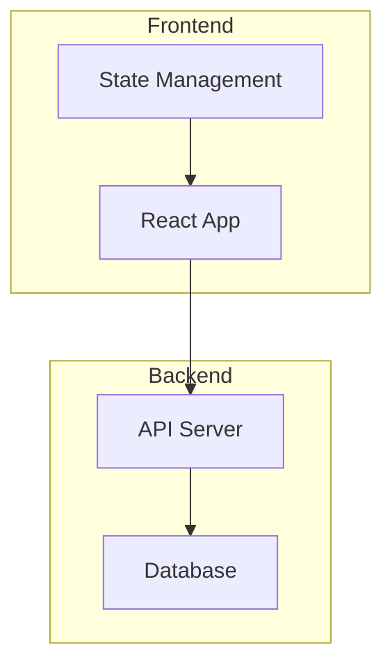

# Visual Communication Protocol

## Purpose

Defines standards for visual output across Loa agents using Mermaid diagrams; GitHub native is the default rendering mode.

## Rendering Modes

| Mode | Output | Use Case | Dependencies |
|------|--------|----------|--------------|
| **GitHub Native** (default) | `\`\`\`mermaid` code block | All markdown docs | None |
| **Local Render** | SVG/PNG files | Image exports | Node.js, mermaid-cli |
| **URL (legacy)** | Preview URL | External sharing | External service |

### Mode Selection Priority

1. Explicit flag (`--github`, `--render`, `--url`)
2. Config `visual_communication.mode`
3. Default: `github`

## When to Include Diagrams

| Agent | Diagrams | Requirement |
|-------|----------|-------------|
| designing-architecture | System architecture, component interactions, data models, state machines | Required |
| translating-for-executives | Executive summary diagrams, high-level flows | Required |
| discovering-requirements | User journeys, process flows | Optional |
| planning-sprints | Sprint workflow, task dependencies | Optional |
| reviewing-code | Code flow diagrams | Optional |

## Diagram Type Selection

| Type | Mermaid Syntax |
|------|----------------|
| Flowchart | `graph TD` / `graph LR` |
| Sequence | `sequenceDiagram` |
| Class | `classDiagram` |
| State | `stateDiagram-v2` |
| ER | `erDiagram` |

## Output Formats

### GitHub Native (Default)

A plain fenced block, no wrapper needed:

```markdown
### Component Architecture


```

No external dependency, no character limit, renders wherever GitHub renders markdown (PRs, issues, wiki).

### Local Render (Optional)

Same block, plus a rendered-image link:

```markdown
> **Rendered**: [View SVG](grimoires/loa/diagrams/diagram-abc12345.svg)
```

Use for documentation exports (PDF generation), presentations, or offline rendering.

### Preview URL (Legacy)

Same block, plus a preview-service link, only when explicitly configured:

```markdown
> **Preview**: [View diagram](https://agents.craft.do/mermaid?code=...&theme=github)
```

**Note:** The default external service (`agents.craft.do/mermaid`) is unreliable. Use GitHub native or local render instead.

## Script Usage

```bash
# GitHub native (default): from stdin
echo 'graph TD; A-->B' | .claude/scripts/mermaid-url.sh --stdin
# GitHub native: from file
.claude/scripts/mermaid-url.sh diagram.mmd

# Local render: default SVG output
echo 'graph TD; A-->B' | .claude/scripts/mermaid-url.sh --stdin --render
# Local render: PNG with theme
echo 'graph TD; A-->B' | .claude/scripts/mermaid-url.sh --stdin --render --format png --theme dracula
# Local render: custom output directory
echo 'graph TD; A-->B' | .claude/scripts/mermaid-url.sh --stdin --render --output-dir /tmp/diagrams

# Legacy URL
echo 'graph TD; A-->B' | .claude/scripts/mermaid-url.sh --stdin --url

# Check configuration
.claude/scripts/mermaid-url.sh --check
```

## Theme Configuration

| Theme ID | Best For |
|----------|----------|
| `github` | Documentation, PRs (default) |
| `dracula` | Dark mode users |
| `nord` | Accessibility |
| `tokyo-night` | IDE integration |
| `solarized-light` | Print-friendly |
| `solarized-dark` | Low-light environments |
| `catppuccin` | Modern aesthetic |

Agents read the theme from `.loa.config.yaml`:

```yaml
visual_communication:
  theme: "github"  # Default theme
```

## Configuration Reference

```yaml
# .loa.config.yaml
visual_communication:
  enabled: true                              # Master toggle
  mode: "github"                             # Default mode: github | render | url
  theme: "github"                            # Default theme

  # Local rendering options
  local_render:
    output_format: "svg"                     # svg | png
    output_dir: "grimoires/loa/diagrams/"    # Output directory

  # Legacy URL options (for mode: url)
  service: "https://agents.craft.do/mermaid" # External service URL
  include_preview_urls: false                # Generate preview links
```

## Local Rendering Dependencies

For `--render` mode, install mermaid-cli: `npm install -g @mermaid-js/mermaid-cli`, or use `npx @mermaid-js/mermaid-cli` (auto-installs on first use). Requires Node.js >= 18 and Chrome/Chromium (for PNG rendering).

## Subgraph Usage



## Integration with Skills

Skills should include:

```markdown
<visual_communication>
## Visual Communication

Follow `.claude/protocols/visual-communication.md` for diagram standards.

### Output Format

Use GitHub native Mermaid code blocks (default). Example:

\`\`\`mermaid
graph TD
    A[Component] --> B[Other]
\`\`\`

For image exports, use `--render` mode.
</visual_communication>
```

## Privacy & Security

**GitHub Native**: no external data transmission; source stays local.

**Local Render**: full privacy (no external service); requires local Node.js + mermaid-cli.

**URL (Legacy)**: sends the Mermaid source (base64 URL-encoded) and theme parameter to the external service. For proprietary architecture or security-sensitive diagrams, use `github` or `render` mode instead.

`mermaid-url.sh` validates:
- Theme names against an allowlist (prevents injection)
- Output format against an allowlist
- Basic Mermaid syntax (requires a valid diagram type)
- Config values (only allows safe characters)

## Related

- `.claude/scripts/mermaid-url.sh` - Multi-mode rendering script
- `.loa.config.yaml` - Configuration file
- SDD Section 4 - Component design details
