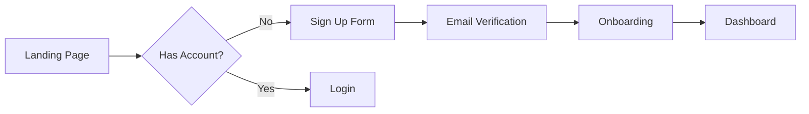

# PRD Architect Reference

## Discovery Phase Questions

### Phase 1: Problem & Vision
- What problem are we solving, and for whom?
- What does success look like from the user's perspective?
- What's the broader vision this fits into?
- Why is this important now?

### Phase 2: Goals & Success Metrics
- What are the specific, measurable goals?
- How will we know this is successful? (KPIs, metrics)
- What's the expected timeline and key milestones?
- What constraints or limitations exist?

### Phase 3: User & Stakeholder Context
- Who are the primary users? What are their characteristics?
- What are the key user personas and their needs?
- Who are the stakeholders, and what are their priorities?
- What existing solutions or workarounds do users employ?

### Phase 4: Functional Requirements
- What are the must-have features vs. nice-to-have?
- What are the critical user flows and journeys?
- What data needs to be captured, stored, or processed?
- What integrations or dependencies exist?

### Phase 5: Technical & Non-Functional Requirements
- What are the performance, scalability, or reliability requirements?
- What are the security, privacy, or compliance considerations?
- What platforms, devices, or browsers must be supported?
- What are the technical constraints or preferred technologies?

### Phase 6: Scope & Prioritization
- What's explicitly in scope for this release?
- What's explicitly out of scope?
- How should features be prioritized if tradeoffs are needed?
- What's the MVP vs. future iterations?

### Phase 7: Risks & Dependencies
- What are the key risks or unknowns?
- What dependencies exist (other teams, systems, external factors)?
- What assumptions are we making?
- What could cause this to fail?

## PRD Quality Checklist

### Structure
- [ ] Table of contents present
- [ ] All 13 required sections included
- [ ] Clear section headings and navigation

### Requirements Quality
- [ ] All requirements have acceptance criteria
- [ ] Requirements are specific and testable
- [ ] Priority levels assigned (Must Have/Should Have/Nice to Have)
- [ ] Dependencies identified

### Metrics Quality
- [ ] Success metrics are quantifiable
- [ ] Baseline values documented
- [ ] Target values specified
- [ ] Timeline for measurement defined

### Scope Quality
- [ ] MVP clearly defined
- [ ] Out of scope items listed with rationale
- [ ] Future iterations outlined
- [ ] Priority matrix included

### Risk Quality
- [ ] Risks identified with probability and impact
- [ ] Mitigation strategies defined
- [ ] Assumptions documented
- [ ] External dependencies noted

## Common Anti-Patterns to Avoid

1. **Vague Requirements**
   - BAD: "The system should be fast"
   - GOOD: "Page load time < 2 seconds on 3G connection"

2. **Missing Acceptance Criteria**
   - BAD: "Users can log in"
   - GOOD: "Users can log in with email/password, receiving session token valid for 24 hours"

3. **Unquantifiable Metrics**
   - BAD: "Improve user engagement"
   - GOOD: "Increase DAU by 20% within 30 days of launch"

4. **Scope Creep Enablers**
   - BAD: "And any other features users might want"
   - GOOD: Explicitly list out-of-scope items with rationale

5. **Undefined Personas**
   - BAD: "Users will appreciate this feature"
   - GOOD: "Power users (>10 sessions/week) will save 15 minutes daily"

## Edge Cases

| Scenario | Behavior |
|----------|----------|
| No context directory | Create it, add README.md, proceed to full interview |
| Empty context directory | Note it, proceed to full interview |
| Only README.md exists | Treat as empty, proceed to full interview |
| Contradictory information | List contradictions, ask developer to clarify |
| Outdated information | Ask "Is this still accurate?" before using |
| Very large files (>1000 lines) | Summarize key sections, note full file available |
| Non-markdown files | Note existence, explain can't parse |
| Partial coverage | Conduct mini-interviews for gaps only |
| Developer disagrees with synthesis | Allow corrections, update understanding |
| Reality conflicts with context | Reality wins, flag conflict for user review |
| Stale reality (>7 days) | Prompt user to refresh or proceed with cached |
| /ride failed | Log blocker, proceed without grounding (with warning) |
| Brownfield detected but no reality | Present 3-option AskUserQuestion: Run /ride, Run /ride --enriched, Skip grounding |
| Greenfield project | Skip codebase grounding entirely, no message |

## Visual Communication (Optional)

Follow `.claude/protocols/visual-communication.md` for diagram standards.

### When to Include Diagrams

PRDs may benefit from visual aids for:
- **User Journeys** (flowchart) - Show user flows through the product
- **Process Flows** (flowchart) - Illustrate business processes
- **Stakeholder Maps** (flowchart) - Show stakeholder relationships

### Output Format

If including diagrams, use Mermaid with preview URLs:

```markdown
### User Registration Journey



> **Preview**: [View diagram](https://agents.craft.do/mermaid?code=...&theme=github)
```

### Theme Configuration

Read theme from `.loa.config.yaml` visual_communication.theme setting.

Diagram inclusion is **optional** for PRDs - use agent discretion based on complexity.

## Phase Transition Protocol

Applied after each discovery phase (see SKILL.md "### Phase Transitions" for the
per-phase value table). Substitute `{THIS}` = current phase name, `{NEXT}` = next
phase name, `{NEXT_NUM}` = next phase number.

When `gate_between` is true:
1. Summarize what was learned in this phase (3-5 bullets, cited)
2. State what carries forward to the next phase
3. Present transition:
   - If `routing_style` == "structured": Use AskUserQuestion:
     question: "Phase {N} complete. Ready for Phase {NEXT_NUM}: {NEXT}?"
     header: "Phase {N}"
     options:
       - label: "Continue"
         description: "Move to {NEXT}"
       - label: "Go back"
         description: "Revisit this phase — I have corrections"
       - label: "Skip ahead"
         description: "Jump to PRD generation — enough context gathered"
   - If `routing_style` == "plain":
     "Phase {N}: {THIS} complete. Moving to Phase {NEXT_NUM}: {NEXT}. Continue, go back, or skip ahead?"
4. WAIT for response. DO NOT auto-continue.

When `gate_between` is false:
One-line transition: "Moving to Phase {NEXT_NUM}: {NEXT}."

Phase 7 is terminal — it moves to pre-generation review, not a next phase: carry
forward to PRD generation, omit the "Skip ahead" option, and use "Moving to
pre-generation review." (plain) / "Moving to PRD generation." (gate off). The
Phase 7 structured option description is "Move to pre-generation summary".


# Codebase-grounding error recovery (cycle-121 split from SKILL.md Phase -0.5)

Execute EXACTLY as written when /ride fails or times out during grounding.

### Error Recovery

If /ride fails or times out:

1. **Capture error** in NOTES.md Decision Log:
   ```markdown
   | Date | Decision | Rationale | Source |
   |------|----------|-----------|--------|
   | YYYY-MM-DD | /ride failed during codebase grounding | [error message] | Phase -0.5 |
   ```

2. **Check config for auto-skip**:
   ```bash
   skip_on_error=$(yq eval '.plan_and_analyze.codebase_grounding.skip_on_ride_error // false' .loa.config.yaml)
   ```
   If `skip_on_error: true`, automatically skip to Phase -1 with warning.

3. **Otherwise prompt user** with AskUserQuestion:
   ```yaml
   questions:
     - question: "/ride analysis failed. How would you like to proceed?"
       header: "Recovery"
       options:
         - label: "Retry /ride analysis"
           description: "Re-run codebase analysis (recommended)"
         - label: "Skip codebase grounding"
           description: "Proceed without code-based requirements (not recommended)"
         - label: "Abort"
           description: "Cancel /plan-and-analyze entirely"
       multiSelect: false
   ```

4. **Handle user response**:

   **If "Retry"**:
   - Re-run /ride with fresh attempt
   - If fails again, return to step 3 (max 2 retries)

   **If "Skip"**:
   - Log warning to NOTES.md blockers:
     ```markdown
     - [ ] [BLOCKER] PRD created without codebase grounding - /ride failed: [error]
     ```
   - Proceed to Phase -1 without reality context
   - Add warning banner to generated PRD:
     ```markdown
     > ⚠️ **WARNING**: This PRD was created without codebase grounding.
     > Run `/ride` and `/plan-and-analyze --fresh` for accurate requirements.
     ```

   **If "Abort"**:
   - Log abort decision to trajectory
   - Exit cleanly with message: "Aborting /plan-and-analyze. Run /ride manually and retry."

5. **Preserve partial results** if available:
   - If /ride produced any output files before failing, keep them
   - Use whatever reality context exists for Phase 0

### Timeout Handling

Default timeout: 20 minutes (configurable in `.loa.config.yaml`)

```yaml
plan_and_analyze:
  codebase_grounding:
    ride_timeout_minutes: 20
```

## Codebase Grounding

SKILL.md's Phase -0.5 (Brownfield Only) delegates its configuration, decision
tree, and `/ride` invocation here.

### Configuration

```bash
enabled=$(yq eval '.plan_and_analyze.codebase_grounding.enabled // true' .loa.config.yaml 2>/dev/null || echo "true")
staleness_days=$(yq eval '.plan_and_analyze.codebase_grounding.reality_staleness_days // 7' .loa.config.yaml 2>/dev/null || echo "7")
timeout_minutes=$(yq eval '.plan_and_analyze.codebase_grounding.ride_timeout_minutes // 20' .loa.config.yaml 2>/dev/null || echo "20")
skip_on_error=$(yq eval '.plan_and_analyze.codebase_grounding.skip_on_ride_error // false' .loa.config.yaml 2>/dev/null || echo "false")
```

If `enabled: false`, skip Phase -0.5 entirely (equivalent to GREENFIELD behavior).

### Decision Tree

Check the `codebase_detection` pre-flight result:

| Condition | Action |
|---|---|
| `enabled: false`, or `type == GREENFIELD` | Skip to Phase -1; don't mention codebase grounding to the user |
| `BROWNFIELD`, reality exists, `reality_age_days < staleness_days` and no `--fresh` | Use cached reality; show "Using recent codebase analysis (N days old)" |
| `BROWNFIELD`, reality exists, stale or `--fresh` passed | Re-run `/ride` (if stale and no `--fresh`, ask the user to choose between re-running or proceeding with the existing analysis) |
| `BROWNFIELD`, no reality exists | Ask the user to run `/ride`, run `/ride --enriched`, or skip grounding |

**No cached reality** — ask via AskUserQuestion:

```yaml
question: "This is a brownfield project with no codebase reality files. How would you like to proceed?"
header: "Grounding"
options:
  - label: "Run /ride (Recommended)"
    description: "Analyze codebase first to ground PRD in code reality"
  - label: "Run /ride --enriched"
    description: "Full analysis with gap tracking, decision archaeology, and terminology extraction"
  - label: "Skip grounding"
    description: "Proceed without codebase analysis (not recommended for brownfield)"
multiSelect: false
```

"Run /ride" invokes the ride skill standard mode; "Run /ride --enriched" invokes it with `--enriched`; "Skip grounding" logs `- [ ] [BLOCKER] PRD created without codebase grounding — user skipped /ride for brownfield project` to NOTES.md blockers, proceeds to Phase -1 without reality context, and adds a warning banner to the generated PRD.

**Invoking /ride**: use the Skill tool (`Skill: ride`), not the `/ride` command. Show progress:

```markdown
CODEBASE GROUNDING PHASE

Analyzing your existing codebase to ground PRD requirements in reality.
This typically takes 5-15 minutes depending on codebase size.

Progress:
- [ ] Extracting component inventory
- [ ] Analyzing architecture patterns
- [ ] Identifying existing requirements
- [ ] Building consistency report
```

Produces `grimoires/loa/reality/extracted-prd.md`, `extracted-sdd.md`, `component-inventory.md`, and `grimoires/loa/consistency-report.md`.

Error/timeout handling: see "Codebase-grounding error recovery" above.

### Greenfield Fast Path

For GREENFIELD projects: no progress message, no delay, proceed directly to Phase -1, log detection result to trajectory only.

## Parallel Context Ingestion

SKILL.md's Large Context Handling (`LARGE` result) delegates its worked
ingestor-prompt template here.

Spawn 4 parallel ingestors:
1. **Vision Ingestor**: Problem, vision, mission
2. **User Ingestor**: Personas, research, journeys
3. **Requirements Ingestor**: Features, stories, specs
4. **Technical Ingestor**: Constraints, stack, integrations

```
Task(subagent_type="Explore", prompt="
CONTEXT INGESTION: Problem & Vision

Read these files: [vision.md, any *vision* or *problem* files]
Extract and summarize:
- Core problem statement
- Product vision
- Mission/purpose
- 'Why now' factors

Return as structured summary with file:line citations.
")
```

Merge summaries into a unified context map before proceeding.

## Post-Completion Debrief

SKILL.md's Post-Completion Debrief step (after saving and validating the PRD)
delegates its exact format here.

### Debrief Structure

Present the following in this exact order:

1. **Confirmation**: "✓ PRD saved to grimoires/loa/prd.md"

2. **Key Decisions** (3-5 items, one line each): "• {choice made} (not {alternative rejected})"

3. **Assumptions** (1-3 items, falsifiable): "• {assumption} — if wrong, {consequence}"

4. **Biggest Tradeoff** (1 item): "• Chose {A} over {B} — {reason}. Risk: {what could go wrong}"

5. **Steer Prompt**: Use AskUserQuestion:

```yaml
question: "Anything to steer before architecture?"
header: "Review"
options:
  - label: "Continue (Recommended)"
    description: "Design the system architecture now"
  - label: "Adjust"
    description: "Tell me what to change — I'll regenerate the PRD"
  - label: "Stop here"
    description: "Save progress — resume with /plan next time. Not what you expected? /feedback helps us fix it."
multiSelect: false
```

### "Adjust" Flow

When the user selects "Adjust": ask "What would you like to change?" (free-text via AskUserQuestion "Other"), then regenerate the PRD only — prior interview answers, context files, and phase state are retained, not the discovery interview. Re-present the debrief afterward with updated decisions/assumptions/tradeoffs, and note small changes explicitly ("Updated: {decision that changed}"). Cap adjustments at 3 rounds, then suggest "Continue" more firmly.

### Constraints

- "Continue" is always the first option (recommended)
- "Stop here" always includes /feedback mention
- If Flatline will run next, add a one-line banner BEFORE the steer prompt: "Next: Multi-model review (~30 seconds)"

## Pre-Generation Gate

SKILL.md's Pre-Generation Gate (when `gate_before_gen` is true) delegates its
exact completeness-summary template here.

```
Discovery Complete
---
Phases covered: {N}/7
Questions asked: {count}
Assumptions made: {count}

Top assumptions (review before I generate), up to 3:
1. [ASSUMPTION] {description} — if wrong, {impact}

Ready to generate PRD?
```
