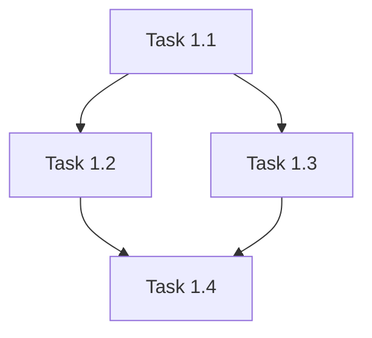

# Visual Communication

Follow `.claude/protocols/visual-communication.md` for diagram standards.

## When to Include Diagrams

Sprint plans may benefit from visual aids for:
- **Task Dependencies** (flowchart) - Show task blocking relationships
- **Sprint Workflow** (flowchart) - Illustrate sprint execution flow

## Output Format

If including diagrams, use Mermaid with preview URLs:

```markdown
## Appendix A: Task Dependencies



> **Preview**: [View diagram](https://agents.craft.do/mermaid?code=...&theme=github)
```

## Theme Configuration

Read theme from `.loa.config.yaml` visual_communication.theme setting.

Diagram inclusion is optional for sprint plans - use agent discretion.
