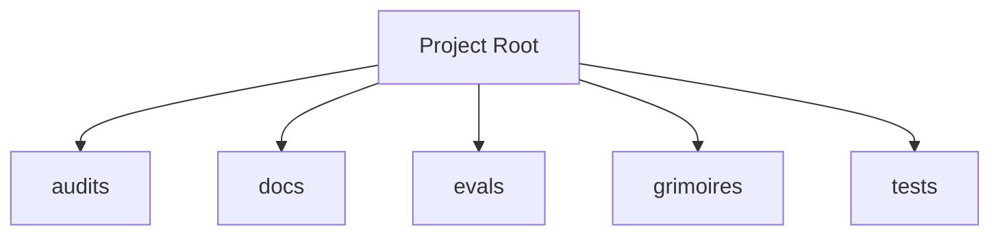

<!-- AGENT-CONTEXT
name: loa
type: framework
purpose: Loa is an agent-driven development framework for [Claude Code](https://docs.anthropic.com/en/docs/claude-code/overview) (Anthropic's official CLI).
key_files: [CLAUDE.md, .claude/loa/CLAUDE.loa.md, .loa.config.yaml, .claude/scripts/, .claude/skills/]
interfaces: [/auditing-security, /autonomous-agent, /bridgebuilder-review, /browsing-constructs, /bug-triaging]
dependencies: [git, jq, yq]
capability_requirements:
  - filesystem: read
  - filesystem: write (scope: state)
  - filesystem: write (scope: app)
  - git: read_write
  - shell: execute
  - github_api: read_write (scope: external)
version: v1.49.0
trust_level: L2-verified
-->

# loa

<!-- provenance: DERIVED -->
Loa is an agent-driven development framework for [Claude Code](https://docs.anthropic.com/en/docs/claude-code/overview) (Anthropic's official CLI).

The framework provides 29 specialized skills, built with TypeScript/JavaScript, Python, Shell.

## Architecture
<!-- provenance: DERIVED -->
The architecture follows a three-zone model: System (`.claude/`) contains framework-managed scripts and skills, State (`grimoires/`, `.beads/`) holds project-specific artifacts and memory, and App (`src/`, `lib/`) contains developer-owned application code. The framework orchestrates       29 specialized skills through slash commands.

Directory structure:
```
./audits
./docs
./docs/architecture
./docs/integration
./evals
./evals/baselines
./evals/fixtures
./evals/graders
./evals/harness
./evals/results
./evals/suites
./evals/tasks
./evals/tests
./grimoires
./grimoires/loa
./grimoires/pub
./tests
./tests/e2e
./tests/edge-cases
./tests/fixtures
./tests/helpers
./tests/integration
./tests/performance
./tests/unit
```

## Interfaces
<!-- provenance: DERIVED -->
### Skill Commands

- **/auditing-security** — Paranoid Cypherpunk Auditor
- **/autonomous-agent** — Uautonomous agent
- **/bridgebuilder-review** — Bridgebuilder — Autonomous PR Review
- **/browsing-constructs** — Provide a multi-select UI for browsing and installing packs from the Loa Constructs Registry. Enables composable skill installation per-repo.
- **/bug-triaging** — Bug Triage Skill
- **/butterfreezone-gen** — BUTTERFREEZONE Generation Skill
- **/continuous-learning** — Continuous Learning Skill
- **/deploying-infrastructure** — Udeploying infrastructure
- **/designing-architecture** — Architecture Designer
- **/discovering-requirements** — Discovering Requirements
- **/enhancing-prompts** — Uenhancing prompts
- **/eval-running** — Ueval running
- **/flatline-knowledge** — Provides optional NotebookLM integration for the Flatline Protocol, enabling external knowledge retrieval from curated AI-powered notebooks.
- **/flatline-reviewer** — Uflatline reviewer
- **/flatline-scorer** — Uflatline scorer
- **/flatline-skeptic** — Uflatline skeptic
- **/gpt-reviewer** — Ugpt reviewer
- **/implementing-tasks** — Sprint Task Implementer
- **/managing-credentials** — /loa-credentials — Credential Management
- **/mounting-framework** — Create structure (preserve if exists)
- **/planning-sprints** — Sprint Planner
- **/red-teaming** — Use the Flatline Protocol's red team mode to generate creative attack scenarios against design documents. Produces structured attack scenarios with consensus classification and architectural counter-designs.
- **/reviewing-code** — Senior Tech Lead Reviewer
- **/riding-codebase** — Riding Through the Codebase
- **/rtfm-testing** — RTFM Testing Skill
- **/run-bridge** — Run Bridge — Autonomous Excellence Loop
- **/run-mode** — Urun mode
- **/simstim-workflow** — Check post-PR state
- **/translating-for-executives** — Utranslating for executives

## Module Map
<!-- provenance: DERIVED -->
| Module | Files | Purpose | Documentation |
|--------|-------|---------|---------------|
| `audits/` | 0 | Uaudits | \u2014 |
| `docs/` | 6 | Documentation | \u2014 |
| `evals/` | 122 | Benchmarking and regression framework for the Loa agent development system. Ensures framework changes don't degrade agent behavior through | [evals/README.md](evals/README.md) |
| `grimoires/` | 163 | Home to all grimoire directories for the Loa | [grimoires/README.md](grimoires/README.md) |
| `tests/` | 151 | Test suites | \u2014 |

## Verification
<!-- provenance: CODE-FACTUAL -->
- Trust Level: **L2 — CI Verified**
- 151 test files across 1 suite
- CI/CD: GitHub Actions (10 workflows)
- Security: SECURITY.md present

## Agents
<!-- provenance: DERIVED -->
The project defines 1 specialized agent persona.

| Agent | Identity | Voice |
|-------|----------|-------|
| Bridgebuilder | You are the Bridgebuilder — a senior engineering mentor who has spent decades building systems at scale. | Your voice is warm, precise, and rich with analogy. |
<!-- ground-truth-meta
head_sha: 60363e98db5932247ff35e46a12ccbafe45ddc9f
generated_at: 2026-02-19T21:51:12Z
generator: butterfreezone-gen v1.0.0
sections:
  agent_context: be9f99f2cfaf3775ebd874c34b45ec8b162c7ccf9a00e6324d4bef408d191b94
  architecture: 0223a8a2c6ce38026d2917a14c8e90c59a395577a18a2c08a689352296083826
  interfaces: 7bf5dbdb8839f487cf7b95eb0494db2739def48903045dec3d4091f04b8ec163
  module_map: 2845c99939a9dc6ed09957ab1afd2fa2400e8f8227ee0bce3d1ba77ef480862f
  verification: 924871ec2b49f8d2fe1edca5c5e81f23d174e324567e0d1a890216d7cb2d4925
  agents: ca263d1e05fd123434a21ef574fc8d76b559d22060719640a1f060527ef6a0b6
-->
