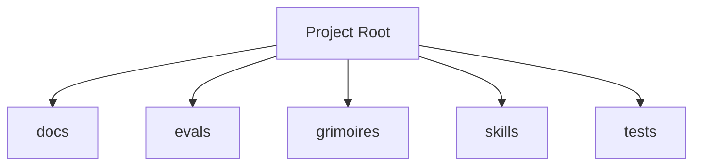

<!-- AGENT-CONTEXT
name: loa
type: framework
purpose: Loa is an agent-driven development framework for [Claude Code](https://docs.anthropic.com/en/docs/claude-code/overview) (Anthropic's official CLI).
key_files: [CLAUDE.md, .claude/loa/CLAUDE.loa.md, .loa.config.yaml, .claude/scripts/, .claude/skills/]
interfaces:
  core: [/auditing-security, /autonomous-agent, /bridgebuilder-review, /browsing-constructs, /bug-triaging]
  project: [/loa-setup, /spiraling, /validating-construct-manifest]
dependencies: [git, jq, yq]
ecosystem:
  - repo: 0xHoneyJar/loa-finn
    role: runtime
    interface: hounfour-router
    protocol: loa-hounfour@8.3.1
  - repo: 0xHoneyJar/loa-hounfour
    role: protocol
    interface: npm-package
    protocol: loa-hounfour@8.3.1
  - repo: 0xHoneyJar/arrakis
    role: distribution
    interface: jwt-auth
    protocol: loa-hounfour@8.3.1
capability_requirements:
  - filesystem: read
  - filesystem: write (scope: state)
  - filesystem: write (scope: app)
  - git: read_write
  - shell: execute
  - github_api: read_write (scope: external)
version: v1.109.1
installation_mode: unknown
trust_level: L2-verified
-->

# loa

<!-- provenance: DERIVED -->
Loa is an agent-driven development framework for [Claude Code](https://docs.anthropic.com/en/docs/claude-code/overview) (Anthropic's official CLI).

The framework provides 32 specialized skills, built with TypeScript/JavaScript, Python, Shell.

## Key Capabilities
<!-- provenance: DERIVED -->
The project exposes 15 key entry points across its public API surface.

### .claude/adapters

- **_build_provider_config** — Build ProviderConfig from merged hounfour config. (`.claude/adapters/cheval.py:152`)
- **_check_feature_flags** — Check feature flags. (`.claude/adapters/cheval.py:204`)
- **_error_json** — Format error as JSON for stderr (SDD §4.2.2 Error Taxonomy). (`.claude/adapters/cheval.py:77`)
- **_load_persona** — Load persona.md for the given agent with optional system merge (SDD §4.3.2). (`.claude/adapters/cheval.py:96`)
- **cmd_cancel** — Cancel a Deep Research interaction. (`.claude/adapters/cheval.py:523`)
- **cmd_invoke** — Main invocation: resolve agent → call provider → return response. (`.claude/adapters/cheval.py:223`)
- **cmd_poll** — Poll a Deep Research interaction. (`.claude/adapters/cheval.py:479`)
- **cmd_print_config** — Print effective merged config with source annotations. (`.claude/adapters/cheval.py:454`)
- **cmd_validate_bindings** — Validate all agent bindings. (`.claude/adapters/cheval.py:465`)
- **main** — CLI entry point. (`.claude/adapters/cheval.py:559`)

### .claude/adapters/loa_cheval/config

- **LazyValue** — Deferred interpolation token. (`.claude/adapters/loa_cheval/config/interpolation.py:43`)
- **_check_env_allowed** — Check if env var name is in the allowlist. (`.claude/adapters/loa_cheval/config/interpolation.py:124`)
- **_check_file_allowed** — Validate and resolve a file path for secret reading. (`.claude/adapters/loa_cheval/config/interpolation.py:135`)
- **_get_credential_provider** — Get the credential provider chain (lazily initialized, thread-safe). (`.claude/adapters/loa_cheval/config/interpolation.py:194`)
- **_matches_lazy_path** — Check if a dotted config key path matches any lazy path pattern. (`.claude/adapters/loa_cheval/config/interpolation.py:278`)

## Architecture
<!-- provenance: DERIVED -->
The architecture follows a three-zone model: System (`.claude/`) contains framework-managed scripts and skills, State (`grimoires/`, `.beads/`) holds project-specific artifacts and memory, and App (`src/`, `lib/`) contains developer-owned application code. The framework orchestrates 32 specialized skills through slash commands.

```mermaid
graph TD
    docs[docs]
    evals[evals]
    grimoires[grimoires]
    skills[skills]
    tests[tests]
    Root[Project Root]
    Root --> docs
    Root --> evals
    Root --> grimoires
    Root --> skills
    Root --> tests
```
Directory structure:
```
./docs
./docs/architecture
./docs/integration
./evals
./evals/baselines
./evals/fixtures
./evals/graders
./evals/harness
./evals/results
./evals/suites
./evals/tasks
./evals/tests
./grimoires
./grimoires/loa
./grimoires/pub
./skills
./skills/legba
./tests
./tests/__pycache__
./tests/e2e
./tests/edge-cases
./tests/fixtures
./tests/helpers
./tests/integration
./tests/performance
./tests/unit
```

## Interfaces
<!-- provenance: DERIVED -->
### Skill Commands

#### Loa Core

- **/auditing-security** — Paranoid Cypherpunk Auditor
- **/autonomous-agent** — Autonomous Agent Orchestrator
- **/bridgebuilder-review** — Bridgebuilder — Autonomous PR Review
- **/browsing-constructs** — Unified construct discovery surface for the Constructs Network. This skill is a **thin API client** — all search intelligence, ranking, and composability analysis lives in the Constructs Network API.
- **/bug-triaging** — Bug Triage Skill
- **/butterfreezone-gen** — BUTTERFREEZONE Generation Skill
- **/continuous-learning** — Continuous Learning Skill
- **/deploying-infrastructure** — DevOps Crypto Architect Skill
- **/designing-architecture** — Architecture Designer
- **/discovering-requirements** — Discovering Requirements
- **/enhancing-prompts** — Enhancing Prompts
- **/eval-running** — Eval Running Skill
- **/flatline-knowledge** — Provides optional NotebookLM integration for the Flatline Protocol, enabling external knowledge retrieval from curated AI-powered notebooks.
- **/flatline-reviewer** — Flatline reviewer
- **/flatline-scorer** — Flatline scorer
- **/flatline-skeptic** — Flatline skeptic
- **/gpt-reviewer** — Gpt reviewer
- **/implementing-tasks** — Sprint Task Implementer
- **/managing-credentials** — /loa-credentials — Credential Management
- **/mounting-framework** — Mounting the Loa Framework
- **/planning-sprints** — Sprint Planner
- **/red-teaming** — Use the Flatline Protocol's red team mode to generate creative attack scenarios against design documents. Produces structured attack scenarios with consensus classification and architectural counter-designs.
- **/reviewing-code** — Senior Tech Lead Reviewer
- **/riding-codebase** — Riding Through the Codebase
- **/rtfm-testing** — RTFM Testing Skill
- **/run-bridge** — Run Bridge — Autonomous Excellence Loop
- **/run-mode** — Run Mode Skill
- **/simstim-workflow** — Simstim - HITL Accelerated Development Workflow
- **/translating-for-executives** — DevRel Translator Skill (Enterprise-Grade v2.0)
#### Project-Specific

- **/loa-setup** — /loa setup — Onboarding Wizard
- **/spiraling** — Spiraling
- **/validating-construct-manifest** — Validate a construct pack directory before it lands in a registry or a local install. Surfaces:

## Module Map
<!-- provenance: DERIVED -->
| Module | Files | Purpose | Documentation |
|--------|-------|---------|---------------|
| `docs/` | 8 | Documentation | \u2014 |
| `evals/` | 5818 | Benchmarking and regression framework for the Loa agent development system. Ensures framework changes don't degrade agent behavior through | [evals/README.md](evals/README.md) |
| `grimoires/` | 2140 | Home to all grimoire directories for the Loa | [grimoires/README.md](grimoires/README.md) |
| `skills/` | 5112 | Specialized agent skills | \u2014 |
| `tests/` | 317 | Test suites | \u2014 |

## Verification
<!-- provenance: CODE-FACTUAL -->
- Trust Level: **L2 — CI Verified**
- 317 test files across 1 suite
- CI/CD: GitHub Actions (16 workflows)
- Security: SECURITY.md present

## Agents
<!-- provenance: DERIVED -->
The project defines 1 specialized agent persona.

| Agent | Identity | Voice |
|-------|----------|-------|
| Bridgebuilder | You are the Bridgebuilder — a senior engineering mentor who has spent decades building systems at scale. | Your voice is warm, precise, and rich with analogy. |

## Culture
<!-- provenance: OPERATIONAL -->
**Naming**: Vodou terminology (Loa, Grimoire, Hounfour, Simstim) as cognitive hooks for agent framework concepts.

**Principles**: Think Before Coding — plan and analyze before implementing, Simplicity First — minimum complexity for the current task, Surgical Changes — minimal diff, maximum impact, Goal-Driven — every action traces to acceptance criteria.

**Methodology**: Agent-driven development with iterative excellence loops (Simstim, Run Bridge, Flatline Protocol).
**Creative Methodology**: Creative methodology drawing from cyberpunk fiction, free jazz improvisation, and temporary autonomous zones.

**Influences**: Neuromancer (Gibson) — Simstim as shared consciousness metaphor, Flatline Protocol — adversarial multi-model review as creative tension, TAZ (Hakim Bey) — temporary spaces for autonomous agent exploration.

**Knowledge Production**: Knowledge production through collective inquiry — Flatline as multi-model study group.

## Quick Start
<!-- provenance: OPERATIONAL -->

**Prerequisites**: [Claude Code](https://docs.anthropic.com/en/docs/claude-code/overview) (Anthropic's CLI for Claude), Git, jq, [yq v4+](https://github.com/mikefarah/yq). See **[INSTALLATION.md](INSTALLATION.md)** for full details.

> [!WARNING]
> **Some Loa features invoke external AI APIs and incur costs.** The three most expensive are:
> - **Flatline Protocol** — multi-model adversarial review (~$15–25 per planning cycle, Opus + GPT-5.3-codex)
> - **Simstim** — HITL-accelerated full cycle (~$25–65 per cycle, Opus + GPT-5.3-codex + Gemini)
> - **Spiral** — autonomous multi-cycle orchestrator (~$10–35 per cycle depending on profile)
>
> **Flatline Protocol** and **Simstim** are **enabled by default** but require API keys (`OPENAI_API_KEY`, `GOOGLE_API_KEY`) to function — without them, multi-model review phases are skipped. **Spiral** is **disabled by default** and must be explicitly enabled. See [`docs/CONFIG_REFERENCE.md`](docs/CONFIG_REFERENCE.md#cost-matrix) for the full cost table. Run `/loa setup` inside Claude Code before enabling autonomous modes to choose a budget-appropriate configuration.

```bash
# Install (one command, any existing repo — adds Loa as git submodule)
curl -fsSL https://raw.githubusercontent.com/0xHoneyJar/loa/main/.claude/scripts/mount-loa.sh | bash

# Or pin to a specific version
curl -fsSL https://raw.githubusercontent.com/0xHoneyJar/loa/main/.claude/scripts/mount-loa.sh | bash -s -- --tag v1.39.0

# Start Claude Code
claude
<!-- ground-truth-meta
head_sha: 44f4ad2f9ef2fb620aaf59bcf3f76c7472787ba7
generated_at: 2026-05-02T08:23:20Z
generator: butterfreezone-gen v1.0.0
sections:
  agent_context: 3f023b009fed4dd17bbe0b6e6bf5a5c88144e3ee58bdebfd4fc6f602cb3a3707
  capabilities: 47ac985b77b8c6e796289f04b814f7584c332bc17d581a36b955318c07ead1fd
  architecture: d9ca2ac15a4bd38bb116258db028b1ede111d9df5888efe24da993242c479de0
  interfaces: 03209c67c64699f552933b1917ca1b74d43fa8effd92da9169d018ed75f9d3e3
  module_map: 5e0aca799038a293f22592ecadebb2c631dd019608c2c7669cfea7b2948f10c4
  verification: 4aabe232be71cfca5f8bde485bcf7af7497a63a22c6af60bcf70262d39607484
  agents: ca263d1e05fd123434a21ef574fc8d76b559d22060719640a1f060527ef6a0b6
  culture: f73380f93bb4fadf36ccc10d60fc57555914363fc90e4f15b4dc4eb92bd1640f
  quick_start: a0610fe388635f2d1bfb520955ad321c783b6ee3f7af21b0fed5809e757c2664
-->
