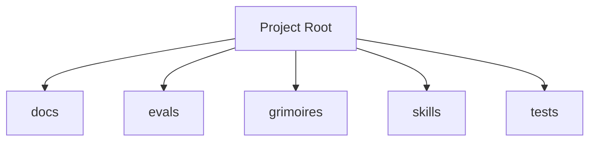

<!-- AGENT-CONTEXT
name: loa
type: framework
purpose: Loa is an agent-driven development framework for [Claude Code](https://docs.anthropic.com/en/docs/claude-code/overview) (Anthropic's official CLI). It adds 17 specialized AI agents, quality gates, per
key_files: [CLAUDE.md, .claude/loa/CLAUDE.loa.md, .loa.config.yaml, .claude/scripts/, .claude/skills/]
interfaces: [/auditing-security, /autonomous-agent, /bridgebuilder-review, /browsing-constructs, /bug-triaging]
dependencies: [git, jq, yq]
version: v1.39.1
trust_level: grounded
-->

# loa

<!-- provenance: DERIVED -->
Loa is an agent-driven development framework for [Claude Code](https://docs.anthropic.com/en/docs/claude-code/overview) (Anthropic's official CLI). It adds 17 specialized AI agents, quality gates, per

The framework provides 29 specialized skills, built with TypeScript/JavaScript, Python, Shell.

## Key Capabilities
<!-- provenance: DERIVED -->
The project exposes 15 key entry points across its public API surface.

### .claude/adapters

- **_build_provider_config** — Build ProviderConfig from merged hounfour config. (`.claude/adapters/cheval.py:149`)
- **_error_json** — Format error as JSON for stderr (SDD §4.2.2 Error Taxonomy). (`.claude/adapters/cheval.py:74`)
- **_load_persona** — Load persona.md for the given agent with optional system merge (SDD §4.3.2). (`.claude/adapters/cheval.py:93`)
- **cmd_invoke** — Main invocation: resolve agent → call provider → return response. (`.claude/adapters/cheval.py:177`)
- **cmd_print_config** — Print effective merged config with source annotations. (`.claude/adapters/cheval.py:326`)
- **cmd_validate_bindings** — Validate all agent bindings. (`.claude/adapters/cheval.py:337`)
- **main** — CLI entry point. (`.claude/adapters/cheval.py:351`)

### .claude/adapters/loa_cheval/config

- **LazyValue** — Deferred interpolation token. (`.claude/adapters/loa_cheval/config/interpolation.py:41`)
- **_check_env_allowed** — Check if env var name is in the allowlist. (`.claude/adapters/loa_cheval/config/interpolation.py:122`)
- **_check_file_allowed** — Validate and resolve a file path for secret reading. (`.claude/adapters/loa_cheval/config/interpolation.py:133`)
- **_deep_merge** — Deep merge overlay into base. (`.claude/adapters/loa_cheval/config/loader.py:53`)
- **_find_project_root** — Walk up from cwd to find project root (contains .loa.config.yaml or .claude/). (`.claude/adapters/loa_cheval/config/loader.py:64`)
- **_get_credential_provider** — Get the credential provider chain (lazily initialized, thread-safe). (`.claude/adapters/loa_cheval/config/interpolation.py:192`)
- **_matches_lazy_path** — Check if a dotted config key path matches any lazy path pattern. (`.claude/adapters/loa_cheval/config/interpolation.py:275`)
- **_reset_credential_provider** — Reset credential provider cache. (`.claude/adapters/loa_cheval/config/interpolation.py:205`)

## Architecture
<!-- provenance: DERIVED -->
The architecture follows a three-zone model: System (`.claude/`) contains framework-managed scripts and skills, State (`grimoires/`, `.beads/`) holds project-specific artifacts and memory, and App (`src/`, `lib/`) contains developer-owned application code. The framework orchestrates 29 specialized skills through slash commands.

Directory structure:
```
./docs
./docs/architecture
./docs/integration
./evals
./evals/baselines
./evals/fixtures
./evals/graders
./evals/harness
./evals/results
./evals/suites
./evals/tasks
./evals/tests
./grimoires
./grimoires/loa
./grimoires/pub
./skills
./skills/legba
./tests
./tests/e2e
./tests/edge-cases
./tests/fixtures
./tests/helpers
./tests/integration
./tests/performance
./tests/unit
```

## Interfaces
<!-- provenance: DERIVED -->
### Skill Commands

- **/auditing-security** — Paranoid Cypherpunk Auditor
- **/autonomous-agent** — Autonomous agent
- **/bridgebuilder-review** — Bridgebuilder — Autonomous PR Review
- **/browsing-constructs** — Provide a multi-select UI for browsing and installing packs from the Loa Constructs Registry. Enables composable skill installation per-repo.
- **/bug-triaging** — Bug Triage Skill
- **/butterfreezone-gen** — BUTTERFREEZONE Generation Skill
- **/continuous-learning** — Continuous Learning Skill
- **/deploying-infrastructure** — Deploying infrastructure
- **/designing-architecture** — Architecture Designer
- **/discovering-requirements** — Discovering Requirements
- **/enhancing-prompts** — Enhancing prompts
- **/eval-running** — Eval running
- **/flatline-knowledge** — Provides optional NotebookLM integration for the Flatline Protocol, enabling external knowledge retrieval from curated AI-powered notebooks.
- **/flatline-reviewer** — Flatline reviewer
- **/flatline-scorer** — Flatline scorer
- **/flatline-skeptic** — Flatline skeptic
- **/gpt-reviewer** — Gpt reviewer
- **/implementing-tasks** — Sprint Task Implementer
- **/managing-credentials** — /loa-credentials — Credential Management
- **/mounting-framework** — Create structure (preserve if exists)
- **/planning-sprints** — Sprint Planner
- **/red-teaming** — Use the Flatline Protocol's red team mode to generate creative attack scenarios against design documents. Produces structured attack scenarios with consensus classification and architectural counter-designs.
- **/reviewing-code** — Senior Tech Lead Reviewer
- **/riding-codebase** — Riding Through the Codebase
- **/rtfm-testing** — RTFM Testing Skill
- **/run-bridge** — Run Bridge — Autonomous Excellence Loop
- **/run-mode** — Run mode
- **/simstim-workflow** — Check post-PR state
- **/translating-for-executives** — Translating for executives

## Module Map
<!-- provenance: DERIVED -->
| Module | Files | Purpose | Documentation |
|--------|-------|---------|---------------|
| `docs/` | 4 | Documentation | \u2014 |
| `evals/` | 1269 | Benchmarking and regression framework for the Loa agent development system. Ensu | [evals/README.md](evals/README.md) |
| `grimoires/` | 520 | Home to all grimoire directories for the Loa framework. | [grimoires/README.md](grimoires/README.md) |
| `skills/` | 5112 | Specialized agent skills | \u2014 |
| `tests/` | 142 | Test suites | \u2014 |

## Known Limitations
<!-- provenance: DERIVED -->
- No automated tests detected

## Quick Start
<!-- provenance: OPERATIONAL -->

**Prerequisites**: [Claude Code](https://docs.anthropic.com/en/docs/claude-code/overview) (Anthropic's CLI for Claude), Git, jq, [yq v4+](https://github.com/mikefarah/yq). See **[INSTALLATION.md](INSTALLATION.md)** for full details.

```bash
# Install (one command, any existing repo)
curl -fsSL https://raw.githubusercontent.com/0xHoneyJar/loa/main/.claude/scripts/mount-loa.sh | bash

# Start Claude Code
claude

# These are slash commands typed inside Claude Code, not your terminal.
# 5 commands. Full development cycle.
/plan      # Requirements -> Architecture -> Sprints
/build     # Implement the current sprint
/review    # Code review + security audit
/ship      # Deploy and archive
```

After install, you should see a `.claude/` directory, `grimoires/loa/`, and `.loa.config.yaml` in your repo. Run `/loa doctor` inside Claude Code to verify everything is healthy.
<!-- ground-truth-meta
head_sha: 098b5c59b426c2e4360efd5813cf5640f9cc36d0
generated_at: 2026-02-15T06:40:02Z
generator: butterfreezone-gen v1.0.0
sections:
  agent_context: f8840fe60473b63400f7662868cca556490e463d25a34284e9c3b9576850e7af
  capabilities: 7ac5066c6290b2bd238aba0cebe80e6c24d2c32ecc6b066842a065eb8c2300c1
  architecture: 116f3296a49700fbee5e9cb0492e4f9aee0f9452b5c051a942ee4429278ab8d3
  interfaces: c0d2732b6ab7745352bd781f56f44f32b2f8f2cacef7234ceed3e8f09796c0f4
  module_map: cf0ac9fba34a290fe05c070b0ed173b88e29186b42830abd1aad63fc4f24b257
  limitations: 05e0fbb2794ed0ae75222e277e1fe2eb457a5b671bc8f5be406bf6d879746dad
  quick_start: 3c38dc53bf2ec73cbbb5c372af747ffa7894538d360b1182566647c2940c58c7
-->
