# Separation of Concerns: Loa vs Runtime

> **Core principle**: Loa should work on ANY runtime. Runtime should support ANY framework.

---

## Overview

Loa is a methodology framework. It defines WHAT to do and in what order. It does not define HOW to execute — that's the runtime's job.

This separation enables:
- **Loa** to work on any runtime (Clawdbot, Claude Code, Cursor, etc.)
- **Runtimes** to support any framework (Loa, custom patterns, etc.)
- **Compound improvements** where either system getting better benefits the other

---

## The Three Layers

```mermaid
graph TB
    subgraph Agent["🤖 AGENT INSTANCE"]
        direction TB
        A1[Specific agent e.g. Legba]
        A2[Uses Loa methodology]
        A3[Runs on specific runtime]
    end
    
    Agent --> Loa
    Agent --> Runtime
    
    subgraph Loa["📘 LOA (Methodology)"]
        L1[WHAT to do]
        L2[In what order]
        L3[To what standard]
    end
    
    subgraph Runtime["⚙️ RUNTIME (Execution)"]
        R1[HOW to execute]
        R2[With what resources]
        R3[Recovering how]
    end
    
    Loa --> Integration
    Runtime --> Integration
    
    subgraph Integration["🔗 INTEGRATION (Contract)"]
        I1[Exit codes]
        I2[State schemas]
        I3[Signals]
    end
    
    style Agent fill:#e1f5fe
    style Loa fill:#fff3e0
    style Runtime fill:#f3e5f5
    style Integration fill:#e8f5e9
```



---

## Loa Layer (Methodology)

### What Loa Owns

| Concern | Description | Examples |
|---------|-------------|----------|
| **Skill definitions** | What a skill does, its purpose | `SKILL.md`, `index.yaml` |
| **Phase orchestration** | Order of execution, dependencies | `construct.yaml` phases |
| **Handoff validation** | What must exist between phases | `requires`, `produces` |
| **Quality criteria** | What "good" looks like | Gate definitions, rubrics |
| **Feedback schema** | What learnings to capture | `feedback/*.yaml` structure |
| **Escalation criteria** | When to ask for human help | Exit code meanings |
| **Templates** | Standard document formats | PRD, SDD templates |

### What Loa Does NOT Own

- How to persist state (Loa says "persist this", runtime decides how)
- How to manage tokens (Loa says "I need context", runtime manages limits)
- How to send messages (Loa says "escalate", runtime delivers)
- How to recover from crashes (Loa says "resume from checkpoint", runtime handles recovery)

### Is This a Loa Concern?

Ask: **"Would this apply to ANY agent using Loa, regardless of what runtime they're on?"**

- If yes → Loa concern
- If no → Probably runtime concern

---

## Runtime Layer (Execution Environment)

### What Runtime Owns

| Concern | Description | Examples |
|---------|-------------|----------|
| **Token management** | Context limits, compaction | Soft/hard limits, estimation |
| **Memory persistence** | Where/how files are stored | File system, database |
| **Session management** | Conversation state | Session IDs, history |
| **Tool execution** | How tools are invoked | Timeouts, error handling |
| **Message routing** | Delivering to channels | Telegram, Discord, Slack |
| **Crash recovery** | Restart, resume | Process management |
| **Resource limits** | Cost, time, rate limits | Quotas, throttling |
| **Authentication** | API keys, tokens | Secrets management |

### What Runtime Does NOT Own

- What phases to execute (Loa configuration)
- What constitutes a valid artifact (Loa criteria)
- When to escalate (Loa criteria)
- What feedback to capture (Loa schema)

### Is This a Runtime Concern?

Ask: **"Would this apply to ANY workflow running on this runtime, regardless of what methodology they use?"**

- If yes → Runtime concern
- If no → Probably framework concern

---

## Integration Layer (The Contract)

The integration layer is small and well-defined. It's the agreement between Loa and runtime about how they communicate.

### Exit Codes

Loa defines the meaning:
```
0 = success (proceed to next phase)
1 = failure (retriable)
2 = blocked (needs human intervention)
```

Runtime implements the handling:
```
if exit_code == 0: proceed_to_next()
if exit_code == 1: retry_with_limit()
if exit_code == 2: escalate_to_human()
```

**Loa says WHAT codes mean. Runtime says HOW to handle them.**

### State Schemas

Loa defines the schema:
```yaml
checkpoint:
  phase: string
  summary: string (max 500 words)
  decisions: Decision[]
  artifacts: ArtifactRef[]
```

Runtime handles persistence:
- Where to store files
- How to read/write atomically
- How to recover from corruption

**Loa says WHAT to persist. Runtime says HOW to persist.**

### Context Signals

Runtime provides signals to Loa:
```yaml
context_tokens_available: 80000
time_remaining_ms: 300000
retry_count: 1
```

Loa uses signals to adapt:
- Low context → summarize more aggressively
- Low time → skip optional steps
- Retrying → try different approach

**Runtime says WHAT resources are available. Loa says HOW to use them.**

### Escalation Protocol

Loa triggers escalation:
```
escalate(
  reason: "blocked on API design decision",
  context: { last_decisions: [...], artifacts: [...] }
)
```

Runtime delivers:
- Format appropriately for channel
- Ensure delivery
- Capture human response
- Route back to Loa

**Loa says WHEN and WHY to escalate. Runtime says HOW to deliver.**

---

## Decision Framework

When adding a feature, use this flow:

```mermaid
flowchart TD
    A[🆕 New Feature / Improvement] --> B{Is it about WHAT to do?<br/>methodology, criteria, order}
    
    B -->|Yes| LOA[📘 LOA]
    B -->|No| C{Is it about HOW to execute?<br/>resources, delivery, infra}
    
    C -->|Yes| RUNTIME[⚙️ RUNTIME]
    C -->|No| INTEGRATION[🔗 INTEGRATION<br/>contract between layers]
    
    style A fill:#fff9c4
    style LOA fill:#fff3e0
    style RUNTIME fill:#f3e5f5
    style INTEGRATION fill:#e8f5e9
```



---

## Data Flow: Skill Execution


---

## Examples

### Context Management

| Aspect | Layer | Rationale |
|--------|-------|-----------|
| "Checkpoint after each phase" | Loa | Defines WHAT to do |
| "Checkpoint schema fields" | Integration | Shared contract |
| "Estimate token count" | Runtime | HOW to measure |
| "Trigger compaction at 80K" | Runtime | HOW to manage resources |
| "Include decisions in checkpoint" | Loa | WHAT to preserve |
| "Write checkpoint to file" | Runtime | HOW to persist |

### Escalation

| Aspect | Layer | Rationale |
|--------|-------|-----------|
| "Escalate when exit code is 2" | Loa | WHEN to escalate |
| "Include last 3 decisions" | Loa | WHAT context to send |
| "Send via Telegram" | Runtime | HOW to deliver |
| "Format as markdown" | Runtime | HOW to format |
| "Capture human response" | Runtime | HOW to receive |
| "Resume from checkpoint" | Loa | WHAT to do next |

---

## Benefits

### For Loa
- Works on any runtime that implements the contract
- Not coupled to specific infrastructure
- Learnings transfer across deployments

### For Runtimes
- Support any framework that uses the contract
- Not locked to Loa specifically
- Improvements benefit all frameworks

### For Agent Operators
- Choose runtime based on needs
- Adopt Loa incrementally
- Switch runtimes without rewriting methodology

### Compound Effect

```mermaid
graph LR
    subgraph Improvements
        L[Loa improves] --> ALL_R[All runtimes benefit]
        R[Runtime improves] --> ALL_F[All frameworks benefit]
    end
    
    ALL_R --> COMPOUND[🚀 Compound gains]
    ALL_F --> COMPOUND
    
    style COMPOUND fill:#c8e6c9
```



---

## See Also

- [Runtime Contract Specification](../integration/runtime-contract.md)
- [Checkpoint Schema](../integration/checkpoint-schema.md)
- [Exit Code Semantics](../integration/exit-codes.md)
