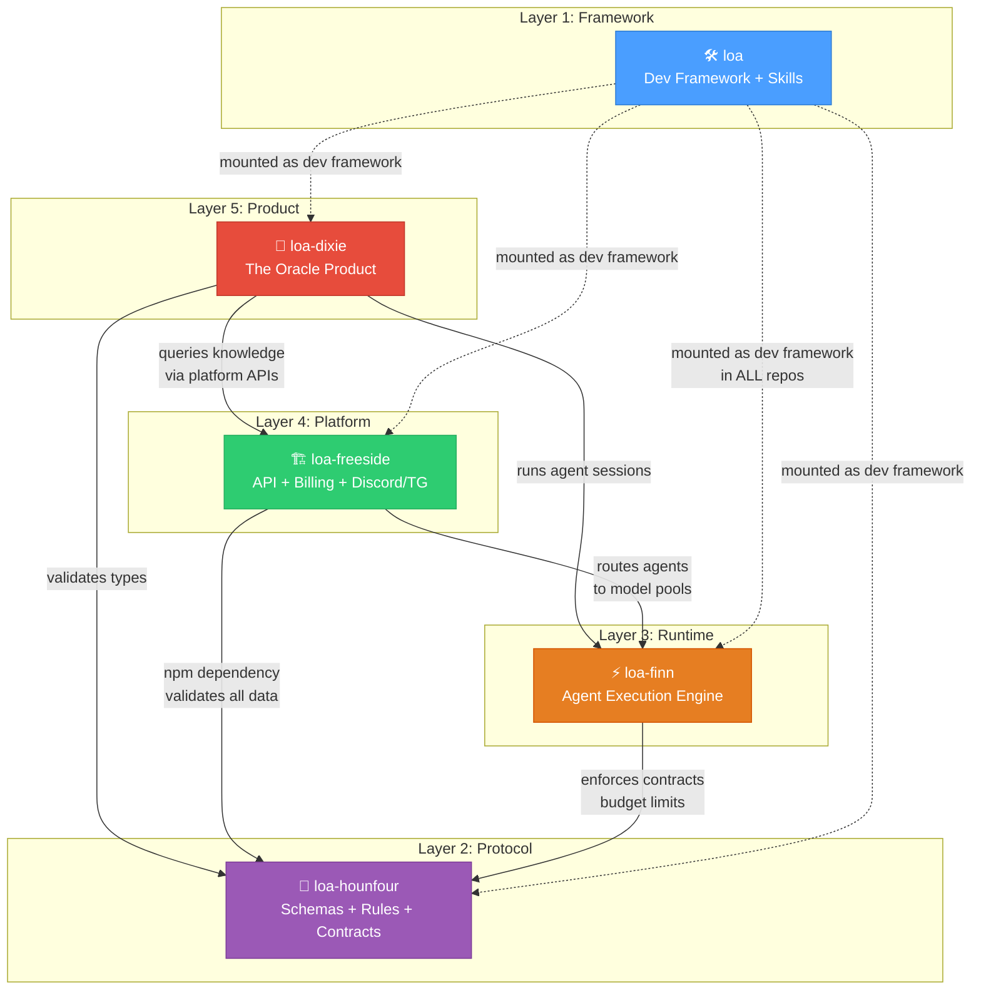

# Loa Ecosystem — How It All Fits Together

> **ELI5 guide** to how `loa`, `loa-hounfour`, `loa-freeside`, `loa-finn`, and `loa-dixie` connect as a 5-layer protocol stack for building and operating AI agent economies.

## Architecture Diagram



## The 5-Layer Stack

| Layer | Repo | Role |
|-------|------|------|
| 5 — Product | `loa-dixie` | dNFT Oracle — first product customer |
| 4 — Platform | `loa-freeside` | API, Discord/TG, token-gating, billing, IaC |
| 3 — Runtime | `loa-finn` | Persistent sessions, tool sandbox, memory |
| 2 — Protocol | `loa-hounfour` | Schemas, state machines, model routing contracts |
| 1 — Framework | `loa` | Agent dev framework, skills, Bridgebuilder |

Each layer depends only on layers below it. Protocol contracts flow upward: lower layers define contracts, upper layers consume them.

---

## ELI5 — What Each One Does

### `loa` — The Toolbox (Layer 1)

**Think of it as**: A really smart instruction manual that every worker carries.

Loa is the development framework — the set of skills, workflows, and quality gates that AI agents use to build software. Every other repo in the ecosystem has Loa installed inside it. When an AI agent works on *any* repo, Loa tells it how to plan, build, review, and ship. It's the common language all the repos share.

> *"The rules and tools every AI agent follows when building anything."*

---

### `loa-hounfour` — The Rulebook (Layer 2)

**Think of it as**: The legal contracts everyone agrees to before doing business.

Hounfour is a pure schema library — no running code, just definitions. It says "an agent session looks like THIS", "a billing event looks like THAT", "a model request must have THESE fields." It compiles to JSON Schema so TypeScript, Python, Go, and Rust can all validate the same data. It also defines economic rules like "budgets must always add up" (conservation invariants) and governance rules like "who can delegate what."

> *"The shared dictionary and rules that all services use to talk to each other."*

---

### `loa-finn` — The Worker (Layer 3)

**Think of it as**: The actual machine that runs the AI agents.

Finn is the runtime — where agent sessions actually execute. It picks which AI model to use (Claude, GPT, Gemini), enforces time and cost limits, sandboxes tool execution so agents can't break things, and persists conversation history. When you ask an agent to do something, Finn is the engine making it happen.

> *"The server that actually runs AI agents, routes them to models, and keeps them safe."*

---

### `loa-freeside` — The Front Desk (Layer 4)

**Think of it as**: The reception area where users walk in and get connected to agents.

Freeside is the platform layer — it handles everything between users and the runtime. Discord bot? That's Freeside. Telegram bot? Freeside. REST API? Freeside. Billing and payments? Freeside. Token-gated access based on on-chain holdings? Freeside. It's a Rust+TypeScript stack with 20 Terraform modules, a multi-shard Discord gateway, and BigInt micro-USD budget tracking.

> *"The platform that connects real users (via Discord, Telegram, API) to AI agents and handles billing."*

---

### `loa-dixie` — The Product (Layer 5)

**Think of it as**: The first app built using everything below it.

Dixie is the first real product — an "institutional consciousness" for The HoneyJar ecosystem. It's not a chatbot-over-docs; it's an oracle that carries the *full context* of the project and answers questions at any level: engineers get code paths, PMs get user stories, investors get revenue models, community members get plain English. It proves the whole stack works end-to-end.

> *"The first product — an all-knowing oracle that answers anyone's questions about the ecosystem."*

---

## The Full Flow

```
User asks question on Discord
        ↓
   loa-freeside receives it (Discord gateway + auth + billing)
        ↓
   loa-finn runs the agent session (picks model, enforces limits)
        ↓
   loa-hounfour validates every message (schemas + budget rules)
        ↓
   loa-dixie provides the knowledge (the oracle product)
        ↓
   Answer flows back to Discord

   ...and loa (the framework) was used to BUILD all of the above.
```

---

## Naming

All names come from William Gibson's *Neuromancer* and Haitian Vodou:

| Name | Origin | Why |
|------|--------|-----|
| **Loa** | Vodou spirits | Agent entities that "ride" codebases |
| **Hounfour** | Vodou temple | The sacred space where spirits (protocols) manifest |
| **Finn** | *Neuromancer* character — the fence | The broker connecting entities to the physical world |
| **Freeside** | *Neuromancer* space station | Where all systems converge |
| **Dixie Flatline** | *Neuromancer* ROM construct | McCoy Pauley's consciousness — institutional memory in queryable form |
