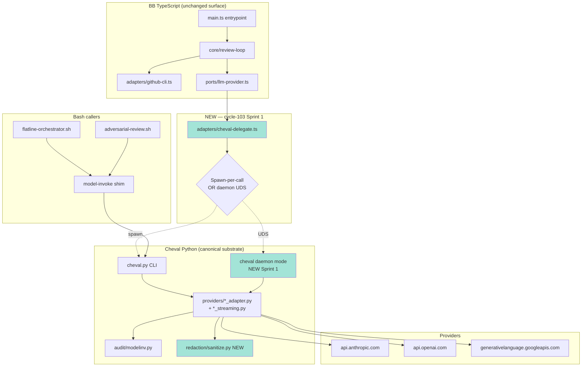
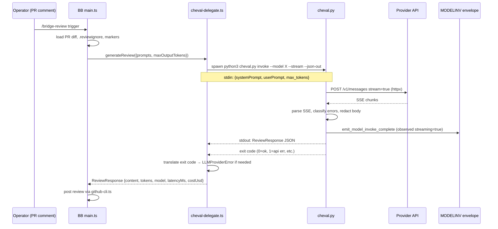
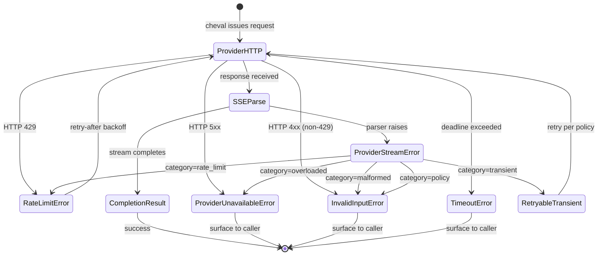

# Software Design Document — Cycle-103 Provider Boundary Unification

**Version:** 1.0
**Date:** 2026-05-11
**Author:** Architecture Designer (cycle-103 kickoff)
**Status:** Draft — ready for `/sprint-plan`
**PRD Reference:** `grimoires/loa/cycles/cycle-103-provider-unification/prd.md`
**Predecessor SDD:** `grimoires/loa/cycles/cycle-102-model-stability/sdd.md` (Sprint 4A streaming substrate)

---

## Table of Contents

1. [Project Architecture](#1-project-architecture)
2. [Software Stack](#2-software-stack)
3. [Data & Audit Schemas](#3-data--audit-schemas)
4. [Operator-Facing Surfaces](#4-operator-facing-surfaces)
5. [Interface Specifications](#5-interface-specifications)
6. [Error Handling Strategy](#6-error-handling-strategy)
7. [Testing Strategy](#7-testing-strategy)
8. [Development Phases](#8-development-phases)
9. [Known Risks and Mitigation](#9-known-risks-and-mitigation)
10. [Open Questions](#10-open-questions)
11. [Appendix](#11-appendix)

---

## 1. Project Architecture

### 1.1 System Overview

Cycle-103 is a **stabilization-and-unification cycle**, not a feature cycle (PRD §0). The deliverable is structural: collapse Loa's **three parallel HTTP boundaries** to LLM providers into **one hardened substrate** (cheval Python `httpx`).

> From prd.md §1.1: "Loa's multi-model surface today has three parallel HTTP boundaries to the same provider endpoints."

| Today (3 boundaries) | After cycle-103 (1 boundary) |
|----------------------|------------------------------|
| `cheval` (Python httpx, streaming, retry-typed, audit-emitted) | `cheval` — **canonical substrate** |
| `bridgebuilder-review` (Node 20 undici `fetch`) | BB → `cheval-delegate` (TS port that spawns Python OR daemon-IPC) |
| `flatline-orchestrator.sh` + direct-API bash paths | bash → `model-invoke` (already cheval) |

This SDD specifies how that collapse happens without breaking BB's TypeScript-side responsibilities (GitHub CLI, review-marker logic, `.reviewignore`, comment posting) or operator-visible behavior.

### 1.2 Architectural Pattern

**Pattern:** Hexagonal Architecture (Ports & Adapters) — extending the existing BB design.

> From `.claude/skills/bridgebuilder-review/resources/ports/llm-provider.ts`: `ILLMProvider.generateReview(request: ReviewRequest): Promise<ReviewResponse>`

The `ILLMProvider` port already exists. Cycle-103 ships a **new adapter** (`ChevalDelegateAdapter`) implementing that port and **retires** the three direct-fetch adapters (`anthropic.ts`, `openai.ts`, `google.ts`). The port contract is unchanged.

**Justification** (per PRD §1.3 Axiom 4 "One HTTP boundary, one hardening codepath"):
- Preserves BB's existing TS responsibilities at the port boundary
- Substrate fixes (retry, streaming, audit, redaction) propagate to all consumers automatically
- No new patterns invented; uses the same hexagonal pattern BB already uses

**Pattern rejected:** Rewriting BB in Python. Rejected because GitHub-CLI interaction, octokit-style behavior, and `.reviewignore` matching are well-served by TypeScript and not the failure surface. Scope is the **LLM-API boundary only** (PRD AC-1.5).

### 1.3 Component Diagram



Green nodes = net-new Sprint 1 / Sprint 3 components.

### 1.4 System Components

#### 1.4.1 `cheval-delegate.ts` (NEW — Sprint 1, AC-1.1)

- **Purpose:** TypeScript-side `ILLMProvider` implementation that delegates LLM-API calls to the cheval Python substrate.
- **Responsibilities:**
  - Build cheval CLI invocation (`python3 .claude/adapters/cheval.py invoke ...`) OR daemon-mode UDS request
  - Marshal `ReviewRequest` (`systemPrompt`, `userPrompt`, `maxOutputTokens`) to cheval's `CompletionRequest` JSON shape
  - Translate cheval exit codes / stderr-classified errors → `LLMProviderError` with typed `code` (`TOKEN_LIMIT` | `RATE_LIMITED` | etc.)
  - Surface `--mock-fixture-dir` flag pass-through so existing BB test scaffolds keep working (AC-1.2)
  - Emit `latencyMs` (wall-clock from spawn-start to stdout-close) and `estimatedCostUsd` (from cheval's audit payload)
- **Interfaces:**
  - Implements `ILLMProvider` (existing port — unchanged)
  - Consumes cheval CLI contract (see §5.1)
- **Dependencies:** Node 20 `child_process` (spawn-mode) OR `net` + UDS path (daemon-mode); existing `LLMProviderError` from `ports/llm-provider.ts`

#### 1.4.2 Cheval daemon mode (NEW — Sprint 1 if R1 forces it)

- **Purpose:** Long-lived Python process listening on Unix domain socket to amortize Python startup cost (~300–800ms cold).
- **Activation:** Off by default. Enabled via `LOA_CHEVAL_DAEMON=1` env OR `.loa.config.yaml::cheval.daemon.enabled: true`.
- **Lifecycle:** Spawned lazily by `cheval-delegate.ts` first call; auto-terminates after `idle_timeout_seconds` (default 300s); PID file at `.run/cheval-daemon.pid`; UDS at `.run/cheval-daemon.sock` (mode 0600).
- **Decision criterion (per PRD R1):** Sprint 1 week 1 benchmarks spawn-per-call mode. If p95 overhead ≤ 1s/call, ship spawn-mode and defer daemon to a later cycle. If >1s/call, ship daemon mode behind `LOA_CHEVAL_DAEMON=1`.
- **Out of scope:** Multi-process daemon-pool; concurrent-request serialization within the daemon. Daemon serializes per-call; concurrency comes from spawn-per-call OR multiple daemon UDS endpoints (future).

#### 1.4.3 `sanitize_provider_error_message` helper (NEW — Sprint 3, AC-3.3)

- **Purpose:** Single redaction chokepoint for upstream-bytes that flow into Python `Exception` args (which then surface to operator stderr / audit logs / BB error text).
- **Location:** `.claude/adapters/loa_cheval/redaction/sanitize.py` (NEW module).
- **Contract:** `sanitize_provider_error_message(s: str) -> str` — scrubs AKIA prefixes, PEM markers, Bearer tokens, `sk-ant-*` shapes, `sk-*` (OpenAI), Google API keys (`AIza*` 39-char), and JSON-escaped variants of the same.
- **Invocation sites:** Every adapter (`anthropic_adapter.py`, `openai_adapter.py`, `google_adapter.py`) at exception-construction (where upstream response body is interpolated into an error message).
- **Defense:** Sanitize-at-exception-boundary mirrors the Cloudbleed-class lesson noted in BB cycle-2 F-006 (PRD §5.2).

#### 1.4.4 `ProviderStreamError` typed exception (NEW — Sprint 3, AC-3.1)

- **Purpose:** Structured parser exception that preserves provider-side failure classification through retry routing.
- **Location:** `.claude/adapters/loa_cheval/types.py` (extends existing exception hierarchy).
- **Contract:**
  ```python
  class ProviderStreamError(ChevalError):
      category: Literal["rate_limit", "overloaded", "malformed", "policy", "transient", "unknown"]
      message: str
      raw_payload: Optional[bytes]  # redacted via sanitize_provider_error_message
  ```
- **Dispatch:** Adapter layer maps `category` → existing typed exception (`RateLimitError`, `ProviderUnavailableError`, `InvalidInputError`, `RetriesExhaustedError`) via a single lookup table; retry logic in `retry.py` reads typed exception (unchanged) — no cascading rewrite (mitigates PRD R4).

#### 1.4.5 `streaming_max_input_tokens` config split (NEW — Sprint 3, AC-3.4)

- **Purpose:** Auto-revert max-input gate when streaming kill-switch is engaged.
- **Schema change** (`.claude/data/model-config.yaml`):
  ```yaml
  models:
    claude-opus-4-7:
      max_input_tokens: 200000          # legacy alias = streaming_max_input_tokens
      streaming_max_input_tokens: 200000
      legacy_max_input_tokens: 36000    # gates when LOA_CHEVAL_DISABLE_STREAMING=1
  ```
- **Lookup change** (`.claude/adapters/loa_cheval/config/loader.py::_lookup_max_input_tokens`):
  ```python
  def _lookup_max_input_tokens(model_id: str) -> int:
      cfg = _get_model_config(model_id)
      if _streaming_disabled():
          return cfg.get("legacy_max_input_tokens", cfg.get("max_input_tokens"))
      return cfg.get("streaming_max_input_tokens", cfg.get("max_input_tokens"))
  ```
- **Backward compat:** Legacy configs (only `max_input_tokens` present) continue to work for both branches.

#### 1.4.6 Drift gate (NEW — Sprint 1, PRD §5.5)

- **Tool:** `tools/check-no-direct-llm-fetch.sh`
- **Purpose:** CI gate enforcing the "one HTTP boundary" invariant.
- **Logic:** `rg` scan of `.claude/skills/bridgebuilder-review/resources/` for the three provider URL substrings (`api.anthropic.com`, `api.openai.com`, `generativelanguage.googleapis.com`) outside of `adapters/cheval-delegate.ts`. Exit 1 with structured message if found.
- **Workflow:** `.github/workflows/no-direct-llm-fetch.yml` triggers on PR + push to main. Mirrors cycle-099 `check-no-raw-curl.sh` precedent (extension list + shebang detection to avoid scanner glob blindness — cycle-099 sprint-1E.c.3.c lesson).

### 1.5 Data Flow — BB review pass post-unification



### 1.6 External Integrations

| Service | Purpose | Path post-cycle-103 |
|---------|---------|---------------------|
| Anthropic Messages API | Claude opus/sonnet inference | cheval `httpx` (streaming) |
| OpenAI Chat Completions | GPT inference | cheval `httpx` (streaming) |
| Google Generative Language | Gemini inference | cheval `httpx` (non-streaming today; #845 / KF-008 may force re-evaluation) |
| GitHub API (`gh` CLI) | PR review posting | BB TS `github-cli.ts` — unchanged |

### 1.7 Deployment Architecture

- **No deployment infrastructure changes.** Loa is operator-machine resident.
- All cycle-103 deliverables ship via the same `.claude/` skill/adapter layout already in use.
- Drift gate ships as GitHub Actions workflow (`.github/workflows/no-direct-llm-fetch.yml`).

### 1.8 Performance Strategy

- **Spawn-per-call latency budget:** <1s per call (p95). Benchmarked Sprint 1 week 1 (PRD §5.1).
- **Daemon-mode latency budget:** <100ms per call (p95) if spawn-mode fails the budget.
- **No new throughput requirements.** BB is operator-triggered, not high-RPS.

### 1.9 Security Architecture

Per PRD §5.2 — security-critical deliverables concentrated in Sprint 3:

- **AC-3.3** — `sanitize_provider_error_message` redacts upstream bytes at exception boundary
- **AC-3.6** — `redact_payload_strings` extended to walk nested dicts (path-aware)
- **AC-3.7** — `_GATE_BEARER` regex extended to cover `bearer:` (no space), percent-encoded, JSON-escaped variants
- **BF-005** — `MAX_SSE_BUFFER_BYTES = 4 * 1024 * 1024` cap on SSE parser (prevents adversarial body-bloat DoS)

Post-Sprint 3, the full upstream-bytes-to-operator-stderr path has redaction coverage at:
1. SSE parser (body-size cap)
2. Provider adapter exception construction (AKIA/PEM/Bearer/sk-ant-* scrub)
3. Audit envelope payload (nested-dict walk)
4. Bash-side stderr forwarding (already covered by `lib/log-redactor.sh` from cycle-099 Sprint 1E.a)

---

## 2. Software Stack

### 2.1 BB TypeScript Side (existing — minimal change)

| Category | Technology | Version | Justification |
|----------|------------|---------|---------------|
| Runtime | Node | 20.x | Existing — already pinned via `entry.sh` NODE_OPTIONS |
| Language | TypeScript | 5.x | Existing — `.claude/skills/bridgebuilder-review/resources/tsconfig.json` |
| Build | tsc | bundled | Existing — outputs to `resources/dist/` |
| Test | (existing harness) | — | AC-1.2 — existing fixtures must keep passing |
| IPC | Node `child_process` (spawn) OR `net` (UDS) | bundled | Decision in §1.4.2 — benchmark-driven |

**Removed in cycle-103:**
- `adapters/anthropic.ts` — replaced by `cheval-delegate.ts`
- `adapters/openai.ts` — replaced by `cheval-delegate.ts`
- `adapters/google.ts` — replaced by `cheval-delegate.ts`
- `adapters/adapter-factory.ts` — collapses to single-adapter selection (delegate only)

Per AC-1.3 — the `NODE_OPTIONS` Happy Eyeballs fix in `entry.sh` becomes vestigial and is marked for cycle-104 removal.

### 2.2 Cheval Python Side (existing substrate — additive)

| Category | Technology | Version | Justification |
|----------|------------|---------|---------------|
| Language | Python | ≥3.11 | Existing — cheval baseline |
| HTTP | `httpx` | (existing) | Existing — already streaming-capable post Sprint 4A |
| Test | `pytest` | (existing) | Existing — 937-test baseline (PRD §9) |
| Schema | (existing `types.py`) | — | Add `ProviderStreamError` to existing hierarchy |

**Added in cycle-103 Sprint 3:**
- `.claude/adapters/loa_cheval/redaction/sanitize.py` — `sanitize_provider_error_message` helper
- `.claude/adapters/loa_cheval/types.py` — `ProviderStreamError` typed exception
- `.claude/adapters/loa_cheval/config/loader.py` — `_lookup_max_input_tokens` split

**Added in cycle-103 Sprint 1 (optional, R1-conditional):**
- `.claude/adapters/loa_cheval/daemon/server.py` — UDS daemon entry point

### 2.3 Infrastructure & DevOps

| Category | Technology | Purpose |
|----------|------------|---------|
| CI | GitHub Actions | Drift gate enforcement (`no-direct-llm-fetch.yml`) |
| Pre-commit | (existing) | Optional local hook to run drift gate (out of scope for cycle-103) |
| Audit logs | Existing MODELINV envelope | Sprint 3 AC-3.2 emits `streaming: bool` derived from observed transport |

---

## 3. Data & Audit Schemas

### 3.1 Cheval CLI request shape (existing — unchanged contract)

> Per PRD §5.4: "Cheval Python CLI contract unchanged (`model-invoke` invocations still work the same way for non-BB callers)."

```json
{
  "model": "claude-opus-4-7",
  "system": "...",
  "messages": [{"role": "user", "content": "..."}],
  "max_tokens": 8000,
  "stream": true
}
```

Stdin JSON; stdout response JSON; stderr diagnostics; exit codes 0–7 (see `cheval.py` module docstring).

### 3.2 Cheval CLI response shape (existing — unchanged)

```json
{
  "content": "...review text...",
  "usage": {"input_tokens": 12345, "output_tokens": 6789},
  "model": "claude-opus-4-7",
  "provider": "anthropic",
  "latency_ms": 8421,
  "estimated_cost_usd": 0.0234,
  "streaming": true
}
```

### 3.3 BB `ReviewResponse` extension (Sprint 3 AC-3.2)

Add observed-transport field at the port level:

```typescript
// ports/llm-provider.ts (extend existing — no breaking change; field optional)
export interface ReviewResponse {
  // ... existing fields ...
  /** Observed transport: true if streaming completed, false if non-streaming, null for legacy. Sprint 3 AC-3.2. */
  streaming?: boolean | null;
}
```

The delegate populates `streaming` from cheval's response `streaming` field. Audit envelope emits the observed value, not the configured value.

### 3.4 MODELINV audit envelope (Sprint 3 AC-3.1 + AC-3.2)

Extension to existing envelope (existing schema unchanged in shape; new fields are additive):

```json
{
  "schema_version": "1.0",
  "event": "model.invoke.complete",
  "primitive_id": "MODELINV",
  "payload": {
    "model_id": "claude-opus-4-7",
    "provider": "anthropic",
    "streaming": true,
    "models_failed": [
      {"model_id": "gpt-5.5-pro", "error_category": "overloaded"}
    ],
    "operator_visible_warn": false,
    "kill_switch_active": false
  }
}
```

**New fields (Sprint 3):**
- `payload.streaming` — observed (was: env-derived per F-003)
- `payload.models_failed[].error_category` — typed (was: free-text; per AC-3.1)

### 3.5 `model-config.yaml` schema extension (Sprint 3 AC-3.4)

```yaml
# .claude/data/model-config.yaml
$schema:
  type: object
  properties:
    models:
      additionalProperties:
        type: object
        properties:
          max_input_tokens:
            type: integer
            description: "Legacy alias. Equivalent to streaming_max_input_tokens."
          streaming_max_input_tokens:
            type: integer
            description: "Active when streaming kill-switch is disengaged (default)."
          legacy_max_input_tokens:
            type: integer
            description: "Active when LOA_CHEVAL_DISABLE_STREAMING=1."
```

**Migration:** Existing models with only `max_input_tokens` continue to work (treated as `streaming_max_input_tokens`; `legacy_max_input_tokens` falls back to the same value). Migration tool: extend cycle-099's `tools/migrate-model-config.py` with a `--cycle103-split` flag (no auto-run).

---

## 4. Operator-Facing Surfaces

Cycle-103 ships no UI. Operator-visible surfaces are:

### 4.1 CLI behavior — unchanged externally

- `bridgebuilder-review` invocations (`entry.sh`) — same args, same exit codes, same stdout/stderr shapes
- `cheval invoke` — same args, same JSON contract
- `flatline-orchestrator.sh` — same invocation; internal routing changes are invisible

### 4.2 Environment variables — additive

| Variable | Default | Purpose | Sprint |
|----------|---------|---------|--------|
| `LOA_CHEVAL_DAEMON` | unset (off) | Enable cheval UDS daemon mode | Sprint 1 (R1-conditional) |
| `LOA_CHEVAL_DAEMON_IDLE_TIMEOUT_SECONDS` | 300 | Daemon auto-terminate threshold | Sprint 1 (R1-conditional) |
| `LOA_CHEVAL_DISABLE_STREAMING` | unset (streaming on) | **Existing** — Sprint 3 AC-3.4 wires it to gate auto-revert | Sprint 3 |
| `LOA_BB_FORCE_LEGACY_FETCH` | unset | **Escape hatch** — re-enables old TS fetch path for ≤1 cycle if delegate breaks | Sprint 1 |

### 4.3 Config-file additions — additive

`.loa.config.yaml`:
```yaml
cheval:
  daemon:
    enabled: false
    idle_timeout_seconds: 300
    socket_path: ".run/cheval-daemon.sock"  # mode 0600
```

`.claude/data/model-config.yaml` — `streaming_max_input_tokens` / `legacy_max_input_tokens` split (§3.5).

### 4.4 Runbooks (new — Sprint 1 + Sprint 3 deliverables)

- `grimoires/loa/runbooks/cheval-delegate-architecture.md` — operator-facing description of BB→cheval delegation, daemon mode, escape hatch
- `grimoires/loa/runbooks/cheval-streaming-transport.md` — **existing**, extended to cover Sprint 3 kill-switch + gate auto-revert behavior

---

## 5. Interface Specifications

### 5.1 Cheval CLI contract (canonical — unchanged in cycle-103)

```
python3 .claude/adapters/cheval.py invoke \
  --model <model_id> \
  --stream | --no-stream \
  --mock-fixture-dir <path>           # NEW Sprint 1 AC-1.2 — passthrough for BB test scaffolds
  --timeout-seconds <int> \
  --json-out                          # stdout = single JSON response object
  [--max-tokens <int>]
  < request_body.json
```

- stdin: `CompletionRequest` JSON (see §3.1)
- stdout: Single `CompletionResult` JSON (see §3.2) — only on success
- stderr: Structured diagnostics; on error, last line is JSON-encoded error class + message
- exit codes: 0–7 (existing — unchanged)

### 5.2 Daemon UDS protocol (NEW — Sprint 1 R1-conditional)

```
Socket: .run/cheval-daemon.sock (Unix Domain Socket, mode 0600)
Wire format: length-prefixed JSON frames (4-byte big-endian length + UTF-8 JSON body)
Request: same shape as cheval CLI stdin
Response: {"result": <CompletionResult>} | {"error": {"code": "<exit_code_name>", "message": "<sanitized>"}}
```

Daemon serializes requests per-connection. Concurrent clients connect on separate sockets (kernel handles).

### 5.3 BB → cheval-delegate (in-process — Sprint 1 AC-1.1)

```typescript
// adapters/cheval-delegate.ts
export class ChevalDelegateAdapter implements ILLMProvider {
  constructor(
    private readonly options: {
      model: string;
      timeoutMs?: number;
      mockFixtureDir?: string;     // AC-1.2 — test scaffolds
      mode?: "spawn" | "daemon";   // env-derived default
    },
  ) {}

  async generateReview(request: ReviewRequest): Promise<ReviewResponse>;
}
```

Errors from cheval (stderr-parsed) translate per this table:

| Cheval exit code | Cheval error class | `LLMProviderErrorCode` |
|------------------|--------------------|------------------------|
| 0 | (success) | — |
| 1 | `RateLimitError` | `RATE_LIMITED` |
| 1 | `ProviderUnavailableError` | `PROVIDER_ERROR` |
| 2 | `InvalidInputError` / `ConfigError` | `INVALID_REQUEST` |
| 3 | (timeout) | `TIMEOUT` |
| 4 | (missing API key) | `AUTH_ERROR` |
| 5 | (invalid response) | `PROVIDER_ERROR` |
| 6 | `BudgetExceededError` | `INVALID_REQUEST` |
| 7 | `ContextTooLargeError` | `TOKEN_LIMIT` |

Network-level errors from spawn / UDS connect → `NETWORK`.

### 5.4 Flatline → model-invoke (AC-1.4 — collapse)

Every direct-API call site in `flatline-*.sh` (audit list in Sprint 1 task breakdown) replaced with the `model-invoke` shim (which already routes to cheval). Sprint 1 task: enumerate, replace, remove dead code, add `tools/check-no-direct-llm-fetch.sh` to cover the bash file extensions per cycle-099 sprint-1E.c.3.c precedent.

---

## 6. Error Handling Strategy

### 6.1 Error taxonomy (post-Sprint 3)



### 6.2 Exception construction policy (Sprint 3 AC-3.3)

**Every** adapter exception-construction site that interpolates upstream response bytes MUST wrap the bytes in `sanitize_provider_error_message`:

```python
# WRONG
raise InvalidInputError(f"provider returned: {response_text}")

# RIGHT
from loa_cheval.redaction.sanitize import sanitize_provider_error_message
raise InvalidInputError(
    f"provider returned: {sanitize_provider_error_message(response_text)}"
)
```

Audited sites (Sprint 3 task list, non-exhaustive):
- `anthropic_adapter.py` — error-response branch (HTTP 4xx/5xx body interpolation)
- `openai_adapter.py` — same
- `google_adapter.py` — same
- `anthropic_streaming.py` / `openai_streaming.py` / `google_streaming.py` — SSE parser error branches
- `retry.py` — `RetriesExhaustedError` final-cause chain

### 6.3 SSE buffer caps (Sprint 3 AC-3.5 / BF-005)

```python
# anthropic_streaming.py / openai_streaming.py / google_streaming.py
MAX_SSE_BUFFER_BYTES = 4 * 1024 * 1024  # 4 MiB
MAX_TEXT_PART_BYTES  = 1 * 1024 * 1024  # 1 MiB per text accumulator
MAX_ARGS_PART_BYTES  = 256 * 1024       # 256 KiB per tool-args accumulator

def _iter_sse_events_raw_data(stream):
    buffer = bytearray()
    for chunk in stream:
        buffer.extend(chunk)
        if len(buffer) > MAX_SSE_BUFFER_BYTES:
            raise ValueError(
                f"SSE buffer exceeded {MAX_SSE_BUFFER_BYTES} bytes without event terminator"
            )
        # ... existing parse logic ...
```

ValueErrors map to `ConnectionLostError` at the adapter layer (existing pattern).

### 6.4 Operator-stderr behavior

- Sanitized error messages only (per §6.2)
- BB-side: `cheval-delegate.ts` forwards cheval stderr verbatim — cheval is responsible for sanitization at the source
- Bash callers: existing `lib/log-redactor.sh` from cycle-099 Sprint 1E.a continues to wrap stderr at the flatline-orchestrator boundary

---

## 7. Testing Strategy

### 7.1 Test pyramid

| Level | Existing baseline | Cycle-103 net-new | Tooling |
|-------|-------------------|-------------------|---------|
| Python unit | 937 tests (PRD §9) | ~30–50 (sanitize / typed-exception / config-split) | pytest |
| Python integration | (existing) | ~5 (cheval-delegate spawn end-to-end with mocked HTTP) | pytest |
| TypeScript unit | (existing BB suite) | ~10 (delegate translation; spawn shim; daemon shim) | existing BB harness |
| TypeScript integration | (existing fixtures) | AC-1.2 — fixtures replay against delegate | existing |
| Cross-language smoke | (none) | 1 BB-against-real-cheval (using mock provider) | bats + python subprocess |
| Bats | (existing) | ~5 (drift gate, flatline-orchestrator no-direct-API) | bats |
| Empirical replay (Sprint 2) | — | 5 prompts × 5 input sizes = 25 prompt-runs (budget ~$3) | pytest + live API (gated behind `LOA_RUN_LIVE_TESTS=1`) |

### 7.2 Per-AC test mapping (PRD DoD: "every Sprint 1 / 2 / 3 AC has at least one corresponding test")

| AC | Test artifact |
|----|---------------|
| AC-1.1 | `tests/test_cheval_delegate_translation.bats` (TS-side mock-spawn) |
| AC-1.2 | Existing BB fixture suite runs unchanged; new fixture cases for delegate error paths |
| AC-1.3 | `tests/test_entry_sh_node_options_vestigial.bats` — asserts NODE_OPTIONS is commented/removed by cycle-104 (cycle-103 marks-only) |
| AC-1.4 | `tests/test_flatline_no_direct_api.bats` — drift-gate scan of `flatline-*.sh` |
| AC-1.5 | Existing `github-cli.ts` test suite continues to pass — no regression |
| AC-1.6 | Manual replay procedure documented in runbook + scripted `tests/replay-kf008-via-delegate.sh` |
| AC-1.7 | `tests/test_modelinv_envelope_unified.bats` — single envelope per BB call |
| AC-2.1 | `tests/replay/test_opus_empty_content_thresholds.py` (gated behind `LOA_RUN_LIVE_TESTS=1`) |
| AC-2.2/2.3 | Outcome-dependent (structural fix → `tests/test_opus_max_input_gate.py`; vendor workaround → KF-002 attempts row update) |
| AC-2.4 | `tests/test_provider_fallback_chain.py` — existing, re-run post-Sprint 2 |
| AC-3.1 | `tests/test_provider_stream_error_classification.py` |
| AC-3.2 | `tests/test_modelinv_streaming_observed.py` |
| AC-3.3 | `tests/test_sanitize_provider_error_message.py` (AKIA / PEM / Bearer / sk-ant / AIza shapes × plain / JSON-escaped variants) |
| AC-3.4 | `tests/test_max_input_token_gate_split.py` |
| AC-3.5 | `tests/test_sse_buffer_cap.py` + per-event-accumulator caps |
| AC-3.6 | `tests/test_redact_payload_nested.py` |
| AC-3.7 | `tests/test_gate_bearer_regex_coverage.py` (bearer-no-space, percent-encoded, JSON-escaped) |
| AC-3.8 | Outcome-dependent (parallel-dispatch tests if pursued; deferred-with-rationale if not) |

### 7.3 Drift-gate CI integration

`.github/workflows/no-direct-llm-fetch.yml`:
```yaml
on:
  pull_request:
    paths:
      - '.claude/skills/bridgebuilder-review/resources/**'
      - '.claude/scripts/flatline-*.sh'
      - 'tools/check-no-direct-llm-fetch.sh'
  push:
    branches: [main]
    paths:
      - '.claude/skills/bridgebuilder-review/resources/**'
      - '.claude/scripts/flatline-*.sh'

jobs:
  check-no-direct-llm-fetch:
    runs-on: ubuntu-latest
    steps:
      - uses: actions/checkout@v4
      - run: bash tools/check-no-direct-llm-fetch.sh
```

Mirror cycle-099 sprint-1E.c.3.c — extension list + shebang detection to avoid scanner glob blindness.

### 7.4 Performance budgets (Sprint 1 R1 gate)

- Spawn-per-call p95 ≤ 1000ms across 50 sequential calls (mock provider): GO for spawn-mode
- Daemon-mode p95 ≤ 100ms across 50 sequential calls (mock provider): GO for daemon-mode
- Sprint 1 week 1 deliverable: benchmark report at `grimoires/loa/cycles/cycle-103-provider-unification/sprint-1-perf-bench.md`

### 7.5 Regression gate

PRD §11 DoD: "no regression from cycle-102's 937-baseline"
- Sprint exit requires `cd .claude/adapters && python3 -m pytest tests/ -q` ≥ 937 passing
- Cycle-103 should add ~30–50 net-new tests; final target ≥ 970

---

## 8. Development Phases

PRD §6.3: Sequential — Sprint 1 → Sprint 2 → Sprint 3. Parallel Sprint 2 ↔ Sprint 3 acceptable per operator preference.

### Phase 1 — Sprint 1: Provider Boundary Unification (5–7 days)

**Goal:** Collapse BB and Flatline onto cheval substrate.

- [ ] **T1.1** Benchmark spawn-per-call latency (Sprint 1 week 1; PRD R1 decision gate)
- [ ] **T1.2** `ChevalDelegateAdapter` (spawn-mode) — implements `ILLMProvider`
- [ ] **T1.3** (Conditional on T1.1) Cheval daemon mode + UDS server + delegate daemon shim
- [ ] **T1.4** Migrate BB `adapter-factory.ts` → always returns delegate; retire `anthropic.ts` / `openai.ts` / `google.ts`
- [ ] **T1.5** AC-1.2 — port existing BB fixture HTTP mocks to cheval `--mock-fixture-dir`
- [ ] **T1.6** Enumerate + replace direct-API call sites in `flatline-*.sh` (AC-1.4)
- [ ] **T1.7** `tools/check-no-direct-llm-fetch.sh` + GHA workflow (PRD §5.5)
- [ ] **T1.8** Mark `entry.sh` NODE_OPTIONS as vestigial (comment + cycle-104 removal TODO)
- [ ] **T1.9** AC-1.6 verification — replay BB cycle-1 + cycle-2 on PR #844; record KF-008 outcome
- [ ] **T1.10** `grimoires/loa/runbooks/cheval-delegate-architecture.md`
- [ ] **T1.11** Escape hatch: `LOA_BB_FORCE_LEGACY_FETCH` env (one-cycle revert path; removed in cycle-104)

**Sprint 1 exit:** M1 + M2 hold per PRD §2.1. KF-008 either closes (M3) or has documented outcome.

### Phase 2 — Sprint 2: KF-002 Layer 2 Structural (#823) (2–3 days)

**Goal:** Close the opus >40K empty-content failure structurally or document vendor-side.

- [ ] **T2.1** AC-2.1 — characterize threshold (30K / 40K / 50K / 60K / 80K replay; budget ~$3)
- [ ] **T2.2** Classify: structural (Loa-side gate) vs vendor-side (file upstream)
- [ ] **T2.3a** (If structural) Apply `max_input_tokens` gate per AC-2.2; OR force `thinking.budget_tokens`
- [ ] **T2.3b** (If vendor-side) File upstream; update KF-002 layer 2 attempts row per AC-2.3
- [ ] **T2.4** AC-2.4 — verify provider fallback chain still routes correctly

**Sprint 2 exit:** M4 holds. KF-002 layer 2 updated.

### Phase 3 — Sprint 3: Sprint 4A Carry-Forwards (3–5 days)

**Goal:** Close 8 carry-forward items from cycle-102 Sprint 4A.

Sequenced per PRD R4 mitigation — **F-002 (AC-3.1) first** (foundational), then layer the rest on top:

- [ ] **T3.1** AC-3.1 — `ProviderStreamError(category=...)` typed exception + adapter dispatch table
- [ ] **T3.2** AC-3.2 — `streaming` derived from observed transport; envelope reads from completion metadata
- [ ] **T3.3** AC-3.3 — `sanitize_provider_error_message` helper + wire at every adapter exception site
- [ ] **T3.4** AC-3.4 — `streaming_max_input_tokens` / `legacy_max_input_tokens` config split + gate logic
- [ ] **T3.5** AC-3.5 / BF-005 — `MAX_SSE_BUFFER_BYTES` + per-event accumulator caps
- [ ] **T3.6** AC-3.6 / DISS-003 — `redact_payload_strings` nested-dict walk (path-aware)
- [ ] **T3.7** AC-3.7 / DISS-004 — `_GATE_BEARER` regex coverage extension
- [ ] **T3.8** AC-3.8 / A6 — parallel-dispatch concurrency (DEFER decision driven by Sprint 1 R1 outcome — daemon-mode informs the concurrency strategy)

**Sprint 3 exit:** M5 holds. All Sprint 4A carry-forwards closed or explicitly re-deferred with rationale.

### Phase 4 — Ship (Cycle-103 close)

- [ ] BB cycle-3 review on cycle-103 PR (PRD DoD: ≤1 HIGH-consensus finding)
- [ ] Cypherpunk audit (PRD DoD: APPROVED, no NEW critical-class findings)
- [ ] KF-002 layer 2 + KF-008 status updates in `known-failures.md`
- [ ] `/run-bridge` plateau ≤3 iterations
- [ ] PR merge to `main`
- [ ] Cycle archive

---

## 9. Known Risks and Mitigation

(Replicates and refines PRD §7.1.)

| ID | Risk | Probability | Impact | Mitigation |
|----|------|-------------|--------|------------|
| **R1** | cheval-delegate spawn latency >1s | Medium | High | Sprint 1 T1.1 benchmark gate; daemon-mode fallback ready (T1.3) |
| **R2** | BB loses TS-specific response-shape behavior in translation | Medium | Medium | AC-1.2 test substrate; T1.5 fixture migration catches divergence early |
| **R3** | #823 has no Loa-side structural fix (vendor-only) | Medium | Low | AC-2.3 accepts this; fallback chain mitigates; KF-002 attempts row documents |
| **R4** | F-002 typed-exception refactor cascades through retry.py + cheval.py + adapters | High | Medium | Sprint 3 T3.1 sequenced first as foundation; T3.2–T3.7 layer on top |
| **R5** | KF-008 doesn't close via unification (httpx also fails at 300KB+) | Low | Medium | AC-1.6 verification surfaces; file second upstream + accept vendor-side |
| **R6** | Streaming default introduced concurrency bugs that surface only in cross-language testing | Low | High | `LOA_CHEVAL_DISABLE_STREAMING=1` operator safety valve; T1.11 `LOA_BB_FORCE_LEGACY_FETCH` for BB-specific regression |
| **R7** | Spawn-per-call accumulated wall-clock makes BB review pass perceptibly slower | Medium | Low | Benchmark in T1.1; if >30s aggregate added, ship daemon-mode |
| **R8** | Cycle-103 cypherpunk audit surfaces NEW critical findings in Sprint 3 redaction code (recursive-defect pattern) | Low | High | Sprint 3 T3.3 ships tests first (TDD); reference cycle-099 sprint-1E.a parity-test patterns |

---

## 10. Open Questions

| # | Question | Owner | Resolution Path |
|---|----------|-------|-----------------|
| Q1 | Spawn-per-call vs daemon-mode — which ships in Sprint 1? | Sprint 1 T1.1 benchmark | Decision committed at end of Sprint 1 week 1; documented in `sprint-1-perf-bench.md` |
| Q2 | Does KF-008 close via cheval httpx path? | Sprint 1 T1.9 replay | AC-1.6 verification result recorded in KF-008 attempts table |
| Q3 | Is #823 opus >40K structural or vendor-side? | Sprint 2 T2.1 replay | Classified Sprint 2 day 1; routes to T2.3a or T2.3b |
| Q4 | Should AC-3.8 (parallel-dispatch / A6) ship in cycle-103 or defer? | Sprint 1 R1 outcome | If daemon-mode lands, concurrency strategy is clear → ship; if spawn-mode lands, defer to cycle-104 |
| Q5 | What's the operator threshold for cycle-104 removal of `LOA_BB_FORCE_LEGACY_FETCH` and `entry.sh` NODE_OPTIONS? | @janitooor | Documented at cycle-104 PRD kickoff |
| Q6 | Does cheval `--mock-fixture-dir` flag already exist or is it Sprint 1 net-new? | Sprint 1 T1.2 | Check current cheval CLI; if absent, add as part of T1.2 — must be operator-invisible (no behavior change for non-mock callers) |
| Q7 | How does the daemon mode handle multiple concurrent BB invocations on the same operator machine (e.g., two PRs reviewing in parallel)? | Sprint 1 T1.3 | Default: serialize per-daemon; multi-daemon via separate UDS paths (per-PID daemon); document explicitly |

---

## 11. Appendix

### A. Glossary

| Term | Definition |
|------|------------|
| **Substrate fragmentation** | The anti-pattern where multiple tools re-implement the same boundary (e.g., HTTP-to-providers), causing each tool to independently rediscover the same failure classes |
| **Cheval** | The Python LLM-invocation substrate (`.claude/adapters/cheval.py` + `loa_cheval/`); canonical HTTP boundary after cycle-103 |
| **BB** | Bridgebuilder review — `.claude/skills/bridgebuilder-review/` |
| **MODELINV** | The audit-envelope primitive emitted by cheval at every model invocation completion |
| **Kill-switch** | `LOA_CHEVAL_DISABLE_STREAMING=1` env that forces non-streaming transport (operator-facing safety valve from cycle-102 Sprint 4A) |
| **KF-002 layer 2** | Subset of empty-content failure class: claude-opus-4-7 returning empty content at >40K input (cf. layer 3 = the streaming-transport class closed in cycle-102) |
| **KF-008** | Google body-size failure: BB hits at ~300KB request body; upstream #845 |

### B. References

- **PRD**: `grimoires/loa/cycles/cycle-103-provider-unification/prd.md`
- **Predecessor cycle SDD**: `grimoires/loa/cycles/cycle-102-model-stability/sdd.md`
- **Known failures**: `grimoires/loa/known-failures.md` (KF-001, KF-002, KF-008 entries)
- **Cheval substrate runbook**: `grimoires/loa/runbooks/cheval-streaming-transport.md`
- **BB cycle-2 carry-forwards**: `grimoires/loa/a2a/sprint-4A/reviewer.md`
- **Sprint 4A cypherpunk audit**: `grimoires/loa/a2a/sprint-4A/auditor-sprint-feedback.md`
- **GitHub issues**: [#843](https://github.com/0xHoneyJar/loa/issues/843), [#823](https://github.com/0xHoneyJar/loa/issues/823), [#845](https://github.com/0xHoneyJar/loa/issues/845)
- **Visions**: vision-019 (fail-loud), vision-024 (substrate-speaks-twice / fractal recursion)
- **Cycle-099 precedents reused**:
  - `tools/check-no-raw-curl.sh` (scanner glob blindness lessons) → applied to `tools/check-no-direct-llm-fetch.sh`
  - `lib/log-redactor.{sh,py}` parity-test pattern → applied to `sanitize_provider_error_message`

### C. Change Log

| Version | Date | Changes | Author |
|---------|------|---------|--------|
| 1.0 | 2026-05-11 | Initial draft — cycle-103 SDD from approved PRD | Architecture Designer |

---

*Generated by Architecture Designer Agent — cycle-103 kickoff*
