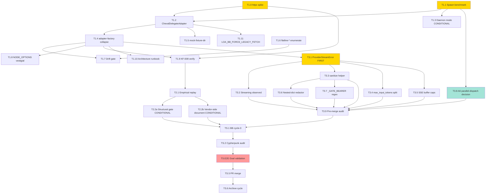

# Sprint Plan — Cycle-103 Provider Boundary Unification

**Version:** 1.0
**Date:** 2026-05-11
**Author:** Sprint Planner (cycle-103 kickoff)
**Status:** Draft — ready for `/run sprint-plan` or `/build`
**PRD Reference:** `grimoires/loa/cycles/cycle-103-provider-unification/prd.md`
**SDD Reference:** `grimoires/loa/cycles/cycle-103-provider-unification/sdd.md`
**Predecessor:** cycle-102 model-stability (PR #844, Sprint 4A streaming substrate)
**Local sprint IDs:** sprint-1, sprint-2, sprint-3 (global IDs assigned at ledger registration: 148, 149, 150 per `grimoires/loa/ledger.json::next_sprint_number=148`)

---

## Executive Summary

Cycle-103 is a **stabilization-and-unification cycle**. The deliverable is structural: collapse Loa's three parallel HTTP boundaries to LLM providers (cheval Python `httpx`, BB Node `fetch`, Flatline bash direct-API) into one hardened substrate.

> From prd.md §0: "Cycle-103 is a stabilization-and-unification cycle, not a feature cycle. Goal: every multi-model surface in Loa goes through the same hardened cheval substrate."

**MVP scope** = three sequential sprints closing five cycle-exit invariants (M1–M5 per prd.md §2.1):

| Sprint | Theme | Scope | Tasks | Duration | Goals |
|---|---|---|---|---|---|
| **Sprint 1** | Provider boundary unification (#843) | LARGE | 10 | 5–7 days | G-1 (M1), G-2 (M2), G-3 (M3 conditional) |
| **Sprint 2** | KF-002 layer 2 structural (#823) | SMALL | 3 | 2–3 days | G-4 (M4) |
| **Sprint 3** | Sprint 4A carry-forwards consolidation | LARGE | 9 | 3–5 days | G-5 (M5) |

**Total:** 22 tasks across 3 sprints, 10–15 days.

**Sequencing:** Sequential (prd.md §6.3). Sprint 2 ↔ Sprint 3 are parallelizable; default sequential for review-cycle simplicity.

**Critical decision gates:**
- Sprint 1 week 1 — T1.1 benchmark decides spawn-per-call vs daemon (R1)
- Sprint 2 day 1 — T2.1 replay classifies #823 as structural vs vendor-side (Q3)
- Sprint 3 sequencing — T3.1 (typed-exception) MUST land before T3.2–T3.7 layer on top (R4)

---

## Sprint 1: Provider Boundary Unification

**Sprint Goal:** Collapse BB (TypeScript) and Flatline (bash) onto the cheval Python substrate so KF-001/KF-008/KF-002-class failures ship once and propagate to all consumers.

**Scope:** LARGE (10 technical tasks)
**Duration:** 5–7 days
**Issue:** [#843](https://github.com/0xHoneyJar/loa/issues/843)
**Cycle-exit invariants:** M1 (BB → cheval), M2 (Flatline → cheval), M3 (KF-008 outcome documented)

### Deliverables

- [ ] **D1.1** Sprint 1 perf-bench report at `grimoires/loa/cycles/cycle-103-provider-unification/handoffs/spawn-vs-daemon-benchmark.md` documenting p95 latency under (a) cold cache, (b) warm cache, (c) concurrent BB review pass shape (IMP-002 from prd.md §8.5.1)
- [ ] **D1.2** `cheval-delegate.contract.md` runbook (versioned IPC contract) at `grimoires/loa/runbooks/cheval-delegate.contract.md` with: (a) CLI invocation spec, (b) stdin/stdout JSON Schema, (c) exit-code table with retry-eligibility per code (IMP-001)
- [ ] **D1.3** Pre-implementation httpx large-body spike report (172KB → 250KB → 318KB → 400KB) at `grimoires/loa/cycles/cycle-103-provider-unification/handoffs/httpx-large-body-spike.md` — FIRST commit on cycle-103 branch (IMP-005)
- [ ] **D1.4** `ChevalDelegateAdapter` (TS) implementing `ILLMProvider` port — spawn-mode and (conditionally) daemon-mode
- [ ] **D1.5** BB `adapter-factory.ts` collapsed to single delegate; `anthropic.ts` / `openai.ts` / `google.ts` retired
- [ ] **D1.6** `flatline-*.sh` direct-API call sites enumerated and replaced with `model-invoke`
- [ ] **D1.7** Drift gate `tools/check-no-direct-llm-fetch.sh` + `.github/workflows/no-direct-llm-fetch.yml` covering `.ts`, `.sh`, `.py` extensions (IMP-010)
- [ ] **D1.8** Escape hatch `LOA_BB_FORCE_LEGACY_FETCH=1` env wired and tested (IMP-003 — mandatory, not optional)
- [ ] **D1.9** `grimoires/loa/runbooks/cheval-delegate-architecture.md` operator-facing runbook
- [ ] **D1.10** KF-008 outcome recorded in `grimoires/loa/known-failures.md` attempts table (close OR document vendor-side per AC-1.6 (a)/(b))

### Acceptance Criteria

- [ ] **AC-1.0** (NEW, IMP-005) Pre-implementation httpx large-body spike completes BEFORE T1.2; outcome documented and routes Sprint 1: (a) httpx handles 400KB → unification trivially closes KF-008 (best case), (b) httpx hits threshold → KF-008 is vendor-side, cycle-103 ships unification + documented operator workaround
- [ ] **AC-1.1** BB invokes cheval for provider calls. `adapters/anthropic.ts`, `adapters/openai.ts`, `adapters/google.ts` replaced with `adapters/cheval-delegate.ts`. IPC contract MUST be defined (D1.2) before adapter code lands
- [ ] **AC-1.2** All three TS adapter test suites under `.claude/skills/bridgebuilder-review/resources/__tests__/` pass against the new delegate using mocked-fixture comparisons (`--mock-fixture-dir`). Byte-equal comparison on live model output is forbidden (IMP-006). Structural assertion targets `result.content` + `result.finish_reason` + typed error category (from Sprint 3 AC-3.1)
- [ ] **AC-1.3** KF-001 NODE_OPTIONS fix marked vestigial in `entry.sh` (comment + cycle-104 removal TODO)
- [ ] **AC-1.4** Every direct-API path in `flatline-orchestrator.sh` + `flatline-*.sh` replaced with `model-invoke`. Mixed-mode behavior (#794 A5 root cause) becomes uniform
- [ ] **AC-1.5** BB's review-marker logic, `.reviewignore` handling, `postComment` in `github-cli.ts` STAY in TypeScript. Network calls to GitHub stay as-is. `LOA_BB_FORCE_LEGACY_FETCH=1` escape hatch ships at merge (IMP-003)
- [ ] **AC-1.6** Re-run BB cycle-1 + cycle-2 test on PR #844 after unification. Record KF-008 outcome: (a) closes via cheval httpx, OR (b) reproduces (well-classified provider-side failure)
- [ ] **AC-1.7** BB's review pass emits the same `MODELINV/model.invoke.complete` envelope cheval emits, via the delegate. No parallel audit chains
- [ ] **AC-1.8** (NEW, IMP-004) Credential-handoff contract: (a) `ANTHROPIC_API_KEY`/`OPENAI_API_KEY`/`GOOGLE_API_KEY` cross subprocess via env inheritance only — never argv, never stdin; (b) delegate stderr/log paths route through `redact_payload_strings` + `_GATE_BEARER`; (c) daemon UDS mode 0600 with first-byte-handshake credential passing (never re-read on every call); (d) bats tests pin AKIA / sk-ant- / Bearer / AIza shapes scrubbed from delegate stderr at every error path
- [ ] **AC-1.9** (NEW, IMP-009) Subprocess lifecycle semantics: (a) non-zero exit codes → typed exceptions per contract; (b) timeout via `subprocess.run(timeout=...)`, SIGTERM at timeout, SIGKILL at timeout+5s; (c) partial-stdout → `MalformedDelegateError` (retry-eligible); (d) daemon orphan-cleanup via `.run/cheval-daemon.pid` checked at startup, SIGTERM-to-orphan if PID alive but socket dead

### Technical Tasks

- [ ] **T1.0** Pre-implementation httpx large-body spike — invoke cheval Python httpx against Google `generativelanguage` API at 172KB / 250KB / 318KB / 400KB reproducing BB KF-008 scenario. Result is FIRST commit on cycle-103 branch. → **[G-1, G-3]**
  > From prd.md §8.5.2 IMP-005; from sdd.md §10 Q2
- [ ] **T1.1** Benchmark `ChevalDelegateAdapter` spawn-per-call latency. Methodology: 50 sequential calls under (a) cold cache, (b) warm cache, (c) concurrent BB review pass shape. p95 ≤ 1000ms = GO for spawn-mode; >1000ms = GO for daemon-mode (T1.3). Commit raw measurements + decision to D1.1. → **[G-1]**
  > From sdd.md §7.4; PRD §8.5.1 IMP-002
- [ ] **T1.2** Implement `ChevalDelegateAdapter` (`.claude/skills/bridgebuilder-review/resources/adapters/cheval-delegate.ts`) — spawn-mode. Implements `ILLMProvider`. Marshals `ReviewRequest` → cheval `CompletionRequest`. Translates cheval exit codes / stderr → `LLMProviderError` per §5.3 table. Adds `--mock-fixture-dir` passthrough (AC-1.2). Includes credential-handoff per AC-1.8. → **[G-1]**
  > From sdd.md §1.4.1, §5.3
- [ ] **T1.3** (Conditional on T1.1 p95 >1000ms) Implement cheval daemon mode: (a) `.claude/adapters/loa_cheval/daemon/server.py` UDS entry point (mode 0600 at `.run/cheval-daemon.sock`); (b) length-prefixed JSON frames per sdd.md §5.2; (c) idle-timeout auto-terminate (default 300s); (d) PID file at `.run/cheval-daemon.pid`; (e) delegate daemon shim in `cheval-delegate.ts`; (f) `LOA_CHEVAL_DAEMON=1` activation env. → **[G-1]**
  > From sdd.md §1.4.2, §5.2
- [ ] **T1.4** Migrate `.claude/skills/bridgebuilder-review/resources/adapters/adapter-factory.ts` to always return delegate. Retire `anthropic.ts` / `openai.ts` / `google.ts` (mark deleted; preserve in git history per AC-1.5). → **[G-1]**
  > From sdd.md §2.1 (Removed in cycle-103)
- [ ] **T1.5** AC-1.2 implementation — extend cheval CLI to accept `--mock-fixture-dir` flag (sdd.md §5.1 NEW). Port existing BB fixture HTTP mocks into the delegate. Apply normalization (timestamps, request IDs, usage fields) before structural compare (IMP-006). → **[G-1]**
  > From prd.md §8.5.1 IMP-006
- [ ] **T1.6** Enumerate direct-API call sites in `flatline-orchestrator.sh` + `flatline-*.sh`. Audit list documented in a sprint subordinate doc. Replace each with `model-invoke` shim. Remove dead code. → **[G-2]**
  > From sdd.md §5.4 (AC-1.4 — collapse)
- [ ] **T1.7** Implement `tools/check-no-direct-llm-fetch.sh`: rg scan of `.claude/skills/**/*.{ts,sh,py}` + `.claude/scripts/**/*.{sh,py}` for `api.anthropic.com|api.openai.com|generativelanguage.googleapis.com` outside delegate; extension list + shebang detection (cycle-099 sprint-1E.c.3.c precedent). Allowlist at `tools/check-no-direct-llm-fetch.allowlist` (mode 0644). `.github/workflows/no-direct-llm-fetch.yml` triggers on PR + push to main. → **[G-1, G-2]**
  > From sdd.md §1.4.6, §7.3; PRD §8.5.1 IMP-010
- [ ] **T1.8** Mark `entry.sh` NODE_OPTIONS Happy Eyeballs fix as vestigial — comment block citing AC-1.3 + cycle-104 removal TODO. Add bats test `tests/test_entry_sh_node_options_vestigial.bats` asserting comment-marker is present and removal is gated on cycle-104. → **[G-1]**
- [ ] **T1.9** AC-1.6 verification — re-run BB cycle-1 + cycle-2 review on PR #844 (or a fresh test fixture if PR #844 already merged) via unified path. Record KF-008 outcome in `grimoires/loa/known-failures.md` attempts table. Update upstream #845 if vendor-side reproduces. → **[G-3]**
- [ ] **T1.10** Author `grimoires/loa/runbooks/cheval-delegate-architecture.md` describing: BB → delegate flow, spawn vs daemon mode, escape hatch (`LOA_BB_FORCE_LEGACY_FETCH=1`), troubleshooting matrix. → **[G-1]**
- [ ] **T1.11** Implement `LOA_BB_FORCE_LEGACY_FETCH=1` escape hatch in `cheval-delegate.ts` constructor — when set, throws clear "legacy fetch path requested but removed in cycle-103" error pointing operators to upstream issue (the path is removed code; the hatch surfaces a guided rollback prompt rather than restoring the path). Survives ≥1 full cycle (removed in cycle-104 only after operator-visible green signal). → **[G-1]**
  > From sdd.md §4.2 + prd.md §8.5.1 IMP-003

### Dependencies

- **Inbound (hard blocker):** PR #844 (cycle-102 Sprint 4A) merged to main. If not merged: cycle-103 rebases on `feature/feat/cycle-102-sprint-4A` OR delays.
- **Inbound (soft):** beads_rust KF-005 workaround active (`br create` works in `--no-db` mode); confirmed at PRD §9 cold-start checklist
- **Inbound (substrate):** Cheval Python pytest baseline = 937 tests passing (PRD §11 DoD regression gate)
- **Outbound:** Sprint 2 + Sprint 3 sequenced after Sprint 1 exit. Drift gate (T1.7) protects all subsequent sprints from re-introducing direct-fetch paths.

### Risks & Mitigation

| ID | Risk | Likelihood | Impact | Mitigation |
|---|---|---|---|---|
| **R1** | Spawn-per-call p95 >1000ms — unacceptable BB review latency | Medium | High | T1.1 benchmark gate decides spawn vs daemon; T1.3 daemon-mode ready as fallback; budget benchmark in week 1 day 1 |
| **R2** | BB loses TS-specific response-shape normalization quirks in delegate translation | Medium | Medium | T1.5 fixture migration with structural-compare (not byte-equal) catches divergence; AC-1.2 substrate runs all existing BB tests against delegate |
| **R5** | KF-008 reproduces on httpx at 300KB+ — unification doesn't close it | Low | Medium | T1.0 spike resolves before T1.2 starts; AC-1.6 (b) path accepts vendor-side outcome; file second upstream issue |
| **R6** | Streaming default introduced cycle-102 concurrency bugs that surface only in cross-language testing | Low | High | `LOA_CHEVAL_DISABLE_STREAMING=1` operator safety valve (cycle-102 Sprint 4A); T1.11 `LOA_BB_FORCE_LEGACY_FETCH` for BB-specific regression |
| **R7** | Spawn-per-call accumulated wall-clock makes BB review pass perceptibly slower (5–10 calls × 800ms = 4–8s overhead) | Medium | Low | Benchmark in T1.1 quantifies; if >30s aggregate added, ship daemon-mode |

### Success Metrics

- **M1:** `grep -rn "fetch(" .claude/skills/bridgebuilder-review/resources/dist/` shows NO provider URL strings (only delegate + GitHub URLs)
- **M2:** `tools/check-no-direct-llm-fetch.sh` exits 0 on full repo scan
- **Perf:** p95 BB-via-delegate end-to-end ≤ baseline + 1000ms (spawn) OR ≤ baseline + 100ms (daemon)
- **Test:** Existing BB test suite passes unchanged (AC-1.2 substrate)
- **Regression:** Cheval pytest ≥ 937 passing (PRD §11 DoD)
- **KF-008:** Status updated in `known-failures.md` (closed OR documented vendor-side with upstream #845 progress)

---

## Sprint 2: KF-002 Layer 2 Structural

**Sprint Goal:** Close the claude-opus-4-7 empty-content failure at >40K input either via Loa-side structural fix or via documented vendor-side workaround with operator sign-off.

**Scope:** SMALL (3 technical tasks)
**Duration:** 2–3 days
**Issue:** [#823](https://github.com/0xHoneyJar/loa/issues/823)
**Cycle-exit invariants:** M4 (KF-002 layer 2 structural fix or documented workaround)

### Deliverables

- [ ] **D2.1** Empirical replay dataset at `grimoires/loa/cycles/cycle-103-provider-unification/sprint-2-corpus/` — fixed prompt corpus with response shape preserved per trial (IMP-008)
- [ ] **D2.2** Sprint 2 classification report at `grimoires/loa/cycles/cycle-103-provider-unification/handoffs/kf-002-layer-2-classification.md` — structural vs vendor-side decision with raw measurements
- [ ] **D2.3** EITHER (structural) `_lookup_max_input_tokens` gate update with empirically-validated safe values OR `thinking.budget_tokens` forced — OR (vendor-side) upstream issue filed + KF-002 layer 2 attempts row updated in `known-failures.md`
- [ ] **D2.4** Provider fallback chain verification report — proves chain still routes correctly post-Sprint-2

### Acceptance Criteria

- [ ] **AC-2.1** Empirically characterize the failure threshold: at what input size does claude-opus-4-7 return empty-content under what conditions? Replay-test at 30K / 40K / 50K / 60K / 80K input. n≥5 trials per input size, fixed prompt corpus checked into repo (IMP-008). Measured outcomes: `{empty_content, partial_content, full_content}` per trial. Decision-rule: "structural fix viable" requires ≥80% full_content at empirically-safe threshold across 5 trials
- [ ] **AC-2.2** (Conditional — structural path) Apply `max_input_tokens` per-model gate with empirically-validated values, OR force `thinking.budget_tokens` explicitly so visible-output budget is preserved
- [ ] **AC-2.3** (Conditional — vendor-side path) File upstream Anthropic issue + document workaround in `grimoires/loa/known-failures.md` KF-002 layer 2 attempts table. Recurrence-≥3 already triggered per original observation. Operator sign-off required for vendor-side conclusion
- [ ] **AC-2.4** Adversarial-review.sh provider fallback chain (Sprint 1B/1F) continues to handle residual failure. Re-run fallback chain test post-Sprint-2 fix; verify routing still works

### Technical Tasks

- [ ] **T2.1** Empirical replay — invoke claude-opus-4-7 via cheval (gated behind `LOA_RUN_LIVE_TESTS=1`) across 5 input sizes × 5 trials × varying `thinking` config and `max_tokens` setting. Record `{empty_content, partial_content, full_content}` per trial. Budget ~$3. Test artifact: `tests/replay/test_opus_empty_content_thresholds.py`. → **[G-4]**
  > From prd.md §8.5.2 IMP-008; sdd.md §7.2 AC-2.1 mapping
- [ ] **T2.2a** (Conditional — structural path, ≥80% full_content at safe threshold) Apply `max_input_tokens` gate or force `thinking.budget_tokens` in `.claude/data/model-config.yaml` + `_lookup_max_input_tokens`. Test artifact: `tests/test_opus_max_input_gate.py`. Update KF-002 layer 2 to RESOLVED-structural. → **[G-4]**
- [ ] **T2.2b** (Conditional — vendor-side path, <80% full_content) File upstream Anthropic issue with measurements from T2.1. Update `grimoires/loa/known-failures.md` KF-002 layer 2 attempts row with recurrence-N + upstream link. Operator sign-off required before closing as vendor-side. Verify provider fallback chain still routes (AC-2.4) via `tests/test_provider_fallback_chain.py`. → **[G-4]**

### Dependencies

- **Inbound:** Sprint 1 merged (cheval-delegate substrate operational; AC-2.1 replay runs via unified path)
- **Inbound (capability):** Operator API budget ~$3 for replay tests (PRD §8 assumption)
- **Outbound:** Sprint 3 unaffected — Sprint 2 is independent of Sprint 3's carry-forward consolidation

### Risks & Mitigation

| ID | Risk | Likelihood | Impact | Mitigation |
|---|---|---|---|---|
| **R3** | #823 opus layer 2 is upstream-only — no Loa-side structural fix possible | Medium | Low | AC-2.3 (file upstream + document) accepts this outcome; fallback chain already mitigates; KF-002 attempts row records recurrence |
| **R3a** | Empirical replay budget overruns (~$10 instead of ~$3) due to needing additional thinking-config sweeps | Medium | Low | Halt replay after $5 budget; if no clean threshold emerges, default to vendor-side classification |

### Success Metrics

- **M4:** KF-002 layer 2 status in `known-failures.md` = RESOLVED-structural OR RESOLVED-vendor-side
- **Coverage:** AC-2.1, AC-2.2/2.3, AC-2.4 each have ≥1 corresponding test
- **Operator sign-off:** If vendor-side path, @janitooor confirms via PR comment before Sprint 2 close
- **Regression:** Cheval pytest ≥ 937 passing; provider fallback chain test green

---

## Sprint 3: Sprint 4A Carry-Forwards Consolidation

**Sprint Goal:** Close eight cycle-102 Sprint 4A carry-forward items (F-002/F-003/F-004/F-007 + BF-005 + DISS-003/DISS-004 + A6) at the cheval boundary so the substrate-fragmentation pattern doesn't recur.

**Scope:** LARGE (9 technical tasks)
**Duration:** 3–5 days
**Issues:** Carry-forwards from cycle-102 Sprint 4A reviewer + cypherpunk audit
**Cycle-exit invariants:** M5 (all Sprint 4A carry-forwards closed or explicitly re-deferred)

### Deliverables

- [ ] **D3.1** `ProviderStreamError(category=...)` typed exception in `.claude/adapters/loa_cheval/types.py` + adapter dispatch table
- [ ] **D3.2** `streaming` field derived from observed transport in `CompletionResult.metadata['streaming']`; `emit_model_invoke_complete` reads from there
- [ ] **D3.3** `sanitize_provider_error_message` helper at `.claude/adapters/loa_cheval/redaction/sanitize.py` + invocation at every adapter exception-construction site
- [ ] **D3.4** `streaming_max_input_tokens` / `legacy_max_input_tokens` config split in `.claude/data/model-config.yaml` + `_lookup_max_input_tokens` gate selection logic
- [ ] **D3.5** `MAX_SSE_BUFFER_BYTES = 4 MiB` + `MAX_TEXT_PART_BYTES = 1 MiB` + `MAX_ARGS_PART_BYTES = 256 KiB` caps in all streaming parsers
- [ ] **D3.6** `redact_payload_strings` extended to walk nested dicts with path-aware policy
- [ ] **D3.7** `_GATE_BEARER` regex extended to cover `bearer:` (no space), percent-encoded, JSON-escaped variants
- [ ] **D3.8** A6 parallel-dispatch decision: ship OR explicitly defer to cycle-104 with rationale (Sprint 1 R1 outcome informs this)
- [ ] **D3.9** Sprint 3 test coverage report — ≥30 net-new tests; per-AC mapping per sdd.md §7.2

### Acceptance Criteria

- [ ] **AC-3.1** Structured parser exception type. Parsers raise `ProviderStreamError(category=Literal["rate_limit","overloaded","malformed","policy","transient","unknown"], message, raw_payload)`. Adapter dispatch maps `category` → typed exception (`RateLimitError`, `ProviderUnavailableError`, `InvalidInputError`, retryable-transient). Restores retry classification cycle-3 flattened
- [ ] **AC-3.2** Audit `streaming` field derived from observed transport. `CompletionResult.metadata['streaming']` populated by adapter at completion time; `emit_model_invoke_complete` reads from there instead of env. Legacy callers fall back to env-derived
- [ ] **AC-3.3** Error-body redaction across exception construction. `sanitize_provider_error_message(s: str) -> str` invoked at every adapter exception-construction site that touches upstream bytes. Tests pin AKIA / PEM / Bearer / sk-ant-* / sk-* / AIza shapes scrubbed before reaching exception args
- [ ] **AC-3.4** Kill-switch + gate auto-revert. When `LOA_CHEVAL_DISABLE_STREAMING=1` is set, `_lookup_max_input_tokens` returns legacy-safe value (24K / 36K) automatically instead of streaming-default value (200K / 180K). Split into `streaming_max_input_tokens` + `legacy_max_input_tokens`
- [ ] **AC-3.5** MAX_SSE_BUFFER_BYTES cap in SSE parser. `_iter_sse_events` + `_iter_sse_events_raw_data` raise `ValueError` (mapped to `ConnectionLostError` at adapter layer) when buffer exceeds `4 * 1024 * 1024` bytes without event terminator. Cap per-event accumulators (text_parts, arguments_parts, etc.)
- [ ] **AC-3.6** `redact_payload_strings` nested-dict walk. Current redactor checks field names at immediate parent level only; extend to walk nested structures with path-aware redaction policy. Nested string under any ancestor in `_REDACT_FIELDS` is redacted regardless of immediate parent key
- [ ] **AC-3.7** `_GATE_BEARER` regex coverage gap. Extend pattern to cover `bearer:` (without space), percent-encoded forms, bare token shape in JSON-escaped contexts. Add tests for each escape variant
- [ ] **AC-3.8** A6 / parallel-dispatch concurrency (AC-4.5c from cycle-102 Sprint 4 main scope): per-provider connection-pool tuning + sequential-fallback strategy when parallelism degrades >50%. **Decision gated on Sprint 1 R1 outcome** — daemon-mode lands → ship; spawn-mode lands → defer to cycle-104 with explicit rationale in NOTES.md

### Technical Tasks

**Sequencing note (per prd.md R4 mitigation):** T3.1 lands FIRST as foundational; T3.2–T3.7 layer on top.

- [ ] **T3.1** `ProviderStreamError` typed exception + dispatch table — single lookup table in adapter layer maps `category` → existing typed exception. `retry.py` unchanged (reads typed exception). Test: `tests/test_provider_stream_error_classification.py`. → **[G-5]**
  > From sdd.md §1.4.4, §6.1; prd.md AC-3.1
- [ ] **T3.2** Observed-streaming audit field — adapter populates `CompletionResult.metadata['streaming']` at completion time. `emit_model_invoke_complete` in `audit/modelinv.py` reads from metadata, falls back to env for legacy callers. Test: `tests/test_modelinv_streaming_observed.py`. → **[G-5]**
  > From sdd.md §3.4 (new fields), prd.md AC-3.2
- [ ] **T3.3** `sanitize_provider_error_message` helper at `.claude/adapters/loa_cheval/redaction/sanitize.py`. Scrubs AKIA / PEM markers / Bearer tokens / `sk-ant-*` / `sk-*` / `AIza*` 39-char keys + JSON-escaped variants. Wire at every adapter exception-construction site (anthropic / openai / google + streaming variants + `retry.py` `RetriesExhaustedError` final-cause chain per sdd.md §6.2). TDD per R8 mitigation. Test: `tests/test_sanitize_provider_error_message.py` (mirrors cycle-099 sprint-1E.a parity-test pattern). → **[G-5]**
  > From sdd.md §1.4.3, §6.2; prd.md AC-3.3
- [ ] **T3.4** `streaming_max_input_tokens` / `legacy_max_input_tokens` config split: (a) extend `.claude/data/model-config.yaml` schema per sdd.md §3.5; (b) update `_lookup_max_input_tokens` in `loader.py` to branch on `_streaming_disabled()`; (c) backward-compat: legacy `max_input_tokens`-only configs continue working. Migration tool: extend cycle-099's `tools/migrate-model-config.py` with `--cycle103-split` flag. Test: `tests/test_max_input_token_gate_split.py`. → **[G-5]**
  > From sdd.md §1.4.5, §3.5; prd.md AC-3.4
- [ ] **T3.5** SSE buffer caps in `anthropic_streaming.py` / `openai_streaming.py` / `google_streaming.py`: `MAX_SSE_BUFFER_BYTES = 4 * 1024 * 1024`, `MAX_TEXT_PART_BYTES = 1 * 1024 * 1024`, `MAX_ARGS_PART_BYTES = 256 * 1024`. ValueError → `ConnectionLostError` at adapter layer (existing pattern). Test: `tests/test_sse_buffer_cap.py` + per-event-accumulator caps. → **[G-5]**
  > From sdd.md §6.3; prd.md AC-3.5 / BF-005
- [ ] **T3.6** `redact_payload_strings` nested-dict walk — path-aware: nested string under any ancestor in `_REDACT_FIELDS` is redacted. Test: `tests/test_redact_payload_nested.py` (nested-list / nested-dict / mixed structures). → **[G-5]**
  > From prd.md AC-3.6 / DISS-003
- [ ] **T3.7** `_GATE_BEARER` regex coverage extension — cover `bearer:` (no space), percent-encoded (`%20Bearer%20`), bare token shape in JSON-escaped contexts (`\"Bearer X\"`). Test: `tests/test_gate_bearer_regex_coverage.py`. Pattern follows cycle-099 sprint-1E.c.3.c Unicode-glob bypass closure (NFKC + control-byte scrubbing). → **[G-5]**
  > From prd.md AC-3.7 / DISS-004
- [ ] **T3.8** A6 parallel-dispatch decision (gated on Sprint 1 R1): IF daemon-mode shipped → implement per-provider connection-pool tuning + sequential-fallback strategy when parallelism degrades >50% + tests `tests/test_parallel_dispatch.py`; ELSE explicitly defer to cycle-104 with rationale in `grimoires/loa/NOTES.md` + cycle-103 sprint.md update marking AC-3.8 as DEFERRED. → **[G-5]**
  > From prd.md AC-3.8; sdd.md §10 Q4
- [ ] **T3.9** Cycle-103 cypherpunk pre-merge self-audit — run `/audit-sprint` on Sprint 3 redaction code (T3.3 / T3.6 / T3.7) BEFORE BB cycle-3. R8 mitigation: substrate-fragmentation pattern surfaces NEW critical findings in recursive-defect class. Audit verdict must be APPROVED with no NEW critical-class findings (carry-forwards acceptable if documented). → **[G-5]**

### Dependencies

- **Inbound (hard):** Sprint 1 merged (cheval-delegate substrate operational; Sprint 3 changes propagate to BB via delegate automatically)
- **Inbound (soft):** Sprint 2 merged OR running in parallel (PRD §6.3 allows parallel Sprint 2 ↔ Sprint 3)
- **Sequencing within Sprint 3:** T3.1 FIRST (R4 mitigation); T3.2–T3.7 layer on top; T3.8 last (gated on Sprint 1 R1 outcome); T3.9 final pre-merge audit
- **Outbound:** Cycle-103 ship gate — Phase 4 (BB cycle-3 + cypherpunk audit + KF status updates + plateau + merge)

### Risks & Mitigation

| ID | Risk | Likelihood | Impact | Mitigation |
|---|---|---|---|---|
| **R4** | F-002 (T3.1) typed-exception refactor cascades through retry.py + cheval.py + all 3 adapter wrappers | High | Medium | T3.1 sequenced FIRST as foundation; single lookup table in adapter layer per sdd.md §1.4.4 (no cascading rewrite); retry.py unchanged |
| **R8** | Sprint 3 cypherpunk audit surfaces NEW critical findings in redaction code (recursive-defect pattern) | Low | High | T3.3 ships TDD; reference cycle-099 sprint-1E.a parity-test patterns; T3.9 pre-merge self-audit catches before BB cycle-3 |
| **R8a** | Nested-dict redactor (T3.6) regresses cycle-098 audit-envelope contract | Low | High | Test `tests/test_redact_payload_nested.py` includes audit-envelope round-trip; validate against `.claude/data/trajectory-schemas/agent-network-envelope.schema.json` |

### Success Metrics

- **M5:** All 8 Sprint 4A carry-forward items closed (or AC-3.8 explicitly re-deferred with rationale)
- **Tests:** ≥30 net-new tests across T3.1–T3.7; per-AC mapping covers each AC (sdd.md §7.2)
- **Audit:** Cypherpunk APPROVED with no NEW critical-class findings (T3.9)
- **BB cycle-3:** ≤1 HIGH-consensus finding on cycle-103 PR (improvement over cycle-102 Sprint 4A cycle-2's 2 HIGH)
- **Regression:** Cheval pytest ≥ 970 (937 baseline + ~30 net-new); zero regressions from baseline
- **Redaction coverage:** SSE buffer cap + adapter exception sanitize + nested-dict redactor + Bearer regex extension together provide full upstream-bytes-to-stderr coverage (PRD §5.2)

---

## Phase 4: Ship (Cycle-103 Close)

**Goal:** Validate end-to-end and merge cycle-103 PR to main per PRD §11 Definition of Done.

### Tasks

- [ ] **TS.1** BB cycle-3 review on cycle-103 PR — verdict ≤1 HIGH-consensus finding
- [ ] **TS.2** Cypherpunk audit on full cycle-103 surface — verdict APPROVED with no NEW critical-class findings
- [ ] **TS.3** KF-002 layer 2 + KF-008 status updates in `grimoires/loa/known-failures.md`
- [ ] **TS.4** `/run-bridge` plateau ≤3 iterations on cycle-103 PR
- [ ] **TS.5** PR merge to `main` via HITL
- [ ] **TS.6** Cycle archive via `/archive-cycle`
- [ ] **TS.E2E** End-to-End Goal Validation (P0) — see below

### Task TS.E2E: End-to-End Goal Validation (P0)

Validates all PRD goals (G-1 through G-5) before cycle-103 ships:

- [ ] **G-1 validation (M1):** `grep -rn "fetch(" .claude/skills/bridgebuilder-review/resources/dist/` returns ZERO provider URL strings. `tools/check-no-direct-llm-fetch.sh` exits 0 on full repo scan
- [ ] **G-2 validation (M2):** `grep -rn "api.anthropic.com\|api.openai.com\|generativelanguage" .claude/scripts/flatline-*.sh` returns ZERO matches outside `model-invoke` shim
- [ ] **G-3 validation (M3):** KF-008 entry in `known-failures.md` updated with cycle-103 outcome: either RESOLVED (httpx handled body size successfully) OR documented vendor-side with upstream #845 progress
- [ ] **G-4 validation (M4):** KF-002 layer 2 entry in `known-failures.md` updated: RESOLVED-structural OR RESOLVED-vendor-side with operator sign-off
- [ ] **G-5 validation (M5):** All 8 Sprint 4A carry-forwards (F-002/F-003/F-004/F-007/BF-005/DISS-003/DISS-004/A6) closed in this cycle's PR commits OR explicitly re-deferred with rationale in NOTES.md
- [ ] **Audit-driven silent-failure query:** Verify vision-019 M1 query returns enriched audit envelope with `streaming: bool` (observed) + `models_failed[].error_category` (typed) + `operator_visible_warn: bool` + `kill_switch_active: bool` per PRD §5.3
- [ ] **Test count:** Cheval pytest ≥ 970 passing (937 baseline + ~30 cycle-103 additions), zero regressions

---

## Risk Register (Cycle-Wide)

(Replicates PRD §7.1 + SDD §9 with sprint mapping.)

| ID | Risk | Sprint | Likelihood | Impact | Mitigation |
|---|---|---|---|---|---|
| **R1** | cheval-delegate spawn latency unacceptable (>2s/call) | 1 | Medium | High | T1.1 benchmark gate; T1.3 daemon-mode fallback |
| **R2** | BB consumes cheval but loses TS-specific behavior | 1 | Medium | Medium | T1.5 fixture migration; AC-1.2 substrate |
| **R3** | #823 opus layer 2 is upstream-only — no Loa-side fix | 2 | Medium | Low | T2.2b accepts; fallback chain mitigates |
| **R4** | F-002 typed-exception refactor cascades widely | 3 | High | Medium | T3.1 first as foundation; single lookup table |
| **R5** | KF-008 reproduces on httpx (no closure via unification) | 1 | Low | Medium | T1.0 spike resolves early; AC-1.6 (b) path |
| **R6** | Streaming default introduced concurrency bugs | 1 | Low | High | `LOA_CHEVAL_DISABLE_STREAMING=1`; T1.11 hatch |
| **R7** | Spawn-per-call wall-clock makes BB perceptibly slower | 1 | Medium | Low | T1.1 benchmark; daemon if >30s aggregate |
| **R8** | Sprint 3 cypherpunk surfaces NEW critical findings | 3 | Low | High | T3.3 TDD; T3.9 pre-merge self-audit |

---

## Success Metrics (Cycle-Wide)

Maps to PRD §2.1 cycle-exit invariants M1–M5:

| Metric | Target | Measurement |
|---|---|---|
| **M1** — BB → cheval | No direct fetch to provider URLs from BB | `grep -rn "fetch(" .claude/skills/bridgebuilder-review/resources/dist/` shows zero provider URLs |
| **M2** — Flatline → cheval | All flatline-* direct-API paths eliminated | `tools/check-no-direct-llm-fetch.sh` exits 0 |
| **M3** — KF-008 closes or documented | Status updated in known-failures.md | KF-008 attempts table cycle-103 row |
| **M4** — KF-002 layer 2 closes structurally or documented | Status updated; operator sign-off if vendor-side | KF-002 attempts table cycle-103 row |
| **M5** — Sprint 4A carry-forwards close | 8 items resolved or explicitly re-deferred | Per-AC test coverage; cycle-103 PR commit trail |
| **Adversarial review** | ≤1 HIGH-consensus finding | BB cycle-3 verdict on cycle-103 PR |
| **Cypherpunk audit** | APPROVED, no NEW critical-class | Auditor sprint feedback |
| **Test surface** | ≥970 cheval pytest passing | `cd .claude/adapters && python3 -m pytest tests/ -q` |
| **PR plateau** | ≤3 `/run-bridge` iterations | `.run/bridge-state.json` |

---

## Appendix A: Task Dependencies

Gold = decision gates. Green = conditional. Red = E2E validation.

---

## Appendix B: Self-Review Checklist

- [x] All MVP features from PRD accounted for (AC-1.0 through AC-3.8 → T-tasks)
- [x] Sprints build logically on each other (Sprint 1 substrate → Sprint 2 & 3 consume)
- [x] Each sprint feasible as single iteration (LARGE = 9–10, SMALL = 3 tasks)
- [x] All deliverables have checkboxes for tracking
- [x] Acceptance criteria clear and testable (per-AC test mapping in sdd.md §7.2)
- [x] Technical approach aligns with SDD (sdd.md §1, §5, §6 cited per task)
- [x] Risks identified with mitigation (R1–R8 from PRD §7.1 + R3a/R8a sprint-specific)
- [x] Dependencies explicitly called out (inbound + outbound + intra-sprint sequencing)
- [x] Plan provides clear guidance for engineers (file paths, test artifacts, gates, sequencing)
- [x] All PRD goals (G-1 through G-5 → M1–M5) mapped to tasks (Appendix C)
- [x] All tasks annotated with goal contributions (→ **[G-N]** annotations)
- [x] E2E validation task included in final sprint (TS.E2E)
- [x] Flatline-integrated refinements (IMP-001 to IMP-010) absorbed into ACs

---

## Appendix C: Goal Traceability

PRD goals are extracted from prd.md §2.1 cycle-exit invariants M1–M5 (auto-assigned G-IDs):

| Goal ID | PRD Source | Description | Validation Method |
|---|---|---|---|
| **G-1** | M1 | BB invokes provider APIs through cheval (subprocess or in-process Python adapter); no direct Node fetch to provider endpoints from BB | `grep -rn "fetch(" .claude/skills/bridgebuilder-review/resources/dist/` shows no provider URL strings |
| **G-2** | M2 | All flatline-orchestrator code paths route provider calls through cheval; residual direct-API paths in `flatline-*.sh` eliminated or documented OOS | `tools/check-no-direct-llm-fetch.sh` exits 0; flatline-* call-site audit complete |
| **G-3** | M3 | KF-008 closes (via unified path) OR documented operator workaround if upstream confirms vendor-side | KF-008 entry in `known-failures.md` updated with cycle-103 outcome |
| **G-4** | M4 | KF-002 layer 2 (#823 opus >40K empty-content) has structural fix OR documented vendor-side workaround with operator sign-off | KF-002 layer 2 entry in `known-failures.md` updated; if vendor-side, operator sign-off captured |
| **G-5** | M5 | Sprint 4A carry-forwards close (F-002/F-003/F-004/F-007/BF-005/DISS-003/DISS-004/A6) — or explicitly re-deferred with rationale | Per-AC test coverage (sdd.md §7.2); cycle-103 PR commit trail; AC-3.8 decision documented |

### Goal → Task Mapping

| Goal | Contributing Tasks | E2E Validation |
|---|---|---|
| **G-1** | T1.0, T1.1, T1.2, T1.3, T1.4, T1.5, T1.7, T1.8, T1.10, T1.11 | TS.E2E G-1 validation |
| **G-2** | T1.6, T1.7 | TS.E2E G-2 validation |
| **G-3** | T1.0, T1.9 | TS.E2E G-3 validation |
| **G-4** | T2.1, T2.2a, T2.2b | TS.E2E G-4 validation |
| **G-5** | T3.1, T3.2, T3.3, T3.4, T3.5, T3.6, T3.7, T3.8, T3.9 | TS.E2E G-5 validation |

### Goal Coverage Verification

- [x] G-1 has contributing tasks (10 tasks)
- [x] G-2 has contributing tasks (2 tasks — both in Sprint 1)
- [x] G-3 has contributing tasks (2 tasks — spike + verify)
- [x] G-4 has contributing tasks (3 tasks — replay + structural/vendor branch)
- [x] G-5 has contributing tasks (9 tasks — all of Sprint 3)
- [x] E2E validation task (TS.E2E) included in final sprint (Phase 4 ship)

No goal warnings. All 5 goals mapped to ≥1 contributing task. E2E validation task present.

---

## Appendix D: Source References

- **PRD**: `grimoires/loa/cycles/cycle-103-provider-unification/prd.md`
- **SDD**: `grimoires/loa/cycles/cycle-103-provider-unification/sdd.md`
- **Predecessor cycle**: `grimoires/loa/cycles/cycle-102-model-stability/sprint.md` (Sprint 4A on PR #844)
- **Known failures**: `grimoires/loa/known-failures.md` (KF-001, KF-002, KF-008)
- **Cheval substrate runbook**: `grimoires/loa/runbooks/cheval-streaming-transport.md`
- **Sprint 4A reviewer**: `grimoires/loa/a2a/sprint-4A/reviewer.md`
- **Sprint 4A cypherpunk audit**: `grimoires/loa/a2a/sprint-4A/auditor-sprint-feedback.md`
- **Flatline-integrated refinements (10 PRD findings)**: `grimoires/loa/cycles/cycle-103-provider-unification/flatline/prd-review.json` (provenance per prd.md §8.5.4)
- **GitHub issues**: [#843](https://github.com/0xHoneyJar/loa/issues/843) (provider unification) + [#823](https://github.com/0xHoneyJar/loa/issues/823) (opus >40K layer 2) + [#845](https://github.com/0xHoneyJar/loa/issues/845) (KF-008 Google body-size)

---

*Generated by Sprint Planner — cycle-103 kickoff, 2026-05-11*
