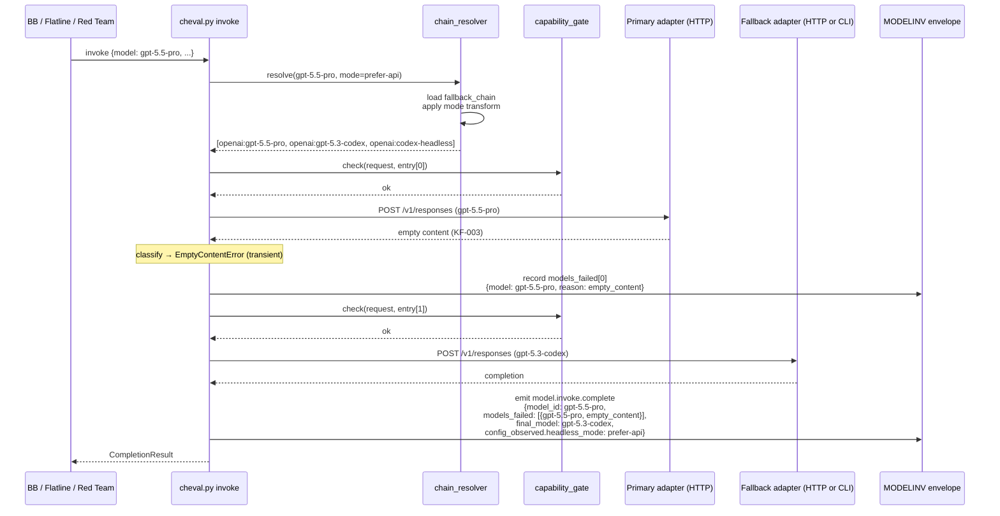
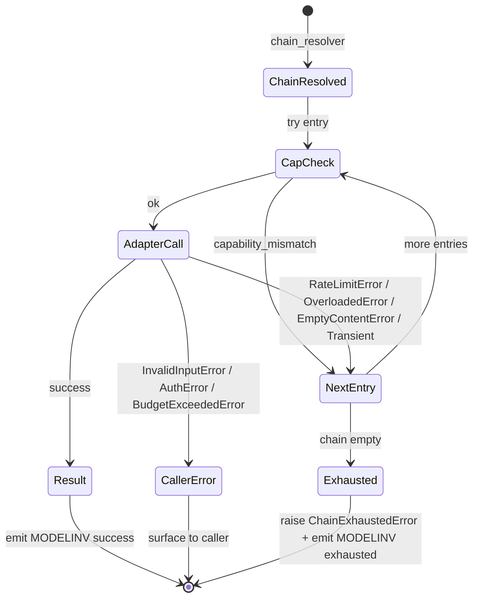

# Software Design Document — Cycle-104 Multi-Model Stabilization

**Version:** 1.0
**Date:** 2026-05-12
**Author:** Architecture Designer (cycle-104 kickoff)
**Status:** Draft — ready for `/sprint-plan`
**PRD Reference:** `grimoires/loa/cycles/cycle-104-multi-model-stabilization/prd.md`
**Predecessor SDD:** `grimoires/loa/cycles/cycle-103-provider-unification/sdd.md` (cheval substrate unification)
**Issues:** [#847](https://github.com/0xHoneyJar/loa/issues/847) (main scope), [#848](https://github.com/0xHoneyJar/loa/issues/848) (framework archival bug)

---

## Table of Contents

1. [Project Architecture](#1-project-architecture)
2. [Software Stack](#2-software-stack)
3. [Data & Audit Schemas](#3-data--audit-schemas)
4. [Operator-Facing Surfaces](#4-operator-facing-surfaces)
5. [Interface Specifications](#5-interface-specifications)
6. [Error Handling Strategy](#6-error-handling-strategy)
7. [Testing Strategy](#7-testing-strategy)
8. [Development Phases](#8-development-phases)
9. [Known Risks and Mitigation](#9-known-risks-and-mitigation)
10. [Open Questions](#10-open-questions)
11. [Appendix](#11-appendix)

---

## 1. Project Architecture

### 1.1 System Overview

Cycle-104 is a **routing-layer stabilization cycle** built on cycle-103's unified substrate (PRD §0). Cycle-103 collapsed three parallel HTTP boundaries (BB Node, Flatline bash, Red Team bash) into one cheval `httpx` substrate. Cycle-104 hardens the routing that runs on top.

> From prd.md §1.2: "The substrate is one place. The routing on top of it should be one place too."

| Layer | Pre-cycle-104 | Post-cycle-104 |
|-------|---------------|----------------|
| Substrate (HTTP) | cheval `httpx` (canonical, cycle-103) | Unchanged |
| **Within-company fallback** | One example (`gemini-3-flash-preview` → `gemini-2.5-flash`) | Every primary has an explicit chain |
| **Headless adapters** | Present but unrouted (cycle-099 PR #727) | First-class chain entries, operator-toggleable |
| **Cross-company swap workaround** | `code_review.model: claude-opus-4-7` (cycle-102 T1B.4) | Reverted to `gpt-5.5-pro`; chain absorbs KF-003 |
| **Operator headless mode** | None | `hounfour.headless.mode: prefer-api \| prefer-cli \| api-only \| cli-only` |
| **BB internal multi-model dispatcher** | Already `ChevalDelegateAdapter` per cycle-103 PR #846 | Audit-verified + drift-gate-extended + KF-008 replay-confirmed |
| **`archive-cycle.sh`** | Targets `${GRIMOIRE_DIR}` root; empty archives for cycle 098+ | Resolves per-cycle subdir via ledger lookup; `--retention N` honored |
| **BB `dist/` build hygiene** | Manual; cycle-103 near-miss possible | Pre-commit + CI gate enforces source/dist sync |

> Cycle-103 finding (verified 2026-05-12 against `resources/core/multi-model-pipeline.ts:212`): BB's internal `MultiModelPipeline` invokes `ma.adapter.generateReview(request)` where `ma.adapter` is constructed via `createAdapter(...)` (adapter-factory.ts:46) which ALWAYS returns `ChevalDelegateAdapter` post-PR #846. **The KF-008 recurrence-4 surface is NOT a Node `fetch` path that survived cycle-103** — it is the cheval-substrate path itself failing at >300KB request body. Sprint 3 is reframed accordingly (§1.4.5, §8 Phase 3).

### 1.2 Architectural Pattern

**Pattern:** Configuration-driven routing layered on Hexagonal Architecture (Ports & Adapters).

The `ILLMProvider` port (cycle-103) is unchanged. Cycle-104 adds three configuration-layer concepts the substrate consults at invocation time:

1. **`fallback_chain`** — per-alias ordered list in `.claude/defaults/model-config.yaml`. Walked on transient / rate-limit / overloaded / empty-content / capability-mismatch errors. NEVER crosses company boundary.
2. **Headless aliases** — `anthropic:claude-headless`, `openai:codex-headless`, `google:gemini-headless` resolve to existing cycle-099 adapters at `.claude/adapters/loa_cheval/providers/{claude,codex,gemini}_headless_adapter.py`.
3. **`hounfour.headless.mode`** — operator preference that reorders or filters the resolved chain at the routing layer, BEFORE cheval issues the first request.

> From prd.md §1.3 axiom 3: "Substrate as answer: routing-layer fixes ship once in `model-config.yaml` + `cheval` and propagate to every consumer automatically."

**Justification:**
- Reuses cycle-103's substrate without modification (PRD non-goal §6.2).
- Configuration-layer addition is additive — operators who don't customize see no behavioral diff (PRD §5.3).
- Per-alias chains are the smallest sufficient granularity (per-primary; not per-call-site).

**Pattern rejected:** Per-call-site fallback declaration (caller passes chain inline). Rejected because it would force every caller (BB, Flatline, Red Team, future skills) to re-encode the same chain logic — the same anti-pattern cycle-103 collapsed for HTTP. Configuration-layer is the substrate-shaped answer.

### 1.3 Component Diagram

```mermaid
graph TD
    subgraph "Configuration Layer (NEW Sprint 2)"
        ModelCfg[.claude/defaults/model-config.yaml<br/>+ fallback_chain per primary<br/>+ headless aliases]
        LoaCfg[.loa.config.yaml<br/>hounfour.headless.mode]
        EnvVar[LOA_HEADLESS_MODE env]
    end

    subgraph "Routing Layer (NEW Sprint 2)"
        Resolver[chain-resolver.py<br/>NEW: applies mode → reorder/filter]
        CapGate[capability-gate.py<br/>NEW: feature-vs-adapter match]
    end

    subgraph "Cheval Substrate (cycle-103 unchanged)"
        Cheval[cheval.py invoke]
        Retry[retry.py<br/>walks chain on typed errors]
        Audit[audit/modelinv.py<br/>+ models_failed[] populated]
    end

    subgraph "Adapters (existing)"
        HTTP_Anth[anthropic_adapter.py<br/>+ streaming]
        HTTP_OAI[openai_adapter.py<br/>+ streaming]
        HTTP_Goog[google_adapter.py<br/>+ streaming]
        CLI_Anth[claude_headless_adapter.py]
        CLI_OAI[codex_headless_adapter.py]
        CLI_Goog[gemini_headless_adapter.py]
    end

    subgraph "Callers (cycle-103 boundary)"
        BB[BB MultiModelPipeline<br/>→ ChevalDelegateAdapter]
        Flatline[flatline-orchestrator.sh<br/>→ model-invoke]
        RedTeam[adversarial-review.sh<br/>→ model-invoke]
    end

    subgraph "Framework Hygiene (NEW Sprint 1)"
        Archive[archive-cycle.sh<br/>per-cycle-subdir resolver<br/>+ retention N honored]
        DistGate[BB dist drift gate<br/>pre-commit + CI]
    end

    ModelCfg --> Resolver
    LoaCfg --> Resolver
    EnvVar --> Resolver
    Resolver --> CapGate
    CapGate --> Cheval
    Cheval --> Retry
    Retry --> Audit
    Cheval --> HTTP_Anth
    Cheval --> HTTP_OAI
    Cheval --> HTTP_Goog
    Cheval --> CLI_Anth
    Cheval --> CLI_OAI
    Cheval --> CLI_Goog

    BB --> Cheval
    Flatline --> Cheval
    RedTeam --> Cheval

    style Resolver fill:#a3e4d7
    style CapGate fill:#a3e4d7
    style Archive fill:#a3e4d7
    style DistGate fill:#a3e4d7
    style ModelCfg fill:#fde68a
    style LoaCfg fill:#fde68a
    style EnvVar fill:#fde68a
```

Green nodes = net-new code (Sprint 1 + Sprint 2). Yellow nodes = configuration surfaces extended.

### 1.4 System Components

#### 1.4.1 `chain-resolver.py` (NEW — Sprint 2, FR-S2.1 / FR-S2.4)

- **Purpose:** Single chokepoint that turns `(alias, operator_mode)` into the ordered list of `(provider, adapter_kind)` tuples cheval walks.
- **Location:** `.claude/adapters/loa_cheval/routing/chain_resolver.py` (NEW module under existing `loa_cheval/`).
- **Responsibilities:**
  - Read primary alias from caller config (e.g., `gpt-5.5-pro`).
  - Read `fallback_chain` from `model-config.yaml` for that alias.
  - Read `hounfour.headless.mode` (config) or `LOA_HEADLESS_MODE` (env; env wins).
  - Apply mode transform: `prefer-api` (default order), `prefer-cli` (CLI entries first), `api-only` (drop CLI entries), `cli-only` (drop HTTP entries).
  - Return ordered `ResolvedChain` dataclass: `[ResolvedEntry(provider, model_id, adapter_kind, capabilities)]`.
- **Invariants:**
  - **Never crosses company boundary**: caller's primary alias's company is preserved across every entry. Mode transforms reorder/filter within the company chain; they do NOT substitute another company's adapter.
  - **Idempotent**: same `(alias, mode)` → same chain order.
  - **Fail-loud**: if `cli-only` and chain has no CLI adapter for the primary's company → raises `NoEligibleAdapterError` (audit-emitted via `models_failed[]`, no silent fallback).
- **Interfaces:**
  - Consumed by `cheval.py invoke` BEFORE first HTTP/CLI request (replaces today's single-primary lookup).
  - Consumed by audit envelope writer for `config_observed.headless_mode` and `models_failed[]` provenance.

#### 1.4.2 `capability_gate.py` (NEW — Sprint 2, FR-S2.7)

- **Purpose:** Per-entry feature-vs-adapter compatibility check. Skips adapters that lack the requested feature (e.g., `large_context`, `tool_use`, `structured_json`) WITHOUT failing the call.
- **Location:** `.claude/adapters/loa_cheval/routing/capability_gate.py`.
- **Contract:** `check(request: CompletionRequest, entry: ResolvedEntry) -> CapabilityCheckResult` returning `{ok: bool, missing: list[str]}`.
- **Behavior on miss:** Router skips the entry, records `models_failed[].reason = "capability_mismatch"` and `models_failed[].missing_capabilities = [...]`, walks to next chain entry.
- **Capability declarations:** Live alongside the alias in `model-config.yaml` (see §3.2). Each entry declares `capabilities: [chat, tools, large_context, structured_json, ...]`.

#### 1.4.3 `archive-cycle.sh` per-cycle-subdir resolver (CHANGED — Sprint 1, FR-S1.1 / FR-S1.2 / FR-S1.3)

- **Purpose:** Make `archive-cycle.sh` archive the actual cycle artifacts, not the (empty) grimoire root.
- **Location:** `.claude/scripts/archive-cycle.sh:80-130` (existing file, surgical edit).
- **Behavior change:**
  1. Resolve cycle directory via ledger lookup: read `grimoires/loa/ledger.json::cycles[].slug` for cycle N, expand to `grimoires/loa/cycles/cycle-N-<slug>/`.
  2. Copy artifacts from the resolved per-cycle subdir: `prd.md`, `sdd.md`, `sprint.md`, `handoffs/`, `a2a/`, `flatline/` (when present).
  3. Preserve backward compat: if the per-cycle subdir doesn't exist (cycles ≤097), fall back to the legacy `${GRIMOIRE_DIR}` root path (current behavior).
  4. Honor `--retention N`: scan `${ARCHIVE_DIR}/cycle-*` directories sorted by ledger-recorded close date, delete oldest beyond N (currently the deletion list is fixed-hardcoded; replace with dynamic enumeration).
- **Safety:** Preserve `--dry-run` semantics; print the resolved cycle path and the deletion candidates BEFORE doing anything destructive.
- **Backward compat:** Cycles ≤097 archive cleanly using the fall-back path. Cycles ≥098 use the new resolver. No flag-flip required.

#### 1.4.4 BB `dist/` drift gate (NEW — Sprint 1, FR-S1.4)

- **Purpose:** Prevent BB TypeScript source changes from shipping without their compiled `dist/` artifacts (cycle-103 near-miss).
- **Tool:** `tools/check-bb-dist-fresh.sh`.
- **Logic:**
  1. Run `npm run build` in a hermetic tmpdir (or compute content hashes of `resources/**/*.ts` and compare to recorded hash in `dist/.build-manifest.json`).
  2. Compare output to committed `dist/`. If diff exists → exit 1 with the file list.
  3. Mirrors cycle-099 sprint-1A drift-gate precedent (`gen-bb-registry:check`-style content-hash compare).
- **Workflow:** `.github/workflows/check-bb-dist-fresh.yml` triggers on PR + push to main, paths filter on `.claude/skills/bridgebuilder-review/resources/**`.
- **Pre-commit:** Optional hook (`.claude/hooks/pre-commit/bb-dist-check.sh`) for operator-side fast feedback. Soft-fail with instructions to run `npm run build`.

#### 1.4.5 Sprint 3 reframed — BB cheval-routing audit + KF-008 replay (CHANGED scope, FR-S3.1 / FR-S3.2 / FR-S3.3 / FR-S3.4)

> **Pre-implementation finding (Q1 in §10):** Verification on 2026-05-12 against `resources/core/multi-model-pipeline.ts:212` and `resources/adapters/adapter-factory.ts:46` confirms BB's internal multi-model parallel dispatcher already routes through `ChevalDelegateAdapter` (cycle-103 PR #846). The PRD's framing of Sprint 3 as a migration is inaccurate. Sprint 3 is reframed as **verification + drift-gate extension + KF-008 replay** without changing the AC count.

The reframed Sprint 3 deliverables:

- **FR-S3.1 verification (not migration):** Inventory grep + audit-trail inspection proves all BB consensus invocations transit cheval. Output: a one-page evidence doc at `grimoires/loa/cycles/cycle-104-multi-model-stabilization/sprint-3-evidence.md` showing the call-site → adapter → cheval traversal.
- **FR-S3.2 drift gate extension:** Cycle-103 T1.7 `tools/check-no-direct-llm-fetch.sh` already scans `.claude/skills/bridgebuilder-review/resources/**`. Extend its glob to cover any new BB files added since cycle-103 close (`adapters/index.ts`, `core/cross-repo.ts`) and add a positive-control test that fails if a `fetch(...)` call is reintroduced into the parallel-dispatch path. Adds shebang detection per cycle-099 sprint-1E.c.3.c (scanner glob blindness lesson).
- **FR-S3.3 KF-008 replay:** Issue the synthetic large-PR replay (297KB / 302KB / 317KB / 539KB request bodies) against the cheval-routed path. Two possible outcomes:
  - **(a)** Body-size failure resolves at the substrate (because cheval's httpx + streaming defaults handle what BB Node `undici` did not). Mark KF-008 → `RESOLVED-architectural-complete`.
  - **(b)** Body-size failure persists at the substrate. File a deeper upstream against `#845` with the new evidence; classify KF-008 attempts row 5 with the cheval-substrate-side failure shape; leave status as `MITIGATED-CONSUMER` (cross-company fallback in the chain is the survival path).
  Either outcome is acceptable — Sprint 3 closure ships the evidence, not a forced fix.
- **FR-S3.4 inventory grep:** `tools/check-bb-no-direct-fetch.sh` returns zero matches of `fetch(` / `https.request(` / `undici` imports outside test fixtures / type definitions. Becomes part of the CI drift-gate workflow.

#### 1.4.6 Within-company fallback chains in `model-config.yaml` (CHANGED schema — Sprint 2, FR-S2.1)

Every primary model alias gets an explicit `fallback_chain` ending in (a) the within-company headless adapter where one exists, OR (b) the smallest within-company model. Example schema is in §3.2.

The schema field already exists (`gemini-3-flash-preview: fallback_chain: ["google:gemini-2.5-flash"]` at L171 of current `model-config.yaml`). Cycle-104 populates it system-wide.

### 1.5 Data Flow — Routing-layer pass with within-company fallback



### 1.6 External Integrations

| Service | Purpose | Path post-cycle-104 |
|---------|---------|---------------------|
| Anthropic Messages API | Claude opus/sonnet inference (HTTP path) | cheval `httpx` — unchanged |
| OpenAI Responses API | GPT inference (HTTP path) | cheval `httpx` — unchanged |
| Google Generative Language | Gemini inference (HTTP path) | cheval `httpx` — unchanged |
| `claude` CLI (local) | Claude inference via Claude Code subscription auth | `claude_headless_adapter.py` subprocess |
| `codex` CLI (local) | GPT inference via Codex CLI auth | `codex_headless_adapter.py` subprocess |
| `gemini` CLI (local) | Gemini inference via Google CLI auth | `gemini_headless_adapter.py` subprocess |
| GitHub API (`gh` CLI) | PR review posting | BB TS `github-cli.ts` — unchanged |

### 1.7 Deployment Architecture

- **No deployment infrastructure changes.** Loa is operator-machine resident.
- All cycle-104 deliverables ship via the same `.claude/` skill/adapter layout already in use.
- Two new GitHub Actions workflows: `check-bb-dist-fresh.yml` (Sprint 1), extension to `no-direct-llm-fetch.yml` (Sprint 3).
- **CLI binary prerequisites** (operator-side, for `prefer-cli` / `cli-only` modes): `claude`, `codex`, `gemini` binaries must be on `$PATH`. Documented in `headless-mode.md` runbook (FR-S2.10).

### 1.8 Performance Strategy

- **Within-company chain latency budget** (PRD §5.1): primary success → 0 chain-walk overhead. Primary failure → exactly 1 additional retry round-trip per chain entry until success.
- **CLI cold-start budget** (PRD §5.1): `prefer-cli` mode acceptable to add ≤2s subprocess-spawn overhead per call (vs HTTP). Operators choosing `prefer-cli` accept this tradeoff.
- **Audit emit overhead**: `models_failed[]` array bounded by chain depth (`≤5` entries per primary in current configs); negligible byte-size impact on envelope.
- **No new throughput requirements.** Cycle-104 is operator-triggered same as cycle-103.

### 1.9 Security Architecture

Per PRD §5.2:

- **AC-8 zero-API-key claim under `cli-only`:** `chain_resolver.py` in `cli-only` mode emits a chain containing zero HTTP adapters. `cheval.py invoke` MUST refuse to issue any HTTPS request when the resolved chain is CLI-only (defense-in-depth check; not just an empty-string `*_API_KEY` env). Verified by Sprint 2 e2e test (FR-S2.9) running with `unset ANTHROPIC_API_KEY OPENAI_API_KEY GOOGLE_API_KEY` and `strace`-equivalent network monitoring.
- **Headless adapter trust boundary**: local CLI binaries are operator-installed; the router does not install or update them. Capability matrix documents version-pinned features (FR-S2.10 runbook).
- **Audit-chain integrity**: `models_failed[]` writes go through the existing `audit_emit` path (`lib/audit-envelope`). Schema version bump if new enum value (`capability_mismatch`, `empty_content`) lands — see §3.4.
- **No new secrets**: cycle-104 introduces zero new credential surfaces.

---

## 2. Software Stack

### 2.1 Cheval Python Side (existing — additive routing layer)

| Category | Technology | Version | Justification |
|----------|------------|---------|---------------|
| Language | Python | ≥3.11 | Existing — cheval baseline |
| HTTP | `httpx` | (existing) | Existing — streaming-capable post cycle-102 Sprint 4A |
| Test | `pytest` | (existing) | Existing — >970-test baseline (cycle-103 close) |
| Schema | `pydantic` (existing) | — | Add `ResolvedEntry`, `ResolvedChain` dataclasses |

**Added in cycle-104 Sprint 2:**
- `.claude/adapters/loa_cheval/routing/chain_resolver.py` — fallback-chain resolver
- `.claude/adapters/loa_cheval/routing/capability_gate.py` — feature-vs-adapter gate
- `.claude/adapters/loa_cheval/routing/__init__.py` — package init

**Changed in cycle-104 Sprint 2:**
- `.claude/adapters/cheval.py` — `invoke()` entry point consults `chain_resolver` before dispatching
- `.claude/adapters/loa_cheval/audit/modelinv.py` — emit `models_failed[]` populated in order + `config_observed.headless_mode`

### 2.2 Bash Side (existing — additive)

| Category | Technology | Version | Justification |
|----------|------------|---------|---------------|
| Shell | bash | 4.0+ | Existing project-wide |
| YAML | `yq` v4+ | (existing) | Existing — `.loa.config.yaml` read pattern |
| Test | `bats` | (existing) | Existing — drift-gate test pattern |

**Changed in cycle-104 Sprint 1:**
- `.claude/scripts/archive-cycle.sh` — per-cycle-subdir resolver + `--retention N` honored

**Added in cycle-104 Sprint 1:**
- `tools/check-bb-dist-fresh.sh` — content-hash drift gate
- `.github/workflows/check-bb-dist-fresh.yml` — CI workflow
- `grimoires/loa/runbooks/cycle-archive.md` — operator runbook
- `grimoires/loa/runbooks/headless-mode.md` — operator runbook (Sprint 2 deliverable, FR-S2.10)
- `grimoires/loa/runbooks/headless-capability-matrix.md` — feature matrix (Sprint 2, FR-S2.2)

### 2.3 BB TypeScript Side (cycle-103 unchanged)

No TypeScript changes in cycle-104. BB's `ChevalDelegateAdapter` (cycle-103 Sprint 1) is the canonical and only LLM adapter; the multi-model pipeline already uses it. Sprint 3 verifies this; nothing to change.

The cycle-103 `LOA_BB_FORCE_LEGACY_FETCH` one-cycle escape hatch (cycle-103 SDD §4.2) is REMOVED in cycle-104 — its removal was scheduled at cycle-103 close as a cycle-104 deliverable.

### 2.4 Infrastructure & DevOps

| Category | Technology | Purpose |
|----------|------------|---------|
| CI | GitHub Actions | `check-bb-dist-fresh.yml` (Sprint 1); extended `no-direct-llm-fetch.yml` (Sprint 3) |
| Pre-commit | (existing hook layer) | Optional `bb-dist-check.sh` for operator-side fast feedback |
| Audit logs | Existing MODELINV envelope | Schema-additive: `models_failed[]` populated, `config_observed.headless_mode` |

---

## 3. Data & Audit Schemas

### 3.1 `ResolvedChain` / `ResolvedEntry` (NEW — Sprint 2)

```python
# .claude/adapters/loa_cheval/routing/types.py (NEW)
from dataclasses import dataclass
from typing import Literal

AdapterKind = Literal["http", "cli"]

@dataclass(frozen=True)
class ResolvedEntry:
    provider: Literal["anthropic", "openai", "google"]
    model_id: str                # e.g., "gpt-5.5-pro" or "openai:codex-headless"
    adapter_kind: AdapterKind
    capabilities: frozenset[str] # e.g., frozenset({"chat", "tools", "large_context"})

@dataclass(frozen=True)
class ResolvedChain:
    primary_alias: str
    entries: tuple[ResolvedEntry, ...]
    headless_mode: Literal["prefer-api", "prefer-cli", "api-only", "cli-only"]
```

### 3.2 `model-config.yaml` extension (CHANGED — Sprint 2, FR-S2.1 / FR-S2.2)

The existing `fallback_chain` field is populated system-wide. Headless aliases are added to the providers' `models:` blocks with `capabilities` declarations.

```yaml
# .claude/defaults/model-config.yaml
providers:
  openai:
    models:
      gpt-5.5-pro:
        capabilities: [chat, tools, large_context, structured_json]
        # NEW Sprint 2: within-company chain. NO cross-company entries.
        fallback_chain:
          - openai:gpt-5.3-codex     # similar capability, smaller window
          - openai:codex-headless    # CLI fallback (no rate limit, no API key)
      gpt-5.3-codex:
        capabilities: [chat, tools, function_calling, code, large_context]
        fallback_chain:
          - openai:codex-headless
      # NEW Sprint 2: headless alias declared in provider block.
      codex-headless:
        kind: cli                    # NEW field — distinguishes HTTP vs CLI
        capabilities: [chat, code]   # No tool_use, no structured_json
        # Headless entries have no fallback_chain (they're chain terminals).
  anthropic:
    models:
      claude-opus-4-7:
        capabilities: [chat, tools, large_context, structured_json, thinking]
        fallback_chain:
          - anthropic:claude-sonnet-4-7
          - anthropic:claude-headless
      claude-headless:
        kind: cli
        capabilities: [chat]
  google:
    models:
      gemini-3-pro:
        capabilities: [chat, tools, large_context, structured_json]
        fallback_chain:
          - google:gemini-2.5-pro
          - google:gemini-headless
      gemini-headless:
        kind: cli
        capabilities: [chat]
```

**Schema invariant** (enforced by `chain_resolver._validate_chain`):
- Every `fallback_chain` entry shares the same company prefix as the primary alias's company.
- No chain references a non-existent alias.
- Headless aliases have `kind: cli`; HTTP aliases have implicit `kind: http`.

### 3.3 `hounfour.headless.mode` config (NEW — Sprint 2, FR-S2.4)

```yaml
# .loa.config.yaml
hounfour:
  headless:
    # Operator-mode for routing layer. Default: prefer-api (today's behavior).
    # prefer-api : HTTP first, CLI last in each chain entry
    # prefer-cli : CLI first, HTTP last (budget-constrained operators)
    # api-only   : drop CLI entries from chain
    # cli-only   : drop HTTP entries from chain (zero-API-key path)
    mode: prefer-api
    # CLI binaries discovery hint. If unset, $PATH is searched.
    cli_paths:
      claude: /usr/local/bin/claude
      codex: /usr/local/bin/codex
      gemini: /usr/local/bin/gemini
```

**Env var override**: `LOA_HEADLESS_MODE=prefer-cli` overrides config-file `mode`. Env wins. Unset env → fall back to config-file value. Both unset → `prefer-api`.

### 3.4 MODELINV audit envelope extension (CHANGED — Sprint 2, FR-S2.3 / observability §5.4)

Add two fields to the existing `model.invoke.complete` payload (cycle-103 already added `streaming` and `models_failed[].error_category`; cycle-104 populates `models_failed[]` in walk order + adds `config_observed`).

```json
{
  "schema_version": "1.1",
  "event": "model.invoke.complete",
  "primitive_id": "MODELINV",
  "payload": {
    "model_id": "gpt-5.5-pro",
    "provider": "openai",
    "final_model_id": "gpt-5.3-codex",
    "transport": "http",
    "streaming": true,
    "models_failed": [
      {
        "model_id": "gpt-5.5-pro",
        "provider": "openai",
        "error_category": "empty_content",
        "reason": "primary returned content=\"\" at input_tokens=27843",
        "missing_capabilities": null
      }
    ],
    "config_observed": {
      "headless_mode": "prefer-api",
      "headless_mode_source": "default"
    },
    "operator_visible_warn": false,
    "kill_switch_active": false
  }
}
```

**New fields (cycle-104):**
- `payload.final_model_id` — the model that produced the result (may differ from `model_id` if chain walked)
- `payload.transport` — `"http"` or `"cli"` (derived from final entry's `adapter_kind`)
- `payload.models_failed[].provider` — provider for each walked entry
- `payload.models_failed[].reason` — human-readable diagnostic (already redacted via cycle-103 `sanitize_provider_error_message`)
- `payload.models_failed[].missing_capabilities` — populated when `error_category=capability_mismatch`
- `payload.config_observed.headless_mode` — observed mode in effect
- `payload.config_observed.headless_mode_source` — `"env"` | `"config"` | `"default"` (audit-the-mode-source, axiom 2 PRD §1.3)

**New `error_category` enum values:** `empty_content` (KF-003 class), `capability_mismatch` (FR-S2.7). Existing values from cycle-103 retained: `rate_limit`, `overloaded`, `malformed`, `policy`, `transient`, `unknown`.

**JCS canonicalization** (PRD §5.5): All new payload fields canonicalize via `lib/jcs.sh` — never substitute `jq -S -c` (cycle-098 invariant carried forward).

### 3.5 Ledger / archive schema (CHANGED — Sprint 1, FR-S1.1)

`archive-cycle.sh` reads `grimoires/loa/ledger.json::cycles[]` for `(cycle_number, slug, status)` to resolve the per-cycle-subdir name. No schema change to the ledger itself; the cycle dir is `cycle-{cycle_number}-{slug}/`.

Example:
```json
{
  "cycles": [
    {"number": 103, "slug": "provider-unification", "status": "archived"},
    {"number": 104, "slug": "multi-model-stabilization", "status": "active"}
  ]
}
```

Resolved path: `grimoires/loa/cycles/cycle-104-multi-model-stabilization/`.

---

## 4. Operator-Facing Surfaces

Cycle-104 ships no UI. Operator-visible surfaces are:

### 4.1 CLI behavior — externally additive

- `cheval invoke` — same args, same JSON contract. Internally now consults `chain_resolver` before issuing requests. Operator-visible new behavior: on chain walk, stderr emits one line per fallback (`[cheval] fallback openai:gpt-5.5-pro → openai:gpt-5.3-codex (reason=empty_content)`) for operator debugging.
- `archive-cycle.sh --cycle N --dry-run` — outputs the resolved per-cycle subdir path BEFORE attempting to copy; operator can verify resolution.
- `archive-cycle.sh --retention N` — now honors N (was: ignored, hardcoded deletion list).

### 4.2 Environment variables — additive

| Variable | Default | Purpose | Sprint |
|----------|---------|---------|--------|
| `LOA_HEADLESS_MODE` | unset (→ config `mode` value, else `prefer-api`) | Override headless routing mode | Sprint 2 |
| `LOA_HEADLESS_VERBOSE` | unset | Emit skip/walk events to stderr at runtime for operator debugging | Sprint 2 |
| `LOA_RUN_LIVE_TESTS` | unset | Gate live-API empirical replay tests (existing pattern) | Sprint 2 (FR-S2.8) |

### 4.3 Config-file additions — additive

`.loa.config.yaml`:
```yaml
hounfour:
  headless:
    mode: prefer-api
    cli_paths:
      claude: ""
      codex: ""
      gemini: ""

# Reverted (Sprint 2 FR-S2.6): code_review & security_audit go back to gpt-5.5-pro
# now that the within-company chain absorbs KF-003 internally.
flatline_protocol:
  code_review:
    model: gpt-5.5-pro     # was: claude-opus-4-7 (cycle-102 T1B.4)
  security_audit:
    model: gpt-5.5-pro     # was: claude-opus-4-7 (cycle-102 T1B.4)
```

`.claude/defaults/model-config.yaml` — `fallback_chain` populated per-primary; headless aliases added (§3.2).

### 4.4 Runbooks (new — Sprint 1 + Sprint 2 deliverables)

- `grimoires/loa/runbooks/cycle-archive.md` (Sprint 1 FR-S1.5) — `archive-cycle.sh --cycle N` semantics, per-cycle subdir assumption, recovery procedure
- `grimoires/loa/runbooks/headless-mode.md` (Sprint 2 FR-S2.10) — CLI install pre-reqs, capability tradeoffs, when to use which mode
- `grimoires/loa/runbooks/headless-capability-matrix.md` (Sprint 2 FR-S2.2) — feature-by-adapter compatibility table

---

## 5. Interface Specifications

### 5.1 `chain_resolver.resolve()` (NEW — Sprint 2)

```python
# .claude/adapters/loa_cheval/routing/chain_resolver.py
def resolve(
    primary_alias: str,
    *,
    model_config: dict,                  # parsed model-config.yaml
    headless_mode: Literal["prefer-api", "prefer-cli", "api-only", "cli-only"],
    headless_mode_source: Literal["env", "config", "default"],
) -> ResolvedChain:
    """
    Resolves a primary alias into an ordered chain of adapter entries.

    Invariants:
      - Every entry's provider == primary_alias's provider (within-company).
      - cli-only with no CLI entries → raises NoEligibleAdapterError.
      - Idempotent: same inputs → same chain order.
    """
```

### 5.2 `capability_gate.check()` (NEW — Sprint 2)

```python
# .claude/adapters/loa_cheval/routing/capability_gate.py
@dataclass
class CapabilityCheckResult:
    ok: bool
    missing: list[str]              # empty when ok=True

def check(
    request: CompletionRequest,
    entry: ResolvedEntry,
) -> CapabilityCheckResult:
    """
    Compares request-required features (e.g., large_context, tools, structured_json)
    against entry.capabilities. Returns missing list on mismatch; router skips entry.
    """
```

### 5.3 `cheval invoke` integration (CHANGED — Sprint 2)

The CLI contract (§3.1 of cycle-103 SDD) is unchanged externally. Internal flow change:

```
cheval invoke --model <primary_alias> ...
  ↓
chain_resolver.resolve(primary_alias, ...) → ResolvedChain
  ↓
for entry in chain.entries:
    cap_check = capability_gate.check(request, entry)
    if not cap_check.ok:
        record models_failed[entry, reason=capability_mismatch, missing=...]
        continue
    try:
        result = adapter_dispatch(entry, request)  # HTTP or CLI
        emit_model_invoke_complete(final_model=entry.model_id, models_failed=[...])
        return result
    except (RateLimitError, ProviderUnavailableError,
            EmptyContentError, RetryableTransient) as e:
        record models_failed[entry, reason=<category>, message=<sanitized>]
        continue
    except (InvalidInputError, AuthError, ...) as e:
        # Non-retryable — surface to caller
        raise
# All entries exhausted
emit_model_invoke_complete(final_model=None, models_failed=[...], outcome=exhausted)
raise ChainExhaustedError(...)
```

### 5.4 `archive-cycle.sh` (CHANGED — Sprint 1)

```
archive-cycle.sh --cycle N [--dry-run] [--retention M] [--archive-dir PATH]
  ↓
cycle_slug=$(jq -r ".cycles[] | select(.number == ${N}) | .slug" ledger.json)
cycle_dir="grimoires/loa/cycles/cycle-${N}-${cycle_slug}/"
  ↓
if [[ -d "${cycle_dir}" ]]; then
    artifact_root="${cycle_dir}"        # cycles ≥098
else
    artifact_root="${GRIMOIRE_DIR}"     # legacy cycles ≤097
fi
  ↓
copy prd.md sdd.md sprint.md handoffs/ a2a/ flatline/ from ${artifact_root}
  ↓
if [[ -n "${RETENTION}" && "${RETENTION}" -gt 0 ]]; then
    ls -dt "${ARCHIVE_DIR}"/cycle-* | tail -n +"$((RETENTION + 1))" | xargs -r rm -rf
fi
```

---

## 6. Error Handling Strategy

### 6.1 Error taxonomy (extending cycle-103)



### 6.2 `NoEligibleAdapterError` (NEW — Sprint 2)

Raised by `chain_resolver.resolve()` when:
- `cli-only` mode and no CLI adapter declared in chain
- `api-only` mode and no HTTP adapter declared in chain
- Primary alias unknown / fallback_chain references unknown alias

Exit code from `cheval.py invoke`: 8 (NEW — extends existing 0–7 range).

### 6.3 `ChainExhaustedError` (NEW — Sprint 2)

Raised by `cheval.py invoke` when every entry in the resolved chain has been walked and all returned retry-able errors.

Exit code: 9 (NEW). The audit envelope's `models_failed[]` carries the full walk evidence; operator can grep stderr for one-line walk summary.

### 6.4 Operator-stderr behavior (unchanged from cycle-103)

- Sanitized error messages via cycle-103's `sanitize_provider_error_message` at exception construction.
- New per-walk one-liners gated behind `LOA_HEADLESS_VERBOSE=1` (off by default to keep cheval's stderr quiet for happy-path callers).

### 6.5 Cross-company fallback (FR-S2.5 — repurposed)

The cross-company `flatline_protocol.models.{secondary, tertiary}` defaults are repurposed (not removed):

- **Today:** fire on any primary failure → substitute another company's model in the same slot
- **Cycle-104:** fire ONLY after within-company chain is exhausted → drop the voice from consensus aggregation, emit `consensus.voice_dropped` event

This preserves consensus diversity (the voice is missing, not silently substituted), and the substitute-another-company anti-pattern that collapsed cycle-102 T1B.4 is structurally retired.

---

## 7. Testing Strategy

### 7.1 Test pyramid

| Level | Existing baseline | Cycle-104 net-new | Tooling |
|-------|-------------------|-------------------|---------|
| Python unit | ~970 (cycle-103 close) | ~40–60 (chain_resolver, capability_gate, audit-envelope extension) | pytest |
| Python integration | (existing) | ~10 (chain-walk end-to-end with mocked HTTP + mocked CLI subprocess) | pytest |
| Bats | (existing) | ~15 (archive-cycle.sh per-cycle-subdir, --retention, BB dist drift gate, mode env override) | bats |
| Cross-runtime parity | (cycle-099 corpus) | ~5 (model-config.yaml schema validation across bash/python/TS readers) | bats + python + tsx |
| Empirical replay | (cycle-103 KF-008 replay) | KF-003 chain replay (FR-S2.8) + KF-008 substrate replay (FR-S3.3) | pytest + live API (gated `LOA_RUN_LIVE_TESTS=1`) |
| E2E | (none) | 1 (cli-only fresh-machine zero-API-key end-to-end — FR-S2.9 / AC-8) | bats + strace/equivalent network monitor |

### 7.2 Per-AC test mapping (PRD §8 DoD)

| AC / FR | Test artifact |
|---------|---------------|
| FR-S1.1 / FR-S1.3 | `tests/test_archive_cycle_per_subdir.bats` — cycle 098+ resolves; cycle ≤097 falls back |
| FR-S1.2 | `tests/test_archive_cycle_retention.bats` — N=0 keeps all; N=5 vs N=50 produces different deletion sets |
| FR-S1.4 | `tests/test_bb_dist_drift_gate.bats` — positive control (source-without-dist fails); negative control (synced source+dist passes) |
| FR-S1.5 | Runbook lint (markdown link check) |
| FR-S2.1 (AC-1) | `tests/test_chain_resolver_within_company.py` — every primary's chain validated against no-cross-company invariant |
| FR-S2.2 (AC-4) | `tests/test_headless_alias_resolution.py` — reuses cycle-099 alias-resolution corpus + new headless entries |
| FR-S2.3 (AC-2) | `tests/test_chain_walk_audit_envelope.py` — simulate primary empty-content → assert chain walked + envelope populated in order |
| FR-S2.4 (AC-3) | `tests/test_headless_mode_routing.bats` — bats captures resolved chain via `LOA_HEADLESS_MODE` × 4 modes |
| FR-S2.5 (AC-1, AC-2) | `tests/test_voice_drop_on_exhaustion.py` — full chain exhausted → `consensus.voice_dropped` emitted, no cross-company substitution |
| FR-S2.6 (AC-5) | `tests/test_code_review_revert.bats` — `grep "code_review" .loa.config.yaml` shows `gpt-5.5-pro` |
| FR-S2.7 (AC-4) | `tests/test_capability_gate.py` — large_context request × codex-headless missing-cap → skip + audit reason |
| FR-S2.8 (AC-7) | `tests/replay/test_kf003_within_company_chain.py` — live API, gated `LOA_RUN_LIVE_TESTS=1`, ~$3 budget |
| FR-S2.9 (AC-8) | `tests/e2e/test_cli_only_zero_api_key.bats` — `unset *_API_KEY`; strace-equivalent zero-HTTPS; cheval succeeds via CLI |
| FR-S2.10 (AC-6) | Runbook lint |
| FR-S3.1 | `grimoires/loa/cycles/cycle-104-multi-model-stabilization/sprint-3-evidence.md` (manual evidence doc) |
| FR-S3.2 | `tests/test_no_direct_fetch_extended.bats` — extends cycle-103 T1.7; positive + negative controls |
| FR-S3.3 | `tests/replay/test_kf008_substrate_replay.py` — gated `LOA_RUN_LIVE_TESTS=1`; closing-evidence written to KF-008 attempts row |
| FR-S3.4 | `tests/test_bb_zero_direct_fetch.bats` — inventory grep returns zero matches |

### 7.3 Drift-gate CI integration

`.github/workflows/check-bb-dist-fresh.yml` (Sprint 1):
```yaml
on:
  pull_request:
    paths:
      - '.claude/skills/bridgebuilder-review/resources/**'
      - '.claude/skills/bridgebuilder-review/dist/**'
      - '.claude/skills/bridgebuilder-review/package.json'
  push:
    branches: [main]
    paths:
      - '.claude/skills/bridgebuilder-review/resources/**'
      - '.claude/skills/bridgebuilder-review/dist/**'

jobs:
  check-bb-dist-fresh:
    runs-on: ubuntu-latest
    steps:
      - uses: actions/checkout@v4
      - uses: actions/setup-node@v4
        with:
          node-version: '20'
      - run: bash tools/check-bb-dist-fresh.sh
```

Extension to cycle-103's `no-direct-llm-fetch.yml` (Sprint 3) — add the new files added in cycle-104 to the scanner paths and add the positive-control test fixture.

### 7.4 Empirical-replay budget (Sprint 2 FR-S2.8 + Sprint 3 FR-S3.3)

- **KF-003 chain replay**: 5 prompts × 5 input sizes (30K, 40K, 50K, 60K, 80K tokens) = 25 runs. At gpt-5.5-pro pricing (~$1.75 per 1M input tokens), full sweep ≈ $1.20. With chain-walk doubling on failures, budget cap $3.
- **KF-008 substrate replay**: 4 request bodies (297K / 302K / 317K / 539K bytes). Single-shot per body. Budget cap $2.
- **Total Sprint 2 + 3 live-API budget**: ≤$5.

### 7.5 Regression gate

- Sprint exit requires `cd .claude/adapters && python3 -m pytest tests/ -q` ≥ 970 passing (cycle-103 baseline).
- Cycle-104 adds ~40–60 net-new Python tests + ~15 bats; final target ≥ 1015 Python tests passing.

---

## 8. Development Phases

PRD §6.1 + §7.3: Sequential by sequencing constraint — Sprint 1 → Sprint 2 → Sprint 3. Sprint 2 ↔ Sprint 3 may run parallel after Sprint 1 lands, per operator preference.

### Phase 1 — Sprint 1: Framework Archival + BB Dist Hygiene (2–3 days)

**Goal:** Unblock framework archival hygiene (#848) + prevent BB dist build near-miss recurrence.

- [ ] **T1.1** `archive-cycle.sh` per-cycle-subdir resolver (FR-S1.1) — ledger-based path resolution + legacy fall-back
- [ ] **T1.2** `archive-cycle.sh --retention N` honored (FR-S1.2) — replace hardcoded list with dynamic enumeration
- [ ] **T1.3** Copy `handoffs/` subdir + `a2a/` backward-compat copy (FR-S1.3)
- [ ] **T1.4** `tools/check-bb-dist-fresh.sh` content-hash drift gate (FR-S1.4)
- [ ] **T1.5** `.github/workflows/check-bb-dist-fresh.yml` (FR-S1.4)
- [ ] **T1.6** Optional pre-commit hook `.claude/hooks/pre-commit/bb-dist-check.sh` (FR-S1.4)
- [ ] **T1.7** `grimoires/loa/runbooks/cycle-archive.md` (FR-S1.5)
- [ ] **T1.8** Bats tests: `test_archive_cycle_per_subdir.bats`, `test_archive_cycle_retention.bats`, `test_bb_dist_drift_gate.bats`
- [ ] **T1.9** Cycle-103 archive re-run (operator-validated) — verify the script produces a non-empty cycle-103 archive

**Sprint 1 exit:** G6 + G7 hold per PRD §2.1. `archive-cycle.sh --cycle 103 --dry-run` enumerates cycle-103 artifacts correctly.

### Phase 2 — Sprint 2: Within-Company Chains + Headless Opt-In + code_review Revert (5–7 days)

**Goal:** Populate `fallback_chain` system-wide; add headless aliases + capability gate; ship `hounfour.headless.mode`; revert cycle-102 T1B.4 cross-company swap.

Sequenced per PRD R4 mitigation — **chain_resolver first** (foundational), **then code_review revert last** (depends on chain absorbing KF-003):

- [ ] **T2.1** `chain_resolver.py` + `ResolvedChain` / `ResolvedEntry` dataclasses (FR-S2.1, FR-S2.4)
- [ ] **T2.2** `capability_gate.py` + capability declarations in model-config.yaml (FR-S2.7)
- [ ] **T2.3** Populate `fallback_chain` for every primary in `model-config.yaml` (FR-S2.1) — Anthropic / OpenAI / Google primaries
- [ ] **T2.4** Add headless aliases (`claude-headless`, `codex-headless`, `gemini-headless`) to model-config.yaml with `kind: cli` + capability declarations (FR-S2.2)
- [ ] **T2.5** Wire `chain_resolver` into `cheval.py invoke` entry point — walk chain on retryable errors (FR-S2.3)
- [ ] **T2.6** Extend MODELINV envelope: `models_failed[]` populated in walk order, `config_observed.headless_mode`, `final_model_id`, `transport` (FR-S2.3, §3.4)
- [ ] **T2.7** `LOA_HEADLESS_MODE` env var + `hounfour.headless.mode` config plumbing (FR-S2.4)
- [ ] **T2.8** Repurpose cross-company `flatline_protocol.models.{secondary,tertiary}` as voice-drop trigger (FR-S2.5)
- [ ] **T2.9** **Revert `.loa.config.yaml::flatline_protocol.code_review.model` and `security_audit.model` to `gpt-5.5-pro`** (FR-S2.6) — depends on T2.3 + T2.5 in effect
- [ ] **T2.10** Empirical KF-003 chain replay (FR-S2.8) — gated `LOA_RUN_LIVE_TESTS=1`; close KF-003 attempts row
- [ ] **T2.11** E2E `cli-only` zero-API-key test (FR-S2.9) — bats + strace-equivalent network monitor
- [ ] **T2.12** Runbooks: `headless-mode.md` (FR-S2.10) + `headless-capability-matrix.md` (FR-S2.2)
- [ ] **T2.13** Cross-runtime parity test: model-config.yaml `fallback_chain` schema readable by bash/python/TS (mirrors cycle-099 corpus pattern)
- [ ] **T2.14** Remove cycle-103 `LOA_BB_FORCE_LEGACY_FETCH` escape hatch (cycle-103 SDD §4.2 scheduled removal)

**Sprint 2 exit:** G1 + G2 + G3 + G4 hold per PRD §2.1. Issue #847 AC-1 through AC-8 all green. KF-003 status updated.

### Phase 3 — Sprint 3: BB Cheval-Routing Audit + KF-008 Substrate Replay (2–3 days)

**Goal:** Verify cycle-103 unification holds for BB's parallel-dispatch path; close (or document) KF-008 recurrence-4.

**Note**: Per §1.4.5 verification on 2026-05-12, BB's `MultiModelPipeline` already routes through `ChevalDelegateAdapter`. Sprint 3 is verification + drift-gate extension + KF-008 substrate replay — not a migration.

- [ ] **T3.1** Sprint-3 evidence doc: inventory + call-graph for BB multi-model pipeline → cheval → providers (FR-S3.1) — written at `grimoires/loa/cycles/cycle-104-multi-model-stabilization/sprint-3-evidence.md`
- [ ] **T3.2** Extend cycle-103 T1.7 `tools/check-no-direct-llm-fetch.sh`: glob update + positive-control test for parallel-dispatch path (FR-S3.2)
- [ ] **T3.3** Inventory grep `tools/check-bb-no-direct-fetch.sh` — fails on any new `fetch(` / `https.request(` / `undici` import in BB resources outside fixtures (FR-S3.4)
- [ ] **T3.4** KF-008 substrate replay (FR-S3.3) — issue 297K / 302K / 317K / 539K request bodies through cheval-routed BB invocation; outcome (a) close architecturally or (b) file deeper upstream + document substrate-side failure shape
- [ ] **T3.5** KF-008 attempts table update — close as `RESOLVED-architectural-complete` (outcome a) or `MITIGATED-CONSUMER` with new attempts row (outcome b)
- [ ] **T3.6** Bats integration of T3.2 + T3.3 into existing CI workflow `no-direct-llm-fetch.yml`

**Sprint 3 exit:** G5 holds per PRD §2.1. KF-008 status updated with closing evidence.

### Phase 4 — Ship (Cycle-104 close)

- [ ] BB review on cycle-104 PR (DoD: BB plateau ≤3 iterations; ≤1 HIGH-consensus finding)
- [ ] Cypherpunk dual-review (DoD: APPROVED; no NEW critical-class findings)
- [ ] KF-003 + KF-008 status updates in `known-failures.md`
- [ ] `cycle-104` archive — first archive run after Sprint 1 fix; produces non-empty archive
- [ ] PR merge to `main`
- [ ] Ledger flip `cycle-104` → `archived`

---

## 9. Known Risks and Mitigation

(Replicates and refines PRD §7.1.)

| ID | Risk | Probability | Impact | Mitigation |
|----|------|-------------|--------|------------|
| **R1** | Within-company chain still doesn't close KF-003 (codex-also-empty) | Medium | High | FR-S2.8 empirical replay gates Sprint 2 closure; chain terminal is `openai:codex-headless` (CLI bypasses the empty-content bug entirely since it's a different transport) |
| **R2** | Headless CLI capability gap larger than expected | Medium | Medium | Capability matrix doc (FR-S2.10) sets expectations; `LOA_HEADLESS_VERBOSE=1` surfaces skip events at runtime |
| **R3** | `cli-only` reveals cheval has hidden HTTP fallback (telemetry / version-check) bypassing routing layer | Low | Medium | FR-S2.9 e2e runs with strace-equivalent zero-HTTPS check; defense-in-depth: cheval refuses to issue HTTPS when resolved chain is CLI-only (§1.9) |
| **R4** | Sprint 3 reframing reveals BB does have a Node-fetch path not visible to me at SDD time | Low | Medium | T3.3 inventory grep is the first task; if a survivor exists, Sprint 3 expands to include the migration (still feasible in 2–3 day budget given cycle-103's adapter pattern) |
| **R5** | `archive-cycle.sh` retention fix breaks downstream tooling depending on old 5-archive deletion list | Low | Low | FR-S1.2 ships with migration note; no known consumer of the fixed-list behavior |
| **R6** | BB `dist/` drift gate produces false positives (legitimate dist changes flagged stale) | Medium | Low | FR-S1.4 uses content-hash, not timestamp; test corpus includes positive-control "dist matches src" cases |
| **R7** | Schema version bump on MODELINV envelope (`config_observed`, new `error_category` enum values) breaks downstream audit consumers | Low | Medium | Existing schema versions are append-only; `schema_version: 1.1` consumers ignore unknown fields per cycle-098 envelope invariant. Downstream tools (`grimoires/loa/runbooks/audit-keys-bootstrap.md`) unchanged |
| **R8** | Reverting code_review → gpt-5.5-pro re-introduces KF-003 if Sprint 2 chains aren't fully populated when T2.9 lands | Medium | High | T2.9 sequenced AFTER T2.3 + T2.5 in effect (chain mechanic actively walking before revert); FR-S2.8 empirical replay must pass BEFORE T2.9 |
| **R9** | Cross-runtime parity (cycle-099 corpus) regresses when adding `kind: cli` field to model-config.yaml | Medium | Medium | T2.13 cross-runtime parity test runs as part of Sprint 2 gate; mirrors cycle-099 sprint-1D byte-equality gate |
| **R10** | KF-008 substrate replay (T3.4) reveals same failure at cheval layer that BB hit — substrate is NOT the answer for body-size class | Medium | Medium | Acceptable outcome (b) documented in §1.4.5: file deeper upstream, leave KF-008 as `MITIGATED-CONSUMER` (chain's voice-drop is survival path), don't force a hard fix |

---

## 10. Open Questions

| # | Question | Owner | Resolution Path |
|---|----------|-------|-----------------|
| Q1 | Has BB's parallel-dispatch path truly migrated to ChevalDelegateAdapter post-cycle-103, or does an internal sibling-path survive? | Sprint 3 T3.1 + T3.3 | Inventory grep + call-graph evidence doc at start of Sprint 3 |
| Q2 | Does KF-008 close at the cheval substrate layer, or does it persist (substrate-side body-size bug)? | Sprint 3 T3.4 empirical replay | Outcome (a) architectural close vs outcome (b) deeper upstream + `MITIGATED-CONSUMER` |
| Q3 | Should `kind: cli` be a top-level field or nested under a `transport:` block in model-config.yaml? | Sprint 2 T2.4 | Default to top-level `kind` (smallest schema delta); revisit if Sprint 2 reveals need for additional transport metadata |
| Q4 | What's the operator UX for `LOA_HEADLESS_VERBOSE=1` output volume on a chain-walk-heavy session? | Sprint 2 T2.11 e2e | Default off; document one-liner format in `headless-mode.md` runbook |
| Q5 | Should the cycle-103 `LOA_BB_FORCE_LEGACY_FETCH` removal (T2.14) be its own micro-sprint or bundled in Sprint 2? | Operator preference | Bundle in Sprint 2 (1-line config + ts removal); separate if BB cycle-3 review surfaces concern |
| Q6 | Does cheval's existing retry logic correctly map `EmptyContentError` → retryable (chain-walk trigger) vs surface-to-caller? | Sprint 2 T2.5 | Audit `retry.py` typed-exception dispatch table; extend if needed (cycle-103 ProviderStreamError pattern) |
| Q7 | For `prefer-cli` mode with all 3 CLIs uninstalled, what's the failure UX? | Sprint 2 T2.7 | `chain_resolver` raises `NoEligibleAdapterError` with explicit "install codex/gemini/claude" guidance; e2e test asserts |
| Q8 | Is `archive-cycle.sh --retention N` semantics "keep newest N" or "delete cycles older than N days"? | Sprint 1 T1.2 | Cycle-count (newest N) per current intent; document explicitly in runbook |

---

## 11. Appendix

### A. Glossary

| Term | Definition |
|------|------------|
| **Routing layer** | The cycle-104 net-new layer above cheval substrate: `chain_resolver` + `capability_gate` + operator-mode plumbing |
| **Within-company chain** | A `fallback_chain` whose entries all share the primary's company prefix (anthropic/openai/google) |
| **Headless adapter** | A cheval provider adapter that spawns a local CLI binary (`claude` / `codex` / `gemini`) and feeds via stdin/stdout — no HTTP, no API key |
| **Operator mode** | `prefer-api` / `prefer-cli` / `api-only` / `cli-only` — operator-toggleable routing preference |
| **Voice drop** | When the within-company chain exhausts and the consensus aggregation marks that voice as missing (rather than substituting another company's voice) |
| **KF-003** | gpt-5.5-pro empty-content failure at ≥27K input tokens (`known-failures.md`) |
| **KF-008** | Google-side body-size failure at ~300KB request bodies; recurrence-4 surfaced on cycle-103 PR #846 |
| **Cycle-102 T1B.4 swap** | The cross-company workaround that put `claude-opus-4-7` in `flatline_protocol.code_review.model` — reverted by cycle-104 FR-S2.6 |

### B. References

- **PRD**: `grimoires/loa/cycles/cycle-104-multi-model-stabilization/prd.md`
- **Predecessor cycle SDD**: `grimoires/loa/cycles/cycle-103-provider-unification/sdd.md`
- **Known failures**: `grimoires/loa/known-failures.md` (KF-001, KF-003, KF-008 entries)
- **Cheval substrate runbook**: `grimoires/loa/runbooks/cheval-streaming-transport.md`
- **GitHub issues**: [#847](https://github.com/0xHoneyJar/loa/issues/847), [#848](https://github.com/0xHoneyJar/loa/issues/848), [#845](https://github.com/0xHoneyJar/loa/issues/845)
- **Cycle-103 PR**: [#846](https://github.com/0xHoneyJar/loa/pull/846) (merged `7fc875ff`)
- **Headless adapters origin PR**: [#727](https://github.com/0xHoneyJar/loa/pull/727) (zksoju, cycle-099)
- **Cycle-099 precedents reused**:
  - Cross-runtime parity corpus (`tests/fixtures/model-resolution/`) → reused for new headless aliases (T2.13)
  - Drift-gate scanner pattern (`tools/check-no-raw-curl.sh`) → reused for `tools/check-bb-dist-fresh.sh`
- **Visions**: vision-019 (fail-loud), vision-024 (substrate-speaks-twice / fractal recursion)
- **Project memory**:
  - `feedback_bash_n_is_structural_not_semantic.md` (content-shape gates per PRD §5.5)
  - `feedback_bb_plateau_via_reframe.md` (REFRAME-as-plateau signal)
  - `feedback_cross_runtime_parity_traps.md` (T2.13 reference)

### C. Change Log

| Version | Date | Changes | Author |
|---------|------|---------|--------|
| 1.0 | 2026-05-12 | Initial draft — cycle-104 SDD from approved PRD. Sprint 3 reframed per §1.4.5 verification finding (BB MultiModelPipeline already routes through ChevalDelegateAdapter post-cycle-103). | Architecture Designer |

---

*Generated by Architecture Designer Agent — cycle-104 kickoff*
