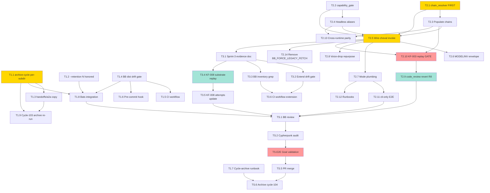

# Sprint Plan — Cycle-104 Multi-Model Stabilization

**Version:** 1.0
**Date:** 2026-05-12
**Author:** Sprint Planner (cycle-104 kickoff)
**Status:** Draft — ready for `/run sprint-plan` or `/build`
**PRD Reference:** `grimoires/loa/cycles/cycle-104-multi-model-stabilization/prd.md`
**SDD Reference:** `grimoires/loa/cycles/cycle-104-multi-model-stabilization/sdd.md`
**Predecessor:** cycle-103-provider-unification (PR #846, merged `7fc875ff`, archived `f6d9a763`)
**Local sprint IDs:** sprint-1, sprint-2, sprint-3 (global IDs assigned at ledger registration: **151, 152, 153** per `grimoires/loa/ledger.json::next_sprint_number=151`)

---

## Executive Summary

Cycle-104 is a **routing-layer stabilization cycle** built on cycle-103's unified cheval substrate. Cycle-103 collapsed three parallel HTTP boundaries into one. Cycle-104 hardens the routing that runs on top.

> From prd.md §1.2: "The substrate is one place. The routing on top of it should be one place too."

**MVP scope** = three sequential sprints closing seven cycle goals (G1–G7 per prd.md §2.1) plus a Sprint 3 reframed by SDD §1.4.5 / §10 Q1+Q2.

| Sprint | Theme | Scope | Tasks | Duration | Goals |
|---|---|---|---|---|---|
| **Sprint 1** | Foundational: archive-cycle.sh fix (#848) + BB dist hygiene | MEDIUM | 9 | 2–3 days | G6 (archive hygiene), G7 (BB dist hygiene) |
| **Sprint 2** | Main event: within-company chains + headless opt-in + code_review revert (#847) | LARGE | 14 | 5–7 days | G1, G2, G3, G4 |
| **Sprint 3** | Boundary verification + drift-gate extension + KF-008 substrate replay (reframed) | MEDIUM | 6 | 2–3 days | G5 |

**Total:** 29 tasks across 3 sprints, 9–13 days.

**Sequencing:** Sequential (PRD §7.3). Sprint 1 must merge before Sprint 2 closes (cycle-104's own archive depends on Sprint 1's fix). Sprint 2 ↔ Sprint 3 are parallelizable after Sprint 1 lands.

**Critical decision gates:**
- **Sprint 2 T2.10 ↔ T2.9** — KF-003 empirical replay (FR-S2.8) MUST pass BEFORE reverting `code_review.model` to `gpt-5.5-pro` (R8 mitigation; chain must absorb KF-003 before revert lands)
- **Sprint 3 T3.4** — KF-008 substrate replay decides outcome (a) `RESOLVED-architectural-complete` vs (b) `MITIGATED-CONSUMER` + deeper upstream (§1.4.5; either outcome is acceptable)
- **Sprint 3 reframed up-front** — Per SDD §1.4.5 / §10 Q1, BB's `MultiModelPipeline` already routes through `ChevalDelegateAdapter` post-cycle-103 PR #846. Sprint 3 is verification + drift-gate extension + KF-008 replay — NOT a migration

---

## Sprint 1: Framework Archival Hygiene + BB Dist Drift Gate

**Sprint Goal:** Unblock cycle archival (#848) and prevent silent source-only BB shipping recurrence so every subsequent cycle archives cleanly and every BB TS change ships with regenerated `dist/`.

**Scope:** MEDIUM (9 technical tasks)
**Duration:** 2–3 days
**Issue:** [#848](https://github.com/0xHoneyJar/loa/issues/848) (archive-cycle.sh) + cycle-103 BB dist near-miss
**Cycle-exit goals:** G6 (framework archival hygiene), G7 (BB dist build hygiene)

### Deliverables

- [ ] **D1.1** `archive-cycle.sh` per-cycle-subdir resolver — reads `grimoires/loa/ledger.json::cycles[].slug` for cycle N and expands to `grimoires/loa/cycles/cycle-N-<slug>/`; backward-compat fall-back to `${GRIMOIRE_DIR}` root for cycles ≤097 (SDD §1.4.3, §5.4)
- [ ] **D1.2** `archive-cycle.sh --retention N` honored — replaces hardcoded 5-archive deletion list with dynamic enumeration sorted by ledger-recorded close date (FR-S1.2)
- [ ] **D1.3** `archive-cycle.sh` copies `handoffs/` + `a2a/` + `flatline/` subdirs (modern + legacy compat) (FR-S1.3)
- [ ] **D1.4** `tools/check-bb-dist-fresh.sh` — content-hash drift gate comparing committed `dist/` to fresh `npm run build` output (SDD §1.4.4)
- [ ] **D1.5** `.github/workflows/check-bb-dist-fresh.yml` — CI workflow gating PRs touching `.claude/skills/bridgebuilder-review/resources/**` (SDD §7.3)
- [ ] **D1.6** Optional pre-commit hook `.claude/hooks/pre-commit/bb-dist-check.sh` — soft-fail operator-side fast feedback with `npm run build` guidance
- [ ] **D1.7** Operator runbook `grimoires/loa/runbooks/cycle-archive.md` — `--cycle N` semantics, per-cycle subdir layout, recovery procedure (FR-S1.5)
- [ ] **D1.8** Sprint 1 test surface — `test_archive_cycle_per_subdir.bats`, `test_archive_cycle_retention.bats`, `test_bb_dist_drift_gate.bats` (~15 net-new bats)
- [ ] **D1.9** Cycle-103 archive re-run validation — `archive-cycle.sh --cycle 103 --dry-run` enumerates cycle-103 artifacts correctly (was: empty archive at cycle-103 close per #848 reproduction)

### Acceptance Criteria

- [ ] **AC-1.1** (FR-S1.1) `archive-cycle.sh --cycle 104 --dry-run` enumerates cycle-104's `prd.md`, `sdd.md`, `sprint.md`, `handoffs/`, `a2a/` correctly from `grimoires/loa/cycles/cycle-104-multi-model-stabilization/`
- [ ] **AC-1.2** (FR-S1.1 backward compat) `archive-cycle.sh --cycle 097` (legacy cycle ≤097) still resolves via `${GRIMOIRE_DIR}` root fall-back path — no regression on archived cycles
- [ ] **AC-1.3** (FR-S1.2) `archive-cycle.sh --retention 50` does NOT delete the same archives `--retention 5` deletes; `--retention 0` keeps all archives. Bats test pins all three points
- [ ] **AC-1.4** (FR-S1.3) Cycle-103 archive re-run (post-fix) contains both `handoffs/` subdir AND cycle-103 sub-artifacts; bats fixture compares contents
- [ ] **AC-1.5** (FR-S1.4) Pre-commit / CI gate fails when `.claude/skills/bridgebuilder-review/resources/**.ts` is modified without corresponding `dist/**` regeneration. Bats test pins reject behavior on a contrived `dist/`-out-of-sync fixture; positive control "dist matches src" passes
- [ ] **AC-1.6** (FR-S1.4 false-positive defense) Content-hash comparison (NOT timestamp) used to determine staleness — legitimate dist edits do not trigger false flags (R6 mitigation)
- [ ] **AC-1.7** (FR-S1.5) `grimoires/loa/runbooks/cycle-archive.md` exists and is linked from `CLAUDE.md` or `PROCESS.md` (whichever is canonical at land time); markdown link-check passes
- [ ] **AC-1.8** (Q8 from SDD §10) Retention semantics documented as "keep newest N" (cycle-count, not date-based); runbook makes this explicit

### Technical Tasks

- [ ] **T1.1** `archive-cycle.sh` per-cycle-subdir resolver — surgical edit at `.claude/scripts/archive-cycle.sh:80-130`. Read ledger via `jq -r ".cycles[] | select(.number == ${N}) | .slug"`; expand to `cycle-${N}-${slug}/`; fall-back to legacy `${GRIMOIRE_DIR}` if dir absent. Test: `tests/test_archive_cycle_per_subdir.bats`. → **[G6]**
  > From sdd.md §1.4.3, §5.4
- [ ] **T1.2** `archive-cycle.sh --retention N` honored — replace fixed-hardcoded deletion list with `ls -dt "${ARCHIVE_DIR}"/cycle-* | tail -n +"$((RETENTION + 1))" | xargs -r rm -rf`. Preserve `--dry-run` semantics (print deletion candidates first). Test: `tests/test_archive_cycle_retention.bats`. → **[G6]**
  > From sdd.md §1.4.3, §5.4
- [ ] **T1.3** Copy `handoffs/` subdir (modern, cycles ≥098) + `a2a/` backward-compat (cycles ≤097) + `flatline/` when present. Test extends `test_archive_cycle_per_subdir.bats` with subdir-presence assertions. → **[G6]**
  > From prd.md FR-S1.3
- [ ] **T1.4** `tools/check-bb-dist-fresh.sh` — content-hash drift gate. Run `npm run build` in hermetic tmpdir OR compute SHA-256 of `resources/**/*.ts` and compare to `dist/.build-manifest.json`. Mirrors cycle-099 sprint-1A `gen-bb-registry:check` precedent. Test: `tests/test_bb_dist_drift_gate.bats`. → **[G7]**
  > From sdd.md §1.4.4
- [ ] **T1.5** `.github/workflows/check-bb-dist-fresh.yml` — paths-filter on `.claude/skills/bridgebuilder-review/{resources,dist}/**` + `package.json`; triggers on `pull_request` + `push` to main. Mirror cycle-103 T1.7 workflow-paths-filter pattern (both `pull_request` AND `push` triggers — cycle-099 scanner-glob-blindness lesson). → **[G7]**
  > From sdd.md §7.3
- [ ] **T1.6** Optional pre-commit hook `.claude/hooks/pre-commit/bb-dist-check.sh` — soft-fail with stderr instructions to run `npm run build`. Operator-side fast feedback; non-blocking (CI is the hard gate per FR-S1.4). → **[G7]**
- [ ] **T1.7** Runbook `grimoires/loa/runbooks/cycle-archive.md` — `--cycle N` semantics, per-cycle subdir layout assumption, escape hatch (manual ledger-flip if script fails). Link from `PROCESS.md`. → **[G6]**
  > From prd.md FR-S1.5
- [ ] **T1.8** Bats integration — all three test artifacts (`test_archive_cycle_per_subdir.bats`, `test_archive_cycle_retention.bats`, `test_bb_dist_drift_gate.bats`) registered in CI; ~15 net-new tests pin all ACs. → **[G6, G7]**
- [ ] **T1.9** Cycle-103 archive re-run validation — operator-validated `archive-cycle.sh --cycle 103 --dry-run` enumerates cycle-103 artifacts correctly (was empty per #848 reproduction). Documented in NOTES.md as the "before/after" evidence row. → **[G6]**

### Dependencies

- **Inbound:** None. Sprint 1 is foundational and has no prerequisites beyond cycle-103 merge state (which holds — PR #846 merged `7fc875ff`).
- **Outbound (hard):** Cycle-104 archive itself (Phase 4 ship task) depends on Sprint 1's fix. Sprint 1 MUST merge before cycle-104 close.
- **Outbound (soft):** Future cycles' archive runs depend on Sprint 1 holding.

### Risks & Mitigation

| ID | Risk | Likelihood | Impact | Mitigation |
|---|---|---|---|---|
| **R5** | Retention bug fix breaks downstream tooling depending on old 5-archive deletion list | Low | Low | FR-S1.2 ships with migration note in runbook (T1.7); no known external consumer of the fixed-list behavior. Bats test exposes any silent breakage pre-merge |
| **R6** | BB dist drift gate produces false positives (legitimate dist changes flagged stale) | Medium | Low | T1.4 uses content-hash comparison (NOT timestamp); test corpus includes "dist matches src" positive controls |
| **R6a** | `npm run build` non-determinism (timestamps in output, build-order variation) makes hash comparison flaky | Medium | Medium | Use `dist/.build-manifest.json` content-hash of source files (not build output) as primary mechanism; build-output comparison is secondary verification |

### Success Metrics

- **G6:** `archive-cycle.sh --cycle 104 --dry-run` correctly enumerates cycle-104 artifacts from per-cycle subdir; `--retention N` honored per bats test
- **G7:** Pre-commit + CI gate fails on stale `dist/`; positive control passes; near-miss from cycle-103 cannot recur
- **Tests:** ≥15 net-new bats tests across T1.1–T1.4
- **Regression:** Existing bats suite ≥ cycle-103 baseline; no archive script regressions on cycles ≤097
- **Operator validation:** Cycle-103 archive re-run produces non-empty archive (T1.9)

---

## Sprint 2: Within-Company Fallback Chains + Headless Opt-In + code_review Revert

**Sprint Goal:** Populate `fallback_chain` system-wide in `model-config.yaml`; add headless aliases with capability gate; ship `hounfour.headless.mode` (4 modes); revert cycle-102 T1B.4 cross-company swap so 3-company BB consensus diversity is restored AND KF-003 is absorbed within-company.

**Scope:** LARGE (14 technical tasks)
**Duration:** 5–7 days
**Issue:** [#847](https://github.com/0xHoneyJar/loa/issues/847) — 8 ACs / 10 PRD tasks (mapped + 4 SDD-derived additions)
**Cycle-exit goals:** G1 (3-company diversity), G2 (KF-003 within-company absorption), G3 (operator-opt-in headless), G4 (cli-only zero-API-key end-to-end)

### Deliverables

- [ ] **D2.1** `.claude/adapters/loa_cheval/routing/chain_resolver.py` + `ResolvedChain` / `ResolvedEntry` dataclasses (SDD §1.4.1, §3.1, §5.1)
- [ ] **D2.2** `.claude/adapters/loa_cheval/routing/capability_gate.py` + `CapabilityCheckResult` (SDD §1.4.2, §3.1, §5.2)
- [ ] **D2.3** `.claude/defaults/model-config.yaml` — `fallback_chain` populated for every primary (Anthropic / OpenAI / Google); headless aliases (`claude-headless`, `codex-headless`, `gemini-headless`) added with `kind: cli` + `capabilities` declarations (SDD §3.2)
- [ ] **D2.4** `.claude/adapters/cheval.py` — `invoke()` entry consults `chain_resolver` BEFORE first request; walks chain on typed retryable errors (SDD §5.3)
- [ ] **D2.5** `.claude/adapters/loa_cheval/audit/modelinv.py` — `models_failed[]` populated in walk order; `final_model_id`, `transport`, `config_observed.headless_mode`, `headless_mode_source` populated (SDD §3.4)
- [ ] **D2.6** `hounfour.headless.mode` config plumbing + `LOA_HEADLESS_MODE` env var (env wins over config); default `prefer-api` preserves today's behavior (SDD §3.3)
- [ ] **D2.7** **Revert `.loa.config.yaml::flatline_protocol.code_review.model` and `security_audit.model` to `gpt-5.5-pro`** — undoes cycle-102 T1B.4 swap (PRD FR-S2.6)
- [ ] **D2.8** Repurposed `flatline_protocol.models.{secondary,tertiary}` cross-company entries — fire ONLY on within-company chain exhaustion; emit `consensus.voice_dropped` event instead of substitution (SDD §6.5)
- [ ] **D2.9** Removal of cycle-103 `LOA_BB_FORCE_LEGACY_FETCH` escape hatch — scheduled at cycle-103 close as cycle-104 deliverable (SDD §2.3)
- [ ] **D2.10** Empirical KF-003 chain replay artifact `tests/replay/test_kf003_within_company_chain.py` — gated `LOA_RUN_LIVE_TESTS=1`, ≤$3 live-API budget
- [ ] **D2.11** E2E `cli-only` zero-API-key test artifact `tests/e2e/test_cli_only_zero_api_key.bats` — `unset *_API_KEY` + strace-equivalent network monitor verifies zero HTTPS connections
- [ ] **D2.12** Runbook `grimoires/loa/runbooks/headless-mode.md` — CLI install pre-reqs (`codex`, `gemini`, `claude` binaries), capability tradeoffs, mode selection guidance (FR-S2.10)
- [ ] **D2.13** Runbook `grimoires/loa/runbooks/headless-capability-matrix.md` — feature-by-adapter compatibility table (FR-S2.2)
- [ ] **D2.14** Cross-runtime parity test — `model-config.yaml` schema (including new `kind: cli` field + `fallback_chain` field) readable byte-equal across bash/python/TS (mirrors cycle-099 sprint-1D corpus pattern, R9 mitigation)

### Acceptance Criteria

- [ ] **AC-2.1** (#847 AC-1; FR-S2.1) Every primary model alias in `model-config.yaml` has an explicit `fallback_chain`; **NO chain entry references a different company prefix**. Verified by `tests/test_chain_resolver_within_company.py` invariant check (`_validate_chain`)
- [ ] **AC-2.2** (#847 AC-2; FR-S2.3) Simulated primary empty-content (KF-003 class) → router walks chain; MODELINV envelope's `models_failed[]` populated in order with `error_category: empty_content`, `reason: <sanitized>`, `provider`. Bats integration test pins the envelope shape
- [ ] **AC-2.3** (#847 AC-3; FR-S2.4) `LOA_HEADLESS_MODE` × {`prefer-api`, `prefer-cli`, `api-only`, `cli-only`} produces 4 distinct resolved chain orderings/filterings. Bats test captures resolved chain via routing tracer per mode
- [ ] **AC-2.4** (#847 AC-4; FR-S2.2 + FR-S2.7) Headless aliases (`anthropic:claude-headless`, `openai:codex-headless`, `google:gemini-headless`) resolvable via cycle-099 alias-resolution corpus; capability matrix doc lands at FR-S2.10 path. Capability-mismatch (e.g., `large_context` request × `codex-headless` lacking large_context) → router skips entry + records `models_failed[].reason = "capability_mismatch"` + `missing_capabilities = [...]`
- [ ] **AC-2.5** (#847 AC-5; FR-S2.6) `grep "code_review" .loa.config.yaml` shows `gpt-5.5-pro` (NOT `claude-opus-4-7`); same for `security_audit`. BB multi-model invocation log shows Anthropic + OpenAI + Google in 3 primary slots (3-company diversity restored)
- [ ] **AC-2.6** (#847 AC-6; FR-S2.10) `headless-mode.md` runbook exists and is linked from `.loa.config.yaml.example` near new `hounfour.headless.mode` key; markdown link-check passes
- [ ] **AC-2.7** (#847 AC-7; FR-S2.8) Empirical replay (gated `LOA_RUN_LIVE_TESTS=1`): gpt-5.5-pro chain handles synthetic 30K / 40K / 50K / 60K / 80K input by falling back to `gpt-5.3-codex` (or `codex-headless` if codex also returns empty) — **without leaving OpenAI**. Audit envelope shows OpenAI-only `models_failed[]` chain walk
- [ ] **AC-2.8** (#847 AC-8; FR-S2.9) `cli-only` mode runs Loa end-to-end with `unset ANTHROPIC_API_KEY OPENAI_API_KEY GOOGLE_API_KEY` against a fresh-machine fixture. `strace`-equivalent verifies zero HTTPS connections issued by cheval. Audit envelope records `transport: cli` consistently. Defense-in-depth: cheval refuses to issue HTTPS when resolved chain is CLI-only (SDD §1.9)
- [ ] **AC-2.9** (FR-S2.5, SDD §6.5) Voice-drop on full chain exhaustion — `consensus.voice_dropped` event emitted; cross-company substitution NOT invoked. `tests/test_voice_drop_on_exhaustion.py` pins behavior
- [ ] **AC-2.10** (R9 mitigation, T2.13) Cross-runtime parity holds — `model-config.yaml` with new `kind: cli` field + `fallback_chain` field reads byte-equal across bash YAML parser + Python yaml + TS yaml libraries

### Technical Tasks

**Sequencing note** (per SDD §8 Phase 2 + PRD R8 mitigation): T2.1 + T2.2 + T2.5 (chain_resolver + capability_gate + wiring) FIRST as substrate. T2.3 + T2.4 populate config. T2.6 + T2.7 add audit-side and operator-mode plumbing. T2.10 (KF-003 empirical replay) MUST pass BEFORE T2.9 (code_review revert).

- [ ] **T2.1** `chain_resolver.py` + `ResolvedChain` / `ResolvedEntry` dataclasses at `.claude/adapters/loa_cheval/routing/chain_resolver.py`. Implements `resolve(primary_alias, *, model_config, headless_mode, headless_mode_source) -> ResolvedChain` per SDD §5.1. Invariants: never crosses company boundary; idempotent; fail-loud `NoEligibleAdapterError` on cli-only-with-no-CLI. Test: `tests/test_chain_resolver_within_company.py` + `tests/test_chain_resolver_modes.py`. → **[G1, G2, G3]**
  > From sdd.md §1.4.1, §5.1; prd.md FR-S2.1, FR-S2.4
- [ ] **T2.2** `capability_gate.py` at `.claude/adapters/loa_cheval/routing/capability_gate.py`. Implements `check(request, entry) -> CapabilityCheckResult`. Skip-and-continue on mismatch (records `missing_capabilities` in audit). Test: `tests/test_capability_gate.py`. → **[G3]**
  > From sdd.md §1.4.2, §5.2; prd.md FR-S2.7
- [ ] **T2.3** Populate `fallback_chain` for every primary in `.claude/defaults/model-config.yaml` — Anthropic primaries (claude-opus-4-7, claude-sonnet-4-7, etc.), OpenAI primaries (gpt-5.5-pro, gpt-5.3-codex, etc.), Google primaries (gemini-3-pro, gemini-2.5-pro, gemini-3-flash-preview existing). Schema invariant: every chain entry's company == primary's company (validated by `chain_resolver._validate_chain` at load time). Test: `tests/test_model_config_fallback_chain_invariants.py` (lints every primary). → **[G1, G2]**
  > From sdd.md §1.4.6, §3.2; prd.md FR-S2.1
- [ ] **T2.4** Add headless aliases (`anthropic:claude-headless`, `openai:codex-headless`, `google:gemini-headless`) to model-config.yaml. Each declares `kind: cli` + `capabilities: [chat, ...]` per cycle-099 PR #727 adapter capabilities. Test: extends cycle-099 alias-resolution corpus at `tests/fixtures/model-resolution/` with new headless aliases; existing 3-runtime byte-equal runners (bash + python + tsx) all green. → **[G3]**
  > From sdd.md §3.2; prd.md FR-S2.2
- [ ] **T2.5** Wire `chain_resolver` + `capability_gate` into `.claude/adapters/cheval.py invoke()` entry point. Replace today's single-primary lookup with chain walk per SDD §5.3 pseudocode. Walk on typed retryable errors (`RateLimitError`, `ProviderUnavailableError`, `EmptyContentError`, `RetryableTransient`); surface non-retryable (`InvalidInputError`, `AuthError`, `BudgetExceededError`) to caller. Per SDD §10 Q6: audit cheval's existing `retry.py` typed-exception dispatch — extend if `EmptyContentError` is not mapped retryable (cycle-103 ProviderStreamError pattern). Test: `tests/test_chain_walk_audit_envelope.py` with mocked adapters. → **[G1, G2, G3]**
  > From sdd.md §5.3, §6.1; prd.md FR-S2.3
- [ ] **T2.6** Extend MODELINV envelope per SDD §3.4: `models_failed[]` populated in walk order with `{model_id, provider, error_category, reason, missing_capabilities}`; new top-level `final_model_id`, `transport`, `config_observed.{headless_mode, headless_mode_source}`. New `error_category` enum values: `empty_content`, `capability_mismatch`. JCS canonicalization via `lib/jcs.sh` (cycle-098 invariant — never substitute `jq -S -c`). Schema version bump `1.0 → 1.1` (additive; consumers ignore unknown fields per cycle-098 envelope invariant). Test: `tests/test_modelinv_envelope_chain_walk.py`. → **[G1, G2, G3]**
  > From sdd.md §3.4; prd.md FR-S2.3, §5.4
- [ ] **T2.7** `LOA_HEADLESS_MODE` env var + `hounfour.headless.mode` config plumbing. Env wins over config; config-unset → `prefer-api` default. `.loa.config.yaml.example` updated with new key + `cli_paths` discovery hint (SDD §3.3). Per SDD §10 Q7: `prefer-cli` with all 3 CLIs uninstalled → `NoEligibleAdapterError` with explicit install guidance. Test: `tests/test_headless_mode_routing.bats` × 4 modes + `tests/test_no_eligible_adapter_error.py`. → **[G3, G4]**
  > From sdd.md §3.3; prd.md FR-S2.4
- [ ] **T2.8** Repurpose cross-company `flatline_protocol.models.{secondary,tertiary}` per SDD §6.5: fires ONLY after within-company chain exhausted. Action changes from "substitute another company's model" to "emit `consensus.voice_dropped` event + drop the voice from consensus aggregation". Test: `tests/test_voice_drop_on_exhaustion.py` (full chain exhausted → voice-drop emitted; cross-company substitution NOT invoked). → **[G1]**
  > From sdd.md §6.5; prd.md FR-S2.5
- [ ] **T2.9** **Revert `.loa.config.yaml::flatline_protocol.code_review.model` and `security_audit.model` to `gpt-5.5-pro`** — undoes cycle-102 Sprint 1B T1B.4 swap. **Sequenced AFTER T2.3 + T2.5 in effect AND T2.10 empirical replay passes** (R8 mitigation: chain must absorb KF-003 before revert lands). Test: `tests/test_code_review_revert.bats` (`grep "code_review" .loa.config.yaml` shows `gpt-5.5-pro`); BB multi-model invocation log shows Anthropic + OpenAI + Google primary slots. → **[G1]**
  > From sdd.md §4.3; prd.md FR-S2.6
- [ ] **T2.10** Empirical KF-003 chain replay — `tests/replay/test_kf003_within_company_chain.py`. Gated `LOA_RUN_LIVE_TESTS=1`. Invokes gpt-5.5-pro via cheval across 5 input sizes (30K / 40K / 50K / 60K / 80K) × varying thinking config. Asserts: primary empty-content → chain walks to `gpt-5.3-codex` (or further to `codex-headless` if codex also empty); audit envelope shows OpenAI-only walk. Budget ≤$3 (PRD §7.4). Update `grimoires/loa/known-failures.md` KF-003 attempts row with closure evidence. → **[G2]**
  > From sdd.md §7.4; prd.md FR-S2.8
- [ ] **T2.11** E2E `cli-only` zero-API-key test — `tests/e2e/test_cli_only_zero_api_key.bats`. `unset ANTHROPIC_API_KEY OPENAI_API_KEY GOOGLE_API_KEY`; set `LOA_HEADLESS_MODE=cli-only`; run a Loa end-to-end pass (single BB review or single flatline run). Verify via `strace -f -e trace=connect` (or equivalent network monitor) that ZERO HTTPS connections are issued by cheval. Audit envelope records `transport: cli` consistently. Per SDD §1.9 defense-in-depth: cheval MUST refuse to issue HTTPS when resolved chain is CLI-only. → **[G4]**
  > From sdd.md §1.9, §7.2; prd.md FR-S2.9
- [ ] **T2.12** Runbooks: `grimoires/loa/runbooks/headless-mode.md` (FR-S2.10) covering CLI install pre-reqs, capability tradeoffs, when-to-use-which-mode, debugging CLI-vs-HTTP discrepancies + `grimoires/loa/runbooks/headless-capability-matrix.md` (FR-S2.2) feature-by-adapter table. Link both from `.loa.config.yaml.example` near new keys. Per SDD §10 Q4: document `LOA_HEADLESS_VERBOSE=1` one-liner stderr format. → **[G3, G4]**
  > From prd.md FR-S2.2, FR-S2.10
- [ ] **T2.13** Cross-runtime parity test — extends cycle-099 sprint-1D corpus at `tests/fixtures/model-resolution/`. New fixture YAMLs with `kind: cli` field + `fallback_chain` field; existing 3-runtime byte-equal runners (bash + python + tsx) all green. Mirrors cycle-099 byte-equal gate (R9 mitigation). Test: `tests/fixtures/model-resolution/cycle-104-fixtures/`. → **[G3]**
  > From sdd.md §7.1; prd.md §5.5 (cross-runtime invariant)
- [ ] **T2.14** Remove cycle-103 `LOA_BB_FORCE_LEGACY_FETCH` escape hatch (cycle-103 SDD §4.2 scheduled removal). One-line config removal + TS code path deletion at `.claude/skills/bridgebuilder-review/resources/adapters/cheval-delegate.ts`. Per SDD §10 Q5: bundled in Sprint 2; separable to micro-sprint if BB cycle-3 review surfaces concern. Test: `tests/test_legacy_fetch_hatch_removed.bats` (env-var set → no special-case path; legacy code absent from `dist/`). → **[G1]**
  > From sdd.md §2.3; cycle-103 SDD §4.2

### Dependencies

- **Inbound (hard):** Sprint 1 merged — Sprint 2 doesn't strictly require it, but cycle-104 archive (Phase 4 ship) does. Sequencing puts Sprint 1 first.
- **Inbound (capability):** Operator API budget ≤$3 for T2.10 KF-003 chain replay (PRD §7.4).
- **Inbound (capability):** Operator-installed `claude`, `codex`, `gemini` CLI binaries for T2.11 e2e zero-API-key test (PRD DEP-6). Documented as op-side prerequisite in `headless-mode.md` runbook.
- **Inbound (substrate):** Cheval Python pytest baseline ≥970 from cycle-103 close (SDD §7.5).
- **Intra-sprint sequencing:** T2.1 + T2.2 + T2.5 first (substrate); T2.3 + T2.4 second (config populated); T2.6 + T2.7 third (audit + mode plumbing); T2.10 BEFORE T2.9 (R8 — chain must absorb KF-003 before revert).
- **Outbound:** Sprint 3 verifies KF-008 against the cheval substrate; Sprint 2 doesn't gate Sprint 3 functionally, but T2.10 + T2.11 evidence informs Sprint 3 confidence.

### Risks & Mitigation

| ID | Risk | Likelihood | Impact | Mitigation |
|---|---|---|---|---|
| **R1** | Within-company chain still doesn't close KF-003 (codex-also-returns-empty at the same input size) | Medium | High | T2.10 empirical replay gates T2.9 revert; chain terminal is `openai:codex-headless` (CLI bypasses the empty-content failure entirely — different transport). If codex-headless also fails, voice-drop fires (T2.8) and consensus continues with 2 voices |
| **R2** | Headless CLI capability gap larger than expected (codex-headless missing tool-use; gemini-headless missing structured output) — frequent skip events surface | Medium | Medium | Capability matrix doc (T2.12) sets expectations; `LOA_HEADLESS_VERBOSE=1` env var surfaces skip events at runtime for operator debugging (SDD §6.4) |
| **R3** | `cli-only` mode reveals cheval has hidden HTTP fallback for telemetry / metering / version-check bypassing routing layer | Low | Medium | T2.11 e2e uses `strace`-equivalent zero-HTTPS check; defense-in-depth: cheval refuses to issue HTTPS when resolved chain is CLI-only (SDD §1.9). Failure here gates Sprint 2 closure |
| **R7** | Schema version bump on MODELINV envelope (`config_observed`, new `error_category` enum values) breaks downstream audit consumers | Low | Medium | Schema bumps are additive (`1.0 → 1.1`); consumers ignore unknown fields per cycle-098 envelope invariant. `grimoires/loa/runbooks/audit-keys-bootstrap.md` unchanged |
| **R8** | Reverting code_review → gpt-5.5-pro (T2.9) re-introduces KF-003 if chains aren't fully populated when T2.9 lands | Medium | High | T2.9 sequenced AFTER T2.3 + T2.5 in effect; T2.10 empirical replay MUST pass before T2.9. Operator sign-off required |
| **R9** | Cross-runtime parity (cycle-099 corpus) regresses when adding `kind: cli` to model-config.yaml | Medium | Medium | T2.13 explicitly extends cycle-099 sprint-1D byte-equality gate; positive controls in all 3 runtimes |
| **R-Q6** | Cheval's existing `retry.py` doesn't classify `EmptyContentError` as retryable → chain walk doesn't fire on KF-003 | Medium | High | T2.5 explicitly audits `retry.py` typed-exception dispatch table; extend dispatch if needed (per SDD §10 Q6). Mirror cycle-103 ProviderStreamError dispatch pattern |

### Success Metrics

- **G1:** `flatline_protocol.code_review.model: gpt-5.5-pro` in `.loa.config.yaml` (reverted from `claude-opus-4-7`); BB multi-model invocation log shows Anthropic + OpenAI + Google 3-company diversity
- **G2:** KF-003 attempts row in `known-failures.md` updated with `RESOLVED-within-company-chain` (or documented next-step if chain insufficient); empirical replay (T2.10) shows OpenAI-only chain walk on 30K-80K input
- **G3:** `LOA_HEADLESS_MODE=prefer-cli` reorders chain (CLI first); `cli-only` removes HTTP entries; bats test pins all 4 modes
- **G4:** `cli-only` mode runs Loa end-to-end on fresh-machine fixture with `unset *_API_KEY` (T2.11); strace verifies zero HTTPS; audit `transport: cli`
- **Tests:** ~40–60 net-new Python tests + ~10 bats + ~5 cross-runtime parity (SDD §7.1) → cheval pytest ≥1010
- **Live-API budget:** Actual T2.10 + T2.11 budget ≤$5 (PRD §7.4)
- **Regression:** Cheval pytest baseline ≥970 (cycle-103) maintained; cross-runtime byte-equality gate green

---

## Sprint 3: BB Cheval-Routing Verification + Drift-Gate Extension + KF-008 Substrate Replay

**Sprint Goal:** Verify cycle-103 unification holds for BB's parallel-dispatch path (Q1 in SDD §10); extend cycle-103 T1.7 drift gate to cover post-cycle-103 files; replay KF-008 at observed body sizes against the cheval substrate; close KF-008 with the appropriate evidence (architectural-complete OR mitigated-consumer + deeper upstream).

**Scope:** MEDIUM (6 technical tasks) — **reframed from migration to verification per SDD §1.4.5 / §10 Q1+Q2**
**Duration:** 2–3 days
**Issue:** Implicit in KF-008 recurrence-4 note + operator recommendation 2026-05-12. May file a fresh issue at Sprint 3 kickoff for tracker hygiene.
**Cycle-exit goals:** G5 (KF-008 recurrence-4 closed with evidence)

> **Reframing context (SDD §1.4.5 + §10 Q1+Q2):** Verification on 2026-05-12 against `resources/core/multi-model-pipeline.ts:212` and `resources/adapters/adapter-factory.ts:46` confirms BB's internal multi-model parallel dispatcher **already routes through `ChevalDelegateAdapter`** (cycle-103 PR #846). The PRD's framing of Sprint 3 as a migration is inaccurate. Sprint 3 is **verification + drift-gate extension + KF-008 substrate replay**, not a migration. AC count unchanged; AC content reflects the reframe.
>
> The KF-008 recurrence-4 surface is therefore NOT a surviving Node `fetch` path — it is the cheval-substrate path itself failing at >300KB request body. Two acceptable outcomes for T3.4: (a) substrate-side body-size class resolves via cheval's `httpx` + streaming defaults (close `RESOLVED-architectural-complete`), or (b) substrate-side body-size class persists (file deeper upstream against #845, leave KF-008 as `MITIGATED-CONSUMER` with chain's voice-drop as survival path).

### Deliverables

- [ ] **D3.1** Sprint-3 evidence doc `grimoires/loa/cycles/cycle-104-multi-model-stabilization/sprint-3-evidence.md` — inventory + call-graph showing BB `MultiModelPipeline` → `ChevalDelegateAdapter` → cheval traversal; cites `resources/core/multi-model-pipeline.ts:212` and `resources/adapters/adapter-factory.ts:46` (SDD §1.4.5)
- [ ] **D3.2** Extended `tools/check-no-direct-llm-fetch.sh` — glob covers any new BB files added since cycle-103 close (`adapters/index.ts`, `core/cross-repo.ts`); positive-control test fails if `fetch(...)` is reintroduced into parallel-dispatch path; shebang detection per cycle-099 sprint-1E.c.3.c (scanner glob blindness lesson)
- [ ] **D3.3** `tools/check-bb-no-direct-fetch.sh` — inventory grep returning zero matches of `fetch(` / `https.request(` / `undici` imports in BB resources outside test fixtures / type definitions (FR-S3.4)
- [ ] **D3.4** KF-008 substrate replay artifact `tests/replay/test_kf008_substrate_replay.py` — gated `LOA_RUN_LIVE_TESTS=1`; issues 297KB / 302KB / 317KB / 539KB request bodies through cheval-routed BB invocation; budget ≤$2 (PRD §7.4)
- [ ] **D3.5** `known-failures.md` KF-008 attempts row 5 update — closing evidence with commit SHA / PR # / replay outcome
- [ ] **D3.6** CI workflow extension `.github/workflows/no-direct-llm-fetch.yml` — incorporates T3.2 + T3.3 positive+negative controls
- [ ] **D3.7** Sprint 3 test surface — ~10 bats + replay tests; per-AC mapping per SDD §7.2

### Acceptance Criteria

- [ ] **AC-3.1** (FR-S3.1 verification, not migration) Evidence doc proves all BB consensus invocations transit cheval via `ChevalDelegateAdapter`. Inventory grep + call-graph cite specific file:line refs (`resources/core/multi-model-pipeline.ts:212`, `resources/adapters/adapter-factory.ts:46`). Audit-trail spot-check on cycle-103-era BB run shows `transport: cheval`-equivalent token consistently
- [ ] **AC-3.2** (FR-S3.2 drift gate extension) Extended `tools/check-no-direct-llm-fetch.sh` exits 0 on full repo scan AND fails on contrived positive-control test fixture that reintroduces `fetch(...)` into `.claude/skills/bridgebuilder-review/resources/core/multi-model-pipeline.ts`. Workflow `paths:` filter mirrors `pull_request` AND `push` (cycle-099 scanner-blindness lesson)
- [ ] **AC-3.3** (FR-S3.3 KF-008 replay) Synthetic large-PR request bodies (297K / 302K / 317K / 539K) issued through cheval-routed BB pipeline. **Two acceptable outcomes:**
  - **(a) Architectural close:** All 4 bodies succeed at cheval substrate → KF-008 status → `RESOLVED-architectural-complete` with closing-evidence ref (commit SHA / PR #)
  - **(b) Mitigated-consumer:** Body-size failure persists at cheval substrate → file deeper upstream against #845 with new evidence; classify KF-008 attempts row 5 with substrate-side failure shape; status → `MITIGATED-CONSUMER` (cross-company fallback in chain is survival path, but voice-drop on within-company chain exhaustion per Sprint 2 T2.8 covers the consensus aggregation)
- [ ] **AC-3.4** (FR-S3.4 inventory grep) `tools/check-bb-no-direct-fetch.sh` returns zero matches of `fetch(` / `https.request(` / `undici` imports in `.claude/skills/bridgebuilder-review/resources/**` outside test fixtures / type definitions. Bats test pins behavior (positive + negative controls)
- [ ] **AC-3.5** KF-008 attempts row 5 in `known-failures.md` updated with the outcome and closing-evidence ref; recurrence count updated; if outcome (b) the upstream issue link recorded

### Technical Tasks

- [ ] **T3.1** Sprint-3 evidence doc — write `grimoires/loa/cycles/cycle-104-multi-model-stabilization/sprint-3-evidence.md`. Inventory + call-graph for BB multi-model pipeline → adapter-factory → ChevalDelegateAdapter → cheval. Cite file:line refs. Include audit-trail spot-check from a cycle-103-era BB review run showing the cheval token. → **[G5]**
  > From sdd.md §1.4.5; prd.md FR-S3.1
- [ ] **T3.2** Extend cycle-103 `tools/check-no-direct-llm-fetch.sh` — glob update to cover new BB files added since cycle-103 close (audit current state via `git log --since=cycle-103-merge -- .claude/skills/bridgebuilder-review/resources/**`). Add positive-control test fixture (`tests/fixtures/parallel-dispatch-fetch-positive.ts`) that fails the gate. Shebang detection per cycle-099 sprint-1E.c.3.c. Test: `tests/test_no_direct_fetch_extended.bats`. → **[G5]**
  > From sdd.md §1.4.5; prd.md FR-S3.2
- [ ] **T3.3** Inventory grep `tools/check-bb-no-direct-fetch.sh` — narrower scope than T3.2 (BB resources only). Fails on any `fetch(` / `https.request(` / `undici` import outside fixtures / type defs. Test: `tests/test_bb_zero_direct_fetch.bats` (positive control + negative control). → **[G5]**
  > From prd.md FR-S3.4
- [ ] **T3.4** KF-008 substrate replay — `tests/replay/test_kf008_substrate_replay.py`. Gated `LOA_RUN_LIVE_TESTS=1`. Constructs synthetic request bodies at observed sizes (297K / 302K / 317K / 539K) and routes through cheval-substrate BB invocation. Records pass/fail per body size. Budget ≤$2 (PRD §7.4). Captures the outcome (a) or (b) decision per AC-3.3. → **[G5]**
  > From sdd.md §1.4.5, §7.4; prd.md FR-S3.3
- [ ] **T3.5** KF-008 attempts row 5 update in `grimoires/loa/known-failures.md` — closing-evidence row with commit SHA / PR # / replay outcome. If outcome (b): file deeper upstream against #845 and record the link. → **[G5]**
  > From prd.md FR-S3.3 / G5
- [ ] **T3.6** CI workflow extension `.github/workflows/no-direct-llm-fetch.yml` — incorporate T3.2 + T3.3 positive/negative controls. Ensure `paths:` filter mirrors both `pull_request` AND `push` triggers (cycle-099 scanner-glob-blindness lesson). → **[G5]**
  > From sdd.md §7.3

### Dependencies

- **Inbound (hard):** Sprint 1 merged (so cycle-104 archive itself can run cleanly at Phase 4); Sprint 2 not strictly required but its evidence (T2.10, T2.11) informs Sprint 3 confidence.
- **Inbound (capability):** Operator API budget ≤$2 for T3.4 KF-008 substrate replay (PRD §7.4).
- **Inbound (substrate):** Cycle-103 T1.7 drift gate (`tools/check-no-direct-llm-fetch.sh` + `.github/workflows/no-direct-llm-fetch.yml`) — extending, not replacing (DEP-4 met).
- **Outbound:** Phase 4 ship — `archive-cycle.sh --cycle 104` runs cleanly post-Sprint 1; KF-008 status updated post-Sprint 3.

### Risks & Mitigation

| ID | Risk | Likelihood | Impact | Mitigation |
|---|---|---|---|---|
| **R4** | Sprint 3 reframing reveals BB does have a Node-fetch path not visible to SDD-time inventory | Low | Medium | T3.3 inventory grep is the first task; if a survivor exists, Sprint 3 expands to include the migration (still feasible in 2–3 day budget given cycle-103's adapter pattern). Per SDD §9 R4 |
| **R10** | KF-008 substrate replay (T3.4) reveals same failure at cheval layer that BB hit — substrate is NOT the answer for body-size class | Medium | Medium | Acceptable outcome (b) documented in SDD §1.4.5: file deeper upstream, leave KF-008 as `MITIGATED-CONSUMER` (chain's voice-drop is survival path), don't force a hard fix. AC-3.3 (b) path is a valid Sprint 3 close |
| **R10a** | KF-008 replay live-API budget overrun (>$2) due to needing additional body-size sweep | Low | Low | Cap replay at $3 hard limit; if no clean outcome emerges within budget, default to outcome (b) classification |

### Success Metrics

- **G5:** KF-008 attempts row 5 in `known-failures.md` updated with status (`RESOLVED-architectural-complete` OR `MITIGATED-CONSUMER`) + closing-evidence ref
- **Drift gate:** Extended `tools/check-no-direct-llm-fetch.sh` exits 0 on full scan; positive-control fixture fails the gate (verified by test)
- **Inventory:** `tools/check-bb-no-direct-fetch.sh` returns zero matches in BB resources outside fixtures / type defs
- **Tests:** ~10 bats + 1 replay test; per-AC mapping covers each AC (SDD §7.2)
- **Live-API budget:** Actual T3.4 budget ≤$2 (PRD §7.4)
- **Regression:** Cheval pytest baseline maintained; no new Node-fetch paths introduced

---

## Phase 4: Ship (Cycle-104 Close)

**Goal:** Validate end-to-end and merge cycle-104 PR to main per PRD §8 cycle-level acceptance summary.

### Tasks

- [ ] **TS.1** BB review on cycle-104 PR — verdict ≤1 HIGH-consensus finding; plateau ≤3 iterations
- [ ] **TS.2** Cypherpunk dual-review on full cycle-104 surface — verdict APPROVED with no NEW critical-class findings
- [ ] **TS.3** KF-003 + KF-008 status updates in `grimoires/loa/known-failures.md`
- [ ] **TS.4** `/run-bridge` plateau ≤3 iterations on cycle-104 PR
- [ ] **TS.5** PR merge to `main` via HITL
- [ ] **TS.6** Cycle archive via `/archive-cycle --cycle 104` — **first archive run after Sprint 1 fix**; verify produces non-empty archive containing cycle-104 prd.md / sdd.md / sprint.md / handoffs/ / a2a/
- [ ] **TS.E2E** End-to-End Goal Validation (P0) — see below

### Task TS.E2E: End-to-End Goal Validation (P0)

Validates all PRD goals (G1 through G7) before cycle-104 ships:

- [ ] **G1 validation:** `grep "code_review" .loa.config.yaml` shows `gpt-5.5-pro`; same for `security_audit`. BB multi-model invocation log (from a fresh BB run on cycle-104 PR) shows Anthropic + OpenAI + Google in 3 primary slots (3-company diversity restored per PRD AC-5)
- [ ] **G2 validation:** KF-003 entry in `known-failures.md` updated with cycle-104 outcome: chain absorbs empty-content at 30K-80K input via fallback to `gpt-5.3-codex` (or `codex-headless`); empirical replay (T2.10) audit envelope shows OpenAI-only chain walk
- [ ] **G3 validation:** `LOA_HEADLESS_MODE` env var × {`prefer-api`, `prefer-cli`, `api-only`, `cli-only`} produces 4 distinct resolved chain orderings; bats test green
- [ ] **G4 validation:** `cli-only` mode e2e runs Loa end-to-end on fresh-machine fixture with `unset *_API_KEY`; `strace`-equivalent verifies zero HTTPS connections; audit envelope records `transport: cli` consistently
- [ ] **G5 validation:** KF-008 attempts row 5 updated with outcome (a) `RESOLVED-architectural-complete` OR (b) `MITIGATED-CONSUMER` + deeper upstream link. Extended drift gate (T3.2) exits 0 on full repo scan; positive control fails the gate
- [ ] **G6 validation:** `archive-cycle.sh --cycle 104 --dry-run` correctly enumerates cycle-104 artifacts from per-cycle subdir; `--retention N` honored. Cycle-103 archive re-run produces non-empty archive (T1.9)
- [ ] **G7 validation:** BB `dist/` drift gate (T1.4 + T1.5) fails on stale dist; positive control passes. CI workflow active on `pull_request` + `push` to main
- [ ] **Audit-driven query:** `MODELINV/model.invoke.complete` envelope populated with `models_failed[]` in walk order, `final_model_id`, `transport`, `config_observed.headless_mode`, `headless_mode_source` per PRD §5.4
- [ ] **Test count:** Cheval pytest ≥1010 passing (cycle-103 baseline 970 + ~40 cycle-104 additions); ~25 net-new bats; zero regressions
- [ ] **Cumulative goal:** Every Loa quality gate's multi-model implementation flows through cheval; within-company retry chains exist for every primary; operator-flippable CLI-only mode works end-to-end (PRD §8)

---

## Risk Register (Cycle-Wide)

(Replicates PRD §7.1 + SDD §9 with sprint mapping.)

| ID | Risk | Sprint | Likelihood | Impact | Mitigation |
|---|---|---|---|---|---|
| **R1** | Within-company chain still doesn't close KF-003 (codex-also-empty) | 2 | Medium | High | T2.10 empirical replay; terminal entry is `codex-headless` (CLI bypasses transport); voice-drop on full exhaustion |
| **R2** | Headless CLI capability gap larger than expected | 2 | Medium | Medium | Capability matrix doc (T2.12); `LOA_HEADLESS_VERBOSE=1` runtime surfacing |
| **R3** | `cli-only` reveals cheval has hidden HTTP fallback bypassing routing | 2 | Low | Medium | T2.11 strace-equivalent zero-HTTPS check; defense-in-depth SDD §1.9 cheval refuses HTTPS on CLI-only chain |
| **R4** | Sprint 3 reframing reveals surviving BB Node-fetch path | 3 | Low | Medium | T3.3 inventory grep first task; sprint expands to migration if survivor found |
| **R5** | `archive-cycle.sh` retention fix breaks downstream tooling | 1 | Low | Low | Migration note in runbook (T1.7); no known consumer |
| **R6** | BB dist drift gate false positives | 1 | Medium | Low | Content-hash not timestamp; positive-control "dist matches src" |
| **R6a** | `npm run build` non-determinism makes hash flaky | 1 | Medium | Medium | Hash source files (not build output) primary; build-output secondary |
| **R7** | MODELINV envelope schema bump breaks downstream audit consumers | 2 | Low | Medium | Schema additive `1.0 → 1.1`; consumers ignore unknown fields (cycle-098 invariant) |
| **R8** | T2.9 code_review revert re-introduces KF-003 if chains incomplete | 2 | Medium | High | T2.9 sequenced AFTER T2.3 + T2.5 + T2.10 empirical replay pass |
| **R9** | Cross-runtime parity regresses adding `kind: cli` | 2 | Medium | Medium | T2.13 extends cycle-099 sprint-1D byte-equality gate |
| **R10** | KF-008 substrate replay reveals cheval-layer body-size failure | 3 | Medium | Medium | Outcome (b) acceptable: file deeper upstream + `MITIGATED-CONSUMER` |
| **R10a** | KF-008 replay budget overrun | 3 | Low | Low | Hard cap $3; default to outcome (b) if no clean signal |
| **R-Q6** | Cheval `retry.py` doesn't classify `EmptyContentError` as retryable | 2 | Medium | High | T2.5 audits dispatch table; extend per cycle-103 ProviderStreamError pattern |

---

## Success Metrics (Cycle-Wide)

Maps to PRD §2.1 goals G1–G7:

| Metric | Target | Measurement |
|---|---|---|
| **G1** — 3-company BB consensus diversity restored | `code_review.model: gpt-5.5-pro`; BB invocation log shows Anth + OAI + Goog | `grep "code_review" .loa.config.yaml` + BB multi-model log inspection |
| **G2** — Within-company chains absorb KF-003 | Empirical 30K-80K input replay walks chain within OpenAI; audit shows no cross-company escape | T2.10 replay artifact + MODELINV envelope inspection |
| **G3** — Operator-opt-in headless mode | 4 modes (`prefer-api` / `prefer-cli` / `api-only` / `cli-only`) produce distinct resolved chains | T2.7 bats test × 4 modes |
| **G4** — `cli-only` zero-API-key end-to-end | Loa runs end-to-end with `unset *_API_KEY`; strace verifies zero HTTPS | T2.11 e2e bats test |
| **G5** — KF-008 recurrence-4 closed | KF-008 row 5 updated with outcome (a) or (b); extended drift gate green | T3.4 replay + T3.5 known-failures update |
| **G6** — Framework archival hygiene fixed | `archive-cycle.sh --cycle 104 --dry-run` enumerates correctly; `--retention N` honored | T1.1 + T1.2 + T1.9 cycle-103 re-run |
| **G7** — BB dist build hygiene | Pre-commit + CI gate fails on stale dist; positive control passes | T1.4 + T1.5 + T1.8 bats tests |
| **Adversarial review** | ≤1 HIGH-consensus finding | BB cycle-3 verdict on cycle-104 PR |
| **Cypherpunk audit** | APPROVED, no NEW critical-class findings | Auditor sprint feedback |
| **Test surface** | ≥1010 cheval pytest + ~25 net-new bats | `cd .claude/adapters && python3 -m pytest tests/ -q` |
| **Live-API budget** | ≤$5 total across T2.10 + T2.11 + T3.4 | Operator-tracked spend |
| **PR plateau** | ≤3 `/run-bridge` iterations | `.run/bridge-state.json` |

---

## Appendix A: Task Dependencies

Gold = foundational substrate (must land first within sprint). Red = decision gates / E2E validation. Green = conditional-outcome tasks.

---

## Appendix B: Self-Review Checklist

- [x] All MVP features from PRD accounted for (FR-S1.1 through FR-S3.4 → T-tasks)
- [x] Sprints build logically on each other (Sprint 1 unblocks archival; Sprint 2 ships routing layer; Sprint 3 verifies + closes KF-008)
- [x] Each sprint feasible as single iteration (MEDIUM = 6–9, LARGE = 14 tasks)
- [x] All deliverables have checkboxes for tracking
- [x] Acceptance criteria clear and testable (per-AC test mapping in SDD §7.2)
- [x] Technical approach aligns with SDD (SDD §1.4, §3, §5, §6 cited per task)
- [x] Risks identified with mitigation (R1–R10a + R-Q6 from SDD §9 + PRD §7.1)
- [x] Dependencies explicitly called out (inbound + outbound + intra-sprint sequencing)
- [x] Plan provides clear guidance for engineers (file paths, test artifacts, gates, sequencing)
- [x] All PRD goals (G1–G7) mapped to tasks (Appendix C)
- [x] All tasks annotated with goal contributions (→ **[G-N]** annotations)
- [x] E2E validation task included in final sprint (TS.E2E)
- [x] Sprint 3 reframe per SDD §1.4.5 / §10 Q1+Q2 absorbed (verification not migration; outcome (a)/(b) both acceptable)
- [x] Critical decision gates flagged (T2.10 BEFORE T2.9 per R8; T3.4 outcome (a)/(b))

---

## Appendix C: Goal Traceability

PRD goals are extracted from prd.md §2.1:

| Goal ID | PRD Source | Description | Validation Method |
|---|---|---|---|
| **G1** | §2.1 G1 | Restore 3-company BB consensus diversity | `code_review.model: gpt-5.5-pro`; BB invocation log shows Anth + OAI + Goog 3 primary slots (#847 AC-5) |
| **G2** | §2.1 G2 | Within-company chains absorb KF-003 without cross-company escape | Empirical 30K-80K replay walks chain within OpenAI; audit shows no cross-company escape (#847 AC-7) |
| **G3** | §2.1 G3 | Operator-opt-in headless mode | `hounfour.headless.mode` × 4 modes + `LOA_HEADLESS_MODE` env var supported; bats pins chain reordering (#847 AC-3) |
| **G4** | §2.1 G4 | `cli-only` mode end-to-end without `*_API_KEY` | Fresh-machine e2e passes; audit `transport: cli` consistently (#847 AC-8) |
| **G5** | §2.1 G5 | KF-008 recurrence-4 closed | BB drift gate extended; substrate replay outcome (a) `RESOLVED-architectural-complete` OR (b) `MITIGATED-CONSUMER` + deeper upstream |
| **G6** | §2.1 G6 | Framework archival hygiene fixed | `archive-cycle.sh --cycle 104 --dry-run` correctly enumerates; `--retention N` honored; cycle-104 archive is first proper archive run after fix |
| **G7** | §2.1 G7 | BB dist build hygiene | Pre-commit + CI gate fails on stale dist; cycle-103 near-miss cannot recur |

### Goal → Task Mapping

| Goal | Contributing Tasks | E2E Validation |
|---|---|---|
| **G1** | T2.1, T2.5, T2.8, T2.9, T2.14 | TS.E2E G1 validation |
| **G2** | T2.1, T2.3, T2.5, T2.6, T2.10 | TS.E2E G2 validation |
| **G3** | T2.1, T2.2, T2.4, T2.5, T2.6, T2.7, T2.12, T2.13 | TS.E2E G3 validation |
| **G4** | T2.7, T2.11, T2.12 | TS.E2E G4 validation |
| **G5** | T3.1, T3.2, T3.3, T3.4, T3.5, T3.6 | TS.E2E G5 validation |
| **G6** | T1.1, T1.2, T1.3, T1.7, T1.8, T1.9 | TS.E2E G6 validation |
| **G7** | T1.4, T1.5, T1.6, T1.8 | TS.E2E G7 validation |

### Goal Coverage Verification

- [x] G1 has contributing tasks (5 tasks — Sprint 2)
- [x] G2 has contributing tasks (5 tasks — Sprint 2, including replay gate)
- [x] G3 has contributing tasks (8 tasks — Sprint 2 routing layer breadth)
- [x] G4 has contributing tasks (3 tasks — Sprint 2 e2e + mode plumbing + runbook)
- [x] G5 has contributing tasks (6 tasks — all of reframed Sprint 3)
- [x] G6 has contributing tasks (6 tasks — Sprint 1 archive-cycle + runbook)
- [x] G7 has contributing tasks (4 tasks — Sprint 1 dist hygiene)
- [x] E2E validation task (TS.E2E) included in Phase 4 ship

No goal warnings. All 7 goals mapped to ≥1 contributing task. E2E validation task present.

---

## Appendix D: Source References

- **PRD**: `grimoires/loa/cycles/cycle-104-multi-model-stabilization/prd.md`
- **SDD**: `grimoires/loa/cycles/cycle-104-multi-model-stabilization/sdd.md` (Sprint 3 reframe at §1.4.5 + §10 Q1+Q2)
- **Predecessor cycle**: `grimoires/loa/cycles/cycle-103-provider-unification/sprint.md` (cheval substrate; LOA_BB_FORCE_LEGACY_FETCH escape hatch scheduled for cycle-104 removal)
- **Known failures**: `grimoires/loa/known-failures.md` (KF-001 architectural precedent; KF-003 closure target; KF-008 recurrence-4 closure target)
- **Cheval substrate runbook**: `grimoires/loa/runbooks/cheval-streaming-transport.md` (cycle-102 Sprint 4A + cycle-103)
- **Headless adapters origin**: cycle-099 PR #727 (zksoju) — `.claude/adapters/loa_cheval/providers/{claude,codex,gemini}_headless_adapter.py`
- **Cycle-099 precedents reused**:
  - Cross-runtime parity corpus (`tests/fixtures/model-resolution/`) → T2.13 extends with `kind: cli` + `fallback_chain` fixtures
  - Scanner-glob-blindness lesson (sprint-1E.c.3.c) → T1.5 + T3.6 mirror `pull_request` AND `push` paths-filter
  - Drift-gate scanner pattern (`tools/check-no-raw-curl.sh`) → reused for `tools/check-bb-dist-fresh.sh` + extended `tools/check-no-direct-llm-fetch.sh`
- **GitHub issues**: [#847](https://github.com/0xHoneyJar/loa/issues/847) (main scope), [#848](https://github.com/0xHoneyJar/loa/issues/848) (archive-cycle.sh foundational), [#845](https://github.com/0xHoneyJar/loa/issues/845) (KF-008 upstream)
- **Cycle-103 PR**: [#846](https://github.com/0xHoneyJar/loa/pull/846) (merged `7fc875ff`)
- **Visions**: vision-019 (fail-loud); vision-024 (substrate-speaks-twice / fractal recursion)
- **Project memory**:
  - `feedback_bash_n_is_structural_not_semantic.md` (PRD §5.5 content-shape gates)
  - `feedback_bb_plateau_via_reframe.md` (REFRAME-as-plateau signal pattern)
  - `feedback_cross_runtime_parity_traps.md` (T2.13 reference, R9 mitigation)
  - `feedback_operator_collaboration_pattern.md` (escalation pattern)
  - `feedback_autonomous_run_mode.md` (`/run` cycle continuity)

---

*Generated by Sprint Planner — cycle-104 kickoff, 2026-05-12*
