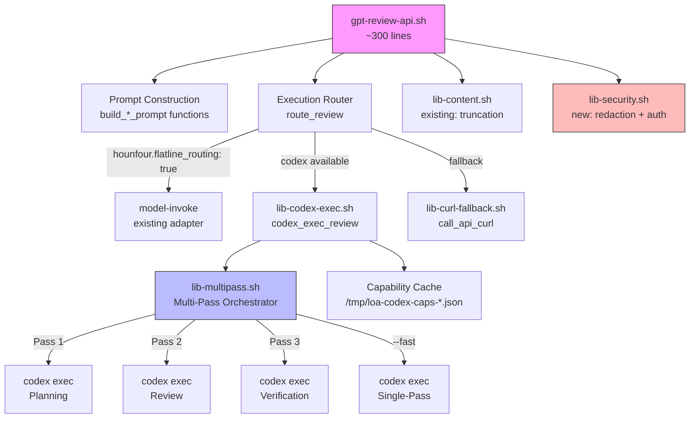
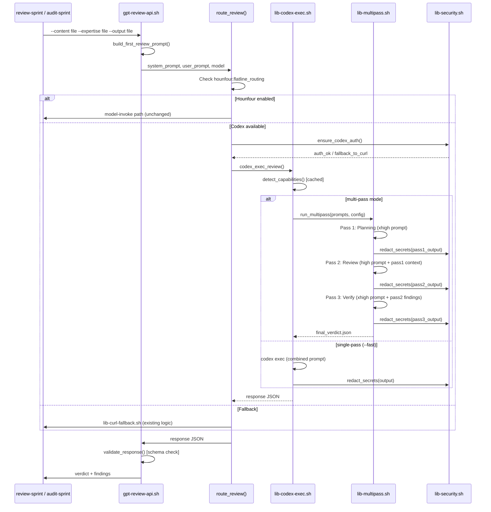

# SDD: Codex CLI Integration for GPT Review

**Version:** 1.0
**Date:** 2026-02-23
**Author:** Architecture Designer Agent
**Status:** Draft
**PRD Reference:** grimoires/loa/prd.md
**Cycle:** cycle-033

---

## Table of Contents

1. [Project Architecture](#1-project-architecture)
2. [Software Stack](#2-software-stack)
3. [Component Design](#3-component-design)
4. [Data Architecture](#4-data-architecture)
5. [Interface Specifications](#5-interface-specifications)
6. [Error Handling Strategy](#6-error-handling-strategy)
7. [Testing Strategy](#7-testing-strategy)
8. [Security Architecture](#8-security-architecture)
9. [Development Phases](#9-development-phases)
10. [Known Risks and Mitigation](#10-known-risks-and-mitigation)
11. [Open Questions](#11-open-questions)

---

## 1. Project Architecture

### 1.1 System Overview

Refactoring of `gpt-review-api.sh` (963 lines) to delegate execution to OpenAI's Codex CLI (`codex exec`) while preserving the existing review contract. The architecture introduces a three-tier execution routing system (Hounfour → Codex → curl), a multi-pass reasoning orchestrator, and auth/security hardening — extracted into sourced library files following the established `lib-content.sh` pattern.

> From prd.md: "A thinner review script that delegates execution to `codex exec` while Loa retains control over what matters: prompt construction, review schema, iteration logic, and multi-pass reasoning orchestration." (prd.md:L29)

### 1.2 Architectural Pattern

**Pattern:** Modular shell library architecture with adapter pattern for execution backends.

**Justification:**
- The existing codebase is Bash scripts — introducing a new language would fragment the stack
- The `lib-content.sh` extraction (PR #235) established the library pattern already in use
- Three execution backends (codex, curl, hounfour) need a common interface → adapter pattern
- Shell sourcing provides zero-cost composition with double-source guards

### 1.3 Component Diagram



### 1.4 File Map

| File | Status | Purpose | Est. Lines |
|------|--------|---------|------------|
| `.claude/scripts/gpt-review-api.sh` | **Refactored** | Entry point, prompt construction, routing | ≤300 |
| `.claude/scripts/lib-codex-exec.sh` | **New** | Codex exec adapter, capability detection | ~180 |
| `.claude/scripts/lib-multipass.sh` | **New** | Multi-pass orchestrator, pass management | ~200 |
| `.claude/scripts/lib-curl-fallback.sh` | **New** | Extracted curl logic from current script | ~250 |
| `.claude/scripts/lib-security.sh` | **New** | Auth management, secret redaction, log filtering | ~120 |
| `.claude/scripts/lib-content.sh` | **Unchanged** | Existing content truncation/priority library | ~100 |
| `.claude/schemas/gpt-review-response.schema.json` | **Unchanged** | Review verdict schema | — |
| `tests/gpt-review/` | **New** | Test suite (bats) | ~400 |

### 1.5 Data Flow



### 1.6 External Integrations

| Service | Purpose | Interface | Auth |
|---------|---------|-----------|------|
| OpenAI Codex CLI | Primary review execution | `codex exec` subprocess | `codex login --with-api-key` via stdin |
| OpenAI API (Chat Completions) | Curl fallback for documents | `POST /v1/chat/completions` | `OPENAI_API_KEY` via curl config file |
| OpenAI API (Responses) | Curl fallback for code | `POST /v1/responses` | `OPENAI_API_KEY` via curl config file |
| Hounfour model-invoke | Alternative routing | `.claude/scripts/model-invoke` subprocess | Inherited from environment |

---

## 2. Software Stack

### 2.1 Runtime

| Category | Technology | Version | Justification |
|----------|------------|---------|---------------|
| Language | Bash | 4.4+ | Existing codebase is Bash; consistency with all `.claude/scripts/` |
| CLI dependency | Codex CLI (`@openai/codex`) | ≥1.0.0 | Soft dep; capability-probed at runtime |
| Test framework | bats-core | 1.10+ | Standard Bash test framework; used in existing Loa tests |
| JSON processing | jq | 1.6+ | Already a hard dependency for existing scripts |
| Config parsing | yq | v4+ | Already a hard dependency for `.loa.config.yaml` |

### 2.2 Minimum Codex CLI Version

**Approach:** Capability-probed rather than version-pinned.

Required capabilities (probed at first invocation):

| Capability | Probe Method | Fallback if Missing |
|------------|--------------|---------------------|
| `--sandbox read-only` | Run `codex exec --sandbox read-only --ephemeral "echo ok" 2>&1`, check stderr for "unknown option" | Fall back to curl |
| `--ephemeral` | Tested jointly with sandbox (above) | Fall back to curl |
| `--output-last-message` | Run `codex exec --output-last-message /dev/null --ephemeral "echo ok" 2>&1`, parse stderr | Fall back to curl |
| `--cd` | Run `codex exec --cd /tmp --ephemeral "echo ok" 2>&1`, parse stderr | Fall back to curl |
| `--skip-git-repo-check` | Same pattern | Non-critical; proceed without |
| `--model` | Same pattern | Non-critical; use default model |

**Probe strategy** (SKP-001): Each probe runs a real no-op command with the flag. If stderr contains "unknown option", "unrecognized", or "invalid", the capability is marked absent. If `execution_mode=codex` and any required flag fails, **hard fail** (exit 2) instead of silent fallback. If `execution_mode=auto`, silent fallback to curl.

**Cache file:** `/tmp/loa-codex-caps-$(md5sum <<< "$(codex --version)" | cut -c1-8)-$$.json`
**TTL:** Session-scoped (survives until /tmp cleanup or reboot)

**Concurrency safety** (IMP-003): Cache filename includes PID (`$$`) to prevent race conditions in parallel CI jobs. Temp workspace dirs use `mktemp -d` (unique by default). Intermediate pass files include PID suffix when `CI=true`: `<type>-pass-1-$$.json`. Capability cache is written atomically (write to `.tmp`, then `mv`).

---

## 3. Component Design

### 3.1 gpt-review-api.sh (Refactored Entry Point)

**Responsibilities:**
- Parse CLI arguments (unchanged: `--expertise`, `--content`, `--context`, `--output`, `--iteration`, `--previous`, `--type`)
- New arguments: `--fast` (single-pass mode)
- Read configuration from `.loa.config.yaml`
- Build prompts via `build_first_review_prompt()`, `build_user_prompt()`, `build_re_review_prompt()`
- Call `route_review()` — the execution router
- Validate response against schema
- Write output file with metadata

**Key function — `route_review()`:**

```bash
route_review() {
  local system_prompt="$1" user_prompt="$2" model="$3" content_file="$4"

  # Priority 1: Hounfour routing
  if is_flatline_routing_enabled; then
    call_api_via_model_invoke "$system_prompt" "$user_prompt" "$model"
    return $?
  fi

  # Priority 2: Codex exec
  local exec_mode
  exec_mode=$(read_config "gpt_review.execution_mode" "auto")

  if [[ "$exec_mode" == "codex" ]] || [[ "$exec_mode" == "auto" ]]; then
    if codex_is_available; then
      codex_exec_review "$system_prompt" "$user_prompt" "$model" "$content_file"
      return $?
    elif [[ "$exec_mode" == "codex" ]]; then
      log_error "execution_mode=codex but codex not found"
      return 2  # invalid input
    fi
  fi

  # Priority 3: Curl fallback
  call_api_curl "$system_prompt" "$user_prompt" "$model"
}
```

**What stays in this file:**
- Argument parsing
- Config reading
- `check_config_enabled()` (phase enablement)
- `build_first_review_prompt()`, `build_user_prompt()`, `build_re_review_prompt()`
- `route_review()` (new)
- `validate_response()` (schema validation)
- Output writing and metadata
- System Zone detection
- `main()`

**What moves out:**
- All `curl` calls → `lib-curl-fallback.sh`
- All OpenAI response parsing → `lib-curl-fallback.sh`
- All retry logic → `lib-curl-fallback.sh`
- All `codex exec` invocation → `lib-codex-exec.sh`
- Multi-pass orchestration → `lib-multipass.sh`
- Auth management → `lib-security.sh`
- Secret redaction → `lib-security.sh`

### 3.2 lib-codex-exec.sh (Codex Adapter)

**Responsibilities:**
- Detect Codex CLI availability and capabilities
- Execute single `codex exec` invocations
- Parse `--output-last-message` response files
- Manage temp workspace for code reviews

**Key functions:**

```bash
# Source guard
_LIB_CODEX_EXEC_LOADED="true"

# Check if codex binary exists
codex_is_available() → boolean

# Probe capabilities and cache results
detect_capabilities() → writes /tmp/loa-codex-caps-*.json

# Check specific capability
codex_has_capability(flag_name) → boolean

# Execute a single codex invocation
# Returns: exit code. Response in $output_file
codex_exec_single() {
  local prompt="$1" model="$2" output_file="$3" workspace_dir="$4" timeout="$5"

  codex exec \
    --sandbox read-only \
    --ephemeral \
    --skip-git-repo-check \
    --cd "$workspace_dir" \
    --model "$model" \
    --output-last-message "$output_file" \
    "$prompt"
}

# Main entry: execute review via codex (delegates to multipass or single)
codex_exec_review() {
  local system_prompt="$1" user_prompt="$2" model="$3" content_file="$4"

  # Auth check
  ensure_codex_auth || return $?

  # Capability check
  detect_capabilities
  if ! codex_has_capability "sandbox" || ! codex_has_capability "cd"; then
    log_warn "Codex missing required capabilities, falling back to curl"
    call_api_curl "$system_prompt" "$user_prompt" "$model"
    return $?
  fi

  # Workspace setup
  local workspace
  workspace=$(setup_review_workspace "$content_file")

  # Route to multi-pass or single-pass
  local reasoning_mode fast_flag
  reasoning_mode=$(read_config "gpt_review.reasoning_mode" "multi-pass")
  fast_flag="${GPT_REVIEW_FAST:-false}"

  if [[ "$reasoning_mode" == "multi-pass" ]] && [[ "$fast_flag" != "true" ]]; then
    run_multipass "$system_prompt" "$user_prompt" "$model" "$workspace"
  else
    codex_exec_single "$combined_prompt" "$model" "$OUTPUT_FILE" "$workspace" "$TIMEOUT"
  fi

  # Cleanup
  cleanup_workspace "$workspace"
}

# Create temp workspace with content file
setup_review_workspace(content_file) → workspace_path

# Remove temp workspace
cleanup_workspace(workspace_path) → void
```

**Workspace structure for code reviews:**

```
/tmp/loa-review-XXXXXX/
├── content.diff         # Truncated diff (from lib-content.sh)
├── review-prompt.md     # Combined system + user prompt
└── (repo symlinks)      # NOT included — workspace is isolated
```

For code reviews with tool augmentation, the workspace contains ONLY the diff content. Codex `--cd` is set to the **repo root** (not the temp dir) so the model can use built-in file tools to read actual source files. The temp workspace is only for output capture.

**Workspace design** (SKP-002 resolution — diff-only by default):
- **Default mode (safe):** Diff content passed as prompt text (inline blob). `--cd` set to the temp output directory (NOT repo root). No tool-augmented file access. This is equivalent to the current curl-based approach but via Codex runtime.
- **Tool-access mode (opt-in):** New flag `--tool-access` or config `gpt_review.tool_access: true` enables `--cd <repo-root>`. Model can read files via Codex built-in tools. Output redaction + deny list applied as defense-in-depth.
- **Rationale:** Repo-root access lets the model read `.env`, credentials, or historical secrets. Diff-only mode is the safe default. Users who want deeper tool-augmented reviews explicitly opt in, accepting the risk.

**Document review content passing** (IMP-004): For document reviews (PRD/SDD/Sprint), the full document is passed as prompt text (inline). Size limit: if document exceeds 25,000 tokens (estimated via `wc -c / 3`), truncate with priority to preserve: (1) requirements/acceptance criteria sections, (2) architecture/design sections, (3) appendices/references. Document reviews use `--cd /dev/null` (no workspace access) since tool-augmented exploration is not needed. Prompt format: `"Review the following document:\n\n---\n\n<document content>\n\n---\n\nProvide your review as JSON..."`

**Output normalization** (IMP-007): `--output-last-message` output format is uncertain (may be raw text, JSON, or markdown-wrapped JSON). The `parse_codex_output()` function normalizes:
1. Try `jq .` — if valid JSON, use directly
2. Try extracting from markdown code fences: `` ```json\n...\n``` ``
3. Try extracting from first `{` to last `}` (greedy JSON extraction)
4. If all fail, log error and return exit code 5 (invalid response format)
This normalizer runs on every codex output before schema validation.

### 3.3 lib-multipass.sh (Multi-Pass Orchestrator)

**Responsibilities:**
- Manage 3-pass review execution (Planning → Review → Verify)
- Enforce per-pass context budgets
- Handle per-pass failure with graceful degradation
- Persist intermediate outputs

**Key functions:**

```bash
_LIB_MULTIPASS_LOADED="true"

# Token budget defaults (IMP-001: configurable via config/env)
# Override: gpt_review.pass_budgets.{pass1_output,pass2_input,pass2_output,pass3_input}
# Override: GPT_REVIEW_PASS1_OUTPUT_BUDGET, etc.
PASS1_OUTPUT_BUDGET="${GPT_REVIEW_PASS1_OUTPUT_BUDGET:-$(read_config 'gpt_review.pass_budgets.pass1_output' 4000)}"
PASS2_INPUT_BUDGET="${GPT_REVIEW_PASS2_INPUT_BUDGET:-$(read_config 'gpt_review.pass_budgets.pass2_input' 20000)}"
PASS2_OUTPUT_BUDGET="${GPT_REVIEW_PASS2_OUTPUT_BUDGET:-$(read_config 'gpt_review.pass_budgets.pass2_output' 6000)}"
PASS3_INPUT_BUDGET="${GPT_REVIEW_PASS3_INPUT_BUDGET:-$(read_config 'gpt_review.pass_budgets.pass3_input' 6000)}"

# Main orchestrator
run_multipass() {
  local system_prompt="$1" user_prompt="$2" model="$3" workspace="$4"
  local review_type="${GPT_REVIEW_TYPE:-code}"
  local output_dir="grimoires/loa/a2a/gpt-review"

  mkdir -p "$output_dir"

  # === Pass 1: Planning (xhigh prompt) ===
  log_info "[gpt-review] Pass 1/3: Planning (deep context analysis)..."
  local pass1_prompt pass1_output pass1_file
  pass1_prompt=$(build_pass1_prompt "$system_prompt" "$user_prompt")
  pass1_file="$output_dir/${review_type}-pass-1.json"

  # IMP-002: Per-pass timeout with total budget tracking
  local pass_timeout="$TIMEOUT"
  local total_start=$SECONDS

  if ! codex_exec_single "$pass1_prompt" "$model" "$pass1_file" "$workspace" "$pass_timeout"; then
    log_warn "Pass 1 failed — falling back to single-pass"
    codex_exec_single "$(build_combined_prompt "$system_prompt" "$user_prompt")" \
      "$model" "$OUTPUT_FILE" "$workspace" "$pass_timeout"
    return $?
  fi

  pass1_output=$(redact_secrets "$(cat "$pass1_file")")
  pass1_output=$(enforce_token_budget "$pass1_output" "$PASS1_OUTPUT_BUDGET")

  # === Pass 2: Review (high prompt) ===
  log_info "[gpt-review] Pass 2/3: Review (finding detection)..."
  local pass2_prompt pass2_output pass2_file
  local truncated_content
  truncated_content=$(enforce_token_budget "$user_prompt" "$PASS2_INPUT_BUDGET")
  pass2_prompt=$(build_pass2_prompt "$system_prompt" "$truncated_content" "$pass1_output")
  pass2_file="$output_dir/${review_type}-pass-2.json"

  if ! codex_exec_single "$pass2_prompt" "$model" "$pass2_file" "$workspace" "$TIMEOUT"; then
    log_error "Pass 2 failed — retrying once"
    if ! codex_exec_single "$pass2_prompt" "$model" "$pass2_file" "$workspace" "$TIMEOUT"; then
      log_error "Pass 2 retry failed"
      return 1
    fi
  fi

  pass2_output=$(redact_secrets "$(cat "$pass2_file")")
  pass2_output=$(enforce_token_budget "$pass2_output" "$PASS2_OUTPUT_BUDGET")

  # === Pass 3: Verification (xhigh prompt) ===
  log_info "[gpt-review] Pass 3/3: Verification (quality gate)..."
  local pass3_prompt pass3_file
  pass3_prompt=$(build_pass3_prompt "$system_prompt" "$pass2_output")
  pass3_file="$output_dir/${review_type}-pass-3.json"

  if ! codex_exec_single "$pass3_prompt" "$model" "$pass3_file" "$workspace" "$TIMEOUT"; then
    log_warn "Pass 3 failed — returning Pass 2 output with verification=skipped"
    inject_verification_skipped "$pass2_file" > "$OUTPUT_FILE"
    return 0
  fi

  redact_secrets "$(cat "$pass3_file")" > "$OUTPUT_FILE"

  # IMP-002: Log total duration
  local total_elapsed=$(( SECONDS - total_start ))
  log_info "Multi-pass complete: ${total_elapsed}s total (budget: $((pass_timeout * 3))s)"
  return 0
}

# IMP-005: Auto-switch threshold — if remaining budget < pass_timeout, switch to --fast
check_budget_overflow() {
  local elapsed="$1" pass_timeout="$2" total_budget="$3"
  local remaining=$(( total_budget - elapsed ))
  if (( remaining < pass_timeout )); then
    log_warn "Budget overflow: ${remaining}s remaining < ${pass_timeout}s per-pass — switching to --fast"
    return 1  # signals caller to switch to single-pass
  fi
  return 0
}

# Pass-specific prompt builders
build_pass1_prompt(system, user) → prompt  # Adds xhigh reasoning instructions
build_pass2_prompt(system, content, context) → prompt  # Adds high efficiency instructions
build_pass3_prompt(system, findings) → prompt  # Adds xhigh verification instructions
build_combined_prompt(system, user) → prompt  # For --fast single-pass

# Token budget enforcement
enforce_token_budget(content, budget) → truncated_content

# Add verification=skipped to response
inject_verification_skipped(pass2_file) → modified_json
```

**Pass prompt templates:**

| Pass | System Prompt Prefix | Purpose |
|------|---------------------|---------|
| 1 | "You are performing deep planning analysis. Think step-by-step about the full codebase structure, dependencies, and change surface area. Output a structured context summary." | Thorough exploration |
| 2 | "You are performing an efficient code review. Focus on finding concrete bugs, security issues, and fabrication. Do not over-analyze. Be concise and specific." | Finding detection |
| 3 | "You are the final verification gate. For each finding from the previous review, verify: (1) the file:line reference exists, (2) the issue is real not speculative, (3) the fix is correct. Remove false positives. Output the final verdict." | Quality gate |

### 3.4 lib-curl-fallback.sh (Extracted Curl Logic)

**Responsibilities:**
- All existing curl-based API invocation (extracted from current `gpt-review-api.sh`)
- Retry logic with exponential backoff
- Response parsing for both Chat Completions and Responses API formats
- Config-file based auth (existing pattern)

**Key functions (extracted from current script):**

```bash
_LIB_CURL_FALLBACK_LOADED="true"

# Direct API call via curl (existing logic, extracted)
call_api_curl() {
  local system_prompt="$1" user_prompt="$2" model="$3"
  # ... existing curl logic from gpt-review-api.sh call_api() ...
}

# Hounfour routing (existing logic, extracted)
call_api_via_model_invoke() {
  local system_prompt="$1" user_prompt="$2" model="$3"
  # ... existing model-invoke logic ...
}

# Response normalization
normalize_json_response(raw) → json
validate_agent_response(json) → boolean
parse_chat_completion(json) → content
parse_responses_api(json) → content
```

This is a **mechanical extraction** — no logic changes, just moving existing functions into a sourced library with the double-source guard pattern.

### 3.5 lib-security.sh (Auth + Redaction)

**Responsibilities:**
- Codex auth management with CI-safe mode
- Secret pattern redaction
- Log filtering
- Sensitive file deny list

**Key functions:**

```bash
_LIB_SECURITY_LOADED="true"

# === Auth Management ===

# Check codex authentication via environment only (SKP-003)
# NEVER calls codex login — relies on OPENAI_API_KEY env var
# Returns 0 if auth available, 1 if should fall back to curl
ensure_codex_auth() {
  # Codex CLI reads OPENAI_API_KEY from environment directly
  if [[ -n "${OPENAI_API_KEY:-}" ]]; then
    return 0
  fi

  log_warn "OPENAI_API_KEY not set — cannot use Codex exec"
  return 1  # Fall back to curl
}

# Check for unwanted persistent credential files
audit_credential_storage() {
  local codex_config_dirs=("$HOME/.codex" "$HOME/.config/codex")
  for dir in "${codex_config_dirs[@]}"; do
    if [[ -d "$dir" ]]; then
      log_warn "Codex credential storage detected at $dir — consider cleanup"
    fi
  done
}

# === Secret Redaction ===

# Redact API keys and secrets from output (SKP-004: jq-based for JSON, sed for text)
redact_secrets() {
  local content="$1"

  # Determine if content is JSON
  if echo "$content" | jq empty 2>/dev/null; then
    # JSON mode: use jq to walk all string values and redact
    content=$(echo "$content" | jq '
      walk(if type == "string" then
        gsub("sk-[A-Za-z0-9_-]{20,}"; "[REDACTED]") |
        gsub("sk-ant-[A-Za-z0-9_-]{20,}"; "[REDACTED]")
      else . end)
    ')
    # Validate JSON integrity post-redaction
    if ! echo "$content" | jq empty 2>/dev/null; then
      log_error "Redaction corrupted JSON — returning unredacted"
      content="$1"  # Fallback to original
    fi
  else
    # Text mode: sed-based (for non-JSON output like Pass 1 context summaries)
    content=$(echo "$content" | sed -E 's/sk-[A-Za-z0-9_-]{20,}/[REDACTED]/g')
    content=$(echo "$content" | sed -E 's/sk-ant-[A-Za-z0-9_-]{20,}/[REDACTED]/g')
  fi

  # Config patterns: load and escape before use
  local patterns
  patterns=$(yq -r '.flatline_protocol.secret_scanning.patterns[]' .loa.config.yaml 2>/dev/null)
  while IFS= read -r pattern; do
    [[ -z "$pattern" ]] && continue
    # Validate pattern is safe (no backreferences, bounded length)
    if (( ${#pattern} > 200 )); then
      log_warn "Skipping oversized secret pattern (${#pattern} chars)"
      continue
    fi
    if echo "$content" | jq empty 2>/dev/null; then
      content=$(echo "$content" | jq --arg pat "$pattern" '
        walk(if type == "string" then gsub($pat; "[REDACTED]") else . end)
      ' 2>/dev/null || echo "$content")
    else
      content=$(echo "$content" | sed -E "s/$pattern/[REDACTED]/g" 2>/dev/null || echo "$content")
    fi
  done <<< "$patterns"

  echo "$content"
}

# Filter stderr/stdout for logging
redact_log_output() {
  local input="$1"
  redact_secrets "$input" | sed -E 's/Bearer [^ ]+/Bearer [REDACTED]/g'
}

# === Deny List ===

SENSITIVE_FILE_PATTERNS=(
  '.env' '.env.*' '*.pem' '*.key' '*.p12'
  'credentials.json' '.npmrc' '.pypirc'
  'id_rsa' 'id_ed25519' '.netrc'
)

# Check if output references sensitive files and redact content
audit_output_for_sensitive_files() {
  local output_file="$1"
  for pattern in "${SENSITIVE_FILE_PATTERNS[@]}"; do
    if grep -qE "$(echo "$pattern" | sed 's/\*/.*/')" "$output_file"; then
      log_warn "Output references sensitive file pattern: $pattern"
      # Redact file content blocks but preserve finding structure
    fi
  done
}
```

---

## 4. Data Architecture

### 4.1 Configuration Schema

New fields in `.loa.config.yaml`:

```yaml
gpt_review:
  enabled: true
  execution_mode: auto        # NEW: codex | curl | auto
  reasoning_mode: multi-pass  # NEW: multi-pass | single-pass
  timeout_seconds: 300        # Per-pass timeout (unchanged semantics)
  max_iterations: 3
  models:
    documents: "gpt-5.2"
    code: "gpt-5.2-codex"
  phases:
    prd: true
    sdd: true
    sprint: true
    implementation: true
```

### 4.2 Capability Cache Schema

File: `/tmp/loa-codex-caps-<version-hash>.json`

```json
{
  "version": "1.2.3",
  "probed_at": "2026-02-23T05:00:00Z",
  "capabilities": {
    "sandbox": true,
    "ephemeral": true,
    "output_last_message": true,
    "cd": true,
    "skip_git_repo_check": true,
    "model": true,
    "output_schema": false
  },
  "all_required_present": true
}
```

### 4.3 Intermediate Pass Files

Files in `grimoires/loa/a2a/gpt-review/`:

| File | Format | Producer | Consumer |
|------|--------|----------|----------|
| `<type>-pass-1.json` | Freeform context summary | Pass 1 | Pass 2 |
| `<type>-pass-2.json` | Raw findings JSON | Pass 2 | Pass 3 |
| `<type>-pass-3.json` | Final verdict (schema-conformant) | Pass 3 | gpt-review-api.sh |
| `<type>-findings-<iter>.json` | Final output (unchanged format) | gpt-review-api.sh | Callers |

### 4.4 Response Schema

**Unchanged.** `.claude/schemas/gpt-review-response.schema.json` remains the contract. Pass 3 output and the `--fast` single-pass output both conform to this schema.

New optional field added to Pass 3 output (backward-compatible):

```json
{
  "verdict": "APPROVED",
  "verification": "passed",  // NEW: "passed" | "skipped" | null
  "pass_metadata": {         // NEW: optional observability
    "passes_completed": 3,
    "pass1_tokens": 2100,
    "pass2_tokens": 4500,
    "pass3_tokens": 1800,
    "total_duration_ms": 45000,
    "reasoning_mode": "multi-pass"
  }
}
```

---

## 5. Interface Specifications

### 5.1 CLI Interface (Unchanged + New Flags)

```bash
.claude/scripts/gpt-review-api.sh \
  --type <code|prd|sdd|sprint> \
  --expertise <file>          # System prompt (domain expertise)
  --context <file>            # User prompt (product/feature context)
  --content <file>            # Content to review (diff or document)
  --output <file>             # Output file path
  --iteration <N>             # Iteration number (for re-reviews)
  --previous <file>           # Previous findings (for re-reviews)
  --fast                      # NEW: Force single-pass mode
```

**Exit codes (unchanged):**

| Code | Meaning |
|------|---------|
| 0 | Success (APPROVED, SKIPPED, CHANGES_REQUIRED, DECISION_NEEDED) |
| 1 | API error |
| 2 | Invalid input |
| 3 | Timeout |
| 4 | Missing API key |
| 5 | Invalid response format |

### 5.2 Library Source Interface

All libraries follow the established pattern from `lib-content.sh`:

```bash
#!/usr/bin/env bash
# =============================================================================
# lib-<name>.sh — <description>
# =============================================================================
# Version: 1.0.0
# Used by: gpt-review-api.sh
# Functions: <list>
# IMPORTANT: This file must NOT call any function at the top level.

# Guard against double-sourcing
if [[ "${_LIB_<NAME>_LOADED:-}" == "true" ]]; then
  return 0 2>/dev/null || true
fi
_LIB_<NAME>_LOADED="true"

# Source dependencies
SCRIPT_DIR="$(cd "$(dirname "${BASH_SOURCE[0]}")" && pwd)"
source "${SCRIPT_DIR}/lib-content.sh"  # if needed
```

### 5.3 Inter-Pass Data Contract

| Handoff | Producer | Consumer | Format | Budget |
|---------|----------|----------|--------|--------|
| Pass 1 → 2 | Pass 1 | Pass 2 prompt | Freeform text (context summary) | ≤4000 tokens |
| Pass 2 → 3 | Pass 2 | Pass 3 prompt | Structured JSON (findings array) | ≤6000 tokens |
| Pass 3 → Caller | Pass 3 | gpt-review-api.sh | `gpt-review-response.schema.json` | Unbounded (schema-validated) |

**Token estimation:** `echo "$content" | wc -c` / 3 (conservative, matching existing `lib-content.sh` approach).

---

## 6. Error Handling Strategy

### 6.1 Error Categories

| Category | Source | Exit Code | Recovery |
|----------|--------|-----------|----------|
| Codex not found | `command -v codex` | — (internal) | Fall back to curl |
| Codex capability missing | Capability probe | — (internal) | Fall back to curl |
| Codex auth failure | `ensure_codex_auth()` | — (internal) | Fall back to curl |
| Pass 1 failure | `codex exec` timeout/error | — (internal) | Degrade to single-pass |
| Pass 2 failure | `codex exec` timeout/error | 1 | Retry once, then error |
| Pass 3 failure | `codex exec` timeout/error | — (internal) | Return Pass 2 with `verification: skipped` |
| Rate limit (429) | Any codex/curl call | — (internal) | Backoff: 5s, 15s, 45s |
| Schema validation failure | Response parsing | 5 | Return error (no auto-fix) |
| Missing API key | Auth check | 4 | Immediate exit |
| Invalid input | Arg parsing | 2 | Immediate exit |

### 6.2 Degradation Chain

```
Multi-pass Codex → Single-pass Codex → Curl fallback → Error
     ↓ (pass failure)     ↓ (auth/cap fail)     ↓ (API fail)    ↓
  degrade gracefully    fall back              return error   exit 1
```

### 6.3 Logging Format

All log output to stderr, prefixed for parsing:

```
[gpt-review] <LEVEL>: <message>
[gpt-review] INFO: Pass 1/3: Planning (deep context analysis)...
[gpt-review] WARN: Pass 1 failed — falling back to single-pass
[gpt-review] ERROR: Pass 2 retry failed
[gpt-review] INFO: Execution mode: codex (version 1.2.3)
[gpt-review] WARN: codex not found, using direct API fallback
```

---

## 7. Testing Strategy

### 7.1 Test Framework

**bats-core 1.10+** — standard Bash test framework, consistent with existing Loa test infrastructure.

### 7.2 Test Directory Structure

```
tests/gpt-review/
├── test_routing.bats           # Execution router tests
├── test_codex_adapter.bats     # Codex exec adapter tests
├── test_multipass.bats         # Multi-pass orchestrator tests
├── test_curl_fallback.bats     # Curl fallback extraction tests
├── test_security.bats          # Auth, redaction, deny list tests
├── test_integration.bats       # End-to-end with mocked codex
├── fixtures/
│   ├── sample-diff.txt         # Test diff content
│   ├── sample-prd.md           # Test document content
│   ├── pass1-response.json     # Mock pass 1 output
│   ├── pass2-response.json     # Mock pass 2 output
│   ├── pass3-response.json     # Mock pass 3 output (schema-valid)
│   ├── codex-auth-ok.txt       # Mock codex auth success
│   └── codex-auth-fail.txt     # Mock codex auth failure
└── helpers/
    └── mock_codex.bash         # Codex CLI mock for testing
```

### 7.3 Test Matrix

| Test | What it Validates | Mocks |
|------|-------------------|-------|
| Routing: hounfour enabled | Routes to model-invoke | config |
| Routing: codex available | Routes to codex_exec_review | codex binary |
| Routing: codex missing | Falls back to curl | no codex binary |
| Routing: execution_mode=curl | Bypasses codex detection | config |
| Capability: all present | Proceeds with codex | mock codex |
| Capability: --cd missing | Falls back to curl | mock codex |
| Multi-pass: all passes succeed | 3 passes, final verdict | mock codex |
| Multi-pass: Pass 1 fails | Degrades to single-pass | mock codex |
| Multi-pass: Pass 2 fails | Retries once, then errors | mock codex |
| Multi-pass: Pass 3 fails | Returns Pass 2 + verification=skipped | mock codex |
| Multi-pass: budget exceeded | Truncates between passes | no mock |
| Multi-pass: context overflow | Auto-switches to --fast | no mock |
| Fast mode: --fast flag | Single-pass only | mock codex |
| Auth: CI=true | Skips codex login | env |
| Auth: existing auth works | No-op | mock codex |
| Auth: env var pipe | Calls codex login | mock codex |
| Auth: all fail | Falls back to curl | mock codex |
| Redaction: API keys | Strips sk-... patterns | no mock |
| Redaction: config patterns | Strips custom patterns | config |
| Schema: valid response | Passes validation | fixture |
| Schema: invalid response | Exit code 5 | fixture |
| Backward compat: exit codes | All codes preserved | various |

### 7.4 Mock Strategy

**`mock_codex.bash`** — a script placed on PATH that mimics `codex exec` behavior:

```bash
#!/usr/bin/env bash
# Mock codex CLI for testing
# Reads MOCK_CODEX_BEHAVIOR env var to control output

case "${MOCK_CODEX_BEHAVIOR:-success}" in
  success)
    echo '{"verdict":"APPROVED","summary":"No issues found"}' > "$output_file"
    exit 0
    ;;
  timeout)
    sleep 999
    ;;
  auth_fail)
    echo "Error: Not authenticated" >&2
    exit 1
    ;;
  # ... more behaviors
esac
```

---

## 8. Security Architecture

### 8.1 Threat Model

| Threat | Vector | Mitigation | Reference |
|--------|--------|------------|-----------|
| API key leakage in process args | `ps aux` exposure | stdin pipe, never in CLI args | NFR3 |
| API key in logs | stderr capture | `redact_log_output()` on all stderr | SKP-002 |
| Secret discovery via Codex file tools | Model reads `.env`, keys | `--cd` repo-scoping + output redaction | SKP-005 |
| Sensitive file content in findings | Model includes file content | Output audit + deny pattern list | SKP-005 |
| Prompt injection via content | Malicious code in diff | `--sandbox read-only` prevents execution | NFR3 |
| Credential persistence | `codex login` writes to disk | `audit_credential_storage()` check | SKP-002 |
| CI environment exposure | Debug logs with secrets | CI-safe mode skips `codex login` | SKP-002 |

### 8.2 Security Invariants

1. `OPENAI_API_KEY` NEVER appears in process arguments
2. All output files are scanned for secret patterns before persistence (jq-based for JSON)
3. `--sandbox read-only` is ALWAYS set (never writable sandbox)
4. `--ephemeral` is ALWAYS set (no session persistence)
5. Default mode: `--cd` set to temp output dir (NO repo file access). Tool-access mode: `--cd <repo-root>` only with explicit opt-in (SKP-002)
6. If any required Codex capability is unavailable and `execution_mode=codex`, HARD FAIL (SKP-001)
7. `codex login` is NEVER called — auth via `OPENAI_API_KEY` env var only (SKP-003)
8. JSON output integrity is verified post-redaction (SKP-004)

---

## 9. Development Phases

### Sprint 1: Extraction + Codex Adapter (Foundation)

- [ ] Extract curl logic from `gpt-review-api.sh` → `lib-curl-fallback.sh`
- [ ] Create `lib-security.sh` (auth management, secret redaction)
- [ ] Create `lib-codex-exec.sh` (capability detection, single invocation)
- [ ] Implement `route_review()` in `gpt-review-api.sh`
- [ ] Implement `--fast` flag (single-pass via codex)
- [ ] Add `execution_mode` config option
- [ ] Tests: routing, capability detection, auth, redaction
- [ ] Verify: existing callers (review-sprint, audit-sprint) work unchanged

### Sprint 2: Multi-Pass Orchestrator

- [ ] Create `lib-multipass.sh` (3-pass orchestration)
- [ ] Implement pass-specific prompt builders (xhigh/high/xhigh)
- [ ] Implement token budget enforcement between passes
- [ ] Implement per-pass failure handling (degrade, retry, skip verification)
- [ ] Add `reasoning_mode` config option
- [ ] Persist intermediate pass outputs to `grimoires/loa/a2a/gpt-review/`
- [ ] Tests: all pass success/failure combinations, budget enforcement

### Sprint 3: Integration + Hardening

- [ ] Integration tests: full end-to-end with mock codex
- [ ] Verify backward compatibility (exit codes, output format, CLI flags)
- [ ] Verify Hounfour routing still works
- [ ] Add `pass_metadata` and `verification` fields to response
- [ ] Update `.loa.config.yaml.example` with new config options
- [ ] Verify line count target: `gpt-review-api.sh` ≤300 lines
- [ ] Security audit: run all redaction tests, verify no leaked secrets

---

## 10. Known Risks and Mitigation

| Risk | Probability | Impact | Mitigation |
|------|-------------|--------|------------|
| Codex CLI version incompatibility | Medium | Medium | Capability probes (§3.2), curl fallback |
| Multi-pass 3x latency | Certain | Medium | `--fast` flag, `reasoning_mode: single-pass` config |
| Pass context budget too restrictive | Medium | Low | Budgets are configurable constants, adjustable |
| Curl extraction introduces regressions | Low | High | Existing behavior preserved; tests validate |
| Codex reads sensitive repo files | Low | High | `--cd` scoping, output redaction, deny list (§8) |
| Auth flow differs across OS | Medium | Low | CI-safe mode, multiple fallback paths |
| `--output-schema` doesn't validate model output | High | Low | Post-hoc `jq` validation retained regardless |

---

## 11. Open Questions

| Question | Owner | Status |
|----------|-------|--------|
| Does `codex exec` read `OPENAI_API_KEY` from env directly (without `codex login`)? | Implementation | Open — verify during Sprint 1 |
| Minimum Codex CLI version for all required flags? | Implementation | Open — probe testing in Sprint 1 |
| Does `--output-last-message` write raw model text or JSON? | Implementation | Open — verify format in Sprint 1 |
| Token estimation accuracy for Codex models vs Chat models? | Sprint 2 | Open — may need calibration |

---

## Appendix

### A. Glossary

| Term | Definition |
|------|------------|
| Codex CLI | OpenAI's `@openai/codex` npm package for non-interactive code operations |
| `codex exec` | Headless execution mode of Codex CLI for scripted workflows |
| Reasoning sandwich | 3-pass pattern: deep (xhigh) → efficient (high) → deep (xhigh) |
| Capability probe | Runtime check of Codex CLI flag support via test invocation |
| Pass | A single `codex exec` invocation within the multi-pass orchestrator |

### B. References

- [Codex CLI Reference](https://developers.openai.com/codex/cli/reference/) — Official docs
- [Harness Engineering (LangChain)](https://blog.langchain.com/improving-deep-agents-with-harness-engineering/) — Reasoning sandwich pattern
- Issue [#400](https://github.com/0xHoneyJar/loa/issues/400) — Original proposal
- `lib-content.sh` (PR #235) — Library extraction pattern precedent

### C. Change Log

| Version | Date | Changes | Author |
|---------|------|---------|--------|
| 1.0 | 2026-02-23 | Initial version | Architecture Designer |

---

*Generated by Architecture Designer Agent • Cycle: cycle-033*
