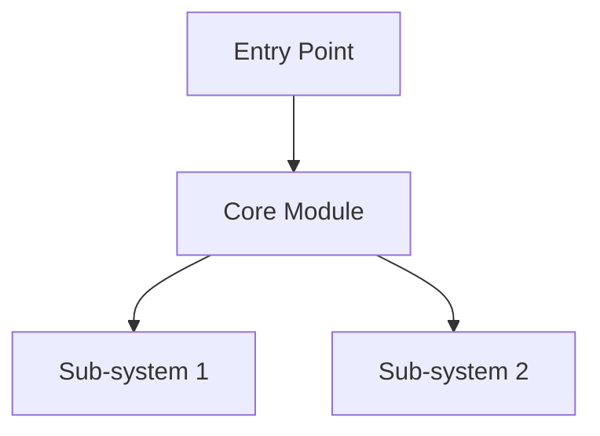

# SDD: Platform Hardening — Cross-Platform Compatibility, Model Catalog, and Quality Gates

> Source: PRD cycle-015 (issues #328, #327, #323, #322, #316)
> Cycle: cycle-015
> PRD: `grimoires/loa/prd.md`

## 1. Architecture Overview

This cycle makes **7 targeted changes** to existing subsystems. No new subsystems are introduced. All changes are backward-compatible — existing 2-model Flatline configs, Linux `flock` paths, and construct installs remain unaffected.

### Change Map

| FR | File(s) | Change Type | Risk |
|----|---------|-------------|------|
| FR-1 | `bridge-state.sh` | Modify `atomic_state_update()` | Medium — concurrency safety |
| FR-2 | `gpt-review-api.sh` | Add try/catch at line 376 | Low — additive fallback |
| FR-3 | `flatline-orchestrator.sh`, `providers/` | Add models + tertiary path | Medium — new parallel paths |
| FR-4 | New: `sync-constructs.sh` | New script + update-loa hook | Low — additive |
| FR-5 | `butterfreezone-gen.sh` | Modify extraction + template | Low — output-only |
| FR-6 | `bridge-orchestrator.sh`, `SKILL.md` | Config lookup for persona path | Low — additive |
| FR-7 | New: `bridge-flatline-check.sh` | Extract from `bridge-state.sh` | Low — extraction |

### Dependency Graph

```
FR-1 (portable locking) ──── standalone, no deps
FR-2 (model-invoke fallback) ──── standalone, no deps
FR-3 (Gemini 3 catalog) ──── standalone, no deps
FR-4 (construct sync) ──── standalone, no deps
FR-5 (butterfreezone quality) ──── standalone, no deps
FR-6 (persona path config) ──── standalone, no deps
FR-7 (flatline check) ──── depends on FR-1 (uses bridge-state.sh)
```

All FRs are independent except FR-7 which reads from `bridge-state.sh` (modified by FR-1). FR-7 should be implemented after FR-1.

## 2. FR-1: Portable Locking in `bridge-state.sh`

### 2.1 Current Architecture

**File**: `.claude/scripts/bridge-state.sh:60-109`

The `atomic_state_update()` function uses `flock` for mutual exclusion:

```
[caller] → atomic_state_update(jq_filter, args...)
              → flock --timeout 5 (FD 200)
              → jq transform on state file
              → write to .tmp.$$ file
              → mv .tmp.$$ → state file (atomic rename)
              → release FD 200
```

**6 callers**: `update_bridge_state()`, `update_iteration()`, `update_iteration_findings()`, `update_iteration_enrichment()`, `update_flatline()`, `update_metrics()`.

**Problem**: Lines 69-73 hard-fail if `flock` is unavailable. macOS doesn't ship `flock`.

### 2.2 Design: Platform-Aware Locking

Replace the `flock`-only path with a strategy pattern:

```bash
# Lock strategy detection (once, at source time)
if command -v flock &>/dev/null; then
    _LOCK_STRATEGY="flock"
else
    _LOCK_STRATEGY="mkdir"
fi
```

#### 2.2.1 `flock` Strategy (existing, unchanged)

Current behavior preserved exactly. Used on Linux where `flock` is available.

#### 2.2.2 `mkdir` Strategy (new, macOS/POSIX fallback)

```bash
_acquire_lock_mkdir() {
    local lock_dir="${BRIDGE_STATE_LOCK}.d"
    local timeout="${1:-5}"
    local elapsed=0

    while ! mkdir "$lock_dir" 2>/dev/null; do
        # Stale lock detection: check if holding PID still exists
        local holder_pid
        holder_pid=$(cat "$lock_dir/pid" 2>/dev/null)
        if [[ -n "$holder_pid" ]] && ! kill -0 "$holder_pid" 2>/dev/null; then
            warn "Removing stale lock (PID $holder_pid no longer running)"
            rm -rf "$lock_dir"
            continue
        fi

        # Age-based stale detection: lock older than 30s
        if [[ -d "$lock_dir" ]]; then
            local lock_age
            lock_age=$(( $(date +%s) - $(stat -f %m "$lock_dir" 2>/dev/null || stat -c %Y "$lock_dir" 2>/dev/null || echo 0) ))
            if (( lock_age > 30 )); then
                warn "Removing aged lock (${lock_age}s old)"
                rm -rf "$lock_dir"
                continue
            fi
        fi

        sleep 0.2
        elapsed=$(( elapsed + 1 ))
        if (( elapsed >= timeout * 5 )); then
            error "Lock acquisition timed out after ${timeout}s"
            return 1
        fi
    done

    # Write our PID for stale detection
    echo $$ > "$lock_dir/pid"
}

_release_lock_mkdir() {
    local lock_dir="${BRIDGE_STATE_LOCK}.d"
    rm -rf "$lock_dir"
}
```

#### 2.2.3 Unified `atomic_state_update()` Interface

```bash
atomic_state_update() {
    local jq_filter="$1"
    shift

    case "$_LOCK_STRATEGY" in
        flock)  _atomic_state_update_flock "$jq_filter" "$@" ;;
        mkdir)  _atomic_state_update_mkdir "$jq_filter" "$@" ;;
    esac
}
```

Both strategies share the same jq transform + temp file + atomic rename pattern. Only the lock acquisition/release differs.

### 2.3 `stat` Portability

macOS `stat` uses `-f %m` for modification time; Linux uses `-c %Y`. The design uses a portable wrapper:

```bash
_portable_mtime() {
    stat -f %m "$1" 2>/dev/null || stat -c %Y "$1" 2>/dev/null || echo 0
}
```

### 2.4 Contracts Preserved

- All 6 callers continue to call `atomic_state_update()` with same signature
- Exit codes unchanged: 0=success, 1=failure
- State file format unchanged
- Lock timeout behavior equivalent (5s default)

### 2.5 butterfreezone-gen.sh Locking

`butterfreezone-gen.sh:249-265` also uses `flock` for concurrency protection. Apply the same portable locking pattern there. Since butterfreezone uses non-blocking `flock -n`, the mkdir equivalent is a single attempt without polling.

## 3. FR-2: model-invoke Runtime Fallback in `gpt-review-api.sh`

### 3.1 Current Architecture

**File**: `.claude/scripts/gpt-review-api.sh:335-398, 914-920`

```
Route decision (line 914-920):
  if is_flatline_routing_enabled && model-invoke is executable:
    → call_api_via_model_invoke()  ←── no try/catch on failure
  else:
    → call_api()  (direct curl)
```

Inside `call_api_via_model_invoke()` at line 376-379:
```bash
if [[ $exit_code -ne 0 ]]; then
    error "model-invoke failed with exit code $exit_code"
    exit $exit_code  # ← HARD FAIL, no fallback
fi
```

### 3.2 Design: Resilient Fallback

**Location**: Modify lines 914-920 to wrap with fallback.

```bash
if is_flatline_routing_enabled && [[ -x "$MODEL_INVOKE" ]]; then
    response=$(call_api_via_model_invoke "$model" "$system_prompt" "$user_prompt" "$timeout") || {
        local mi_exit=$?
        warn "model-invoke failed (exit $mi_exit), falling back to direct API call"
        response=$(call_api "$model" "$system_prompt" "$user_prompt" "$timeout")
    }
else
    response=$(call_api "$model" "$system_prompt" "$user_prompt" "$timeout")
fi
```

**Change inside `call_api_via_model_invoke()`**: Replace `exit $exit_code` with `return $exit_code` at line 379, so the caller can catch the failure.

### 3.3 Contracts

- `call_api_via_model_invoke()` returns non-zero on failure (instead of exiting)
- `call_api()` path exercised on fallback — existing retry logic (3 attempts, exponential backoff) handles API failures
- Warning includes exit code for diagnosis
- Happy path (model-invoke succeeds) unchanged

## 4. FR-3: Gemini 3 Pro/Flash in Model Catalog

### 4.1 Current Architecture

**File**: `.claude/scripts/flatline-orchestrator.sh:191-229`

```bash
VALID_FLATLINE_MODELS=(opus gpt-5.2 gpt-5.2-codex gpt-5.3-codex claude-opus-4.6 claude-opus-4.5 gemini-2.0)

get_model_primary()   → reads .flatline_protocol.models.primary (default: opus)
get_model_secondary() → reads .flatline_protocol.models.secondary (default: gpt-5.2)
```

Phase 1 fires 4 parallel calls (2 models x {review, skeptic}). Phase 2 fires 2 parallel calls (cross-scoring).

### 4.2 Design: Tertiary Model + Gemini 3

#### 4.2.1 Model Registry Expansion

```bash
VALID_FLATLINE_MODELS=(
    opus gpt-5.2 gpt-5.2-codex gpt-5.3-codex
    claude-opus-4.6 claude-opus-4.5
    gemini-2.0 gemini-3-pro gemini-3-flash
)
```

#### 4.2.2 Tertiary Model Accessor

```bash
get_model_tertiary() {
    local tertiary
    tertiary=$(read_config '.hounfour.flatline_tertiary_model' '')
    if [[ -z "$tertiary" ]]; then
        echo ""  # Not configured — 2-model mode
        return
    fi
    echo "$tertiary"
}
```

#### 4.2.3 Phase 1: Conditional 6-Way Parallel

When tertiary model is configured:

```
Wave 1 (concurrent):
  Primary review    |  Secondary review  |  Tertiary review
Wave 2 (concurrent):
  Primary skeptic   |  Secondary skeptic |  Tertiary skeptic
```

When not configured, existing 4-way behavior preserved.

**Implementation**: Check `get_model_tertiary()` before building the parallel call array. If empty, skip tertiary calls.

```bash
local tertiary_model
tertiary_model=$(get_model_tertiary)

# Build call array
calls=()
calls+=("review:$primary_model" "review:$secondary_model")
[[ -n "$tertiary_model" ]] && calls+=("review:$tertiary_model")
calls+=("skeptic:$primary_model" "skeptic:$secondary_model")
[[ -n "$tertiary_model" ]] && calls+=("skeptic:$tertiary_model")
```

#### 4.2.4 Phase 2: 3-Way Cross-Scoring

When tertiary model configured, cross-scoring becomes triangular:

```
Primary scores Secondary items  |  Primary scores Tertiary items
Secondary scores Primary items  |  Secondary scores Tertiary items
Tertiary scores Primary items   |  Tertiary scores Secondary items
```

6 parallel scoring calls instead of 2. Consensus threshold unchanged — items need agreement from any 2 of 3 models.

**2-model backward compatibility**: When no tertiary configured, existing 2-way cross-scoring runs unchanged.

#### 4.2.5 Google Provider Routing

**File**: `.claude/scripts/flatline-orchestrator.sh` → `call_model()` function (lines 280-355)

Add model-to-provider mapping for Gemini models:

```bash
case "$model" in
    gemini-2.0|gemini-3-pro|gemini-3-flash)
        provider="google"
        api_key_var="GOOGLE_API_KEY"
        ;;
    # ... existing mappings
esac
```

The existing `model-adapter.sh.legacy` and `call_model()` routing already support provider-based dispatch. Gemini routing follows the same pattern as OpenAI/Anthropic.

#### 4.2.6 Configuration

```yaml
# .loa.config.yaml
hounfour:
  flatline_tertiary_model: gemini-3-pro  # optional, empty = 2-model mode

flatline_protocol:
  models:
    primary: opus
    secondary: gpt-5.2
    # tertiary is separate because it's Hounfour-level, not Flatline-level
```

### 4.3 Contracts

- `validate_model()` accepts `gemini-3-pro` and `gemini-3-flash`
- 2-model config unchanged when no tertiary set
- Phase 1 returns 4 or 6 result files depending on tertiary
- Phase 2 returns 2 or 6 score files depending on tertiary
- Cost accumulation works across all models

## 5. FR-4: Construct Symlink Sync

### 5.1 Current Architecture

Constructs are installed via the construct registry. Pack manifests live at `.claude/constructs/packs/{pack-name}/manifest.json`. Metadata tracked in `.claude/constructs/.constructs-meta.json`.

Skills are stored in `.claude/skills/{skill-name}/`. There are no cross-skill symlinks — skills are self-contained directories. The "sync" described in the PRD is about ensuring all skills declared in a pack's manifest are properly registered in `.constructs-meta.json` and accessible.

### 5.2 Design: `sync-constructs.sh`

**New file**: `.claude/scripts/sync-constructs.sh`

```bash
#!/usr/bin/env bash
# Sync construct pack skills with .constructs-meta.json
# Ensures all manifest-declared skills are registered

set -euo pipefail
source "$(dirname "$0")/bootstrap.sh"

PACKS_DIR="${PROJECT_ROOT}/.claude/constructs/packs"
META_FILE="${PROJECT_ROOT}/.claude/constructs/.constructs-meta.json"

sync_pack() {
    local pack_dir="$1"
    local manifest="${pack_dir}/manifest.json"

    [[ -f "$manifest" ]] || return 0

    local pack_name
    pack_name=$(jq -r '.slug // .name' "$manifest")

    # Get declared skills from manifest
    local declared_skills
    declared_skills=$(jq -r '.skills[].slug' "$manifest" 2>/dev/null)

    [[ -z "$declared_skills" ]] && return 0

    local added=0
    while IFS= read -r skill_slug; do
        local skill_path=".claude/skills/${skill_slug}"

        # Check if skill directory exists
        if [[ ! -d "${PROJECT_ROOT}/${skill_path}" ]]; then
            warn "Skill '${skill_slug}' declared in ${pack_name} manifest but directory not found"
            continue
        fi

        # Check if already registered in meta
        local registered
        registered=$(jq -r --arg path "$skill_path" '.installed_skills[$path] // empty' "$META_FILE" 2>/dev/null)

        if [[ -z "$registered" ]]; then
            # Register the skill
            local now
            now=$(date -u +"%Y-%m-%dT%H:%M:%SZ")
            jq --arg path "$skill_path" \
               --arg pack "$pack_name" \
               --arg now "$now" \
               '.installed_skills[$path] = {
                   "version": "synced",
                   "installed_at": $now,
                   "updated_at": $now,
                   "registry": "local",
                   "from_pack": $pack
               }' "$META_FILE" > "${META_FILE}.tmp" && mv "${META_FILE}.tmp" "$META_FILE"

            echo "Synced: ${skill_slug} (from ${pack_name})"
            ((added++))
        fi
    done <<< "$declared_skills"

    if (( added == 0 )); then
        : # No output on second run (idempotent)
    fi
}

main() {
    [[ -d "$PACKS_DIR" ]] || { echo "No packs directory found"; exit 0; }
    [[ -f "$META_FILE" ]] || { echo "No constructs meta file found"; exit 0; }

    for pack_dir in "$PACKS_DIR"/*/; do
        [[ -d "$pack_dir" ]] && sync_pack "$pack_dir"
    done
}

main "$@"
```

### 5.3 Update-Loa Hook

**File**: `.claude/commands/update-loa.md`

After Phase 5 (merge) and Phase 5.5 (revert protected paths), add Phase 5.6:

```
Phase 5.6: Sync constructs
→ Run .claude/scripts/sync-constructs.sh
→ Report any newly synced skills
```

### 5.4 Contracts

- Idempotent: running twice produces no output on second run
- Non-destructive: never removes existing registrations
- Validates manifest JSON before processing (jq error → skip pack)
- Missing skill directories logged as warnings, not errors

## 6. FR-5: Butterfreezone Output Quality

### 6.1 Current Architecture

**File**: `.claude/scripts/butterfreezone-gen.sh`

The script uses a tier-based extraction system (Tier 1: reality files, Tier 2: source code grep, Tier 3: stub). Each section has a word budget. Total budget: 3200 words.

Current output is structured as factual extraction — symbol lists, directory trees, dependency lists. This produces a sparse, list-heavy README that lacks narrative prose.

### 6.2 Design: Narrative Enhancement

The core change is in the **section extractors** and **word budgets**, not the overall architecture.

#### 6.2.1 Word Budget Adjustment

```bash
WORD_BUDGETS=(
    [agent_context]=80
    [header]=200        # was 120 — room for narrative intro
    [capabilities]=800  # was 600 — needs prose descriptions
    [architecture]=600  # was 400 — diagram + narrative
    [interfaces]=600    # was 800 — reduced, less important
    [module_map]=400    # was 600 — reduced, less important
    [ecosystem]=200
    [limitations]=200
    [quick_start]=300   # was 200 — needs actual steps
)
TOTAL_BUDGET=3400       # was 3200
```

#### 6.2.2 Section Extractor Changes

**`extract_header()`**: Add 2-3 sentence narrative summary below the H1. Synthesize from reality files or package.json description.

**`extract_capabilities()`**: Transform from symbol list to narrative paragraphs. Each capability gets a 1-2 sentence description with the source symbol as a reference, not the whole entry.

**`extract_architecture()`**: Add a Mermaid diagram block before the directory tree:

```markdown
## Architecture
<!-- provenance: CODE-FACTUAL -->



The project follows a [detected pattern] architecture...

[directory tree follows]
```

The Mermaid generation reads the directory structure and creates a top-level component graph. Max 8 nodes to keep it readable.

**`extract_quick_start()`**: Include actual commands from README.md or package.json scripts, not just references.

#### 6.2.3 Narrative Mode Flag

Add a `--narrative` flag (default: true for Tier 1/2, false for Tier 3):

```bash
NARRATIVE_MODE="${NARRATIVE_MODE:-true}"
```

When narrative mode is on, extractors wrap factual data in prose context. When off, current list-based output preserved.

#### 6.2.4 Validation Update

`butterfreezone-validate.sh` gains an additional check:
- Word count > 500 (new)
- Architecture section present with diagram marker (new)
- Existing provenance and checksum checks unchanged

### 6.3 Contracts

- Provenance tags preserved (`<!-- provenance: ... -->`)
- Ground truth meta checksum block preserved
- Security redaction still applied
- Tier detection unchanged
- Validation script backward-compatible (new checks additive)

## 7. FR-6: Bridge Orchestrator Persona Path Config

### 7.1 Current Architecture

**File**: `.claude/skills/run-bridge/SKILL.md` (Phase 3.1, step 1)

Persona path is hardcoded to `.claude/data/bridgebuilder-persona.md`. The orchestrator reads this path directly.

### 7.2 Design: Configurable Path

Add config lookup in `bridge-orchestrator.sh`:

```bash
get_persona_path() {
    local configured
    configured=$(read_config '.run_bridge.bridgebuilder.persona_path' '')
    if [[ -n "$configured" ]]; then
        echo "$configured"
    else
        echo ".claude/data/bridgebuilder-persona.md"  # default
    fi
}
```

The config key `run_bridge.bridgebuilder.persona_path` already exists in `.loa.config.yaml` — this change connects it to the orchestrator code.

### 7.3 Contracts

- Default path unchanged when config not set
- Persona integrity check (SHA comparison) uses the resolved path
- Section validation checks the resolved path

## 8. FR-7: Standalone Flatline Check Script

### 8.1 Current Architecture

**File**: `.claude/scripts/bridge-state.sh:394-410`

```bash
is_flatlined() {
    local consecutive_required="${1:-2}"
    # ... reads bridge-state.json, checks consecutive_below_threshold
}
```

This function is embedded in `bridge-state.sh` and only accessible by sourcing the entire file.

### 8.2 Design: Extraction to Standalone Script

**New file**: `.claude/scripts/bridge-flatline-check.sh`

```bash
#!/usr/bin/env bash
# Standalone flatline detection for bridge iterations
# Reads bridge-state.json and evaluates convergence
#
# Exit: 0 = flatlined (should stop), 1 = not flatlined (continue)
# Stdout: JSON summary

set -euo pipefail
source "$(dirname "$0")/bootstrap.sh"

BRIDGE_STATE="${PROJECT_ROOT}/.run/bridge-state.json"
WINDOW="${1:-3}"           # Number of recent iterations to check
THRESHOLD="${2:-0.05}"     # Flatline threshold (fraction of initial score)

main() {
    if [[ ! -f "$BRIDGE_STATE" ]]; then
        echo '{"flatlined": false, "reason": "no state file"}'
        exit 1
    fi

    local initial_score last_score consecutive flatline_detected reason
    initial_score=$(jq -r '.flatline.initial_score // 0' "$BRIDGE_STATE")
    last_score=$(jq -r '.flatline.last_score // 0' "$BRIDGE_STATE")
    consecutive=$(jq -r '.flatline.consecutive_below_threshold // 0' "$BRIDGE_STATE")
    flatline_detected=$(jq -r '.flatline.flatline_detected // false' "$BRIDGE_STATE")
    reason=$(jq -r '.flatline.reason // "none"' "$BRIDGE_STATE")

    # Build summary JSON
    jq -n \
        --argjson flatlined "$flatline_detected" \
        --argjson initial "$initial_score" \
        --argjson last "$last_score" \
        --argjson consecutive "$consecutive" \
        --arg reason "$reason" \
        --argjson threshold "$THRESHOLD" \
        '{
            flatlined: $flatlined,
            initial_score: $initial,
            last_score: $last,
            consecutive_below_threshold: $consecutive,
            threshold: $threshold,
            reason: $reason
        }'

    if [[ "$flatline_detected" == "true" ]]; then
        exit 0  # Flatlined — should stop
    else
        exit 1  # Not flatlined — continue
    fi
}

main "$@"
```

### 8.3 Contracts

- Exit 0 = flatlined (callers can use `if bridge-flatline-check.sh; then stop`)
- Exit 1 = not flatlined
- JSON summary on stdout for programmatic consumption
- Reads `.run/bridge-state.json` (read-only, no writes)
- Does not source `bridge-state.sh` — standalone with only `bootstrap.sh` dependency

## 9. Testing Strategy

### 9.1 FR-1 Testing (Portable Locking)

- **Unit**: Mock `command -v flock` to return failure, verify mkdir strategy activates
- **Concurrency**: Run 10 parallel `atomic_state_update()` calls, verify no state corruption
- **Stale lock**: Create lock dir with dead PID, verify recovery
- **Platform**: Test on both Linux (flock path) and macOS (mkdir path)

### 9.2 FR-2 Testing (model-invoke Fallback)

- **Unit**: Mock `call_api_via_model_invoke` to return non-zero, verify `call_api` called
- **Integration**: Verify warning message includes exit code on stderr
- **Happy path**: Verify no change when model-invoke succeeds

### 9.3 FR-3 Testing (Gemini 3)

- **Validation**: Call `validate_model gemini-3-pro` → success
- **2-model**: Verify no tertiary calls when config empty
- **3-model**: Verify 6 Phase 1 calls and 6 Phase 2 calls when tertiary set
- **Backward compat**: Run full Flatline with only primary+secondary configured

### 9.4 FR-4 Testing (Construct Sync)

- **Fixture**: Use `tests/fixtures/registry/packs/test-pack/manifest.json`
- **Idempotency**: Run twice, verify no output on second run
- **Missing skill**: Declare skill in manifest with no directory, verify warning

### 9.5 FR-5 Testing (Butterfreezone)

- **Word count**: Generated output > 500 words
- **Architecture section**: Contains `## Architecture` and mermaid marker
- **Validation**: `butterfreezone-validate.sh` passes
- **Provenance**: Tags present in output

### 9.6 FR-6 Testing (Persona Path)

- **Config set**: Verify custom path read from config
- **Config unset**: Verify default path used
- **Invalid path**: Verify graceful handling

### 9.7 FR-7 Testing (Flatline Check)

- **Flatlined state**: Exit 0, JSON shows `flatlined: true`
- **Active state**: Exit 1, JSON shows `flatlined: false`
- **No state file**: Exit 1, JSON explains missing file

## 10. Migration & Backward Compatibility

### 10.1 No Breaking Changes

All changes are additive or modify internal implementation details:

- `atomic_state_update()` signature unchanged
- `call_api_via_model_invoke()` changes `exit` to `return` (internal)
- `VALID_FLATLINE_MODELS` grows (additive)
- `sync-constructs.sh` is new (additive)
- Butterfreezone output changes are cosmetic (same schema)
- Persona path defaults to current value when unconfigured
- Flatline check script is new (additive)

### 10.2 Configuration Additions

New optional config keys (all backward-compatible with defaults):

```yaml
hounfour:
  flatline_tertiary_model: ""  # default: empty (2-model mode)

run_bridge:
  bridgebuilder:
    persona_path: .claude/data/bridgebuilder-persona.md  # default
```

### 10.3 Rollback

Each FR can be independently reverted:
- FR-1: Restore `flock`-only path in `atomic_state_update()`
- FR-2: Restore `exit` in `call_api_via_model_invoke()`
- FR-3: Remove models from array, remove tertiary function
- FR-4: Delete `sync-constructs.sh`
- FR-5: Restore original word budgets and extractors
- FR-6: Remove `get_persona_path()` call
- FR-7: Delete `bridge-flatline-check.sh`
