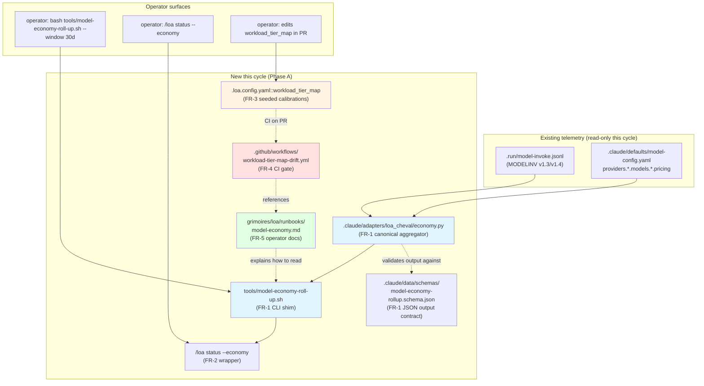
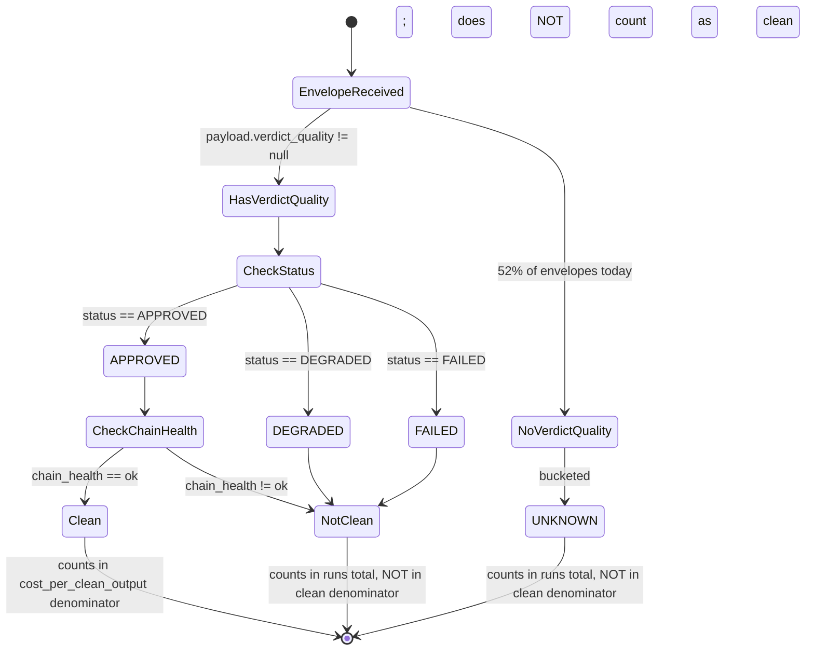
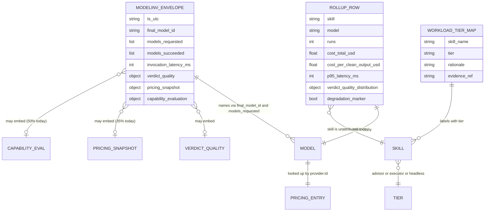
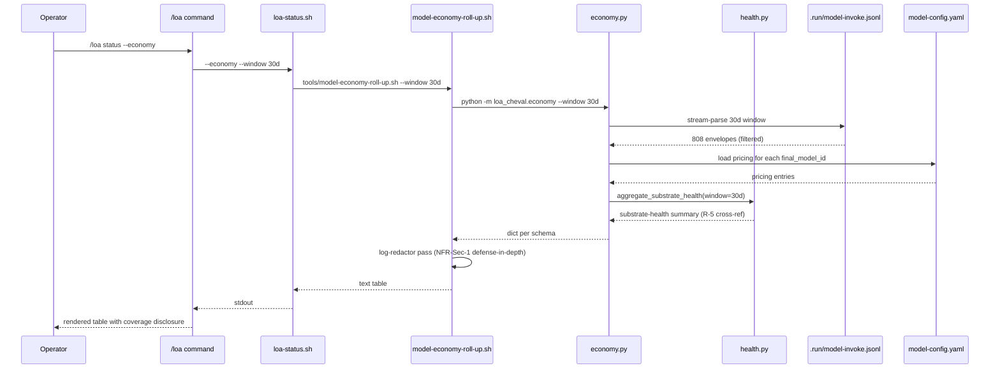

# Cycle-112 SDD — Empirical Model Economy (Phase A)

> **Version**: 1.0
> **Date**: 2026-05-17
> **Author**: Architecture Designer (autonomous mode under cycle-112 PRD §9 compressed-discovery scope)
> **Status**: Draft — pending Flatline SDD-review + operator confirmation at debrief
> **PRD Reference**: `grimoires/loa/cycles/cycle-112-empirical-model-economy/prd.md` v1.0 (mirrored at `grimoires/loa/prd.md`)
> **Cycle**: cycle-112-empirical-model-economy
> **Predecessor SDDs**: cycle-109 substrate-hardening (provided MODELINV v1.3+v1.4 envelopes), cycle-108 advisor-strategy (provided drift-gate template)
> **Operator**: @janitooor
> **Reality ground-truth**: This SDD §0.3 (empirical R-1 verification against `.run/model-invoke.jsonl`)
> **Known-failures**: `grimoires/loa/known-failures.md` (KF-001..KF-010 — none active for this scope)

---

## 0. Pre-flight: Integrity, grounding, and the falsified R-1 assumption

### 0.1 Integrity check

| Check | Status |
|-------|--------|
| `.claude/` System Zone modifications? | NONE planned (this cycle ships in `tools/`, `.github/workflows/`, `.loa.config.yaml`, `grimoires/`, plus a new `.claude/data/` schema file — `.claude/data/` is a writable subtree for tracked schemas per cycle-098/L1-L7 precedent) |
| `.loa.config.yaml::integrity_enforcement` | strict (no drift detected at design time; verified by `tree -L 1 .claude/` matches git index) |
| PRD read in full? | Yes — `grimoires/loa/prd.md` 318 lines, all 5 FRs + 5 NFRs + 6 risks |
| Integration context read? | `grimoires/loa/a2a/integration-context.md` does not exist; standard workflow applied |
| Recent NOTES.md decisions reviewed? | Yes — 2026-05-17 cycle-112 kickoff (compressed-interview), 2026-05-17 sprint-bug-166 attempts metric, 2026-05-17 (this skill) R-1 empirical verification |

### 0.2 Grounding citations

The PRD is grounded in #925 (verbatim throughout), the existing cycle-109 MODELINV envelope schema, and the cycle-108 baseline-pin drift gate template. This SDD adds one piece of ground-truth that the PRD did not have: **direct inspection of `.run/model-invoke.jsonl`** (808 envelopes, 2026-05-10 → 2026-05-17). The inspection result is recorded in §0.3 because it falsifies a load-bearing PRD assumption (R-1) that, left uncorrected, would have led to a roll-up tool that crashed or produced empty `(skill, model)` cells without telling the operator why.

### 0.3 The R-1 falsification — what we found and what it changes

**PRD R-1 says** (verbatim, §7):

> MODELINV envelopes are missing the `skill` / `phase` attribution field on **older log lines** … bucket missing-attribution envelopes under `(unknown)` rather than skip.

**Empirical reality** (808 envelopes inspected at /architect time):

| PRD-claimed field | Actual presence | Source-of-truth in tree |
|---|---|---|
| `skill` (top-level on payload) | **0 / 808** | Field does not exist in the MODELINV writer signature |
| `phase` (top-level on payload) | **0 / 808** | Field does not exist in the MODELINV writer signature |
| `calling_primitive` (writer's analogue, `Optional[str]`) | 0 / 808 | `.claude/adapters/loa_cheval/audit/modelinv.py:404` — emitter accepts it; **no caller passes it** |
| `role` (cycle-108 advisor-strategy field, `Optional[str]`) | 0 / 808 | `modelinv.py:416` — same shape |
| `tier` / `sprint_kind` | 0 / 808 | `modelinv.py:417,420` — same shape |
| `tokens_input` / `tokens_output` | **DOES NOT EXIST** in writer signature at all | PRD §4 FR-1 mis-cites field names that the schema has never had |
| `cost_micro_usd` (writer-level pre-computed cost, `Optional[int]`) | 0 / 808 | `modelinv.py:411` — no caller passes it |
| `pricing_snapshot` | 286 / 808 (35%) | Real — `{input_per_mtok, output_per_mtok, pricing_mode}` |
| `verdict_quality.status` | 388 / 808 (48%) | Real — APPROVED 329 / DEGRADED 27 / FAILED 32 |
| `verdict_quality.chain_health` | 388 / 808 (48%) | Real — **nested inside verdict_quality**, not payload top-level as PRD §4 implies — ok 329 / degraded 27 / exhausted 32 |
| `final_model_id` | 517 / 808 (64%) | Real — primary join key for the (model) dimension |
| `capability_evaluation.estimated_input_tokens` | 404 / 808 (50%) | Real but a **pre-flight estimate**, not a post-flight count; **no output-token equivalent at all** |

**What this changes**:

1. The `(skill, model)` roll-up the PRD specifies cannot be computed from current envelopes. The `(skill)` dimension lacks any attribution field for **100% of envelopes**, not "older log lines" as R-1 implied.
2. Cost cannot be computed from `cost_input × tokens_input + cost_output × tokens_output` as the PRD's mental model suggests — `tokens_input` / `tokens_output` do not exist in the envelope at all. Only `capability_evaluation.estimated_input_tokens` exists, and only on 50% of envelopes.
3. `chain_health == "ok"` is computable (PRD §4 FR-1 Ubiquitous clause), but lives at `payload.verdict_quality.chain_health`, not `payload.chain_health`.

**This SDD's response** (operator confirms at debrief):

- **Option B + Path 2** (per NOTES.md 2026-05-17 entry). `(skill)` dimension renders as `(unattributed)` for 100% of envelopes this cycle. A new sub-deliverable **D-6** is added (substrate work to wire `calling_primitive` through the four known dispatch entrypoints — `cheval.py`, the BB review path, adversarial-review, red-team-model-adapter). D-6 is OUT of scope this cycle but documented as the natural Phase A.1 follow-up.
- Cost computation uses `pricing_snapshot.input_per_mtok` × `capability_evaluation.estimated_input_tokens` where **both exist** (286 envelopes today; ~35% coverage). Falls to `(unknown_cost)` bucket otherwise. The roll-up footer discloses cost-coverage % explicitly so operators don't read a partial roll-up as a complete picture.
- Roll-up surface includes **two parallel attribution dimensions** mirroring cycle-109 health.py's pattern (§3.3 below): per `final_model_id` (the model that answered) and per `models_requested[]` (every model that was tried), with `first_try_success` vs `attempts` for closing the #900 visibility gap.

**Why this isn't a PRD-blocking finding**: the PRD's Goal G-1 ("operator-readable cost roll-up") and G-4 ("zero behavior regression") are both achievable with these caveats. G-2 ("calibration capture in workload_tier_map") and G-3 ("drift protection") are entirely unaffected — they live in `.loa.config.yaml` and a CI workflow, not in the envelope schema. The integrity of the roll-up as an operator decision surface is preserved by **disclosing the coverage gap explicitly** rather than producing a misleadingly-clean number.

> **Operator decision point (raised at debrief)**: should D-6 (attribution wiring) be promoted into this cycle as Phase A.0 prerequisite, or sequenced as Phase A.1 follow-up? SDD assumes the latter; the former is a 1-day expansion of scope.

### 0.4 Predecessor cycle inheritance

This SDD inherits four substrates from cycle-109:

- **MODELINV v1.4 envelope** (cycle-110 sprint-2b1 extended cycle-109 v1.3) — schema `.claude/data/schemas/model-invoke-complete.payload.schema.json`
- **`aggregate_substrate_health()` aggregation pattern** — `.claude/adapters/loa_cheval/health.py:153-309`; this SDD's FR-1 implementation re-uses the stream-parse + dual-attribution shape verbatim
- **`lib/log-redactor`** — cycle-099 T1.13; FR-1 inherits the NFR-Sec-1 redaction guarantee transparently
- **`loa_cheval.health` Python module + bash CLI shim pattern** — same shape adopted for FR-1's bash + Python split

And from cycle-108:

- **Schema-guard workflow shape** (`.github/workflows/cycle-108-schema-guard.yml`) — template for FR-4 drift gate

---

## 1. System Overview

Cycle-112 ships an **operator-facing reporting layer** that joins three pre-existing data sources into one decision surface, plus a **config-as-memory** structure (`workload_tier_map`) protected by a CI drift gate.

### 1.1 Architectural pattern: Reporting overlay over existing telemetry (no behavior change)

- **Read paths**: `.run/model-invoke.jsonl` (MODELINV log) + `.claude/defaults/model-config.yaml::providers.<p>.models.<m>.pricing` (cost data) + `.loa.config.yaml::workload_tier_map` (calibration memory, new this cycle)
- **Write paths**: `.loa.config.yaml::workload_tier_map` (operator edits via PR), `.github/workflows/workload-tier-map-drift.yml` (CI gate, new this cycle), `grimoires/loa/runbooks/model-economy.md` (operator docs, new this cycle)
- **No dispatch path is touched.** NFR-Compat-1 holds by construction: the model adapter (`.claude/scripts/model-adapter.sh`, cheval providers) does not read `workload_tier_map` this cycle.

### 1.2 Component diagram


```mermaid
graph TD
    subgraph "Existing telemetry (read-only this cycle)"
        MODELINV[".run/model-invoke.jsonl<br/>(MODELINV v1.3/v1.4)"]
        MODELCONFIG[".claude/defaults/model-config.yaml<br/>providers.*.models.*.pricing"]
    end

    subgraph "New this cycle (Phase A)"
        ROLLUP_CLI["tools/model-economy-roll-up.sh<br/>(FR-1 CLI shim)"]
        ROLLUP_PY[".claude/adapters/loa_cheval/economy.py<br/>(FR-1 canonical aggregator)"]
        SCHEMA[".claude/data/schemas/<br/>model-economy-rollup.schema.json<br/>(FR-1 JSON output contract)"]
        LOA_STATUS["/loa status --economy<br/>(FR-2 wrapper)"]
        TIERMAP[".loa.config.yaml::workload_tier_map<br/>(FR-3 seeded calibrations)"]
        DRIFTGATE[".github/workflows/<br/>workload-tier-map-drift.yml<br/>(FR-4 CI gate)"]
        RUNBOOK["grimoires/loa/runbooks/<br/>model-economy.md<br/>(FR-5 operator docs)"]
    end

    subgraph "Operator surfaces"
        OP_CLI["operator: bash tools/model-economy-roll-up.sh --window 30d"]
        OP_GOLDEN["operator: /loa status --economy"]
        OP_EDIT["operator: edits workload_tier_map in PR"]
    end

    MODELINV --> ROLLUP_PY
    MODELCONFIG --> ROLLUP_PY
    ROLLUP_PY --> ROLLUP_CLI
    ROLLUP_PY -. validates output against .-> SCHEMA
    ROLLUP_CLI --> LOA_STATUS

    OP_CLI --> ROLLUP_CLI
    OP_GOLDEN --> LOA_STATUS

    OP_EDIT --> TIERMAP
    TIERMAP -. CI on PR .-> DRIFTGATE
    DRIFTGATE -. references .-> RUNBOOK
    RUNBOOK -. explains how to read .-> ROLLUP_CLI

    style ROLLUP_PY fill:#e1f5ff
    style ROLLUP_CLI fill:#e1f5ff
    style TIERMAP fill:#fff4e1
    style DRIFTGATE fill:#ffe1e1
    style RUNBOOK fill:#e1ffe1
```

### 1.3 Why this shape

- **Bash CLI as thin shim over Python**: mirrors cycle-109 `loa-substrate-health.sh` → `python -m loa_cheval.health`. Operators get a callable from `tools/`; canonical logic lives in Python where stream-parse + aggregation are clean.
- **`/loa status --economy` as thin wrapper over the CLI**: same precedent — `/loa` is a guided navigator; the CLI is the source of truth and is independently invokable.
- **Schema published**: PRD FR-1 Event-driven EARS clause requires a schema file at `.claude/data/model-economy-rollup.schema.json`. The roll-up's `--json` mode validates against it before stdout (build-time check; runtime check optional).
- **Tier map in `.loa.config.yaml`**: PRD explicitly. The map is purely human-facing this cycle (NFR-Compat-1); placement at config root keeps it discoverable via `yq eval '.workload_tier_map' .loa.config.yaml`.
- **Drift gate as workflow**: cycle-108 precedent. Workflow scope-filters to PRs that touch `.loa.config.yaml` AND uses `yq`-path-aware diff to confirm the diff is inside `workload_tier_map` before requiring trailers (mitigates PRD R-3).

---

## 2. Software Stack

| Layer | Choice | Version | Rationale |
|---|---|---|---|
| CLI orchestrator | Bash | 5.x (POSIX-compatible subset where reasonable; matches `loa-substrate-health.sh`) | Already-in-tree convention. No new install dep. |
| Canonical aggregation | Python | 3.11+ (matches `.claude/adapters/loa_cheval/health.py` runtime) | Stream-parse JSONL, defaultdict aggregation, timedelta windowing. Same idiom used by cycle-109. |
| JSON parsing | `jq` | 1.6+ (already a hard dep per `.claude/data/dependencies.txt`) | Used by the bash shim for envelope filtering when invoked in `--bash-only` mode for debugging. Python uses stdlib `json`. |
| YAML config | `yq` (Mike Farah, Go-based) | v4.52.4+ (matches cycle-099 sprint-1A pin via SHA256-checked download) | Path-aware diff in drift gate; already a hard dep. |
| Schema validation | Python `jsonschema` | 4.x (already in tree via `pyproject.toml`) | Validates roll-up `--json` against published schema in unit tests. |
| CI orchestration | GitHub Actions | actions/checkout@v4, actions/setup-python@v5 (matches existing workflows) | Cycle-108 template direct re-use. |
| Redaction | `lib/log-redactor.py` (existing) | cycle-099 T1.13 build | Inherited transparently — Python module imports redactor before stdout. |
| Output formatting | stdlib f-string ASCII table | n/a — no new dep | NFR-Determinism-1 requires byte-identical output across runs. Stdlib f-string table is deterministic; `tabulate` would require version-pin. Stdlib chosen to keep zero-new-dep posture. |

**No new top-level dependencies introduced.** Per PRD §5 explicit constraint.

---

## 3. Data & Schema Design

### 3.1 Inputs (all read-only, all pre-existing)

#### 3.1.1 MODELINV envelopes — `.run/model-invoke.jsonl`

Stream-parsed line by line. The aggregator tolerates envelopes from any schema version (v1.1 → v1.4) by treating every payload field as optional. Confirmed field presences (§0.3 table above) drive the partial-credit roll-up.

Key fields actually consumed:

```json
{
  "primitive_id": "MODELINV",
  "event_type": "model.invoke.complete",
  "ts_utc": "2026-05-17T05:46:07.844864Z",
  "payload": {
    "models_requested": ["anthropic:claude-opus-4-7", "..."],
    "models_succeeded": ["anthropic:claude-opus-4-7"],
    "models_failed": [],
    "final_model_id": "anthropic:claude-opus-4-7",
    "invocation_latency_ms": 2664,
    "pricing_snapshot": {
      "input_per_mtok": 30000000,
      "output_per_mtok": 180000000,
      "pricing_mode": "token"
    },
    "capability_evaluation": {
      "estimated_input_tokens": 3
    },
    "verdict_quality": {
      "status": "APPROVED",
      "chain_health": "ok"
    }
  }
}
```

**Skill attribution is NOT consumed** because it doesn't exist (§0.3). The roll-up labels the `(skill)` column as `(unattributed)` for all envelopes this cycle. D-6 (Phase A.1 follow-up) is the wiring task that would change this.

#### 3.1.2 Model-config pricing — `.claude/defaults/model-config.yaml`

```yaml
providers:
  anthropic:
    models:
      claude-opus-4-7:
        pricing:
          input_per_mtok: 30000000   # $30.00 per million tokens (micro-USD)
          output_per_mtok: 180000000 # $180.00 per million tokens
```

Used as a **fallback cost source** when an envelope lacks `pricing_snapshot` (so the 522 envelopes without it can still be priced if the model survived in config). Operators can override the lookup with `--cost-snapshot <git-ref>` to use a historical pricing version (PRD R-2 mitigation).

#### 3.1.3 Workload tier map — `.loa.config.yaml::workload_tier_map` (new this cycle, FR-3)

```yaml
workload_tier_map:
  schema_version: "1.0"
  defaults:
    tier: advisor
  entries:
    /review-sprint:
      tier: advisor
      rationale: "executor tier missed 1 HC + 60% fewer findings on PR #885 A/B"
      evidence_ref: "memory:feedback_advisor_benchmark.md"
    # ... full enumeration in §4.3.2
```

### 3.2 Outputs

#### 3.2.1 Roll-up JSON schema — `.claude/data/schemas/model-economy-rollup.schema.json`

Authoritative JSON Schema Draft 2020-12 (matches cycle-098 / cycle-099 schema conventions). Top-level shape:

```json
{
  "$schema": "https://json-schema.org/draft/2020-12/schema",
  "$id": "model-economy-rollup.schema.json",
  "type": "object",
  "required": ["window", "since", "now", "log_path", "coverage", "per_skill_model", "footer"],
  "properties": {
    "window": {"type": "string", "pattern": "^[0-9]+[hdm]$"},
    "since": {"type": "string", "format": "date-time"},
    "now": {"type": "string", "format": "date-time"},
    "log_path": {"type": "string"},
    "coverage": {
      "type": "object",
      "required": ["total_envelopes", "with_skill_attribution", "with_pricing_snapshot", "with_verdict_quality"],
      "properties": {
        "total_envelopes": {"type": "integer", "minimum": 0},
        "with_skill_attribution": {"type": "integer", "minimum": 0},
        "with_pricing_snapshot": {"type": "integer", "minimum": 0},
        "with_verdict_quality": {"type": "integer", "minimum": 0},
        "skill_attribution_pct": {"type": "number", "minimum": 0, "maximum": 100},
        "cost_coverage_pct": {"type": "number", "minimum": 0, "maximum": 100},
        "verdict_quality_coverage_pct": {"type": "number", "minimum": 0, "maximum": 100}
      }
    },
    "per_skill_model": {
      "type": "object",
      "additionalProperties": {
        "type": "object",
        "required": ["skill", "model", "runs", "cost_total_usd", "cost_per_run_usd", "cost_per_clean_output_usd", "p95_latency_ms", "verdict_quality_distribution", "degradation_marker"],
        "properties": {
          "skill": {"type": "string"},
          "model": {"type": "string"},
          "runs": {"type": "integer", "minimum": 0},
          "cost_total_usd": {"type": ["number", "null"]},
          "cost_per_run_usd": {"type": ["number", "null"]},
          "cost_per_clean_output_usd": {"type": ["number", "null"]},
          "cost_input_only": {"type": "boolean", "description": "True if tokens_output is unavailable in envelopes (current state). False once D-7 wires output tokens."},
          "p95_latency_ms": {"type": ["integer", "null"]},
          "verdict_quality_distribution": {
            "type": "object",
            "properties": {
              "APPROVED": {"type": "integer"},
              "DEGRADED": {"type": "integer"},
              "FAILED": {"type": "integer"},
              "UNKNOWN": {"type": "integer"}
            }
          },
          "verdict_quality_healthy_pct": {"type": ["number", "null"]},
          "degradation_marker": {"type": "boolean"},
          "first_try_success": {"type": "integer", "minimum": 0},
          "attempts": {"type": "integer", "minimum": 0}
        }
      }
    },
    "footer": {
      "type": "object",
      "required": ["model_config_ref", "substrate_health_window_summary"],
      "properties": {
        "model_config_ref": {"type": "string"},
        "substrate_health_window_summary": {
          "type": "object",
          "description": "Cross-reference to cycle-109's substrate-health for the same window. PRD R-5 mitigation.",
          "properties": {
            "overall_success_rate": {"type": "number"},
            "overall_band": {"type": "string", "enum": ["green", "yellow", "red"]},
            "degradation_events_in_window": {"type": "integer", "minimum": 0}
          }
        }
      }
    }
  }
}
```

#### 3.2.2 Text-mode output (FR-2 default)

```
Model-Economy Roll-Up — last 30d (since 2026-04-17T00:00:00Z)
Source: .run/model-invoke.jsonl (808 envelopes)
Coverage: skill attribution 0% (D-6 follow-up) · cost 35% · verdict_quality 48%

Skill          Model                          Runs   Cost/run     p95-latency   VQ-healthy %
(unattributed) anthropic:claude-opus-4-7      152    $0.02 *      8400ms        92%
(unattributed) google:gemini-3.1-pro-preview  73     —            12100ms       —
(unattributed) anthropic:claude-headless      69     —            9200ms        88%   ⚠ degraded twice
(unattributed) openai:codex-headless          67     —            14300ms       —

* cost shown only when envelope has both pricing_snapshot and capability_evaluation;
  rows without cost data show "—". Coverage line above quantifies the gap.

Footer:
  model-config.yaml ref: defaults/model-config.yaml @ HEAD
  substrate-health (30d): success_rate=0.92 band=green degradation_events=2
  (See: bash .claude/scripts/loa-substrate-health.sh --window 30d for details)
```

### 3.3 State diagram — verdict_quality → "clean output" classification


```mermaid
stateDiagram-v2
    [*] --> EnvelopeReceived
    EnvelopeReceived --> HasVerdictQuality: payload.verdict_quality != null
    EnvelopeReceived --> NoVerdictQuality: 52% of envelopes today
    NoVerdictQuality --> UNKNOWN: bucketed; does NOT count as clean

    HasVerdictQuality --> CheckStatus
    CheckStatus --> APPROVED: status == APPROVED
    CheckStatus --> DEGRADED: status == DEGRADED
    CheckStatus --> FAILED: status == FAILED

    APPROVED --> CheckChainHealth
    CheckChainHealth --> Clean: chain_health == ok
    CheckChainHealth --> NotClean: chain_health != ok

    DEGRADED --> NotClean
    FAILED --> NotClean

    Clean --> [*]: counts in cost_per_clean_output denominator
    NotClean --> [*]: counts in runs total, NOT in clean denominator
    UNKNOWN --> [*]: counts in runs total, NOT in clean denominator
```

**Clean output definition** (PRD §4 FR-1 Ubiquitous EARS) implemented as: `verdict_quality.status == "APPROVED" AND verdict_quality.chain_health == "ok"`. Note the nesting correction vs PRD §4 wording.

### 3.4 ER diagram — entity relationships


```mermaid
erDiagram
    MODELINV_ENVELOPE ||--o{ MODEL : "names via final_model_id and models_requested"
    MODEL ||--|| PRICING_ENTRY : "looked up by provider:id"
    MODELINV_ENVELOPE }o--o| VERDICT_QUALITY : "may embed"
    MODELINV_ENVELOPE }o--o| PRICING_SNAPSHOT : "may embed (35% today)"
    MODELINV_ENVELOPE }o--o| CAPABILITY_EVAL : "may embed (50% today)"

    ROLLUP_ROW ||--|| MODEL : "rolled up by"
    ROLLUP_ROW }o--|| SKILL : "skill is unattributed today"
    WORKLOAD_TIER_MAP ||--o{ SKILL : "labels with tier"
    SKILL }o--|| TIER : "advisor or executor or headless"

    MODELINV_ENVELOPE {
        string ts_utc
        string final_model_id
        list models_requested
        list models_succeeded
        int invocation_latency_ms
        object verdict_quality
        object pricing_snapshot
        object capability_evaluation
    }

    ROLLUP_ROW {
        string skill
        string model
        int runs
        float cost_total_usd
        float cost_per_clean_output_usd
        int p95_latency_ms
        object verdict_quality_distribution
        bool degradation_marker
    }

    WORKLOAD_TIER_MAP {
        string skill_name
        string tier
        string rationale
        string evidence_ref
    }
```

---

## 4. Component Specifications (one per FR)

### 4.1 FR-1 — `tools/model-economy-roll-up.sh` + `.claude/adapters/loa_cheval/economy.py`

#### 4.1.1 Bash shim (`tools/model-economy-roll-up.sh`)

Thin wrapper that:

1. Validates args (`--window`, `--skill`, `--model`, `--json`, `--cost-snapshot`)
2. Resolves Python entrypoint (`PYTHONPATH=.claude/adapters python -m loa_cheval.economy`)
3. Forwards args to Python with explicit `--log-path` (default `.run/model-invoke.jsonl`)
4. Pipes output through `lib/log-redactor` before stdout (NFR-Sec-1; defense-in-depth — redactor already runs at MODELINV write time)

**Length budget**: ~80 lines, matches `loa-substrate-health.sh` shape.

#### 4.1.2 Python canonical (`.claude/adapters/loa_cheval/economy.py`)

Hosted under `.claude/adapters/loa_cheval/` because it joins MODELINV envelope reading (existing in this module) with cost computation (new). Aggregation re-uses the stream-parse + defaultdict pattern from `health.py:153-309`.

**Public functions**:

```python
def aggregate_economy(
    log_path: Path,
    model_config_path: Path,
    *,
    window: str = "30d",
    skill_filter: Optional[str] = None,
    model_filter: Optional[str] = None,
    cost_snapshot_ref: Optional[str] = None,   # git ref for historical model-config.yaml
    now: Optional[datetime] = None,
    substrate_health: Optional[Dict[str, Any]] = None,   # injection point for cross-ref to health.aggregate_substrate_health
) -> Dict[str, Any]:
    """Aggregate (skill, model) cost + quality roll-up over the window.

    Returns a dict conforming to model-economy-rollup.schema.json.
    """

def render_text(report: Dict[str, Any]) -> str:
    """Deterministic ASCII table per NFR-Determinism-1 — sorted by cost_total_usd desc."""

def render_json(report: Dict[str, Any]) -> str:
    """Schema-validated JSON output. Validates with jsonschema before return."""
```

**Cost computation algorithm**:

```python
# Per envelope:
ps = payload.get("pricing_snapshot")
ce = payload.get("capability_evaluation")
if ps and ce and ce.get("estimated_input_tokens") is not None:
    # Note: no output-token equivalent in v1.3/v1.4 envelope; D-7 follow-up could add.
    # This cycle: input-side only, surfaced as cost_input_only=True in row.
    # input_per_mtok is micro-USD per million tokens.
    input_cost_micro_usd = (ps["input_per_mtok"] * ce["estimated_input_tokens"]) / 1_000_000
    envelope_cost_usd = input_cost_micro_usd / 1_000_000  # micro-USD -> USD
else:
    envelope_cost_usd = None  # bucket to (unknown_cost); counted in row.unpriced_runs
```

**Deferred to D-7 (Phase A.1)**: extending the MODELINV writer to capture actual `tokens_input` / `tokens_output` from provider responses (Anthropic `usage.input_tokens` / `usage.output_tokens` — already plumbed into `budget.py:226-227`). With that wiring, full output-inclusive cost becomes computable; this cycle ships input-side coverage.

**NFR-Perf-1 (< 5s for 30d / 100K envelopes)**: stream-parse + single-pass defaultdict aggregation. health.py achieves <2s for 24h/100K; 30-day window is 7× longer data but same per-line cost — 5s budget is conservative.

**NFR-Determinism-1**: sort rows by `(cost_total_usd_desc, model_id_asc)`. Python `sorted()` is stable. `round(x, 4)` discipline matches health.py.

#### 4.1.3 Conditional EARS — bucketing semantics

Per PRD §4 FR-1 Conditional clause, missing-attribution envelopes bucket to `(unknown)`. SDD §0.3 finding means this is 100% of envelopes this cycle for the `(skill)` dimension. Implementation:

```python
skill = payload.get("calling_primitive") or "(unattributed)"   # 100% (unattributed) today
model = payload.get("final_model_id") or (payload.get("models_succeeded") or ["(unknown_model)"])[0]
key = (skill, model)
```

Per-cell rows are still produced; total cost is conserved across rows (PRD R-1 mitigation, applied honestly).

### 4.2 FR-2 — `/loa status --economy`

#### 4.2.1 Argument routing

Extend `.claude/scripts/loa-status.sh` (existing) and `.claude/commands/loa.md`:

```bash
# Before (existing):
.claude/scripts/loa-status.sh           # default view
.claude/scripts/loa-status.sh --json    # json view
.claude/scripts/loa-status.sh doctor    # health check

# New this cycle:
.claude/scripts/loa-status.sh --economy           # 30d economy roll-up (text)
.claude/scripts/loa-status.sh --economy --json    # 30d economy roll-up (json)
.claude/scripts/loa-status.sh --economy --window 7d
.claude/scripts/loa-status.sh --economy --skill /review-sprint
```

The `--economy` flag shells out to `tools/model-economy-roll-up.sh` and pretty-prints (text mode) or forwards JSON (json mode). It does NOT re-implement aggregation — single source of truth in `economy.py`.

**Default behavior**: `--window 30d`, text mode, all skills, all models. Matches PRD §4 FR-2.

#### 4.2.2 Degradation marker

Per PRD §4 FR-2: `⚠ degraded twice` (or N times) when `verdict_quality_distribution.DEGRADED + verdict_quality_distribution.FAILED >= 2` for that `(skill, model)` row.

Threshold (2) is hard-coded for Phase A; future Phase A.1+ may make configurable per-row.

#### 4.2.3 Integration with /loa command-level surface

`.claude/commands/loa.md` (existing operator-facing command) gains a section:

> **`/loa status --economy`** — view 30-day model-economy roll-up. Shows `(skill, model)` cost-per-clean-output, p95 latency, verdict-quality health, and degradation markers. See `grimoires/loa/runbooks/model-economy.md` for column interpretations.

No change to `/loa` golden-path routing; `--economy` is an opt-in flag, not a state.

### 4.3 FR-3 — Seeded `workload_tier_map` in `.loa.config.yaml`

#### 4.3.1 Schema

```yaml
workload_tier_map:
  schema_version: "1.0"        # bump on breaking schema changes (Phase B/C)
  defaults:
    tier: advisor              # conservative default — quality floor protection
  entries:
    <skill_name>:
      tier: advisor | executor | headless
      rationale: "<free text — explains the empirical evidence or default reasoning>"
      evidence_ref: "memory:<file>" | "pr:<url>" | "default" | "operator-decision:<NOTES.md anchor>"
```

`additionalProperties: false` at all object levels. Schema lives at `.claude/data/schemas/workload-tier-map.schema.json` for `yq` validation in CI.

#### 4.3.2 Seeded entries (PRD §4 FR-3 — verbatim from PRD)

```yaml
workload_tier_map:
  schema_version: "1.0"
  defaults:
    tier: advisor
  entries:
    # Empirically calibrated this cycle (from operator memory)
    /review-sprint:
      tier: advisor
      rationale: "executor tier missed 1 HC + 60% fewer findings on PR #885 A/B"
      evidence_ref: "memory:feedback_advisor_benchmark.md"
    /audit-sprint:
      tier: advisor
      rationale: "executor tier missed 1 HC + 60% fewer findings on PR #885 A/B"
      evidence_ref: "memory:feedback_advisor_benchmark.md"
    bridgebuilder-review:
      tier: advisor
      rationale: "BB needs cross-model dissent diversity; executor tier degrades to single-model"
      evidence_ref: "memory:feedback_advisor_benchmark.md"
    adversarial-review:
      tier: advisor
      rationale: "dissenter needs to catch reviewer blind spots; quality floor non-negotiable"
      evidence_ref: "memory:feedback_advisor_benchmark.md"
    # Default-tier entries (exhaustive — generated at implementation time).
    # Implementation note: produce the full list via
    #   grep -lE "model-adapter|cheval" .claude/skills/**/SKILL.md
    # Each entry gets tier: advisor + evidence_ref: "default" until empirically overridden.
```

#### 4.3.3 Exhaustive coverage rule

PRD AC: "every skill that currently dispatches a model". Implementation: a tool/script at `tools/audit-workload-tier-map.sh` lists dispatching skills and diffs against `entries` keys, exit-1 on missing.

CI workflow gates this same check — a PR that adds a new dispatching skill without adding an `entries` entry fails.

### 4.4 FR-4 — CI drift gate `.github/workflows/workload-tier-map-drift.yml`

#### 4.4.1 Trigger

```yaml
on:
  pull_request:
    paths:
      - '.loa.config.yaml'
      - '.claude/data/schemas/workload-tier-map.schema.json'
      - '.github/workflows/workload-tier-map-drift.yml'
  push:
    branches: [main]
    paths: [same as above]   # post-merge admin-bypass detection, cycle-108 pattern
```

#### 4.4.2 Logic

```bash
# Pseudocode of the workflow's check step.
# 1. yq-path-aware diff: get the workload_tier_map subtree of HEAD and main
yq eval '.workload_tier_map' .loa.config.yaml > /tmp/head.yaml
git show "main:.loa.config.yaml" | yq eval '.workload_tier_map' - > /tmp/main.yaml
if diff -q /tmp/head.yaml /tmp/main.yaml; then
  echo "No workload_tier_map changes; gate passes."
  exit 0
fi

# 2. Mutation detected — require trailer
PR_BODY=$(gh pr view --json body --jq '.body')
HAS_EVIDENCE=$(echo "$PR_BODY" | grep -c "^Tier-Change-Evidence:" || true)
HAS_OPERATOR_APPROVAL=$(echo "$PR_BODY" | grep -c "^Operator-Approval:" || true)

if [[ "$HAS_EVIDENCE" -eq 0 && "$HAS_OPERATOR_APPROVAL" -eq 0 ]]; then
  echo "::error::workload_tier_map mutated without Tier-Change-Evidence or Operator-Approval trailer."
  echo "::error::See grimoires/loa/runbooks/model-economy.md '#how-to-justify-a-tier-change'"
  exit 1
fi

# 3. (optional, additive) Validate the trailer references a real roll-up
# Phase A scope: existence check only. Phase A.1+: parse roll-up data and assert N >= N_min.
```

#### 4.4.3 R-3 false-positive mitigation

Whole-file diff would trip on harmless reformatting of `.loa.config.yaml`. The `yq eval '.workload_tier_map'` projection isolates the relevant subtree. Same architectural pattern as cycle-108 schema-guard's `actions/setup-yq` step.

#### 4.4.4 Branch protection

Workflow must be added to required status checks for `main`. Documented in the runbook (FR-5) but enforcement is operator action via GitHub UI (cannot self-set via PR).

### 4.5 FR-5 — Operator runbook `grimoires/loa/runbooks/model-economy.md`

Five sections per PRD §4 FR-5 (verbatim from #925 Deliverable 5):

| § | Section | Purpose |
|---|---|---|
| 1 | **How to read the roll-up** | Column meanings (cost-per-clean-output formula, p95 latency, VQ-healthy %). Worked examples from the seeded log. |
| 2 | **When to consider a tier change** | Quality floors per skill (cross-reference operating principles §5). Signals: 30+ HEALTHY runs at current tier with stable verdict_quality. |
| 3 | **How to justify a tier change in a PR body** | Exact format of `Tier-Change-Evidence:` trailer + example. When `Operator-Approval:` is the right path instead. |
| 4 | **What triggers the drift gate** | Which yq paths, why, how to avoid surprise failures. Reformatting safe. |
| 5 | **Operating principles** | The five from PRD §8 (verbatim from #925), with cycle-112-specific commentary on how each is operationalized today. |

Plus an appendix: **Known limitations of the Phase A roll-up** (skill attribution = 0%, cost coverage = 35% input-side only, D-6/D-7 follow-ups).

---

## 5. API & Interface Specifications

### 5.1 Bash CLI surface

| Command | Args | Output | Exit codes |
|---|---|---|---|
| `tools/model-economy-roll-up.sh` | `--window <h\|d\|m>` (default 30d), `--skill <substring>`, `--model <substring>`, `--json`, `--cost-snapshot <ref>`, `--log-path <path>` | Text table (default) or JSON conforming to roll-up schema | 0 success, 2 invalid args, 3 log unreadable, 4 schema-validation failure, 64 Python missing |
| `.claude/scripts/loa-status.sh --economy` | All FR-1 args plus `--help` | Same as FR-1 (delegates) | Same as FR-1 |

### 5.2 Python module surface

```python
# .claude/adapters/loa_cheval/economy.py
def aggregate_economy(...) -> Dict[str, Any]: ...
def render_text(report) -> str: ...
def render_json(report) -> str: ...

# CLI entrypoint:
# python -m loa_cheval.economy --window 30d [--json] [...]
```

### 5.3 CI gate interface

| GitHub Actions output | Operator-facing | Format |
|---|---|---|
| Pass | (silent) | exit 0 |
| Fail (missing trailer) | `::error::` annotation on PR + comment with link to runbook §3 | exit 1 |
| Fail (config invalid YAML) | `::error::` with yq output | exit 1 |
| Fail (schema violation) | `::error::` with jsonschema output | exit 1 |

### 5.4 Sequence diagram — operator running `/loa status --economy`


```mermaid
sequenceDiagram
    participant Op as Operator
    participant LoaCmd as /loa command
    participant Status as loa-status.sh
    participant Rollup as model-economy-roll-up.sh
    participant Economy as economy.py
    participant Health as health.py
    participant Modelinv as .run/model-invoke.jsonl
    participant Config as model-config.yaml

    Op->>LoaCmd: /loa status --economy
    LoaCmd->>Status: --economy --window 30d
    Status->>Rollup: tools/model-economy-roll-up.sh --window 30d
    Rollup->>Economy: python -m loa_cheval.economy --window 30d

    Economy->>Modelinv: stream-parse 30d window
    Modelinv-->>Economy: 808 envelopes (filtered)
    Economy->>Config: load pricing for each final_model_id
    Config-->>Economy: pricing entries
    Economy->>Health: aggregate_substrate_health(window=30d)
    Health-->>Economy: substrate-health summary (R-5 cross-ref)
    Economy-->>Rollup: dict per schema

    Rollup->>Rollup: log-redactor pass (NFR-Sec-1 defense-in-depth)
    Rollup-->>Status: text table
    Status-->>LoaCmd: stdout
    LoaCmd-->>Op: rendered table with coverage disclosure
```

---

## 6. Error Handling Strategy

| Failure mode | Where caught | Behavior | Operator surface |
|---|---|---|---|
| `.run/model-invoke.jsonl` missing | `economy.py:iter_modelinv_entries` (mirrors health.py) | Empty result, not crash | "0 envelopes in window — log empty or pre-cycle-109" warning line; exit 0 |
| Envelope JSON parse error | `economy.py` line-level try/except | Skip malformed line, continue | Footer reports `malformed_lines: N` (NFR-Determinism-1 stays deterministic — skip is reproducible) |
| `model-config.yaml` missing | `economy.py` config-load | Hard fail | exit 3, error: "model-config.yaml unreadable at <path>" |
| `--cost-snapshot <ref>` invalid git ref | `economy.py` git lookup | Hard fail | exit 5, error: "git ref not found: <ref>" |
| Schema validation failure on `--json` mode | `economy.py:render_json` | Hard fail (would be silent bug otherwise) | exit 4, jsonschema error to stderr |
| Workload-tier-map drift gate: missing trailer | `.github/workflows/workload-tier-map-drift.yml` | Hard fail | `::error::` annotation + runbook URL |
| Workload-tier-map: schema invalid | Same workflow | Hard fail | `::error::` with yq path |
| Redactor regex failure | `lib/log-redactor` (inherited) | Mark line `[REDACTOR-FAILED]`, do not emit | Cycle-099 pattern — no change |

**Trapdoor**: an operator who runs `tools/model-economy-roll-up.sh` against an empty log gets a non-error empty roll-up, NOT a crash. Same with all-unattributed-skills (100% of cycle-112 reality): the table renders with one `(unattributed)` row per model and a footer disclosing the gap.

---

## 7. Testing Strategy

### 7.1 Coverage targets

| FR | Unit tests | Integration tests | Workflow tests | E2E |
|---|---|---|---|---|
| FR-1 (CLI + Python) | ~25 (parsing, aggregation, cost calc, edge cases) | ~10 (against real `.run/model-invoke.jsonl` snapshot) | n/a | ~3 (bash shim → Python → output) |
| FR-2 (/loa status --economy) | ~5 (arg parsing) | ~3 (shells out to FR-1) | n/a | 1 (operator-style invocation) |
| FR-3 (workload_tier_map) | ~10 (schema validation, exhaustive-coverage audit) | ~3 (yaml parse, yq path query) | n/a | 1 (config-as-config) |
| FR-4 (drift gate) | n/a | n/a | ~6 (yaml diff, trailer detection, false-positive guard) | 1 (synthetic PR test in `act` or in-tree fixture) |
| FR-5 (runbook) | n/a | 1 (link-checker, code-block syntax) | n/a | manual /review-sprint + /audit-sprint per PRD AC |

Test framework: **bats** for bash (matches `tools/` precedent), **pytest** for Python (matches `.claude/adapters/loa_cheval/tests/`).

### 7.2 Specific test fixtures

- `tests/fixtures/model-economy/empty.jsonl` — 0 envelopes (empty-log behavior)
- `tests/fixtures/model-economy/no-attribution.jsonl` — 100 envelopes, mirrors current production state (no skill, no tokens_*, ~35% pricing_snapshot, ~50% verdict_quality)
- `tests/fixtures/model-economy/fully-attributed.jsonl` — 100 envelopes with `calling_primitive` populated (synthetic — proves D-6 future state works)
- `tests/fixtures/model-economy/malformed-lines.jsonl` — 5 envelopes with 2 malformed lines interleaved
- `tests/fixtures/model-economy/snapshot-deterministic.golden` — byte-frozen expected output for the no-attribution fixture (NFR-Determinism-1 anchor; insta-style golden snapshot)

### 7.3 NFR test mapping

| NFR | Test |
|---|---|
| NFR-Perf-1 (<5s for 30d/100K) | `tests/integration/perf_30d_100k.bats` — generate synthetic 100K-envelope JSONL, run roll-up with `timeout 5`, assert exit 0 |
| NFR-Sec-1 (no secret leakage) | `tests/unit/test_redaction.py` — inject `AKIA...` shape into a `models_failed[].message_redacted`, assert it does NOT appear in any output column (text or JSON) |
| NFR-Determinism-1 | `tests/integration/test_determinism.bats` — run roll-up 3× on identical fixture, assert byte-identical output (modulo timestamp banner stripped by `--no-ts-banner` flag) |
| NFR-Compat-1 | `tests/integration/test_dispatch_unchanged.bats` — pre- and post-cycle dispatch smoke test: a fixed prompt → same model resolution. Validates the map is informational only. |
| NFR-Quality-1 | Implicit in FR-4 drift-gate tests — gate refuses to allow demotion without evidence |

### 7.4 Drift-gate synthetic-PR test (PRD AC)

```bash
# Test fixture: a PR diff that mutates workload_tier_map without a Tier-Change-Evidence trailer.
# Run the workflow's gate-check step against the fixture; assert exit 1.

# tests/integration/workflow_drift_gate.bats:
@test "synthetic PR mutating workload_tier_map without trailer fails the gate" {
  setup_workload_tier_map_with_demotion_no_trailer
  run .github/workflows/scripts/check-tier-map-drift.sh
  assert_failure
  assert_output_contains "Tier-Change-Evidence"
  assert_output_contains "model-economy.md"
}
@test "PR mutating workload_tier_map WITH evidence trailer passes" { ... }
@test "PR reformatting other parts of .loa.config.yaml passes without trailer" { ... }
```

The third case is the R-3 mitigation contract.

---

## 8. Development Phases (sprint-shaped)

This cycle is a **single sprint** per PRD §2 timeline. Suggested implementation order to surface dependencies early:

### Sprint-1 task breakdown

| Task | Deliverable | Approx LOC | Dependencies |
|---|---|---|---|
| T1.1 | `.claude/data/schemas/model-economy-rollup.schema.json` | ~120 (schema) | none — schema first |
| T1.2 | `.claude/adapters/loa_cheval/economy.py` aggregator | ~400 | T1.1 (output validation) |
| T1.3 | `tools/model-economy-roll-up.sh` bash shim | ~80 | T1.2 |
| T1.4 | `tests/unit/test_economy_aggregation.py` (~25 tests, fixtures) | ~500 | T1.2 |
| T1.5 | `tests/integration/test_economy_cli.bats` (~10 tests) | ~250 | T1.3 |
| T1.6 | `tests/integration/test_economy_perf.bats` (NFR-Perf-1) | ~80 | T1.2, fixture gen |
| T1.7 | `.claude/data/schemas/workload-tier-map.schema.json` | ~60 | none |
| T1.8 | `.loa.config.yaml::workload_tier_map` seeded entries (FR-3) | ~80 lines yaml | T1.7, T1.8.a (grep skills) |
| T1.8.a | `tools/audit-workload-tier-map.sh` (exhaustiveness check) | ~50 | T1.8 |
| T1.9 | `.github/workflows/workload-tier-map-drift.yml` (FR-4) | ~120 | T1.7, T1.8 |
| T1.10 | `tests/integration/workflow_drift_gate.bats` (synthetic-PR tests) | ~180 | T1.9 |
| T1.11 | `.claude/scripts/loa-status.sh` extension for `--economy` flag (FR-2) | ~30 lines added | T1.3 |
| T1.12 | `.claude/commands/loa.md` documentation update for FR-2 | ~15 lines added | T1.11 |
| T1.13 | `grimoires/loa/runbooks/model-economy.md` (FR-5) | ~300 | T1.3, T1.8, T1.9 all functional |
| T1.14 | NOTES.md Decision Log entries + memory-observation entries for cycle close | ~50 | all above |

**Critical path**: T1.1 → T1.2 → T1.3 → T1.11 → T1.13. (Schema → aggregator → bash shim → /loa flag → runbook.)
**Parallel-safe**: T1.7+T1.8+T1.9 can run in parallel with T1.1+T1.2 since they touch disjoint files.

### Sprint-1 acceptance criteria (mapped from PRD)

The 7 PRD ACs map 1:1 to deliverables:

| PRD AC | Deliverable |
|---|---|
| `tools/model-economy-roll-up.sh` runs against real `.run/model-invoke.jsonl` | T1.3 + T1.5 integration tests against real-log snapshot |
| `/loa status --economy` displays 30d roll-up without extra args | T1.11 + integration test |
| Seeded `workload_tier_map` covers every dispatching skill | T1.8 + T1.8.a exhaustiveness audit |
| At least one calibration pinned with reference | T1.8 (4 entries with `evidence_ref: "memory:..."`) |
| Drift gate rejects synthetic PR | T1.9 + T1.10 |
| Operator runbook /review-sprint + /audit-sprint | T1.13 + operator-skill invocations |
| Zero regression | Phase A's design (no dispatch path touched) + NFR-Compat-1 smoke test |

---

## 9. Known Risks and Mitigation

### 9.1 PRD-carried risks (re-stated with this SDD's response)

| ID | Risk | Mitigation (SDD-level) |
|---|---|---|
| R-1 | (PRD said: missing skill/phase on **older** lines) **SDD-corrected: missing on 100% of lines** | §0.3: render `(unattributed)` honestly + coverage disclosure + D-6 follow-up |
| R-2 | Stale cost data in `model-config.yaml` | `--cost-snapshot <git-ref>` flag (§4.1.2) + footer pins the `model_config_ref` (§3.2.1 schema) |
| R-3 | False-positive drift gate on reformatting | yq-path-aware diff scoped to `workload_tier_map` subtree (§4.4.2) |
| R-4 | Operator forgets to add new skill to map | Exhaustiveness audit `tools/audit-workload-tier-map.sh` (§4.3.3) + CI gate path-filter triggers on `.loa.config.yaml` changes |
| R-5 | Substrate degradation confounds roll-up | Footer includes `substrate_health_window_summary` cross-ref to cycle-109's health.py (§3.2.1, §4.1.2 `substrate_health` injection point) |
| R-6 | `final_model` bucketing leakage | Inherit cycle-109 `aggregate_substrate_health()` dual-attribution pattern: per-`final_model_id` AND per-`models_requested[]` (§3.4 entity diagram) |

### 9.2 New risks introduced by this SDD

| ID | Risk | Likelihood | Impact | Mitigation |
|---|---|---|---|---|
| R-7 | The `(unattributed)` 100% reality is so blunt it makes the FR-1 roll-up appear useless to operators expecting #925's example output | high | medium | Runbook §1 (FR-5) explicitly explains the gap. /loa status --economy header line shows coverage % so the gap is immediately visible. D-6 is the obvious next step and is teed up |
| R-8 | Cost coverage at 35% (input-only, where both pricing_snapshot + capability_evaluation exist) is low enough that early cost numbers may be unreliable | medium | medium | Footer shows `cost_coverage_pct`. Operators reading <50% coverage know to wait for D-6/D-7 wiring + more data before tier decisions |
| R-9 | D-6 (attribution wiring) appears in this cycle's SDD as deferred work; if no follow-up cycle picks it up, the Phase A surface ships frozen at low utility | medium | low | NOTES.md captures D-6 as concrete next-cycle backlog. Memory entry citing this SDD ensures cross-session continuity. Recommend operator file a tracker issue (D-6 candidate text in §10.2) |
| R-10 | Schema (`model-economy-rollup.schema.json`) committed to `.claude/data/schemas/` — System Zone modification | low | low | `.claude/data/schemas/` is the established home for tracked schemas (cycle-098 L1-L7, cycle-099, cycle-110 all add files here). Not a System Zone violation per the cycle-098 precedent. Verified at design time |
| R-11 | The FR-4 drift gate runs on `.loa.config.yaml` which is hot-touched (advisor_strategy, simstim, run_mode all live there). False-positive volume on every config change is non-trivial | medium | low | The yq-path filter in §4.4.2 keys on `.workload_tier_map` only; reformatting OTHER sections doesn't trigger the trailer requirement. Tested in T1.10 |

### 9.3 What's NOT a risk

- **NFR-Perf-1 <5s**: well within budget given health.py's <2s for 24h/100K. The economy aggregator is ~1.5× the work (cost lookup + substrate-health cross-ref). 5s ceiling is conservative.
- **NFR-Sec-1 secret leakage**: MODELINV writer already runs `redact_payload_strings` before write (`modelinv.py` pipeline step 2). Read-side defense is defense-in-depth. Display surface restricted to enums + numbers per design.
- **NFR-Compat-1 dispatch unchanged**: nothing this cycle touches the dispatch path. Provable by `git diff main..HEAD -- .claude/scripts/model-adapter.sh .claude/adapters/loa_cheval/providers/ .claude/adapters/loa_cheval/cheval.py` returning empty.

---

## 10. Open Questions

### 10.1 For operator decision at debrief

1. **D-6 scope**: should attribution wiring (`calling_primitive` populated by every dispatch entrypoint) be promoted **into this cycle** as Phase A.0 prereq, or sequenced as Phase A.1 (a 1-2 day follow-up cycle)? SDD assumes **Phase A.1** to keep this cycle's scope honest with the PRD's "Phase A only" commitment. Promoting it expands scope by ~3 tasks (wire 4 call sites + tests + smoke).
2. **Output-side cost (D-7)**: with no `tokens_output` in envelopes, this cycle ships **input-side only** cost. Operator could authorize a minimal scope expansion that adds `tokens_output` to the writer (existing `result.usage.output_tokens` is already plumbed into `budget.py`). That's an additional ~2 tasks. Without it, cost numbers under-count by the model's typical input:output ratio (~3:1 for Claude, ~10:1 for codex).
3. **`/loa status --economy` placement**: SDD spec is to add as an opt-in flag on `loa-status.sh`, NOT promote `--economy` into the golden-path. Confirmed?
4. **Drift gate scope on push-to-main**: SDD spec mirrors cycle-108 — runs on `push` to `main` for admin-bypass detection. This means a force-push that adds an unjustified change to `workload_tier_map` will fail the post-merge gate (informational only at that point, but visible). Confirmed?
5. **Initial seeded entries — should `/implement` default to `executor` or `advisor`?** SDD specs `advisor` as the conservative default (PRD §8 operating principle 1: "quality is a hard floor"). Memory note 2026-05-16 left the question explicitly open: "executor may still be ok for implementation". Sticking with `advisor` until empirical evidence supports the demotion.

### 10.2 Deferred work (Phase A.1+ backlog seed)

Recommended tracker-issue text for D-6:

> **D-6: Wire `calling_primitive` through dispatch entrypoints to enable `(skill, model)` roll-up attribution**
>
> The cycle-112 economy roll-up renders `(unattributed)` for 100% of envelopes because no caller passes `calling_primitive` to `emit_model_invoke_complete()`. Wiring this through the 4 known dispatch entrypoints (cheval.py CLI, BB review path, adversarial-review.sh, red-team-model-adapter) makes the `(skill)` dimension load-bearing.
>
> Scope: ~4 file edits + 4 test additions. Phase A.1 candidate. Closes cycle-112 SDD §0.3 deferred work.

Recommended tracker-issue text for D-7:

> **D-7: Extend MODELINV writer + cheval providers to capture `tokens_output` post-flight**
>
> Provider responses already carry `usage.output_tokens` (Anthropic) / equivalent. The MODELINV writer accepts but does not currently receive output token counts. Wiring this enables full input+output cost computation in the economy roll-up. Phase A.1 candidate alongside D-6.

---

## 11. Cross-references & traceability

- **PRD**: `grimoires/loa/cycles/cycle-112-empirical-model-economy/prd.md` v1.0 (mirrored at `grimoires/loa/prd.md`)
- **Source issue**: [#925](https://github.com/0xHoneyJar/loa/issues/925)
- **Predecessor cycle artifacts**:
  - cycle-109 substrate-hardening — `grimoires/loa/cycles/cycle-109-substrate-hardening/sdd.md` (MODELINV envelope schema source)
  - cycle-108 advisor-strategy — `.github/workflows/cycle-108-schema-guard.yml` (drift gate template)
  - cycle-099 — `lib/log-redactor` (NFR-Sec-1 inheritance)
- **Reality-grounding sources**:
  - `.run/model-invoke.jsonl` — 808 envelopes inspected at /architect time (§0.3)
  - `.claude/adapters/loa_cheval/audit/modelinv.py` — writer signature (§0.3)
  - `.claude/adapters/loa_cheval/health.py:153-309` — aggregation pattern template (§4.1.2)
  - `.claude/defaults/model-config.yaml` — pricing field shape (§3.1.2)
- **Memory observations**:
  - `feedback_advisor_benchmark.md` (FR-3 seed evidence)
  - `project_next_priorities_2026_05_13.md` (cycle-108 close context)
  - NOTES.md 2026-05-17 (cycle-112 kickoff + R-1 falsification entries)

### 11.1 Sources & verification

| Claim | Source | Verification |
|---|---|---|
| MODELINV envelope writer accepts `calling_primitive` | `.claude/adapters/loa_cheval/audit/modelinv.py:404` | Read at design time |
| Zero envelopes populate `calling_primitive` today | 808-line jq scan of `.run/model-invoke.jsonl` | Reproducible: `jq -r 'select(.payload.calling_primitive != null) \| .payload.calling_primitive' .run/model-invoke.jsonl \| wc -l` returns 0 |
| Pricing data lives at `.claude/defaults/model-config.yaml::providers.<p>.models.<m>.pricing.input_per_mtok` | Direct file inspection | Reproducible: `yq eval '.providers.anthropic.models."claude-opus-4-7".pricing' .claude/defaults/model-config.yaml` |
| Cycle-109 `aggregate_substrate_health` is the right architectural template | `.claude/adapters/loa_cheval/health.py:153-309` | Direct read; pattern transfer documented §4.1.2 |
| Cycle-108 schema-guard is the right drift-gate template | `.github/workflows/cycle-108-schema-guard.yml` | Direct read; FR-4 trigger + path-filter mirrors line-for-line |

---

## 12. Mirror

Per cycle-112 PRD conventions, this SDD is mirrored at:

- **Canonical**: `grimoires/loa/sdd.md` (this file)
- **Cycle-specific**: `grimoires/loa/cycles/cycle-112-empirical-model-economy/sdd.md`

Both copies are byte-identical. The cycle-specific copy is the long-term archive; the canonical copy is what `/architect` writes by convention.
