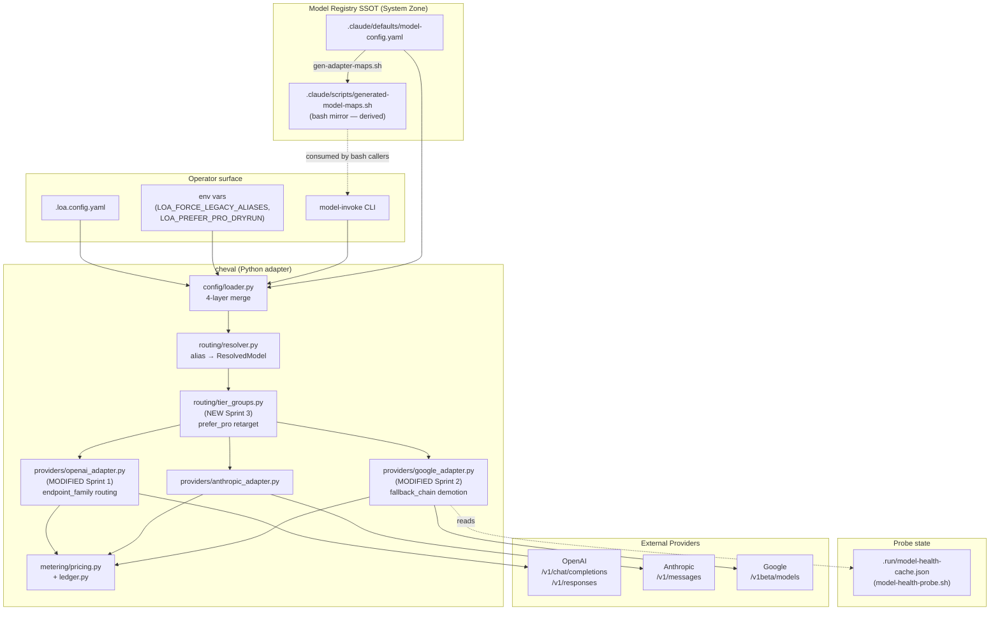
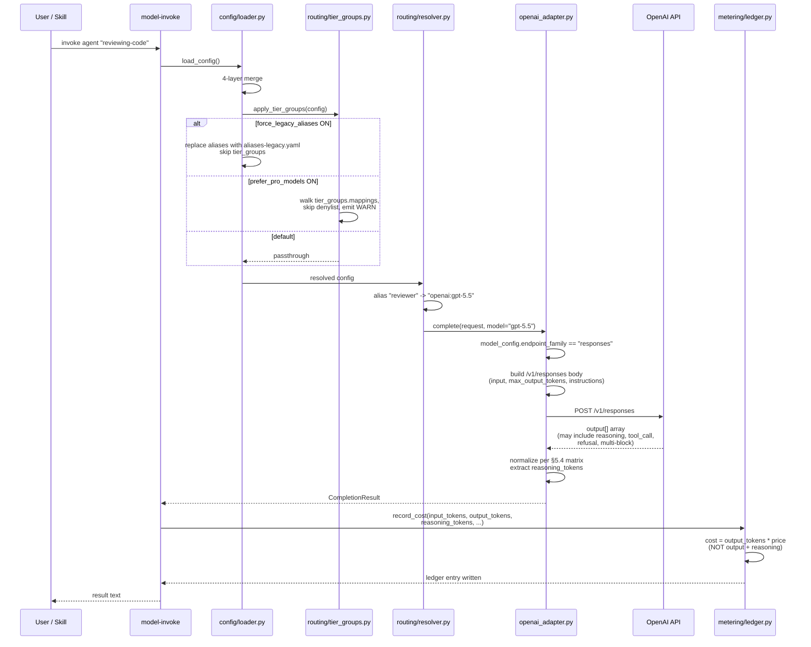

# Software Design Document: Model Currency Cycle (cycle-095)

**Version:** 1.0
**Date:** 2026-04-29
**Author:** Architecture Designer (deep-name + Claude Opus 4.7 1M)
**Status:** Draft (awaiting `/flatline-review` then `/sprint-plan`)
**PRD Reference:** `grimoires/loa/prd.md`
**Pre-flight intel:** `grimoires/loa/context/model-currency-cycle-preflight.md`

---

## Scope note

This is an **infrastructure migration SDD**, not a greenfield-product SDD. The system already exists (Loa framework, cheval Python adapter, model registry SSOT, generated bash maps). Cycle-095 modifies routing behavior, registry schema, and config-load semantics. UI Design (template §4) is N/A — no user-facing UI ships here; the only operator-facing surface is YAML config (`.loa.config.yaml`) and CLI flags on `model-invoke`. Frontend stack table (§2.1) is N/A for the same reason.

The sections that do load-bearing work in this cycle:

| Template § | Reframed for cycle-095 | Status |
|---|---|---|
| §1 Architecture | Cheval routing + registry layout | Full design |
| §2 Software Stack | Cheval Python adapter, yq, bash, pytest | Full design |
| §3 Database | YAML registry schema (model-config.yaml) | **Concrete schema** |
| §4 UI | N/A (config-only operator surface) | Operator surface table |
| §5 API | Provider HTTP endpoints + cheval `complete()` contract | Full design |
| §6 Errors | Exception taxonomy + kill-switch + fallback chain | Full design |
| §7 Testing | pytest fixtures vs live + golden-fixture coverage | Full design |
| §8 Phases | Sprint 1 / 2 / 3 task ordering | Full design |
| §9 Risks | Cross-cuts PRD + lower-level technical risks | Full design |
| §10 Open Questions | Architecture-phase decisions | Full design |

---

## Table of Contents

1. [Project Architecture](#1-project-architecture)
2. [Software Stack](#2-software-stack)
3. [Registry Schema (Database Equivalent)](#3-registry-schema-database-equivalent)
4. [Operator Surface](#4-operator-surface)
5. [API & Adapter Specifications](#5-api--adapter-specifications)
6. [Error Handling & Resilience](#6-error-handling--resilience)
7. [Testing Strategy](#7-testing-strategy)
8. [Development Phases](#8-development-phases)
9. [Known Risks and Mitigation](#9-known-risks-and-mitigation)
10. [Open Questions](#10-open-questions)
11. [Appendix](#11-appendix)

---

## 1. Project Architecture

### 1.1 System Overview

The Loa framework dispatches model calls through **cheval**, a Python provider-abstraction layer at `.claude/adapters/loa_cheval/`. Cheval reads a YAML registry (`.claude/defaults/model-config.yaml`) that catalogues providers, models, aliases, agent bindings, and pricing. A bash mirror (`.claude/scripts/generated-model-maps.sh`) is **derived** from the YAML via `gen-adapter-maps.sh` and serves bash-side callers (legacy `model-adapter.sh`, red-team-model-adapter, flatline-orchestrator). The model registry is the single source of truth (SSOT) for both paths.

cycle-095 introduces five structural changes:

1. **Routing-decision metadata**: `endpoint_family` field on each model entry decides which OpenAI endpoint family is used (`/v1/chat/completions` vs `/v1/responses`).
2. **Response normalization**: Six-shape `/v1/responses` contract collapsed to canonical `CompletionResult` (PRD §3.1).
3. **Tier groups**: A `tier_groups:` schema block declares per-alias `*-pro` retargets, gated by `hounfour.prefer_pro_models`.
4. **Probe-driven fallback**: A `fallback_chain:` field on a model entry triggers automatic demotion when the primary's probe state goes UNAVAILABLE (with hysteresis + cooldown — design lock below).
5. **Alias-level kill-switch**: `LOA_FORCE_LEGACY_ALIASES=1` env var (or `hounfour.experimental.force_legacy_aliases: true`) restores pre-cycle-095 alias resolution at config-load time. **No endpoint-force layer exists** — each restored alias still routes per its own `endpoint_family` (PRD FR-1 acceptance).

### 1.2 Architectural Pattern

**Pattern:** Hexagonal adapter pattern (already in place — cheval is the hexagonal core; provider adapters are outward ports). cycle-095 extends the existing pattern; it does not introduce a new style.

**Justification:** The PRD mandates "Each sprint independently mergeable" (PRD §Constraints) and "no Sprint-N depends on Sprint-(N+M)". A hexagonal adapter architecture allows orthogonal changes — Sprint 1 modifies only the OpenAI port (adapter), Sprint 2 modifies only the registry data, Sprint 3 modifies only the config-load layer. Each is testable in isolation.

### 1.3 Component Diagram


```mermaid
flowchart TD
    subgraph Operator["Operator surface"]
        UC[".loa.config.yaml"]
        ENV["env vars<br/>(LOA_FORCE_LEGACY_ALIASES,<br/>LOA_PREFER_PRO_DRYRUN)"]
        CLI["model-invoke CLI"]
    end

    subgraph SSOT["Model Registry SSOT (System Zone)"]
        YAML[".claude/defaults/model-config.yaml"]
        YAML -->|"gen-adapter-maps.sh"| GMAPS[".claude/scripts/generated-model-maps.sh<br/>(bash mirror — derived)"]
    end

    subgraph Cheval["cheval (Python adapter)"]
        Loader["config/loader.py<br/>4-layer merge"]
        Resolver["routing/resolver.py<br/>alias → ResolvedModel"]
        Tier["routing/tier_groups.py<br/>(NEW Sprint 3)<br/>prefer_pro retarget"]
        OAdapter["providers/openai_adapter.py<br/>(MODIFIED Sprint 1)<br/>endpoint_family routing"]
        AAdapter["providers/anthropic_adapter.py"]
        GAdapter["providers/google_adapter.py<br/>(MODIFIED Sprint 2)<br/>fallback_chain demotion"]
        Pricing["metering/pricing.py<br/>+ ledger.py"]
    end

    subgraph Probe["Probe state"]
        ProbeS[".run/model-health-cache.json<br/>(model-health-probe.sh)"]
    end

    subgraph Providers["External Providers"]
        OAI["OpenAI<br/>/v1/chat/completions<br/>/v1/responses"]
        ANT["Anthropic<br/>/v1/messages"]
        GOO["Google<br/>/v1beta/models"]
    end

    UC --> Loader
    ENV --> Loader
    CLI --> Loader
    YAML --> Loader
    Loader --> Resolver
    Resolver --> Tier
    Tier --> OAdapter
    Tier --> AAdapter
    Tier --> GAdapter
    OAdapter --> OAI
    AAdapter --> ANT
    GAdapter --> GOO
    GAdapter -.reads.-> ProbeS
    OAdapter --> Pricing
    AAdapter --> Pricing
    GAdapter --> Pricing
    GMAPS -.consumed by bash callers.-> CLI
```

### 1.4 System Components

#### 1.4.1 OpenAI Adapter — `providers/openai_adapter.py` (MODIFIED, Sprint 1)

**Purpose:** Translate canonical `CompletionRequest` to either `/v1/chat/completions` or `/v1/responses` body shape; normalize response back to `CompletionResult`.

**Responsibilities:**
- Read `endpoint_family` from `model_config` (NEW field) — never inspect model name regex.
- Build the correct request body per family (see §5.3 transformation table).
- Parse the response per family, handling all six `/v1/responses` shapes (§5.4 normalization matrix).
- Map `output_tokens_details.reasoning_tokens` to `Usage.reasoning_tokens` for cost-ledger transparency (NOT for billing — see §5.5).
- Raise `InvalidConfigError` on missing/unknown `endpoint_family` (no silent default).

**Interfaces:**
- `complete(request: CompletionRequest) -> CompletionResult` (existing public method)
- `_route_decision(model_config: ModelConfig) -> str` (NEW private helper — returns `"chat"` or `"responses"` or raises)
- `_build_responses_body(request, model_config) -> dict` (existing — extended for system prompt as `instructions` + tools passthrough)
- `_parse_responses_response(resp, latency_ms) -> CompletionResult` (REPLACED — full six-shape normalizer)

**Dependencies:**
- `loa_cheval.types.ModelConfig` (extended additively — new optional `endpoint_family` field)
- `loa_cheval.providers.base.http_post` (unchanged)

#### 1.4.2 Google Adapter — `providers/google_adapter.py` (MODIFIED, Sprint 2)

**Purpose:** Existing Google adapter; extended in Sprint 2 with probe-driven `fallback_chain` demotion (PRD FR-4).

**Responsibilities (NEW for cycle-095):**
- Before each request, check probe state from `.run/model-health-cache.json`.
- If primary model's probe state is `UNAVAILABLE` AND has been so for `cooldown_seconds` (hysteresis), substitute the first AVAILABLE entry in `fallback_chain`.
- WARN-once-per-process when demotion fires; INFO-once when probe recovers.

**Interfaces:**
- `_resolve_active_model(request, model_config) -> str` (NEW) — returns the model id to actually call, after fallback consideration.

#### 1.4.3 Tier Groups Module — `routing/tier_groups.py` (NEW, Sprint 3)

**Purpose:** Apply `hounfour.prefer_pro_models` retargeting to the `aliases:` block at config-load time. Implements denylist, dry-run, cost-cap configuration parsing. Cost-cap **enforcement** lives in the metering layer (§1.4.4) — this module only parses and reports.

**Responsibilities:**
- Read `hounfour.prefer_pro_models` (default `false`) and `tier_groups:` block from merged config.
- Walk `tier_groups.mappings:` entries: for each `<base_alias>: <pro_target>`, replace `aliases[base_alias]` with `<pro_target>`.
- Skip aliases listed in `tier_groups.denylist`.
- Emit mandatory WARN log once per process when `prefer_pro_models: true` activates.
- Support dry-run mode (`LOA_PREFER_PRO_DRYRUN=1` or CLI `--dryrun`): print impact, do NOT mutate.
- Enforce override precedence: user `aliases:` override > `tier_groups.denylist` > flag-driven retargeting > base alias.

**Interfaces:**
- `apply_tier_groups(config: dict, *, dry_run: bool = False) -> tuple[dict, list[str]]` — returns `(mutated_config, retarget_log_lines)`.
- `validate_tier_groups(config: dict) -> list[str]` — returns validation error strings.

**Dependencies:** Pure config transformation; no I/O outside reading env var.

#### 1.4.4 Cost-Cap Enforcer — `metering/budget.py` (MODIFIED, Sprint 2)

**Purpose:** Existing per-day budget exists. Add `tier_groups.max_cost_per_session_micro_usd` enforcement (PRD FR-5a).

**Responsibilities (NEW for cycle-095):**
- Track per-session cost-ledger sum (session = process lifetime, indexed by `trace_id`).
- **Two-phase atomic enforcement (SDD Flatline iter-1 SKP-001 CRITICAL 910):**
  - **Pre-call check**: before each `complete()` call, compute `prospective_cost = current_session_total + estimate(request)` where `estimate()` uses `input_tokens × input_per_mtok + max_output_tokens × output_per_mtok` (worst-case — assumes full output_tokens budget consumed). If `prospective_cost > cap`, raise `CostBudgetExceeded` BEFORE the API call. This is the hard guard; cap is never exceeded by more than one call's worst-case.
  - **Post-call reconciliation**: after each `record_cost()`, recompute session total with actual usage. The actual cost is always ≤ `prospective_cost` (max_output_tokens is an upper bound). The post-call check is observability/logging only — it doesn't gate; the pre-call check already did.
  - **Soft-cap nature documented**: `reasoning_tokens` is an unobservable subset of `output_tokens` — the worst-case estimate already accounts for it via `max_output_tokens` ceiling. If operator sets `max_output_tokens` extremely high, the pre-call estimate is conservative; lowering `max_output_tokens` tightens the guard.
- Cap independent of `prefer_pro_models` — usable today.

**Interfaces:**
- `check_session_cap_pre(trace_id: str, ledger_path: str, cap_micro: int, request_estimate_micro: int) -> None` — pre-call: raises `CostBudgetExceeded` if (current_total + estimate) > cap.
- `check_session_cap_post(trace_id: str, ledger_path: str, cap_micro: int) -> None` — post-call: logs WARN if total > cap (sanity check; should not fire if pre-call worked).

**Concurrency note**: A single Python process may have multiple in-flight `complete()` calls from different agent contexts sharing one `trace_id`. The pre-call check uses a `threading.Lock` around the ledger read+estimate; this serializes the cap-check window. Multi-process Loa workflows (e.g., parallel `/run`) get per-process caps unless the operator pins all subprocesses to the same `trace_id` AND uses a shared ledger file (existing behavior; ledger uses `flock` for append safety).

#### 1.4.5 Loader — `config/loader.py` (MODIFIED, Sprint 1 + Sprint 3)

**Purpose:** Existing 4-layer merge (system defaults, project, env, CLI). Add post-merge tier_groups application + experimental kill-switch handling.

**Responsibilities (NEW for cycle-095):**
- After 4-layer merge: if `hounfour.experimental.force_legacy_aliases: true` OR `LOA_FORCE_LEGACY_ALIASES=1`, **replace** the `aliases:` block with the pre-cycle-095 snapshot stored in `.claude/defaults/aliases-legacy.yaml` (a NEW snapshot file shipped Sprint 1). Then short-circuit: skip tier_groups application.
- Otherwise: invoke `apply_tier_groups()` to produce the final config (Sprint 3).
- Validate `endpoint_family` on every `providers.openai.models.*` entry post-merge (Sprint 1 — strict validation).
- Emit one-time WARN when kill-switch is active.

**Migration safety:** The legacy-aliases snapshot is captured as part of Sprint 1 from the **pre-cycle-095** state of `model-config.yaml` aliases section. Sprint 1's PR includes `aliases-legacy.yaml` so the kill-switch is operational from the moment Sprint 2 lands the alias flip.

#### 1.4.6 Generated bash maps — `generated-model-maps.sh` (REGENERATED, Sprint 2)

**Purpose:** Bash mirror of the YAML registry. Existing — regenerated when YAML changes.

**Responsibilities (NEW for cycle-095):**
- `gen-adapter-maps.sh` extended to include `endpoint_family` in a new `MODEL_ENDPOINT_FAMILY` associative array (so bash callers can also know which endpoint a model uses, even though they don't currently call `/v1/responses`).
- Cap: bash callers continue NOT to call `/v1/responses` directly. The `MODEL_ENDPOINT_FAMILY` array is informational for bash-side validation tools only.

#### 1.4.7 model-invoke CLI — `.claude/scripts/model-invoke` (MODIFIED, Sprint 2 + Sprint 3)

**Purpose:** Existing CLI for cheval. Extended with `--validate-bindings --strict-endpoint-family` and `--dryrun` flags.

**Responsibilities (NEW for cycle-095):**
- `--validate-bindings`: existing — extended (Sprint 1) to check that every OpenAI model entry has an explicit `endpoint_family`. Missing or unknown value → validation FAIL.
- `--dryrun` (paired with `--validate-bindings`): print the alias remap preview that `prefer_pro_models: true` WOULD produce (Sprint 2 ships dry-run for FR-5a; Sprint 3 ships full activation).

### 1.5 Data Flow


```mermaid
sequenceDiagram
    participant U as User / Skill
    participant CLI as model-invoke
    participant Load as config/loader.py
    participant TG as routing/tier_groups.py
    participant Res as routing/resolver.py
    participant OA as openai_adapter.py
    participant API as OpenAI API
    participant Led as metering/ledger.py

    U->>CLI: invoke agent "reviewing-code"
    CLI->>Load: load_config()
    Load->>Load: 4-layer merge
    Load->>TG: apply_tier_groups(config)
    alt force_legacy_aliases ON
        Load->>Load: replace aliases with aliases-legacy.yaml<br/>skip tier_groups
    else prefer_pro_models ON
        TG->>TG: walk tier_groups.mappings,<br/>skip denylist, emit WARN
    else default
        TG-->>Load: passthrough
    end
    Load->>Res: resolved config
    Res->>Res: alias "reviewer" -> "openai:gpt-5.5"
    Res->>OA: complete(request, model="gpt-5.5")
    OA->>OA: model_config.endpoint_family == "responses"
    OA->>OA: build /v1/responses body<br/>(input, max_output_tokens, instructions)
    OA->>API: POST /v1/responses
    API-->>OA: output[] array<br/>(may include reasoning, tool_call,<br/>refusal, multi-block)
    OA->>OA: normalize per §5.4 matrix<br/>extract reasoning_tokens
    OA-->>CLI: CompletionResult
    CLI->>Led: record_cost(input_tokens, output_tokens,<br/>reasoning_tokens, ...)
    Led->>Led: cost = output_tokens * price<br/>(NOT output + reasoning)
    Led-->>CLI: ledger entry written
    CLI-->>U: result text
```

### 1.6 External Integrations

| Service | Endpoint | Purpose | Auth | Documentation |
|---------|----------|---------|------|---------------|
| OpenAI | `POST /v1/chat/completions` | Existing — gpt-5.2 (and OpenAI-compat third parties) | `Authorization: Bearer {OPENAI_API_KEY}` | `https://platform.openai.com/docs/api-reference/chat` |
| OpenAI | `POST /v1/responses` | gpt-5.3-codex (existing post-PR #586), gpt-5.5, gpt-5.5-pro (NEW) | Same | `https://platform.openai.com/docs/api-reference/responses` |
| OpenAI | `GET /v1/models` (existing) | Probe-driven AVAILABLE check | Same | (same docs root) |
| Anthropic | `POST /v1/messages` | Haiku 4.5 (NEW), Opus 4.7 / Sonnet 4.6 | `x-api-key: {ANTHROPIC_API_KEY}` + `anthropic-version: 2023-06-01` | `https://docs.anthropic.com/en/api/messages` |
| Google | `POST /v1beta/models/{id}:generateContent` | Gemini 3 fast variant (NEW), 3.1-pro-preview, 2.5-flash | `x-goog-api-key: {GOOGLE_API_KEY}` | `https://ai.google.dev/api/rest/v1beta/models/generateContent` |
| Google | `GET /v1beta/models` | Probe-driven AVAILABLE check | Same | (same docs root) |

> Live probe evidence (2026-04-29T01:15Z, preflight.md:9-25): gpt-5.5 returns 200 OK on `/v1/responses` with `reasoning_tokens: 9` in usage; HTTP 400 on `/v1/chat/completions`.

### 1.7 Deployment Architecture

cycle-095 ships **no new infrastructure**. The change is delivered by:

1. Source code edits in `.claude/adapters/loa_cheval/` (System Zone, authorized by this PRD/SDD pair).
2. YAML edits in `.claude/defaults/model-config.yaml` (System Zone, same authorization).
3. Regeneration of `.claude/scripts/generated-model-maps.sh` via `gen-adapter-maps.sh` as part of Sprint 2 commit.

Distribution: standard Loa upstream PR → merge → `update-loa` pulls into downstream loa-as-submodule projects.

### 1.8 Scalability Strategy

N/A — this cycle does not change throughput characteristics. Per-call latency add ≤5ms (PRD §NFR Performance — routing-decision branch).

### 1.9 Security Architecture

Inherited from existing cheval design. **No new credential surface** (PRD §NFR Security). The kill-switch and `prefer_pro_models` flag introduce no new privileged operations:

- `LOA_FORCE_LEGACY_ALIASES`: env-gated rollback. Equivalent risk profile to existing `LOA_PROBE_LEGACY_BEHAVIOR=1`.
- `tier_groups.max_cost_per_session_micro_usd`: defensive, raises an exception. Cannot leak data or exceed normal API authorization.
- `aliases-legacy.yaml` snapshot file lives in `.claude/defaults/` (System Zone, read-only at runtime).

---

## 2. Software Stack

### 2.1 Frontend Technologies

N/A — this cycle has no UI surface. Operator surface is YAML config + CLI flags (§4).

### 2.2 Backend Technologies

| Category | Technology | Version | Justification |
|----------|------------|---------|---------------|
| Language | Python | 3.10+ (existing) | Cheval is already Python; matches Loa runtime |
| YAML parser | `pyyaml` (preferred) OR `yq` v4+ (fallback) | pyyaml ≥6.0 / yq ≥4.0 | Existing — `loader.py:_load_yaml` already supports both. yq fallback documented at `loader.py:30-50`. |
| HTTP client | `httpx` (preferred) OR `urllib.request` (fallback) | httpx ≥0.24.0 | Existing — `base.py:_detect_http_client` already handles both. |
| Config schema | YAML 1.2 (existing) | n/a | Single source of truth at `.claude/defaults/model-config.yaml` |
| Token estimator | `tiktoken` (optional, existing) | latest | Used for context-window enforcement; falls back to chars/3.5 heuristic |

**Key Libraries (no NEW additions for cycle-095):**
- `loa_cheval.providers.base.http_post`: existing HTTP wrapper (httpx OR urllib)
- `loa_cheval.types`: dataclasses for `ModelConfig`, `CompletionRequest`, `CompletionResult`, `Usage` (existing — extended additively, see §5.6)
- `loa_cheval.metering.pricing`: integer-only cost arithmetic (existing — micro-USD per million tokens)

### 2.3 Infrastructure & DevOps

| Category | Technology | Purpose |
|----------|------------|---------|
| CI runner | GitHub Actions | Existing — runs pytest + bats on every PR |
| Test runner | pytest 7+ (Python) | Existing — provider adapter tests |
| Test runner | bats 1.10+ (bash) | Existing — `flatline-model-validation.bats`, `model-registry-sync.bats`, `model-health-probe*.bats` |
| YAML linter | yq v4+ + jq | Existing — used by `gen-adapter-maps.sh` |
| Probe runner | `model-health-probe.sh` | Existing — gates registry currency |

---

## 3. Registry Schema (Database Equivalent)

> The Loa "database" is the YAML model registry (`.claude/defaults/model-config.yaml`) plus the JSONL cost-ledger (`grimoires/loa/a2a/cost-ledger.jsonl`) and the JSON probe cache (`.run/model-health-cache.json`). cycle-095 changes the YAML registry shape; ledger and cache schemas are unchanged.

### 3.1 Schema Technology

**Primary registry:** YAML 1.2 (System Zone, source of truth)
**Generated bash mirror:** Bash associative arrays in `generated-model-maps.sh` (derived; never edited by hand)
**Cost ledger:** JSONL append-only, fcntl-protected (existing — `metering/ledger.py`)
**Probe cache:** JSON, atomic write (existing — `model-health-probe.sh`)

**Justification:** YAML is the existing convention; bash mirror exists for legacy bash adapters. cycle-095 preserves both — the changes are additive (new fields, new keys), not breaking.

### 3.2 Registry Schema (cycle-095 additions)

#### Provider model entry — extended

```yaml
providers:
  openai:
    type: openai
    endpoint: "https://api.openai.com/v1"
    auth: "{env:OPENAI_API_KEY}"
    models:
      gpt-5.5:                                    # NEW — promoted from probe_required
        capabilities: [chat, tools, function_calling, code]
        context_window: 400000
        token_param: max_completion_tokens        # legacy field; ignored when endpoint_family=responses
        endpoint_family: responses                # NEW — REQUIRED for openai entries (§3.4)
        # (probe_required: true — REMOVED in Sprint 2)
        pricing:
          input_per_mtok: 5000000                 # micro-USD/M tokens — $5.00
          output_per_mtok: 30000000               # $30.00
          # cached_input_per_mtok: 500000         # OUT OF SCOPE — preflight assumption #3
      gpt-5.5-pro:                                # NEW — promoted from probe_required
        capabilities: [chat, tools, function_calling, code]
        context_window: 400000
        token_param: max_completion_tokens
        endpoint_family: responses                # NEW
        pricing:
          input_per_mtok: 30000000                # $30.00
          output_per_mtok: 180000000              # $180.00 (includes reasoning_tokens — see §5.5)
      gpt-5.3-codex:
        # MIGRATED Sprint 1: explicit endpoint_family added
        endpoint_family: responses                # NEW — codex already routes here pre-cycle-095
        # ... existing fields unchanged
      gpt-5.2:
        # MIGRATED Sprint 1: explicit endpoint_family added
        endpoint_family: chat                     # NEW
        # ... existing fields unchanged
  anthropic:
    models:
      claude-haiku-4-5-20251001:                  # NEW Sprint 2
        capabilities: [chat, tools, function_calling]
        context_window: 200000
        token_param: max_tokens
        # No endpoint_family — only required for openai (see §3.4 validation rule)
        pricing:
          # FROZEN at Sprint 2 commit time (PRD FR-3 AC: "live-fetch ONCE, freeze")
          input_per_mtok: TBD                     # Sprint 2 task: live-fetch + commit
          output_per_mtok: TBD
      # ... existing entries unchanged
  google:
    models:
      gemini-3-flash-preview:                     # NEW Sprint 2 (or 3.1-flash-lite-preview — see §10)
        capabilities: [chat]
        context_window: 1048576
        fallback_chain: ["google:gemini-2.5-flash"]   # NEW (§3.5)
        pricing:
          input_per_mtok: TBD                     # Sprint 2 task: live-fetch + commit
          output_per_mtok: TBD
      # ... existing entries unchanged
```

#### Aliases — extended

```yaml
aliases:
  reviewer: "openai:gpt-5.5"            # FLIPPED Sprint 2 (was gpt-5.3-codex)
  reasoning: "openai:gpt-5.5"           # FLIPPED Sprint 2 (was gpt-5.3-codex)
                                        # NOT gpt-5.5-pro — pro is opt-in via prefer_pro_models
  tiny: "anthropic:claude-haiku-4-5-20251001"   # NEW Sprint 2 (PRD §10 may rename)
  gemini-3-flash: "google:gemini-3-flash-preview"   # NEW Sprint 2
  # ... existing entries unchanged
```

#### Backward-compat aliases — extended

```yaml
backward_compat_aliases:
  # NEW Sprint 2: immutable self-map (Flatline cluster 1 / SKP-001 CRITICAL)
  "gpt-5.3-codex": "openai:gpt-5.3-codex"   # NOT a retarget to 5.5 — literal old model
  # Existing entries unchanged
```

#### Tier groups — NEW (top-level block)

Sprint 2 lands the block structurally empty (PRD FR-5a); Sprint 3 populates `mappings:` and the flag activates.

```yaml
tier_groups:
  mappings:
    reviewer: gpt-5.5-pro
    reasoning: gpt-5.5-pro
    # Future tiered aliases declared here additively
  denylist: []                          # operator opt-out — alias names
  max_cost_per_session_micro_usd: null  # null = no enforcement
```

> Schema design rationale (architecture decision): use a **per-alias `mappings:` block** rather than a tier-name → list shape (e.g., `tiers: { pro: [reviewer, reasoning] }`). Per-alias is more explicit at config-read time, makes denylist-vs-mapping precedence trivial (skip if alias in denylist), and keeps validation simple (each mapping value is just an alias-target string, like `aliases:`). Future tiers (e.g., `prefer_nano_models`) can be a sibling block, not a tier-axis on the same block. (PRD assumption #1 RESOLVED.)

#### Hounfour user config — extended

```yaml
# .loa.config.yaml under hounfour:
hounfour:
  prefer_pro_models: false              # NEW Sprint 3 — default false (HARD constraint)
  experimental:
    force_legacy_aliases: false         # NEW Sprint 1 — kill-switch; default false
```

### 3.3 Schema Versioning & Migration

**Migration policy:** Additive-only. cycle-095 adds 2 new model fields (`endpoint_family`, `fallback_chain`) and 2 new top-level blocks (`tier_groups`, `hounfour.experimental`). All defaults preserve current behavior.

**Schema version field:** Not currently in `model-config.yaml` (gap). cycle-095 does NOT introduce one — out of scope. If a future cycle adds breaking schema changes, that cycle introduces `schema_version: 2`.

**Backward compat guarantee:** Operators with existing `.loa.config.yaml`:
- Without `endpoint_family` declared on their custom `providers.openai.models.*` entries → validation FAILS (loud, not silent). Operator must add the field. **Sprint 1 migration provides the System Zone defaults**; operator configs that DEFINE their own openai models must add it.
- Without `tier_groups`, `prefer_pro_models`, or `experimental.force_legacy_aliases`: no behavior change.
- With existing `claude-opus-4.5 → claude-opus-4-7` retargets: unchanged (Flatline iter-3/4 confirmed historical retargets stay).

**Drift detection:** `gen-adapter-maps.sh --check` exits 3 if YAML and bash mirror disagree (existing). cycle-095 extends drift detection to the new `MODEL_ENDPOINT_FAMILY` array.

### 3.4 Endpoint family field — strict validation with operator-migration backstop

| Provider | `endpoint_family` required? | Allowed values | Default |
|----------|----------------------------|----------------|---------|
| `openai` | **YES** (loud failure on missing) | `chat` \| `responses` | none — must declare |
| `anthropic` | NO (no equivalent endpoint split) | n/a | n/a |
| `google` | NO | n/a | n/a |

Validation enforcement points:
- **Config-load time** (`config/loader.py` post-merge step): walk `providers.openai.models`, raise `ConfigError("Missing endpoint_family on openai model X")` if absent or not in `{chat, responses}`.
- **CLI validation** (`model-invoke --validate-bindings`): same check, exits non-zero with actionable error.
- **Runtime** (`openai_adapter.complete()`): defense-in-depth — if a request reaches the adapter without `endpoint_family`, raises `InvalidConfigError`. Should never happen in practice because validation rejects it earlier; this is the belt-and-suspenders layer.

**Migration ordering invariant (Flatline PRD-iter-3 IMP-003):** Sprint 1 commit MUST add `endpoint_family: chat` to every existing OpenAI registry entry in `.claude/defaults/model-config.yaml` **in the same commit** that activates strict validation. Splitting the migration across commits would leave a window where strict validation rejects a config that was just-merged-without-the-field.

**Operator-migration backstop (SDD Flatline iter-1 SKP-004 HIGH 745):** Operators with custom OpenAI model entries in their own `.loa.config.yaml` overrides will hit `ConfigError` immediately on first run after the upgrade lands — they haven't migrated their custom entries yet. To prevent immediate post-upgrade outage:

- **One-shot backward-compat env var**: `LOA_LEGACY_ENDPOINT_FAMILY_DEFAULT=chat`. When set, validator treats missing `endpoint_family` on any OpenAI model entry as `chat` AND emits a WARN identifying each affected entry: `"WARN: <provider>:<model_id> missing endpoint_family — defaulting to 'chat' under LOA_LEGACY_ENDPOINT_FAMILY_DEFAULT. Migrate by adding 'endpoint_family: chat' to your config; this fallback will be removed in cycle-100+."`. Loa's own SSOT (`.claude/defaults/model-config.yaml`) is migrated in Sprint 1, so the env var only affects user-overrides.
- **CHANGELOG migration note**: explicit step-by-step for operators with custom OpenAI model entries.
- **`model-invoke --validate-bindings --suggest-migrations`**: prints a yq diff that would migrate a user's custom entries — copy/paste into their config.
- The env-var backstop has no expiration mechanism today (operator removes when their migration is done); SDD §13 future-work notes a soft sunset target of cycle-100.

### 3.5 Fallback chain field

```yaml
google:
  models:
    gemini-3-flash-preview:
      fallback_chain: ["google:gemini-2.5-flash"]
```

**Schema rules:**
- Optional; absence = no fallback (existing behavior — fail-fast on UNAVAILABLE).
- Each entry is a `provider:model_id` string (validated at config-load).
- Multiple entries allowed; adapter walks the chain in declared order, returning the first AVAILABLE.
- Self-reference forbidden (e.g., `gemini-3-flash-preview` cannot list itself); validation rejects.
- Cycles forbidden (entry A lists B which lists A); validation rejects via DFS.

**Behavioral spec (PRD FR-4 AC + Flatline iter-6 architecture-scope concern):**

| Concern | Decision | Rationale |
|---|---|---|
| When does adapter consult the chain? | At **request-time** (each `complete()` call), not probe-time. | Probe state is read from the cache; cache is updated by `model-health-probe.sh` on its own cadence. Request-time check is O(1) cache read. |
| How is hysteresis modeled? | `fallback.cooldown_seconds` config field (default 300s). When primary's probe transitions UNAVAILABLE→AVAILABLE, adapter waits cooldown_seconds before promoting back. | Avoids flapping when a provider's `/v1/models` is intermittent. |
| Where is hysteresis state? | **Two-tier (SDD Flatline iter-1 SKP-005 HIGH 715):** in-process `dict[model_id, last_unavailable_ts]` by default; optional persistence to `.run/fallback-state.json` when `fallback.persist_state: true` config is set. Persistence uses `flock` for multi-process safety. | Default in-process matches MVP simplicity for single-process Loa workflows. Optional persistence enables consistent behavior across parallel cycles, CI workers, or `/run` orchestration with multiple subprocesses. Operator opt-in keeps the file-system surface small for users who don't need it. |
| Multi-process consistency | When `fallback.persist_state: true`: adapter reads state on init, writes on each demotion/promotion under `flock`. Stale entries (older than `cooldown_seconds * 2`) are pruned on read. When `false` (default): each process has independent state — documented expectation for operators running parallel cycles. | Explicit choice, no silent multi-process surprises. |
| Probe cache trust boundary | The probe cache (`.run/model-health-cache.json`) is read at request-time. Adapter validates: (a) file owner matches process UID, (b) file mode is 0600 or stricter. On mismatch, treat cache as missing (probe state = UNKNOWN, behavior reverts to no-fallback) and emit ERROR log. (SDD Flatline iter-1 SKP-003 HIGH 770) | Defense against an attacker writing the cache file to manipulate routing. Mode/ownership check matches existing precedent (`stash-safety.sh`, `interpolation.py:_check_file_allowed`). |
| What if all entries in chain are UNAVAILABLE? | Raise `ProviderUnavailableError(provider="google", reason="all fallback chain UNAVAILABLE: <list>")`. Existing fail-fast semantics preserved. | PRD §NFR Reliability hard constraint. |
| Logging | WARN once per process per (primary, fallback) demotion event. INFO once per recovery event. Both written via existing `logger.warning` / `logger.info`. ERROR if cache trust check fails. | PRD FR-4 AC explicit. |
| Test coverage | New pytest in `test_providers.py::TestFallbackChain`: simulate cache transitions; assert correct routing + log emission. Probe state mocked via patched `_read_probe_cache()` helper. New pytest `TestProbeCacheTrustBoundary`: write cache with wrong owner/mode, assert adapter falls through to UNKNOWN behavior. New pytest `TestFallbackPersistState`: enable persistence, simulate demotion in process A, restart adapter, assert state read back correctly. | §7.4 test architecture. |

### 3.6 Tier groups field

See §3.2 schema block above. Validation rules:

- `mappings.<base>: <pro_target>`: `<base>` must be a valid alias name; `<pro_target>` must be a known alias OR `provider:model_id` string. Invalid → `ConfigError`.
- `denylist`: list of alias names. Each must be a known alias. Unknown → WARN (not error — operator may have removed an alias and forgotten to clean denylist; non-fatal).
- `denylist` entries that have no corresponding `mappings:` entry → WARN (denylist is no-op for them).
- `max_cost_per_session_micro_usd`: integer ≥ 0 OR null. Other types → `ConfigError`.

### 3.7 Indexing and access patterns

| Query / Operation | Frequency | Mechanism |
|---|---|---|
| Resolve alias → provider:model_id | Every adapter call | In-memory dict lookup on cached merged config |
| Look up model_config (incl. endpoint_family) | Every adapter call | In-memory dict on cached config |
| Walk `tier_groups.mappings` | Once per process (config-load) | Linear scan; ≤20 entries expected |
| Probe cache read | Every Google adapter call (Sprint 2+) | JSON file read via `_read_probe_cache()` helper, 5s TTL in-process cache |
| Validate `endpoint_family` on all OpenAI models | Once per config-load | Linear scan over `providers.openai.models.*` |

### 3.8 Backup & Recovery

YAML is git-tracked. Recovery is `git checkout`. The kill-switch (§1.4.5) provides ~60-second runtime rollback without git revert. (PRD §Rollback Playbook.)

---

## 4. Operator Surface

### 4.1 No UI; CLI + YAML only

| Surface | Where | Sprint that lands it |
|---|---|---|
| `endpoint_family` field on registry entries | `.claude/defaults/model-config.yaml` (System) + `.loa.config.yaml` (project, optional) | Sprint 1 (defaults) |
| `aliases-legacy.yaml` snapshot | `.claude/defaults/aliases-legacy.yaml` (System) | Sprint 1 |
| `LOA_FORCE_LEGACY_ALIASES=1` env | shell environment | Sprint 1 (operational from PR merge) |
| `hounfour.experimental.force_legacy_aliases: true` | `.loa.config.yaml` | Sprint 1 |
| `reviewer: openai:gpt-5.5` (default flip) | `.claude/defaults/model-config.yaml` | Sprint 2 |
| `tiny` alias | `.claude/defaults/model-config.yaml` | Sprint 2 |
| `gemini-3-flash` alias | `.claude/defaults/model-config.yaml` | Sprint 2 |
| `tier_groups:` block (empty/structural) | `.claude/defaults/model-config.yaml` | Sprint 2 |
| `tier_groups.denylist:` validation | cheval `tier_groups.py` | Sprint 2 (FR-5a) |
| `tier_groups.max_cost_per_session_micro_usd:` | cheval `metering/budget.py` | Sprint 2 (FR-5a) |
| `LOA_PREFER_PRO_DRYRUN=1` env (preview) | `model-invoke --validate-bindings` | Sprint 2 (FR-5a) |
| `hounfour.prefer_pro_models: true` activation | cheval `tier_groups.py` (mapping walk) | Sprint 3 |
| `tier_groups.mappings:` populated | `.claude/defaults/model-config.yaml` | Sprint 3 |

### 4.2 CLI flags added or extended

| Flag | Behavior | Sprint |
|---|---|---|
| `model-invoke --validate-bindings` (existing) | Now also rejects missing/unknown `endpoint_family` on OpenAI entries | Sprint 1 |
| `model-invoke --validate-bindings --dryrun` | Print preview of `prefer_pro_models: true` impact (denylist applied) | Sprint 2 |
| `model-invoke --print-effective-config` (existing) | Now also shows `endpoint_family` and `tier_groups` annotations | Sprint 2 |

### 4.3 Documentation samples (operator-facing)

`.loa.config.yaml.example` updates:

```yaml
hounfour:
  # Pro-tier opt-in: retargets aliases declared in tier_groups.mappings to
  # their *-pro counterparts. Default false (cost-safety).
  # WARNING: enables ~5-10x cost increase on reasoning_tokens-charged calls.
  prefer_pro_models: false

  # Operational kill-switch (incident rollback to pre-cycle-095 alias resolution)
  experimental:
    force_legacy_aliases: false   # set true OR export LOA_FORCE_LEGACY_ALIASES=1

# tier_groups lives at top of merged config (not nested under hounfour)
tier_groups:
  mappings:
    reviewer: gpt-5.5-pro       # opt-in target when prefer_pro_models: true
    reasoning: gpt-5.5-pro
  denylist: []                  # alias names to opt out of retargeting
  max_cost_per_session_micro_usd: null  # set to integer (e.g., 100000000 = $100) for per-session cap
```

---

## 5. API & Adapter Specifications

### 5.1 cheval public contract

The `complete()` method on each `ProviderAdapter` subclass is the public contract. Signature unchanged for cycle-095:

```python
def complete(self, request: CompletionRequest) -> CompletionResult: ...
```

`CompletionRequest` and `CompletionResult` (`types.py`) extend additively per §5.6.

### 5.2 OpenAI adapter routing decision

Replaces the `_is_codex_model` regex check at `openai_adapter.py:32-34` with an explicit metadata read.

```python
# .claude/adapters/loa_cheval/providers/openai_adapter.py (Sprint 1)

def _route_decision(self, model_config: ModelConfig, model_id: str) -> str:
    """Return 'chat' or 'responses'. Raises InvalidConfigError on missing/unknown."""
    family = getattr(model_config, "endpoint_family", None)
    if family is None:
        raise InvalidConfigError(
            f"Model '{model_id}' lacks required 'endpoint_family' field. "
            f"Add 'endpoint_family: chat' or 'endpoint_family: responses' to "
            f".claude/defaults/model-config.yaml. (Sprint 1 migration step.)"
        )
    if family not in ("chat", "responses"):
        raise InvalidConfigError(
            f"Unknown endpoint_family '{family}' for model '{model_id}'. "
            f"Allowed: chat, responses."
        )
    return family
```

> Implementation note: Sprint 1 task extends `ModelConfig` dataclass to include `endpoint_family: Optional[str] = None` AND extends `ProviderConfig.models` construction in `loader.py` to populate it. This keeps the contract clean — the adapter reads a typed dataclass field, not a raw dict.

### 5.3 Body transformation table

| Field | `/v1/chat/completions` (existing) | `/v1/responses` (extended for non-codex) |
|---|---|---|
| User content | `messages: [{role, content}]` | `input: <string OR list of typed message blocks>` |
| Token cap | `max_completion_tokens: N` (per `model_config.token_param`) | `max_output_tokens: N` |
| System prompt | First `messages[]` entry with `role: system` | `instructions: <string>` (top-level) |
| Tools | `tools: [{type:"function", function:{name,description,parameters}}]` | `tools: [...]` (same shape) |
| Tool choice | `tool_choice: "auto"\|"required"\|"none"\|{...}` | `tool_choice: "auto"\|"required"\|"none"\|{...}` (same) |
| Temperature | `temperature: float` | `temperature: float` (preserved) |
| Tool result threading | `messages: [..., {role:"tool", tool_call_id, content}]` | `input: [..., {type:"function_call_output", call_id, output}]` (typed-block list form) |

**Implementation function** (Sprint 1, replaces existing `_build_responses_body` at `openai_adapter.py:108-126`):

```python
def _build_responses_body(self, request: CompletionRequest, model_config: ModelConfig) -> Dict[str, Any]:
    """Build /v1/responses body. Handles system->instructions, multi-message->input,
    tool_call_id->call_id, max_tokens->max_output_tokens."""

    instructions: Optional[str] = None
    input_blocks: List[Dict[str, Any]] = []
    has_tool_results = any(m.get("role") == "tool" for m in request.messages)

    for msg in request.messages:
        role = msg.get("role", "")
        content = msg.get("content", "")
        if role == "system":
            instructions = (instructions + "\n\n" + content) if instructions else content
        elif role == "tool":
            input_blocks.append({
                "type": "function_call_output",
                "call_id": msg.get("tool_call_id", ""),
                "output": content if isinstance(content, str) else json.dumps(content),
            })
        else:
            # user / assistant
            input_blocks.append({
                "type": "message",
                "role": role,
                "content": content if isinstance(content, str) else self._render_blocks(content),
            })

    body: Dict[str, Any] = {"model": request.model}

    # Optimization: if conversation is single-user-message and no tool results,
    # use the simple string form (matches probe evidence shape).
    if (len(input_blocks) == 1 and not has_tool_results
            and input_blocks[0]["type"] == "message"
            and isinstance(input_blocks[0]["content"], str)):
        body["input"] = input_blocks[0]["content"]
    else:
        body["input"] = input_blocks

    if instructions:
        body["instructions"] = instructions

    body["max_output_tokens"] = request.max_tokens

    if request.temperature is not None and (model_config.params or {}).get("temperature_supported", True):
        body["temperature"] = request.temperature

    if request.tools:
        body["tools"] = request.tools  # Same shape as chat — no transformation
    if request.tool_choice:
        body["tool_choice"] = request.tool_choice

    return body
```

### 5.4 Response Contract Matrix (locked from PRD §3.1) — concrete normalization

The `/v1/responses` endpoint returns six observable shapes. The adapter normalizes losslessly to existing `CompletionResult`:

```python
def _parse_responses_response(self, resp: Dict[str, Any], latency_ms: int) -> CompletionResult:
    """Six-shape response normalization (PRD §3.1 + cycle-095 SDD §5.4)."""
    output = resp.get("output", [])
    incomplete = resp.get("incomplete_details") or {}
    incomplete_reason = incomplete.get("reason") if isinstance(incomplete, dict) else None

    text_parts: List[str] = []
    thinking_parts: List[str] = []
    tool_calls: List[Dict[str, Any]] = []
    refusal_text: Optional[str] = None
    metadata: Dict[str, Any] = {}

    for item in output:
        item_type = item.get("type", "")

        if item_type == "message":
            # Shape 1: multi-block text
            for part in item.get("content", []):
                ptype = part.get("type", "")
                if ptype == "output_text":
                    text_parts.append(part.get("text", ""))
                elif ptype == "refusal":
                    # Shape 4: refusal embedded in message
                    refusal_text = part.get("refusal", "")

        elif item_type in ("tool_call", "function_call"):
            # Shape 2: tool-use (canonical normalization)
            tool_calls.append({
                "id": item.get("id") or item.get("call_id", ""),
                "type": "function",
                "function": {
                    "name": item.get("name", ""),
                    "arguments": item.get("arguments", "{}"),
                },
            })

        elif item_type == "reasoning":
            # Shape 3: visible reasoning summary (distinct from invisible
            # reasoning_tokens count tracked in usage)
            for sblock in item.get("summary", []):
                if isinstance(sblock, dict) and "text" in sblock:
                    thinking_parts.append(sblock["text"])

        elif item_type == "refusal":
            # Shape 4 (top-level variant)
            refusal_text = item.get("refusal", "")

        else:
            # Forward-compat: unknown shape — policy-driven (SDD Flatline iter-1 SKP-002 HIGH 865)
            unknown_policy = self._unknown_shape_policy()  # reads hounfour.experimental.responses_unknown_shape_policy
            if unknown_policy == "degrade":
                # Graceful: log WARN, capture metadata, continue extracting from known siblings
                logger.warning(
                    "OpenAI /v1/responses returned unknown output[].type='%s' (degrading per policy)",
                    item_type,
                )
                metadata.setdefault("unknown_shapes", []).append(item_type)
                metadata["unknown_shapes_present"] = True
                continue  # skip this block; surrounding output[] items still flow normally
            else:
                # strict (default per PRD): raise — fail loud
                raise UnsupportedResponseShapeError(
                    f"Unknown /v1/responses output[].type: '{item_type}'. "
                    f"Adapter does not support this shape; file a Loa bug. "
                    f"For one-shot graceful degradation, set "
                    f"hounfour.experimental.responses_unknown_shape_policy: degrade."
                )

    # Shape 4 handling — refusal sets content + metadata flag, does NOT raise
    if refusal_text is not None:
        content = refusal_text
        metadata["refused"] = True
    else:
        content = "\n\n".join(text_parts)

    # Shape 5 — empty output (warn but don't raise)
    if not content and not tool_calls:
        logger.warning("OpenAI /v1/responses returned empty output (model=%s)", resp.get("model"))

    # Shape 6 — partial / truncated
    if incomplete_reason:
        metadata["truncated"] = True
        metadata["truncation_reason"] = incomplete_reason

    # Token accounting (PRD §3.1 token-accounting rules)
    usage_data = resp.get("usage", {})
    output_tokens = usage_data.get("output_tokens", 0)
    reasoning_tokens = usage_data.get("output_tokens_details", {}).get("reasoning_tokens", 0)

    # NOTE: output_tokens is INCLUSIVE total (visible + reasoning). Do NOT sum.
    usage = Usage(
        input_tokens=usage_data.get("input_tokens", 0),
        output_tokens=output_tokens,
        reasoning_tokens=reasoning_tokens,
        source="actual" if usage_data else "estimated",
    )

    # Sanity check: visible-text-token estimate vs reported output_tokens.
    # If divergence > 5%, log WARN (PRD §3.1 edge-case spec).
    visible_estimate = self._estimate_visible_tokens(content, tool_calls, thinking_parts)
    if output_tokens > 0:
        denom = max(output_tokens, 1)
        divergence = abs(visible_estimate - (output_tokens - reasoning_tokens)) / denom
        if divergence > 0.05:
            logger.warning(
                "Token accounting divergence: visible≈%d, reported=%d (reasoning=%d) for model=%s",
                visible_estimate, output_tokens, reasoning_tokens, resp.get("model"),
            )

    return CompletionResult(
        content=content,
        tool_calls=tool_calls if tool_calls else None,
        thinking="\n".join(thinking_parts) if thinking_parts else None,
        usage=usage,
        model=resp.get("model", "unknown"),
        latency_ms=latency_ms,
        provider=self.provider,
        metadata=metadata,  # NEW field — see §5.6
    )
```

### 5.4.1 Unknown-shape degradation policy (SDD Flatline iter-1 SKP-002 HIGH 865)

**Default policy: `strict`** (per PRD Out-of-Scope decision — `UnsupportedResponseShapeError`). Operators who need a one-shot escape hatch (e.g., OpenAI ships a new shape type before Loa is updated) can set:

```yaml
hounfour:
  experimental:
    responses_unknown_shape_policy: degrade   # strict (default) | degrade
```

In `degrade` mode:
- Adapter logs WARN once per unique unknown type per process
- The unknown block is **skipped** (not interpreted)
- Sibling blocks in the same `output[]` array still process normally
- Final `CompletionResult.metadata.unknown_shapes_present = true` and `metadata.unknown_shapes = [<list of skipped types>]`
- Token accounting still works (uses provider-reported `usage`)
- Caller can inspect `metadata["unknown_shapes_present"]` to detect that they got a partial result

This is `experimental.*` namespace — not stable API. Default stays `strict` because silent partial results carry their own correctness risk; the namespace signals "use only when the alternative is an outage".

### 5.5 Cost-ledger billing semantics (PRD-locked)

| Signal | Meaning | Used in cost calc? |
|---|---|---|
| `usage.input_tokens` | Visible input tokens | YES — `input_tokens × input_per_mtok / 1M` |
| `usage.output_tokens` | INCLUSIVE total output (visible + reasoning) | YES — `output_tokens × output_per_mtok / 1M` |
| `usage.output_tokens_details.reasoning_tokens` | Invisible reasoning subset of `output_tokens` | NO (observability only — surfaced as `tokens_reasoning` ledger field) |

**Why NOT add reasoning_tokens to output_tokens for billing:** OpenAI's `/v1/responses` documentation states `output_tokens` is the inclusive total. Adding `reasoning_tokens` would double-charge. The Sprint 1 fixture (gpt-5.5-pro) validates this with a known-cost round-trip: `expected_cost = output_tokens * output_per_mtok / 1M`, NOT `(output_tokens + reasoning_tokens) * output_per_mtok / 1M`.

**Ledger entry shape (existing, no schema change):**

```jsonl
{"ts":"2026-04-29T...","trace_id":"...","provider":"openai","model":"gpt-5.5-pro","tokens_in":150,"tokens_out":2400,"tokens_reasoning":1800,"cost_micro_usd":432000000,"pricing_source":"config","pricing_mode":"token","phase_id":"...","sprint_id":"..."}
```

Where `cost_micro_usd = floor(2400 * 180_000_000 / 1_000_000) = 432_000_000`. Matches `output_tokens × output_per_mtok / 1M`.

### 5.6 Type extensions (additive to `types.py`)

```python
# .claude/adapters/loa_cheval/types.py

@dataclass
class ModelConfig:
    # ... existing fields preserved (capabilities, context_window, token_param, pricing,
    #     api_mode, extra, params) ...
    endpoint_family: Optional[str] = None   # NEW Sprint 1 — "chat" | "responses" | None (non-OpenAI)
    fallback_chain: Optional[List[str]] = None  # NEW Sprint 2 — list of "provider:model_id"
    probe_required: bool = False            # NEW (existed in YAML, formalized as dataclass field)

@dataclass
class CompletionResult:
    # ... existing fields preserved (content, tool_calls, thinking, usage, model,
    #     latency_ms, provider, interaction_id) ...
    metadata: Dict[str, Any] = field(default_factory=dict)  # NEW Sprint 1 — refused/truncated/etc.

@dataclass
class Usage:
    # ... existing fields preserved (input_tokens, output_tokens, reasoning_tokens, source) ...
    pass  # No additions; reasoning_tokens already exists at types.py:45

class InvalidConfigError(ChevalError):
    """Registry / config-shape error caught at adapter request-time."""
    def __init__(self, message: str):
        super().__init__("INVALID_CONFIG", message, retryable=False)

class UnsupportedResponseShapeError(ChevalError):
    """Adapter encountered a response shape not in §5.4 normalization matrix."""
    def __init__(self, message: str):
        super().__init__("UNSUPPORTED_RESPONSE_SHAPE", message, retryable=False)

# Forward-compat alias for PRD wording (FR-5/FR-5a)
CostBudgetExceeded = BudgetExceededError  # existing exception class, aliased
```

### 5.7 Anthropic adapter — minimal changes

Anthropic adapter requires **no routing changes** (Haiku 4.5 uses `/v1/messages` like Opus 4.7 — confirmed by preflight probe). Sprint 2 changes are limited to:

- New registry entry `claude-haiku-4-5-20251001` (YAML).
- New alias `tiny` (YAML).
- Pricing freeze step (Sprint 2 task: live-fetch Haiku 4.5 pricing once, write to YAML, commit).

### 5.8 Google adapter — fallback-chain extension

```python
# .claude/adapters/loa_cheval/providers/google_adapter.py (Sprint 2 addition)

def _resolve_active_model(self, request: CompletionRequest) -> str:
    """Return model_id to actually call, after fallback consideration."""
    primary = request.model
    primary_config = self._get_model_config(primary)
    chain = getattr(primary_config, "fallback_chain", None) or []

    if not chain:
        return primary  # No chain — caller's responsibility (existing behavior)

    if self._is_available(self.provider, primary):
        # Possible recovery promotion (hysteresis)
        if primary in self._demoted_state:
            unavailable_since = self._demoted_state[primary]
            if (time.time() - unavailable_since) >= self._cooldown_seconds:
                logger.info("Probe recovered for %s; promoting back from fallback", primary)
                del self._demoted_state[primary]
                return primary
            # Still in cooldown — stay demoted on the most-recently-chosen fallback
            return self._last_fallback_used.get(primary, primary)
        return primary

    # Primary UNAVAILABLE — record + walk chain
    self._demoted_state[primary] = self._demoted_state.get(primary, time.time())
    for entry in chain:
        if ":" in entry:
            _, candidate = entry.split(":", 1)
        else:
            candidate = entry
        if self._is_available(self.provider, candidate):
            self._warn_once_demotion(primary, candidate)
            self._last_fallback_used[primary] = candidate
            return candidate

    raise ProviderUnavailableError(
        self.provider,
        f"all fallback chain UNAVAILABLE: primary={primary}, chain={chain}",
    )
```

### 5.9 Tier-groups application

```python
# .claude/adapters/loa_cheval/routing/tier_groups.py (NEW Sprint 3)

def apply_tier_groups(config: Dict[str, Any], *, dry_run: bool = False) -> Tuple[Dict[str, Any], List[str]]:
    """Apply prefer_pro_models retargeting. Returns (new_config, retarget_log)."""
    flag_on = config.get("hounfour", {}).get("prefer_pro_models", False)
    if not flag_on:
        return config, []

    tg = config.get("tier_groups", {}) or {}
    mappings = tg.get("mappings", {}) or {}
    denylist = set(tg.get("denylist", []) or [])

    aliases = config.get("aliases", {}).copy()
    log_lines: List[str] = []
    retargeted_count = 0

    # Precedence model (revised SDD Flatline iter-2 SKP-005 HIGH 710):
    # User explicit overrides WIN over tier_groups by default. If a user pins
    # `aliases.reviewer: openai:gpt-5.4` in their .loa.config.yaml, that explicit
    # choice is preserved even when prefer_pro_models is true. Rationale: explicit
    # user intent should not be silently overwritten by a coarse-grained flag.
    #
    # Operators who want flag-wins-over-user-pin behavior set:
    #   tier_groups:
    #     override_user_aliases: true
    # …documented as the "tier-groups-takes-priority" mode for users who explicitly
    # want pro-everywhere even over their own pins.
    #
    # Implementation: detect "user explicitly set" by comparing post-merge `aliases`
    # to system-defaults `aliases`. Any base alias that differs is "user-overridden"
    # and skipped unless override_user_aliases is true OR alias is denylisted.
    user_overrides_present = _detect_user_alias_overrides(config)  # set[str] of overridden alias names
    override_user_aliases = tg.get("override_user_aliases", False)

    for base, pro_target in mappings.items():
        if base in denylist:
            log_lines.append(f"  {base}: SKIPPED (denylist)")
            continue
        if base in user_overrides_present and not override_user_aliases:
            log_lines.append(f"  {base}: SKIPPED (user explicit override; set tier_groups.override_user_aliases: true to override)")
            continue
        old = aliases.get(base, "(unknown)")
        new = pro_target if ":" in pro_target else config.get("aliases", {}).get(pro_target, pro_target)
        aliases[base] = new
        log_lines.append(f"  {base}: {old} -> {new}")
        retargeted_count += 1

    if not dry_run:
        config = {**config, "aliases": aliases}
        if retargeted_count > 0:
            logger.warning(
                "prefer_pro_models is enabled — %d aliases retargeted to pro variants; "
                "expected cost impact ~5-10x on reasoning_tokens-charged calls. "
                "Use tier_groups.denylist to opt specific aliases out, or set "
                "tier_groups.max_cost_per_session_micro_usd for hard cap.",
                retargeted_count,
            )

    return config, log_lines
```

### 5.10 Override precedence (PRD FR-5 AC) — REVISED post SDD Flatline iter-2 SKP-005

Final precedence (highest first):

1. **CLI override** (`--model openai:gpt-5.3-codex`)
2. **User `.loa.config.yaml` aliases** (explicit pin in user config — WINS over tier_groups by default)
3. **`tier_groups.denylist`** (skips retargeting for listed aliases — useful for system-default aliases the operator wants kept on non-pro)
4. **`tier_groups.mappings`** + `prefer_pro_models: true` (retargets to pro for non-overridden, non-denylisted aliases)
5. **System default `aliases:`** in `.claude/defaults/model-config.yaml`

**Default precedence rationale (revised):** explicit user intent (a pin in their config) WINS over coarse-grained flag (`prefer_pro_models`). If a user pins `reviewer: openai:gpt-5.4` and also sets `prefer_pro_models: true`, the pin wins. Rationale: explicit pin signals deliberate choice; flag-overwrite would silently invalidate that choice. Operators are not surprised by silent retargeting of their own pins.

**Opt-in flag-wins-over-pin behavior:** for operators who want `prefer_pro_models` to be the dominant signal even over their own user pins, set:
```yaml
tier_groups:
  override_user_aliases: true
```
…then tier_groups mappings overwrite user pins (denylist still wins). This is the previous default, now opt-in.

**Examples:**

| User config | tier_groups.override_user_aliases | Effective `reviewer` resolution |
|---|---|---|
| (no user override) + prefer_pro_models: true | (any) | `gpt-5.5-pro` (mapping fires) |
| `aliases.reviewer: gpt-5.4` + prefer_pro_models: true | `false` (default) | `gpt-5.4` (user pin wins) |
| `aliases.reviewer: gpt-5.4` + prefer_pro_models: true | `true` | `gpt-5.5-pro` (override fires) |
| `aliases.reviewer: gpt-5.4` + prefer_pro_models: true + `denylist: [reviewer]` | (any) | `gpt-5.4` (denylist wins over override; user pin retained) |
| (no user override) + prefer_pro_models: true + `denylist: [reviewer]` | (any) | system-default `reviewer` (mapping skipped, user has no pin) |

The `--dryrun` mode prints these resolutions explicitly so operators can verify before enabling.

---

### 5.11 Flatline Iteration Closeout (kaironic stop, 2 SDD iters)

SDD passed through 2 Flatline iterations 2026-04-29. Real fixes integrated each round:

- **iter-1 BLOCKERs (5)**: Cost-cap atomicity (pre-call estimate guard, §1.4.4); unknown-shape graceful-degrade opt-in (§5.4.1, default stays strict per PRD); probe cache trust boundary (§3.5 ownership/mode check); operator-migration env-var backstop (§3.4); multi-process fallback persistence opt-in (§3.5)
- **iter-2 BLOCKERs (5)**: Precedence inversion fix (§5.10 — user pin wins by default; opt-in `override_user_aliases`). Other 4 are REFRAMEs of iter-1 design tensions already resolved.

Stop signal per `feedback_kaironic_flatline_signals.md`: HIGH_CONSENSUS plateau (3-4); BLOCKER count flat (5-5); iter-2 SKP-002 reframes iter-1 SKP-002 to argue opposite default (rotation territory). Residual concerns are accepted limitations: container-env probe-cache trust (defaults to safe UNKNOWN), multi-process cost-cap consistency (operator action required for shared semantics), env-var backstop sunset target. Iteration outputs preserved at `grimoires/loa/a2a/flatline/sdd-review-iter{1,2}.json`.

---

## 6. Error Handling & Resilience

### 6.1 Error Categories

| Category | Exception class | When raised |
|---|---|---|
| Misconfiguration | `InvalidConfigError` (NEW) | Missing/unknown `endpoint_family`; circular `fallback_chain`; invalid `tier_groups` shape |
| Unsupported response | `UnsupportedResponseShapeError` (NEW) | `/v1/responses` returned a `type` not in §5.4 matrix |
| Provider unavailable | `ProviderUnavailableError` (existing) | All `fallback_chain` entries UNAVAILABLE; HTTP 5xx; circuit breaker open |
| Rate limit | `RateLimitError` (existing) | HTTP 429 |
| Invalid input | `InvalidInputError` (existing) | HTTP 4xx (excluding 401/403) |
| Budget | `BudgetExceededError` / `CostBudgetExceeded` (existing) | Daily budget OR per-session cap exceeded |
| Context | `ContextTooLargeError` (existing) | Estimated tokens > context_window |

### 6.2 Error Response Format

Internal cheval errors serialize via `ChevalError.to_json()` (existing):

```json
{
  "error": true,
  "code": "INVALID_CONFIG",
  "message": "[cheval] INVALID_CONFIG: Model 'gpt-5.5' lacks required 'endpoint_family' field. ...",
  "retryable": false
}
```

### 6.3 Logging Strategy

| Event | Level | Frequency | Mechanism |
|---|---|---|---|
| Routing decision (`endpoint_family` chosen) | DEBUG | Every call | `logger.debug` |
| Fallback chain demotion | WARN | Once per (primary, fallback) per process | `_warn_once_demotion()` (Sprint 2) |
| Fallback chain recovery | INFO | Once per recovery event | `logger.info` |
| `prefer_pro_models` activation | WARN | Once per process | `logger.warning` (Sprint 3) |
| `force_legacy_aliases` activation | WARN | Once per process | `logger.warning` (Sprint 1) |
| `gpt-5.3-codex` immutable-self-map first resolution | INFO | Once per process per alias | `logger.info` (Sprint 2) |
| Token accounting divergence > 5% | WARN | Per offending call | `logger.warning` (Sprint 1) |
| Empty `/v1/responses` output | WARN | Per offending call | `logger.warning` (Sprint 1) |
| Probe state transition | INFO | Per transition | Existing — `model-health-probe.sh` audit log |

### 6.4 Rollback playbook (mirrors PRD §Rollback Playbook)

| Step | Mechanism | Time-to-effect | Requires PR? |
|---|---|---|---|
| 1. Symptom investigation | Read `.run/model-health-cache.json` + `cost-ledger.jsonl` | <60s | No |
| 2. Alias-level rollback | `export LOA_FORCE_LEGACY_ALIASES=1` OR set `hounfour.experimental.force_legacy_aliases: true` | Next config-load (immediate) | No |
| 3. Per-alias pin | User adds `aliases: {reviewer: openai:gpt-5.3-codex}` to `.loa.config.yaml` | Next config-load | No |
| 4. Provider-level disable | `tier_groups.denylist: [reviewer, reasoning]` | Next config-load | No |
| 5. Revert PR | Standard `git revert` | Hours (PR cycle) | Yes |

---

## 7. Testing Strategy

### 7.1 Test architecture decision (Flatline iter-5 + sponsor concern)

**Three test layers:**

| Layer | Scope | Speed | Network | Tool |
|---|---|---|---|---|
| Unit / fixture-driven | Adapter parsing logic, single function | <1s/test | None (mocked HTTP) | pytest |
| Integration / golden-replay | End-to-end body construction + parsing against golden fixtures | <5s/test | None (golden replay) | pytest |
| Live / probe-confirming | Real provider round-trip (CI-skipped without keys) | 10-30s/test | Yes | pytest with `-m live` marker |

**Decision rationale:** Pure-mocked unit tests catch shape regressions but cannot verify "this is actually what the provider returns." Pure-live tests catch contract drift but are flaky and require API keys. The Sprint 1 testing strategy is: **unit + golden-replay in the default CI gate; live tests opt-in via pytest marker**, runnable on demand by maintainers with API keys (and as a nightly job if GitHub secrets are configured).

This matches existing patterns: `test_providers.py` already uses fixture files at `.claude/adapters/tests/fixtures/`.

### 7.2 Golden fixture coverage strategy

Sprint 1 ships **six fixture files** at `.claude/adapters/tests/fixtures/openai/` — one per `/v1/responses` shape from §5.4:

| Fixture | Filename | Captures |
|---|---|---|
| Multi-block text | `responses_multiblock_text.json` | `output[]` with 2+ `message.content` blocks (tests `\n\n` join) |
| Tool-use | `responses_tool_call.json` | `output[]` with `function_call` block (tests canonical normalization) |
| Reasoning summary | `responses_reasoning_summary.json` | `output[]` with `reasoning.summary` block + final `message.output_text` |
| Refusal | `responses_refusal.json` | `output[]` with embedded `refusal` content (tests `metadata.refused = true`) |
| Empty output | `responses_empty.json` | `output: []` (tests WARN log + empty content) |
| Partial / truncated | `responses_truncated.json` | `incomplete_details: {reason: "max_output_tokens"}` (tests `metadata.truncated = true`) |

Each fixture also carries a known-token `usage` block. The cost-billing test computes `expected_cost` from `output_tokens × pricing.output_per_mtok / 1M` and asserts ledger entry matches — proving the "don't sum reasoning_tokens for billing" invariant.

**One additional fixture** captures a **gpt-5.5-pro reasoning_tokens-bearing** response (`responses_pro_reasoning_tokens.json`). This is the load-bearing fixture for §5.5 cost semantics.

### 7.3 Sprint-by-sprint test inventory

**Sprint 1 — adapter routing + response normalization**

| Test file | Suite | Cases |
|---|---|---|
| `.claude/adapters/tests/test_providers.py` | `TestOpenAIResponsesEndpointRouting` (NEW) | (a) gpt-5.5 → /v1/responses (metadata-driven, not regex); (b) gpt-5.3-codex → /v1/responses (regression — already routed here pre-cycle); (c) gpt-5.2 → /v1/chat/completions (regression); (d) missing `endpoint_family` raises `InvalidConfigError` at request-time; (e) unknown `endpoint_family` raises; (f) `LOA_FORCE_LEGACY_ALIASES=1` + reviewer call → `gpt-5.3-codex` (which routes /v1/responses per its own metadata — proves NO endpoint-force layer). |
| `.claude/adapters/tests/test_providers.py` | `TestOpenAIResponsesNormalization` (NEW) | One test per fixture above (6 + 1 pro = 7); plus `TestUnsupportedResponseShape` for forward-compat fail-loud. |
| `.claude/adapters/tests/test_pricing_extended.py` | `TestReasoningTokensBilling` (NEW) | Pro fixture round-trip: `cost_micro_usd == floor(output_tokens * output_per_mtok / 1M)`; `tokens_reasoning > 0`; ledger entry preserves both. |
| `tests/integration/model-registry-sync.bats` | (existing) | Extended: assert every `providers.openai.models.*` has explicit `endpoint_family`. |
| `tests/integration/cycle095-migration.bats` (NEW) | (NEW) | (a) Sprint 1 commit's pre-strict-validation file has all OpenAI entries with `endpoint_family`; (b) `model-invoke --validate-bindings` exits 0 post-migration; (c) `model-invoke --validate-bindings` exits non-zero if `endpoint_family` deleted on any OpenAI entry. |

**Sprint 2 — alias flip + new tiers + cost guardrails + immutable self-map + fallback chain**

| Test file | Cases |
|---|---|
| `tests/integration/flatline-model-validation.bats` (existing) | 15/15 pass (regression). |
| `.claude/adapters/tests/test_chains.py` (existing — extended) | reviewer/reasoning resolve to `openai:gpt-5.5`; `gpt-5.3-codex` self-map: `aliases: {reviewer: gpt-5.3-codex}` resolves to `openai:gpt-5.3-codex` LITERALLY (no silent flip to 5.5). |
| `.claude/adapters/tests/test_providers.py` | `TestFallbackChain` (NEW): primary AVAILABLE → primary used; primary UNAVAILABLE → fallback used + WARN emitted once; recovery → primary back after cooldown; all UNAVAILABLE → `ProviderUnavailableError`. |
| `.claude/adapters/tests/test_haiku.py` (NEW) | Haiku 4.5 round-trip via Anthropic adapter (golden fixture); pricing freeze test (assert YAML pricing matches a frozen snapshot). |
| `.claude/adapters/tests/test_providers.py` | `TestTierGroupsCostCap` (NEW, FR-5a): `max_cost_per_session_micro_usd` enforcement — synthetic ledger that exceeds cap → `BudgetExceededError`; under cap → ok. |
| `.claude/adapters/tests/test_providers.py` | `TestPreferProDryrun` (NEW, FR-5a): `LOA_PREFER_PRO_DRYRUN=1` + `validate-bindings` prints expected remap; does NOT actually retarget. |
| `tests/integration/cycle095-backwardcompat.bats` (NEW, FR-6) | Fixture project at v1.92.0 pin: alias resolution unchanged for legacy IDs; cost-ledger pricing matches 5.3-codex. |

**Sprint 3 — prefer_pro_models flag**

| Test file | Cases |
|---|---|
| `.claude/adapters/tests/test_config.py::TestPreferProModels` (NEW) | (a) flag default false: behavior unchanged; (b) flag true + tier_groups.mappings: aliases retarget; (c) override precedence: user `aliases: {reviewer: openai:custom}` + `prefer_pro_models: true` (with reviewer NOT in denylist) → tier_groups WINS (documented behavior); (d) denylist: alias listed in denylist NOT retargeted; (e) WARN log emitted once per process; (f) dry-run mode preview output. |
| `.claude/adapters/tests/test_config.py::TestForceLegacyAliases` (already lands Sprint 1) | (Sprint 1) `LOA_FORCE_LEGACY_ALIASES=1` resolves to legacy snapshot; tier_groups skipped when active. |
| `tests/integration/cycle095-prefer-pro-e2e.bats` (NEW) | End-to-end: with flag on, `model-invoke reviewing-code` resolves to `gpt-5.5-pro`; ledger entry uses pro pricing. |

### 7.4 Live API tests (opt-in)

A `pytest -m live` set runs against real providers. Fixtures captured at probe time become future regression bases. Only run when `OPENAI_API_KEY` etc. are present; otherwise SKIP. CI runs on a nightly schedule with org secrets. Local maintainer runs available via `pytest -m live test_providers.py`.

```python
@pytest.mark.live
@pytest.mark.skipif(not os.environ.get("OPENAI_API_KEY"), reason="no key")
def test_gpt55_round_trip_live():
    ...
```

### 7.5 Probe stability tests (existing — unchanged)

`tests/integration/probe-integration-sprint4.bats` (cycle-093) covers fixture-swap probe transitions for gpt-5.5 / gpt-5.5-pro / gemini-3.1-pro-preview. cycle-095 inherits this coverage; Sprint 2 extends with a new test for the AVAILABLE-after-probe transition that drops `probe_required: true`.

### 7.6 Coverage targets

| Layer | Target | Verification |
|---|---|---|
| New cheval modules (`tier_groups.py`, openai routing function, fallback resolver) | 100% line + 100% branch on the new code | pytest --cov |
| Modified files (`openai_adapter.py`, `loader.py`) | No regression vs cycle-093 baseline | pytest --cov + branch comparison |
| YAML schema + `gen-adapter-maps.sh` | 100% of new fields exercised by `model-registry-sync.bats` | bats run |
| Six §5.4 shapes | 100% golden-fixture coverage | pytest |

### 7.7 CI integration

- Existing GitHub Actions matrix runs pytest + bats on every PR. cycle-095 adds no new workflow files; the new tests slot into the existing runs.
- Live tests in nightly job if secrets are wired (out of scope for cycle-095 — preflight assumption).

---

## 8. Development Phases

This SDD is the prerequisite to `/sprint-plan`. The sprint plan will produce the task-level breakdown. The phase outline below mirrors PRD §Timeline & Milestones and locks the load-bearing ordering invariants.

### Phase 1: Sprint 1 — adapter routing + normalization + kill-switch primitive (PRD §Timeline 2026-05-01)

**Independent merge gate.** Lands code change; no defaults flipped. Operators see no behavior change unless they explicitly migrate.

Task ordering (load-bearing):

1. Extend `ModelConfig` dataclass + `ProviderConfig.models` construction in `loader.py` to propagate `endpoint_family`.
2. Add `endpoint_family: chat` to **every existing** OpenAI registry entry in `model-config.yaml`. (Migration step BEFORE strict validation activates — Flatline iter-3 IMP-003.)
3. Activate strict validation in `loader.py` post-merge: missing/unknown `endpoint_family` on OpenAI entries → `InvalidConfigError`.
4. Replace `_is_codex_model` regex check in `openai_adapter.py` with `_route_decision(model_config)`.
5. Replace `_build_responses_body` with the full §5.3 transformation (instructions, max_output_tokens, typed message blocks).
6. Replace `_parse_responses_response` with the §5.4 six-shape normalizer.
7. Add `aliases-legacy.yaml` snapshot file (System Zone) with pre-cycle-095 alias state.
8. Add `force_legacy_aliases` post-merge step in `loader.py`.
9. Ship six golden fixtures + Sprint 1 pytests (§7.3).
10. CI smoke (probe-confirmable in isolation).

**Exit criteria:** All Sprint 1 ACs met; `pytest .claude/adapters/tests/` green; no live API call required for CI gate (live tests opt-in).

### Phase 2: Sprint 2 — alias flip + new tiers + cost guardrails + immutable self-map (PRD §Timeline 2026-05-02)

Task ordering:

1. Drop `probe_required: true` from gpt-5.5 / gpt-5.5-pro entries.
2. Flip `aliases.reviewer: openai:gpt-5.5` and `aliases.reasoning: openai:gpt-5.5` (NOT pro).
3. Add `gpt-5.3-codex` self-map to `backward_compat_aliases`.
4. Add `claude-haiku-4-5-20251001` registry entry + live-fetch + freeze pricing.
5. Add `tiny: anthropic:claude-haiku-4-5-20251001` alias.
6. Add Gemini 3 fast variant entry + alias + `fallback_chain: ["google:gemini-2.5-flash"]`.
7. Update `fast-thinker` agent binding to use the new alias.
8. Implement Google adapter `_resolve_active_model` (probe-driven demotion + hysteresis).
9. Implement `tier_groups:` block (empty/structural) + `denylist` validation + `max_cost_per_session_micro_usd` enforcement + `LOA_PREFER_PRO_DRYRUN` (FR-5a).
10. Update 8 caller files (PRD §Sources: model-currency-cycle-preflight.md:106-113).
11. Regenerate `generated-model-maps.sh` via `gen-adapter-maps.sh`.
12. Update `.loa.config.yaml.example` with new operator surface (§4.3).
13. Sprint 2 pytests + bats (§7.3).
14. CHANGELOG entry with cost comparison.

**Exit criteria:** `model-invoke --validate-bindings` returns `valid: true`; `flatline-model-validation.bats` 15/15 pass; backward-compat smoke against legacy pin clean; manual 3-model Flatline smoke succeeds.

### Phase 3: Soak (PRD §Timeline 2026-05-02 → 2026-05-04)

48-hour observation window. No new code. Monitor for downstream consumer issues, cost-ledger anomalies, probe state changes.

### Phase 4: Sprint 3 — prefer_pro_models opt-in flag (PRD §Timeline 2026-05-05)

Task ordering:

1. Populate `tier_groups.mappings:` with `reviewer: gpt-5.5-pro`, `reasoning: gpt-5.5-pro`.
2. Implement `routing/tier_groups.py::apply_tier_groups()`.
3. Wire tier_groups application into `loader.py` post-merge (after `force_legacy_aliases` short-circuit).
4. Implement `--dryrun` mode on `model-invoke --validate-bindings` (full activation; FR-5a delivered structural support in Sprint 2).
5. Implement mandatory WARN log on flag activation.
6. Sprint 3 pytests (§7.3).
7. Documentation update in `.claude/skills/loa-setup/SKILL.md`.

**Exit criteria:** Flag default-off preserves behavior; flag-on retargets correctly with override precedence; WARN log emitted; pytests cover all four guardrail interactions.

---

## 9. Known Risks and Mitigation

Cross-references PRD §Risks & Mitigation; this section adds **technical risks** below the PRD level.

| Risk | Probability | Impact | Mitigation |
|---|---|---|---|
| **R-S1**: `endpoint_family` field missed on a non-System-Zone operator config (e.g., custom OpenAI-compat endpoint operator declares own openai entries) | Medium | High (validation FAIL on first config-load post-merge) | Loud fail with actionable error message identifying the missing entry; CHANGELOG callout; documentation example shows the field on every openai entry |
| **R-S2**: Sprint 1 strict-validation activation merges before `endpoint_family` is added to existing entries (ordering inversion) | Low | High (config-load fails for everyone) | Migration ordering invariant locked at §3.4; Sprint 1 task 2 must precede task 3 in same commit; integration test `cycle095-migration.bats` enforces |
| **R-S3**: Six §5.4 shape coverage incomplete — production traffic hits a 7th shape | Medium | High (UnsupportedResponseShapeError raised loudly) | `UnsupportedResponseShapeError` is the PRD's **chosen** failure mode (loud > silent). Forward-compat: new shape added in subsequent PR with new fixture. Test inventory includes a `TestUnsupportedResponseShape` case proving the loud-fail path |
| **R-S4**: Tier-groups override-precedence subtlety surprises operators (custom alias overwritten by mappings) | Medium | Medium | `--dryrun` mode surfaces remap; documentation example shows denylist usage; CHANGELOG explicit on this; documented edge-case behavior in §5.10 |
| **R-S5**: `aliases-legacy.yaml` snapshot drifts from "true pre-cycle-095 state" if Sprint 1 lands after some other PR has already mutated aliases | Low | Medium | Snapshot is captured at **Sprint 1 PR creation time** by reading the just-pre-Sprint-1 main branch state; integration test asserts snapshot ≠ post-Sprint-2 aliases (sanity check) |
| **R-S6**: Probe cache is stale when Google adapter fallback decision is made (cache could be 5+ min old) | Medium | Low | In-process 5s TTL on probe cache reads is sufficient; staleness manifests as conservative behavior (stays on fallback slightly longer than needed) — never aggressive demotion |
| **R-S7**: `prefer_pro_models` triggers cost-cap exception mid-session and breaks downstream workflow | Medium | Medium | `BudgetExceededError` is documented in PRD §Constraints as the safety net; downstream callers already handle it. Documentation example includes recommended cap value calibrated against typical Flatline cycle |
| **R-S8**: `gen-adapter-maps.sh` doesn't extract `endpoint_family`; bash callers stay ignorant of it | Low | Low | Sprint 2 extends `gen-adapter-maps.sh` to emit `MODEL_ENDPOINT_FAMILY` array; sync test (`model-registry-sync.bats`) catches drift |
| **R-S9**: Fallback hysteresis cooldown=300s default is wrong for some operators (too long for transient errors, too short for persistent) | Low | Low | Cooldown is config-overridable (`fallback.cooldown_seconds`); documentation includes tuning guidance |
| **R-S10**: Live-API tests in CI are flaky on nightly job; obscure real regressions | Medium | Low | Live tests are advisory (nightly), not gating. Default CI gate uses fixtures only |
| **R-S11**: `output_tokens` semantics diverge across OpenAI's future model variants (some "include reasoning", some "don't") | Low | High | Token-accounting divergence WARN (>5%) catches this. Unit test asserts the WARN fires when fixture intentionally has divergence |
| **R-S12**: New adapter registers/dataclass-field changes break downstream Python consumers that import `loa_cheval.types` directly | Low | Medium | All extensions are additive (default values); no field removed or repurposed |

---

## 10. Open Questions

| ID | Question | Resolution path | Status |
|---|---|---|---|
| **OQ-1** | Pick `gemini-3-flash-preview` vs `gemini-3.1-flash-lite-preview` for `fast-thinker` | Sprint 2 task: probe both for capability + latency; pick lighter unless capability-needed. **Default decision in this SDD: `gemini-3-flash-preview`** (PRD assumption #2; closer to current naming, stable in preflight probe). Reversible via `aliases:` retarget. | DEFAULTED |
| **OQ-2** | Tier alias name for Haiku 4.5 — `tiny` vs alternative | Sprint 2 task: confirm with operator. **Default: `tiny`** (PRD assumption #4). Reversible additively. | DEFAULTED |
| **OQ-3** | Should `cached_input_per_mtok` schema field be added in this cycle? | Out-of-scope per PRD §Out of Scope; preflight assumption #3. **Decision: defer to follow-up cycle** when a concrete consumer needs it | RESOLVED — out of scope |
| **OQ-4** | Tier-groups schema: per-alias mappings vs tier-name-axis? | Architecture decision in §3.2: **per-alias mappings** | RESOLVED |
| **OQ-5** | Fallback hysteresis: in-process state vs persisted to disk? | Architecture decision in §3.5: **in-process** for MVP; persisted-to-disk is forward-additive | RESOLVED |
| **OQ-6** | Cost-cap session boundary definition (process lifetime vs trace-id)? | Architecture decision in §1.4.4: **per-`trace_id`** (matches existing ledger semantics; survives Python process boundaries via shared ledger file) | RESOLVED |
| **OQ-7** | Should `tier_groups` block live under `hounfour:` or top-level? | Architecture decision in §3.2: **top-level** to mirror `aliases:` and `providers:` (parallel structure; consistent with existing layout). `hounfour.prefer_pro_models` is the FLAG; `tier_groups:` is the DATA. | RESOLVED |
| **OQ-8** | When Sprint 1 lands strict validation, how does upstream `update-loa` flow handle pre-existing operator configs? | Documentation: CHANGELOG explicit; `update-loa` already shows diff before merging. Operators see the validation error on first invocation post-update if they have custom OpenAI entries; the error message tells them what to add. | RESOLVED — UX path documented |

---

## 11. Appendix

### A. Glossary

| Term | Definition |
|---|---|
| Cheval | Loa's multi-model provider abstraction layer (`.claude/adapters/loa_cheval/`) |
| `endpoint_family` | NEW field declaring which OpenAI endpoint family a model uses (`chat` \| `responses`) |
| `fallback_chain` | NEW field declaring ordered list of fallback model targets when probe says primary is UNAVAILABLE |
| `tier_groups` | NEW top-level YAML block declaring per-alias `*-pro` retargets, denylist, and cost cap |
| Immutable self-map | A `backward_compat_aliases` entry that maps a legacy ID to itself (e.g., `gpt-5.3-codex → openai:gpt-5.3-codex`) — semantically distinct from a retarget |
| Kill-switch | `LOA_FORCE_LEGACY_ALIASES=1` or `hounfour.experimental.force_legacy_aliases: true` — restores pre-cycle-095 alias resolution |
| Hysteresis (cooldown) | After UNAVAILABLE→AVAILABLE probe transition, time delay before promoting back to primary |
| Probe-driven demotion | Adapter substitutes `fallback_chain[0]` when primary's probe state is UNAVAILABLE |
| `reasoning_tokens` | Subset of `output_tokens` consumed by invisible reasoning (gpt-5.5-pro etc.); observability-only, NOT separately billed |
| SSOT | Single source of truth — `.claude/defaults/model-config.yaml` |

### B. References

**Internal:**
- PRD: `grimoires/loa/prd.md`
- Pre-flight intel: `grimoires/loa/context/model-currency-cycle-preflight.md`
- Codex routing precedent (PR #586, cycle-088): `feedback_bridgebuilder_codex_routing.md`
- Cycle-093 sprint-4 SSOT generator (T4.2): `.claude/scripts/gen-adapter-maps.sh`
- Existing adapter: `.claude/adapters/loa_cheval/providers/openai_adapter.py:32-159`
- Existing types: `.claude/adapters/loa_cheval/types.py:91-106` (ModelConfig)
- Existing loader: `.claude/adapters/loa_cheval/config/loader.py:115-180`

**External:**
- OpenAI Responses API: https://platform.openai.com/docs/api-reference/responses
- OpenAI Chat Completions API: https://platform.openai.com/docs/api-reference/chat
- OpenAI Pricing: https://platform.openai.com/docs/pricing
- Anthropic Messages API: https://docs.anthropic.com/en/api/messages
- Google Gemini API (v1beta): https://ai.google.dev/api/rest/v1beta/models
- OWASP API Security (referenced for §1.9): https://owasp.org/www-project-api-security/

### C. Change Log

| Version | Date | Changes | Author |
|---|---|---|---|
| 1.0 | 2026-04-29 | Initial SDD covering all PRD scope (FR-1..FR-6 + FR-5a). Six §5.4 shapes locked. Tier-groups schema decided. Fallback hysteresis spec'd. Test architecture decision recorded. | Architecture Designer (deep-name + Claude Opus 4.7 1M) |

---

*Generated by `/architect` 2026-04-29.*
*Pre-flight intel: `grimoires/loa/context/model-currency-cycle-preflight.md`.*
*PRD: `grimoires/loa/prd.md`.*
*Next phase: `/flatline-review` on this SDD, then `/sprint-plan`.*
