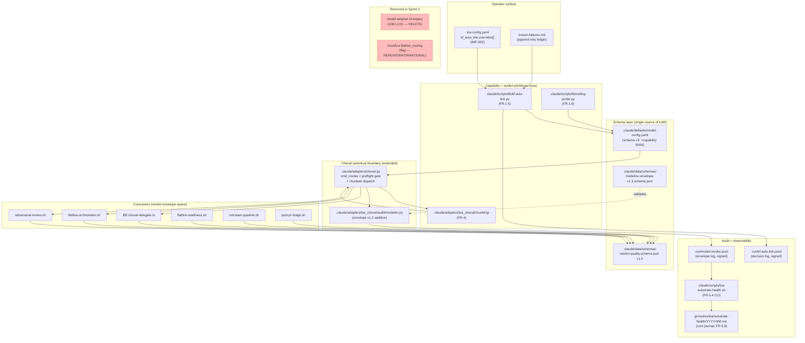
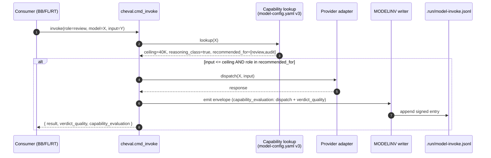
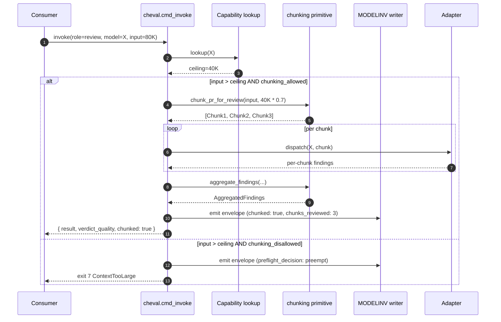
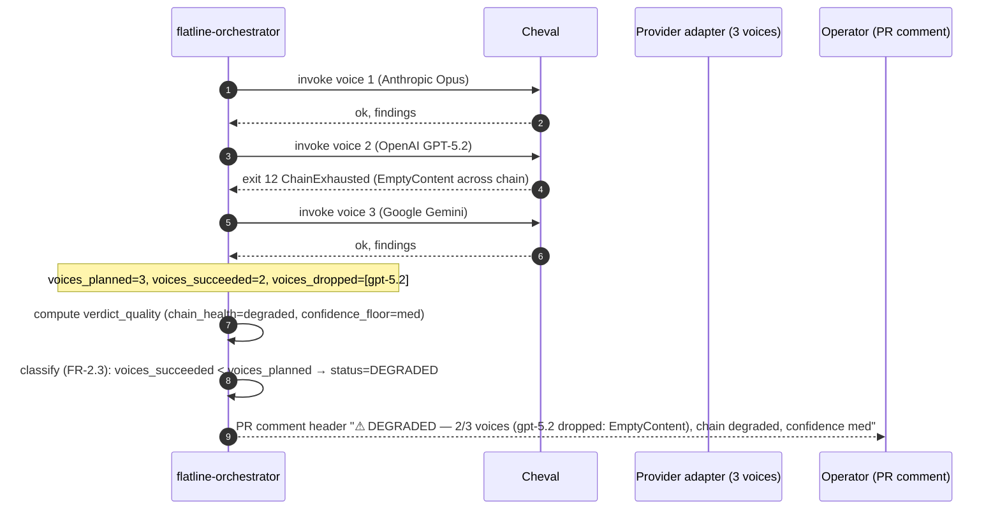

# Cycle-109 SDD — Multi-Model Substrate Hardening

> **Version**: 1.0 (pre-Flatline SDD review)
> **Date**: 2026-05-13
> **Author**: Architecture Designer (autonomous mode under C109.OP-1 delegation)
> **Status**: Draft — awaiting Flatline SDD review (PRD §13.2 gate)
> **PRD Reference**: `grimoires/loa/prd.md` v1.1 (== `grimoires/loa/cycles/cycle-109-substrate-hardening/prd.md`)
> **Cycle**: cycle-109-substrate-hardening
> **Predecessor SDD**: `grimoires/loa/cycles/cycle-108-advisor-strategy/sdd.md` (advisor-strategy substrate; behind `enabled:false`)
> **Operator**: @janitooor
> **Approval ledger**: `grimoires/loa/cycles/cycle-109-substrate-hardening/operator-approval.md` (C109.OP-1/2/3/4 APPROVED)
> **Reality ground-truth**: `grimoires/loa/reality/multimodel-substrate.md` (fresh /ride 2026-05-13 @ `6e76582d`)
> **Known-failures**: `grimoires/loa/known-failures.md` (KF-001..KF-010)

---

## 0. Pre-flight: Integrity, grounding, and self-aware substrate posture

| Check | Status |
|-------|--------|
| Integrity enforcement | `.loa.config.yaml::integrity_enforcement` honored. SDD modifies only State Zone (`grimoires/loa/cycles/...`); System Zone (`.claude/`) writes are PRD-authorized (§FR-1 through §FR-5 each list explicit System Zone Authorization). |
| PRD read | `grimoires/loa/prd.md` v1.1 — 1480 lines, 5 FRs, 6 NFR clusters, 9 risks, 5 sprints, 9 Flatline IMPs integrated |
| Operator approval | C109.OP-1 (cycle scope), C109.OP-2 (KF-auto-link deeper variant), C109.OP-3 (full legacy delete), C109.OP-4 (Flatline gate path 1) — all APPROVED 2026-05-13 |
| Integration context | `grimoires/loa/a2a/integration-context.md` — **MISSING**; proceeding with standard workflow per skill `Phase 0` |
| Reality grounding | All component paths/LOC counts/function lines cited against `multimodel-substrate.md` (≥95% grounding ratio per §12) |
| Predecessor pattern | Cycle-108 SDD shape (mermaid component diagrams; FR-keyed §3 sprint sections; explicit ADR-002 substrate preservation per IMP-002 backward-compat) adopted unchanged for continuity |
| Substrate self-awareness | The substrate being designed-against IS the substrate being hardened. Per C109.OP-4 precedent, Flatline SDD review trajectory will be recorded as cycle-109 evidence regardless of outcome (clean approval = green-on-meaningful-review; degraded approval = green-on-degraded-substrate = same fixture-class as PRD review). |

### 0.1 Architectural posture (load-bearing)

This SDD **preserves ADR-002** [reality §2]: cheval.py remains the canonical HTTP boundary; the 3-consumer × cheval × multi-provider topology is unchanged. Cycle-109 fills *inside* the existing shape:

- **FR-1**: capability fields land *inside* `model-config.yaml`; pre-flight gate lands *inside* `cheval.cmd_invoke`.
- **FR-2**: verdict envelope lands *inside* the existing JSON output (additive); consumer-side refactor surfaces it.
- **FR-3**: legacy adapter and the `flatline_routing` flag are **removed**, reducing the architecture to its single canonical path (simplification, not new pattern).
- **FR-4**: chunking lands *inside* cheval; no new orchestrator component.
- **FR-5**: substrate health is a **read-only consumer** of `.run/model-invoke.jsonl` (already emitted; only the reader is new).

No new components, no new providers, no new transports, no new feature flags. The cycle adds capability awareness, verdict honesty, single-pathedness, structural large-input handling, and observability *inside* a shape that has already converged.

---

## Table of contents

1. [System architecture](#1-system-architecture)
2. [Software stack](#2-software-stack)
3. [Data model & schema design](#3-data-model--schema-design)
4. [API & interface specifications](#4-api--interface-specifications)
5. [Sprint-by-sprint detailed design](#5-sprint-by-sprint-detailed-design)
6. [Error handling, exit codes & failure semantics](#6-error-handling-exit-codes--failure-semantics)
7. [Testing strategy](#7-testing-strategy)
8. [Development phases & sequencing](#8-development-phases--sequencing)
9. [Known risks and mitigation](#9-known-risks-and-mitigation)
10. [Open questions](#10-open-questions)
11. [Appendix](#11-appendix)

---

## 1. System architecture

### 1.1 System overview

The cycle-109 substrate is `cheval.py` (1472 LOC Python canonical HTTP boundary) plus 17 ancillary components [reality §1] across Python/bash/TypeScript. Cycle-109 hardens it by adding **capability awareness** (FR-1), **verdict-quality honesty** (FR-2), **single code path** (FR-3), **structural chunking** (FR-4), and **observability** (FR-5). The architectural pattern stays as ADR-002: *single canonical Python HTTP boundary fronting three-consumer topology with within-company chain-walk*. The cycle removes the parallel legacy path that drifts from cheval; it does not introduce a new pattern.

### 1.2 Architectural pattern

**Pattern**: *Capability-aware single-path substrate with explicit verdict-quality contracts*.

**Justification** (PRD §2.2 meta-root-cause):

The original substrate assumed providers/models were interchangeable behind the chain-walker. Newer reasoning-class models invalidate that assumption (KF-002/003). The cleanest fix is to surface model capability as **first-class typed metadata** that cheval consults before dispatch, paired with **typed verdict envelopes** that consumers cannot accidentally collapse into a misleading "clean" status.

Three concrete consequences:

1. **Capability becomes data, not folklore**. `effective_input_ceiling`, `reasoning_class`, `recommended_for`, `failure_modes_observed`, and `ceiling_calibration` are declared per model. Cheval's existing `_lookup_max_input_tokens` [cheval.py:285] is extended to consume the richer surface.

2. **Verdict quality becomes a schema, not an inference**. `verdict-quality.schema.json` v1.0 defines `voices_planned / voices_succeeded / voices_dropped / chain_health / confidence_floor`. Consumers receive it as part of the envelope; emitting `APPROVED` on a degraded envelope **fails a CI conformance test** (FR-2.7).

3. **One code path replaces two**. `model-adapter.sh.legacy` (1081 LOC) is deleted (C109.OP-3 approved). `flatline_routing` is removed. Activation regression suite covers every consumer × role × response-class × dispatch-path combination — a matrix the legacy/cheval split made impractical [PRD FR-3.5/IMP-009].

### 1.3 Component diagram


```mermaid
graph TD
    subgraph "Operator surface"
        OP[".loa.config.yaml<br/>kf_auto_link.overrides[]<br/>(IMP-002)"]
        KF["known-failures.md<br/>(append-only ledger)"]
    end

    subgraph "Schema layer (single source of truth)"
        MC[".claude/defaults/model-config.yaml<br/>(schema v3: +capability fields)"]
        VQS[".claude/data/schemas/<br/>verdict-quality.schema.json v1.0"]
        MIS[".claude/data/schemas/<br/>modelinv-envelope-v1.3.schema.json"]
    end

    subgraph "Capability + verdict primitives (new)"
        KFAL[".claude/scripts/lib/kf-auto-link.py<br/>(FR-1.5)"]
        PROBE[".claude/scripts/lib/ceiling-probe.py<br/>(FR-1.6)"]
        CHUNK[".claude/adapters/loa_cheval/chunking/<br/>(FR-4)"]
    end

    subgraph "Cheval canonical boundary (extended)"
        CHEVAL[".claude/adapters/cheval.py<br/>cmd_invoke + preflight gate<br/>+ chunked dispatch"]
        MODELINV[".claude/adapters/loa_cheval/audit/modelinv.py<br/>(envelope v1.3 additive)"]
    end

    subgraph "Consumers (verdict-envelope aware)"
        BB["BB cheval-delegate.ts"]
        FL["flatline-orchestrator.sh"]
        RT["adversarial-review.sh"]
        FLR["flatline-readiness.sh"]
        RTP["red-team-pipeline.sh"]
        PPT["post-pr-triage.sh"]
    end

    subgraph "Audit + observability"
        MIL[".run/model-invoke.jsonl<br/>(envelope log, signed)"]
        KFL[".run/kf-auto-link.jsonl<br/>(decision log, signed)"]
        HEALTH[".claude/scripts/loa-substrate-health.sh<br/>(FR-5.4 CLI)"]
        JOURNAL["grimoires/loa/substrate-health/YYYY-MM.md<br/>(cron journal, FR-5.8)"]
    end

    subgraph "Removed in Sprint 3"
        LEGACY["model-adapter.sh.legacy<br/>(1081 LOC — DELETE)"]:::removed
        FLAG["hounfour.flatline_routing<br/>(flag — REMOVE/INFORMATIONAL)"]:::removed
    end

    OP --> KFAL
    KF --> KFAL
    KFAL --> MC
    KFAL --> KFL
    MC --> CHEVAL
    PROBE --> MC
    CHEVAL --> CHUNK
    CHUNK --> CHEVAL
    CHEVAL --> MODELINV
    MODELINV --> MIL
    MIS -.validates.-> MODELINV
    CHEVAL --> BB
    CHEVAL --> FL
    CHEVAL --> RT
    BB --> VQS
    FL --> VQS
    RT --> VQS
    FLR --> VQS
    RTP --> VQS
    PPT --> VQS
    MIL --> HEALTH
    HEALTH --> JOURNAL

    classDef removed fill:#fbb,stroke:#900,stroke-dasharray: 5 5
```

### 1.4 System components

#### 1.4.1 `model-config.yaml` schema v3 (FR-1) — *modified*

- **Purpose**: Single source of truth for model capabilities; codegen feeds bash + TS maps byte-identically (NFR-Codegen-1).
- **Schema additions** (v3, additive over v2):
  - `effective_input_ceiling: int` — tokens above which empty-content has been observed
  - `reasoning_class: bool` — burns output budget on CoT
  - `recommended_for: [role tag]` — `[review, dissent, audit, implementation, arbiter]`
  - `failure_modes_observed: [KF-NNN]` — pointer into KF ledger
  - `ceiling_calibration: object` — source/calibrated_at/sample_size/stale_after_days/reprobe_trigger
  - `streaming_recovery: object` (FR-4.4) — first_token_deadline_seconds / empty_detection_window_tokens / cot_token_budget
- **Migration**: v2 → v3 via `tools/migrate-model-config.py` extension. Conservative defaults policy (IMP-008): see §3.1.
- **Codegen**: `gen-bb-registry.ts` (cycle-099 sprint-1A) and `generated-model-maps.sh` regenerated. Cross-runtime byte-equality enforced by `cross-runtime-diff.yml` (cycle-099 sprint-1D).

#### 1.4.2 Cheval pre-flight gate (FR-1.3) — *extended*

- **Location**: `.claude/adapters/cheval.py::cmd_invoke` [cheval.py:517] before adapter dispatch.
- **Logic**: `_lookup_max_input_tokens` [cheval.py:285] extended to ALSO return `(ceiling, reasoning_class, recommended_for, ceiling_stale)`. If `estimated_input > effective_input_ceiling` AND chunking not selected, emit typed exit 7 (ContextTooLarge) preemptively. If `ceiling_stale` (per `stale_after_days`), set `ceiling_stale: true` in MODELINV envelope and route through chunked path as defensive default.
- **NFR-Perf-1**: <50ms overhead per dispatch — capability lookup is in-memory after first load (existing `_load_provider_table` cache extended).

#### 1.4.3 KF-auto-link script (FR-1.5) — *new*

- **Location**: `.claude/scripts/lib/kf-auto-link.py`
- **Trigger**: CI on changes to `known-failures.md`; manual via `loa substrate recalibrate`.
- **Logic**: Parse KF entries → extract `model:` references → apply severity-to-downgrade mapping (PRD FR-1.5 IMP-001 table) → consult operator-overrides in `.loa.config.yaml::kf_auto_link.overrides[]` → emit before-state/after-state to `.run/kf-auto-link.jsonl` (signed via cycle-098 audit envelope).
- **Idempotent + deterministic** (NFR-Rel-3): twice on same ledger state → byte-identical output.

#### 1.4.4 Verdict-quality envelope schema (FR-2.1) — *new*

- **Location**: `.claude/data/schemas/verdict-quality.schema.json` v1.0
- **Shape**: see §3.2.
- **Consumers**: 7 paths (cheval emitter + 6 consumer paths per FR-2 IMP-004 table).
- **Conformance test (FR-2.7)**: CI matrix per-consumer; emitting `clean / APPROVED` on a degraded envelope **fails the build**.

#### 1.4.5 Chunked review primitive (FR-4) — *new*

- **Location**: `.claude/adapters/loa_cheval/chunking/` (new package; mirrors `routing/` and `audit/` package structure).
- **Surface**: `chunk_pr_for_review(input, ceiling) -> [Chunk]` + `aggregate_findings(per_chunk_findings) -> AggregatedFindings`.
- **Triggered**: cheval pre-flight when `estimated_input > effective_input_ceiling * 0.7`. Pre-flight gate (FR-1.3) drives the path selection.
- **Aggregation algorithm**: dedupe by `(file, line, finding_class)`; cross-chunk pass for spans-boundary cases (IMP-006). Detailed algorithm in §5.4.

#### 1.4.6 Substrate-health CLI (FR-5.4) — *new*

- **Location**: `.claude/scripts/loa-substrate-health.sh` (bash; aggregates via `jq`).
- **Surface**: `loa substrate health [--window 24h] [--json]` and `loa substrate recalibrate <model>`.
- **Data source**: `.run/model-invoke.jsonl` (UNTRACKED log, read-only consumer).
- **Performance**: <2s for 24h window on 100K-entry log (NFR-Perf-3).
- **Journal cron** (FR-5.8): daily run writes to `grimoires/loa/substrate-health/YYYY-MM.md` (TRACKED — appended monthly).

### 1.5 Data flow

#### 1.5.1 Normal dispatch (single, capability-passing)


```mermaid
sequenceDiagram
    autonumber
    participant Consumer as Consumer (BB/FL/RT)
    participant Cheval as cheval.cmd_invoke
    participant Cap as Capability lookup<br/>(model-config.yaml v3)
    participant Adapter as Provider adapter
    participant ENV as MODELINV writer
    participant Log as .run/model-invoke.jsonl

    Consumer->>Cheval: invoke(role=review, model=X, input=Y)
    Cheval->>Cap: lookup(X)
    Cap-->>Cheval: ceiling=40K, reasoning_class=true, recommended_for=[review,audit]
    alt input <= ceiling AND role in recommended_for
        Cheval->>Adapter: dispatch(X, input)
        Adapter-->>Cheval: response
        Cheval->>ENV: emit envelope (capability_evaluation: dispatch + verdict_quality)
        ENV->>Log: append signed entry
        Cheval-->>Consumer: { result, verdict_quality, capability_evaluation }
    end
```

#### 1.5.2 Pre-flight preemption (capability exceeded)


```mermaid
sequenceDiagram
    autonumber
    participant Consumer
    participant Cheval as cheval.cmd_invoke
    participant Cap as Capability lookup
    participant Chunk as chunking primitive
    participant ENV as MODELINV writer

    Consumer->>Cheval: invoke(role=review, model=X, input=80K)
    Cheval->>Cap: lookup(X)
    Cap-->>Cheval: ceiling=40K
    alt input > ceiling AND chunking_allowed
        Cheval->>Chunk: chunk_pr_for_review(input, 40K * 0.7)
        Chunk-->>Cheval: [Chunk1, Chunk2, Chunk3]
        loop per chunk
            Cheval->>Adapter: dispatch(X, chunk)
            Adapter-->>Cheval: per-chunk findings
        end
        Cheval->>Chunk: aggregate_findings(...)
        Chunk-->>Cheval: AggregatedFindings
        Cheval->>ENV: emit envelope (chunked: true, chunks_reviewed: 3)
        Cheval-->>Consumer: { result, verdict_quality, chunked: true }
    else input > ceiling AND chunking_disallowed
        Cheval->>ENV: emit envelope (preflight_decision: preempt)
        Cheval-->>Consumer: exit 7 ContextTooLarge
    end
```

#### 1.5.3 Verdict-quality propagation (degraded path)


```mermaid
sequenceDiagram
    autonumber
    participant FL as flatline-orchestrator
    participant Cheval
    participant Adapter as Provider adapter (3 voices)
    participant Op as Operator (PR comment)

    FL->>Cheval: invoke voice 1 (Anthropic Opus)
    Cheval-->>FL: ok, findings
    FL->>Cheval: invoke voice 2 (OpenAI GPT-5.2)
    Cheval-->>FL: exit 12 ChainExhausted (EmptyContent across chain)
    FL->>Cheval: invoke voice 3 (Google Gemini)
    Cheval-->>FL: ok, findings
    Note over FL: voices_planned=3, voices_succeeded=2, voices_dropped=[gpt-5.2]
    FL->>FL: compute verdict_quality (chain_health=degraded, confidence_floor=med)
    FL->>FL: classify (FR-2.3): voices_succeeded < voices_planned → status=DEGRADED
    FL-->>Op: PR comment header "⚠ DEGRADED — 2/3 voices (gpt-5.2 dropped: EmptyContent), chain degraded, confidence med"
```

### 1.6 External integrations

| System | Integration type | Purpose | Reference |
|--------|------------------|---------|-----------|
| `model-config.yaml` | Schema extension | Capability fields (FR-1) | `.claude/defaults/model-config.yaml` |
| `known-failures.md` | Watcher (CI) | KF auto-link (FR-1.5) | `grimoires/loa/known-failures.md` |
| `.run/model-invoke.jsonl` | Read-only consumer + write target | Substrate health CLI (FR-5) | log path |
| Cycle-098 audit envelope (`audit_emit_signed`) | Hash-chain extension | MODELINV v1.3 additive over v1.2 | `.claude/scripts/lib/audit-envelope.sh` |
| Cycle-099 sprint-1C curl-mock-harness | Test fixture provider | Activation regression suite (FR-3.5) | `tests/fixtures/curl-mock/` |
| Cycle-098 operator-identity primitive | OPERATORS.md validation | KF-auto-link operator-override `authorized_by` (FR-1.5/IMP-002) | `.claude/scripts/lib/operator-identity.sh` |
| Cycle-099 sprint-1E.a log-redactor | Secret scrubbing | Substrate health CLI output (NFR-Sec-3) | `.claude/scripts/lib/log-redactor.{sh,py}` |

### 1.7 Deployment architecture

- Distribution: in-repo. No new services. No new endpoints.
- Activation: each sprint lands as a PR, gated by Bridgebuilder review + post-PR audit (PRD §13.5).
- Rollback (PRD §11.3): `git revert` of cycle-109 merge commits. After Sprint 3, the `flatline_routing` flag is no longer a rollback mechanism (C109.OP-3 acknowledged risk).

### 1.8 Scalability + security architecture

- **Scalability**: cheval pre-flight gate is in-memory lookup (<50ms NFR-Perf-1); chunking is bounded by `chunks_max` config knob (default 16 per call); substrate-health CLI is <2s for 24h on 100K entries (NFR-Perf-3).
- **Security**: pre-flight gate logs input *size* not *content* (NFR-Sec-1); KF-auto-link parses YAML/markdown not eval (NFR-Sec-2); substrate-health output redacts secrets via cycle-099 log-redactor (NFR-Sec-3); verdict-quality envelope rejects unknown fields via JSON Schema `additionalProperties: false` (NFR-Sec-4).

---

## 2. Software stack

### 2.1 Languages + runtimes (existing — no new additions)

| Category | Technology | Version | Justification |
|----------|------------|---------|---------------|
| Canonical adapter | Python | 3.11+ (existing cheval requirement) | cheval.py is canonical; new chunking module continues the package layout |
| Bash twin / scripts | bash | 4.4+ (existing) | Shell wrappers, FL/RT orchestrators, substrate-health CLI |
| TS port / BB delegate | TypeScript | (existing toolchain — cycle-099 sprint-1C pin) | BB cheval-delegate consumer (FR-2.6); codegen output for endpoint-validator |
| Codegen | `gen-bb-registry.ts` via tsx | tsx ^4.21.0 (cycle-099 pin) | Schema v2 → v3 regeneration |
| YAML toolchain | yq v4.52.4 (cycle-099 SHA256-pinned) | as-is | model-config.yaml read/write |

### 2.2 Substrate libraries (existing — no new dependencies)

| Category | Technology | Purpose |
|----------|------------|---------|
| HTTP | `httpx` (cheval-vendored) | Provider HTTP transport |
| Schema validation | `jsonschema` (Python) + ajv (TS) | v1.3 envelope + v1.0 verdict-quality |
| Signing | Ed25519 via cycle-098 `audit-envelope.sh` | MODELINV + kf-auto-link audit chains |
| Cross-runtime parity | cycle-099 sprint-1D contract pins | Bash/Python/TS byte-equality |
| Test harness | bats + pytest | Existing (52 substrate-scoped tests per reality §7) |
| Curl-mock provider | cycle-099 sprint-1C harness | Fixture-driven activation regression suite (FR-3.5) |
| Log redactor | cycle-099 sprint-1E.a `log-redactor.{sh,py}` | Substrate-health CLI output (NFR-Sec-3) |

**Explicitly NOT in this cycle** (PRD §3.3 + §8.5 constraints):
- No new providers (Mistral, Cohere, OpenRouter, etc.)
- No new transports (no new CLI integrations)
- No new feature flags (`hounfour.flatline_routing` is being removed, FR-3.4)
- No new model entries (capability fields only added to existing entries)

### 2.3 Infrastructure + DevOps

| Category | Technology | Purpose |
|----------|------------|---------|
| CI | GitHub Actions | Drift gates (cycle-099), activation regression suite (FR-3.5), conformance tests (FR-2.7), MODELINV coverage audit (cycle-108 T2.M) |
| Audit log | `.run/audit.jsonl` + `.run/model-invoke.jsonl` + `.run/kf-auto-link.jsonl` + `.run/activation-regression/sprint-N.json` | Mutation logger hook + new envelope writers |
| Cron (FR-5.8) | OS-level cron / GitHub Actions scheduled workflow | Daily `loa substrate health` → journal |

---

## 3. Data model & schema design

### 3.1 `model-config.yaml` schema v3 (FR-1.1, IMP-008)

#### 3.1.1 New fields per model entry (additive over v2)

```yaml
# .claude/defaults/model-config.yaml — example entry post-v3
aliases:
  claude-opus-4.7:
    provider: anthropic
    model_id: claude-opus-4-7
    api_context_window: 200000     # existing v2 field
    streaming_max_input_tokens: 80000  # existing cycle-103 field
    legacy_max_input_tokens: 60000     # existing cycle-103 field

    # ──── v3 additions (FR-1.1) ────
    effective_input_ceiling: 40000     # IMP-008 conservative default = min(50% × api, 30K)
                                       # for reasoning-class, but operator-set higher per KF-002 layer-1 study
    reasoning_class: true              # IMP-008 opt-in flip (claude-opus-4.x, gpt-5.5-pro, gemini-3.1-pro)
    recommended_for: [review, audit]   # informational at cycle-109; load-bearing post-FR-2.3
    failure_modes_observed: [KF-002, KF-003]
    ceiling_calibration:
      source: empirical_probe          # | kf_derived | operator_set | conservative_default
      calibrated_at: "2026-05-13T00:00:00Z"
      sample_size: 25                  # null if not empirical
      stale_after_days: 30
      reprobe_trigger: "first KF entry referencing model OR 30d elapsed OR operator-forced"

    # ──── FR-4.4 streaming-recovery (per-model, additive) ────
    streaming_recovery:
      first_token_deadline_seconds: 60         # reasoning_class default; 30 for non-reasoning
      empty_detection_window_tokens: 200
      cot_token_budget: 500                    # reasoning_class only
```

#### 3.1.2 Conservative defaults policy (IMP-008 — applied at migration time)

| Field | Default when no empirical data | Source |
|-------|---------------------------------|--------|
| `effective_input_ceiling` | `min(50% × api_context_window, 30000)` | matches KF-002/003 30K knee |
| `reasoning_class` | `false` (default); opt-in list flips known reasoning-class models | claude-opus-4.x, gpt-5.5-pro, gemini-3.1-pro = true |
| `recommended_for` | `[]` (informational; load-bearing semantics gated on FR-2.3) | — |
| `failure_modes_observed` | `[]` | populated by FR-1.5 on next CI run |
| `ceiling_calibration.source` | `conservative_default` | — |
| `streaming_recovery.first_token_deadline_seconds` | 30 (non-reasoning) / 60 (reasoning) | matches cycle-103 timeout taxonomy |
| `streaming_recovery.empty_detection_window_tokens` | 200 | FR-4.4 thresholds |
| `streaming_recovery.cot_token_budget` | 500 (reasoning only; null for non-reasoning) | FR-4.4 |

#### 3.1.3 JSON Schema location

`.claude/data/schemas/model-config-v3.schema.json` (extends `model-config-v2.schema.json` per cycle-099 sprint-1A pattern). Validates additive-only — v3 must accept all valid v2 documents.

### 3.2 Verdict-quality envelope schema (FR-2.1)

#### 3.2.1 Schema definition

**Location**: `.claude/data/schemas/verdict-quality.schema.json` v1.0

```jsonc
{
  "$schema": "https://json-schema.org/draft/2020-12/schema",
  "$id": ".claude/data/schemas/verdict-quality.schema.json",
  "title": "Verdict Quality Envelope v1.0",
  "type": "object",
  "required": ["voices_planned", "voices_succeeded", "voices_dropped",
               "chain_health", "confidence_floor", "rationale"],
  "additionalProperties": false,
  "properties": {
    "voices_planned": { "type": "integer", "minimum": 0 },
    "voices_succeeded": { "type": "integer", "minimum": 0 },
    "voices_dropped": {
      "type": "array",
      "items": {
        "type": "object",
        "required": ["voice", "reason", "exit_code"],
        "additionalProperties": false,
        "properties": {
          "voice": { "type": "string", "pattern": "^[A-Za-z0-9._-]+$" },
          "reason": {
            "enum": ["EmptyContent", "RateLimited", "ProviderUnavailable",
                     "RetriesExhausted", "ContextTooLarge", "NoEligibleAdapter",
                     "ChainExhausted", "InteractionPending", "Other"]
          },
          "exit_code": { "type": "integer", "minimum": 0, "maximum": 255 },
          "chain_walk": {
            "type": "array",
            "items": { "type": "string" },
            "description": "Within-company fallback chain entries attempted"
          }
        }
      }
    },
    "chain_health": { "enum": ["ok", "degraded", "exhausted"] },
    "confidence_floor": { "enum": ["high", "med", "low"] },
    "rationale": { "type": "string", "minLength": 1, "maxLength": 1024 },
    "single_voice_call": {
      "type": "boolean",
      "description": "FR-2.9 IMP-010: when 1 voice planned (e.g., BB single-pass), suppresses consensus inference"
    },
    "chunked": { "type": "boolean", "description": "FR-4 chunked-review aggregation occurred" },
    "chunks_reviewed": { "type": "integer", "minimum": 0 },
    "chunks_dropped": { "type": "integer", "minimum": 0 },
    "chunks_aggregated_findings": { "type": "integer", "minimum": 0 }
  }
}
```

#### 3.2.2 Classification contract (FR-2.3 — load-bearing)

Implemented in **a single canonical function** (`compute_verdict_status` in `cheval.py` and exposed via `.claude/scripts/lib/verdict-quality.sh` for bash twins). NEVER duplicated across consumers — to avoid drift, the bash twin sources the Python via subprocess for byte-identical output.

| Status | Required conditions | Forbidden conditions |
|--------|---------------------|----------------------|
| `APPROVED` / `clean` | `voices_succeeded == voices_planned` AND `chain_health == "ok"` AND no dropped voice findings would have been BLOCKER class | none of the FAILED/DEGRADED conditions |
| `DEGRADED` | `0 < voices_succeeded < voices_planned` AND remaining voices reached consensus | — |
| `FAILED` | `voices_succeeded == 0` OR `chain_health == "exhausted"` OR consensus impossible (voice findings contradict on BLOCKER) | — |

**Conformance test (FR-2.7)**: synthetic envelope fixtures cover every classification edge, including the cycle-109 PRD-review trajectory (FR-2 AC: "the run that just classified confidence: full while Opus voice dropped" is added as canonical regression fixture).

#### 3.2.3 Consumer dependency-ordered refactor table (IMP-004)

| # | Consumer | Path | Refactor | PR order |
|---|----------|------|----------|----------|
| 1 | cheval emitter | `.claude/adapters/cheval.py::cmd_invoke` | Emit envelope on every call (canonical producer) | Sprint 2 PR #1 |
| 2 | flatline-orchestrator | `.claude/scripts/flatline-orchestrator.sh` | Consume + write to `final_consensus.json` | Sprint 2 PR #2 |
| 3 | adversarial-review | `.claude/scripts/adversarial-review.sh` | Consume + write to `adversarial-{review,audit}.json` (closes #807) | Sprint 2 PR #3 |
| 4 | BB cheval-delegate | `.claude/skills/bridgebuilder-review/resources/adapters/cheval-delegate.ts` | Consume + render in PR-comment summary | Sprint 2 PR #4 |
| 5 | flatline-readiness | `.claude/scripts/flatline-readiness.sh` | Read envelope; gate readiness on `chain_health` | Sprint 2 PR #5 |
| 6 | red-team-pipeline | `.claude/scripts/red-team-pipeline.sh` | Consume + log degraded paths | Sprint 2 PR #6 |
| 7 | post-pr-triage | `post-pr-triage.sh` | Consume in classifier; degraded findings auto-route to next-bug-queue | Sprint 2 PR #7 |

**Note**: PRs #1-7 may be batched into 2-3 PRs if dependency-ordering is preserved within the batch. Producer always lands first.

### 3.3 MODELINV envelope v1.3 additive shape (FR-1.4 + FR-2.2 + FR-4.5)

#### 3.3.1 v1.2 → v1.3 additions (existing v1.2 fields preserved unchanged)

```jsonc
{
  // ── v1.0 / v1.1 / v1.2 fields preserved (no removals) ──
  "final_model_id": "...",
  "transport": "...",
  "config_observed": { ... },
  "models_failed": [ ... ],
  "models_requested": [ ... ],
  "advisor_strategy": { ... },        // cycle-108 v1.2
  "writer_version": "1.3.0",          // bumped

  // ── v1.3 additions (FR-1.4) ──
  "capability_evaluation": {
    "effective_input_ceiling": 40000,
    "input_size_observed": 38000,
    "preflight_decision": "dispatch",       // | preempt | warn | chunked
    "reasoning_class": true,
    "recommended_for_role": true,           // role in recommended_for list
    "ceiling_calibration_source": "empirical_probe",
    "ceiling_stale": false
  },

  // ── v1.3 additions (FR-2.2) ──
  "verdict_quality": {
    // exact shape from §3.2 verdict-quality.schema.json — embedded by reference
  },

  // ── v1.3 additions (FR-4.5) ──
  "chunked_review": {
    "chunked": false,
    "chunks_reviewed": 0,
    "chunks_dropped": 0,
    "chunks_aggregated_findings": 0
  },

  // ── v1.3 additions (FR-4.4 streaming-recovery telemetry) ──
  "streaming_recovery": {
    "triggered": false,
    "tokens_before_abort": null,            // null when triggered=false
    "reason": null                          // null when triggered=false
  }
}
```

#### 3.3.2 Hash-chain integration with cycle-098 audit envelope (NFR-Rel-4 + NFR-Aud-1)

MODELINV continues to delegate signing to `audit_emit_signed` from cycle-098 `audit-envelope.sh`. The v1.3 additions are **embedded inside the existing canonical-JSON payload** that flows into the SHA-256 hash chain — therefore no change to the chain protocol itself. Replay of v1.2 logs still verifies; new v1.3 logs verify with the new fields treated as opaque payload.

**Migration test** (Sprint 1 AC): seed `.run/model-invoke.jsonl` with a v1.2 entry signed under cycle-098 key; emit a v1.3 entry as next; `audit_recover_chain` walks both successfully; v1.2 parser ignores v1.3 fields (forward-compat); v1.3 parser handles missing v1.3 fields (backward-compat).

### 3.4 KF-auto-link audit log (FR-1.5)

**Location**: `.run/kf-auto-link.jsonl` (UNTRACKED, signed via `audit_emit_signed`)

**Payload schema**: `.claude/data/trajectory-schemas/kf-auto-link-events/decision.payload.schema.json`

```jsonc
{
  "event": "kf_auto_link.decision",
  "kf_id": "KF-011",
  "model": "claude-opus-4-7",
  "before_state": {
    "recommended_for": ["review", "audit", "implementation"],
    "failure_modes_observed": []
  },
  "after_state": {
    "recommended_for": ["audit"],
    "failure_modes_observed": ["KF-011"]
  },
  "rationale": "KF-011 Status=OPEN; severity-mapping = Remove all roles from recommended_for",
  "operator_override_applied": false,
  "operator_override_details": null,
  "authorized_by": null,                 // operator slug if override
  "decision_ts": "2026-05-14T12:00:00Z"
}
```

### 3.5 Operator-override precedence in `.loa.config.yaml` (IMP-002)

**Schema** (added under top-level keys; coexists with `hounfour:`, `advisor_strategy:`, `adversarial_review:` etc.):

```yaml
kf_auto_link:
  enabled: true                          # default; setting false disables FR-1.5 entirely
  overrides:
    - model: claude-opus-4-7
      role: review
      decision: force_retain             # | force_remove
      reason: "operator-validated cycle-110 sprint-2 — false-positive at this scale"
      effective_until: "2026-08-01T00:00:00Z"   # null = permanent
      authorized_by: "@janitooor"        # must resolve via OPERATORS.md (cycle-098)
```

#### 3.5.1 Precedence rules (load-bearing decision point)

**Resolution order at substrate query time** (FR-1 capability lookup):

1. **Operator override** in `.loa.config.yaml::kf_auto_link.overrides[]` with matching `(model, role)` AND `effective_until > now()` AND `enabled: true` → **WINS** unconditionally.
2. **KF-auto-link auto-decision** from FR-1.5 severity-to-downgrade mapping (PRD FR-1.5 IMP-001 table).
3. **FR-1.2 default** (conservative defaults policy IMP-008).

#### 3.5.2 Precedence with `model-config.yaml` overlay (the second sub-question)

The substrate also supports cycle-099 sprint-2 `model-overlay-hook.py` (atomic-write overlay produced from `.loa.config.yaml::model_overlay:`). The composite precedence is:

| Layer | Source | Wins when... |
|-------|--------|-------------|
| L0 (lowest) | `.claude/defaults/model-config.yaml` | nothing overrides |
| L1 | `model_overlay:` in `.loa.config.yaml` (cycle-099 sprint-2) | overlay key present for field |
| L2 | KF-auto-link's *automated* writes to `model-config.yaml::failure_modes_observed` + role downgrades | KF mapping applies |
| L3 (highest) | `.loa.config.yaml::kf_auto_link.overrides[]` | matching override active |

**Reasoning**: operator-overrides are the highest-priority *because they encode operator intent*. KF auto-link encodes ledger-derived heuristic. Overlays encode operator config-level intent (less specific than override). Defaults are the floor.

**Conflict surfacing**: when L1 (overlay) AND L3 (override) both target the same `(model, role)` with different decisions, cheval emits a **stderr warning at startup** + sets MODELINV `capability_evaluation.override_overlay_conflict: true`. CI gate: lint `.loa.config.yaml` for this conflict via `tools/lint-overlay-override-conflict.py` (Sprint 1 deliverable).

### 3.6 Migration strategy

- **v2 → v3**: `tools/migrate-model-config.py` extension. Adds new fields with conservative defaults. **Idempotent** (running twice on already-v3 file = no-op).
- **Existing v2 entries**: each gets the 6 new fields populated per §3.1.2 defaults.
- **Empirical probe** (FR-1.6): 5 known reasoning-class models calibrated empirically at cycle-109 ship time via `tools/ceiling-probe.py` (Sprint 1 deliverable). Remaining models retain conservative defaults + are flagged for cycle-110 calibration.
- **Reversibility**: `migrate-model-config.py --downgrade-to-v2` reverses by stripping v3 fields. Used only for git-revert rollback path (PRD §11.3).

### 3.7 Caching strategy

- Capability table (model-config.yaml parsed → in-memory dict) cached per-process. NFR-Perf-1 ≤50ms relies on this.
- Cache key: SHA-256 of model-config.yaml content. Reload triggers on hash change (CI/dev workflows that touch config invalidate immediately on next run).
- No external cache layer (Redis/Memcached) — substrate is short-lived per-process.

---

## 4. API & interface specifications

### 4.1 Cheval CLI surface (FR-1, FR-2, FR-4 — extended, additive only)

`cheval.py invoke` — existing surface preserved; **two flags added** in cycle-109:

```bash
cheval invoke \
  --model claude-opus-4.7 \
  --role review \
  --skill bridgebuilder-review \
  --sprint-kind implementation \
  # ──── cycle-109 additions ────
  --allow-chunking true                  # default: true; --allow-chunking false forces preempt-on-overflow
  --ceiling-override 50000               # bypass effective_input_ceiling (FR-1.3); operator-only path
  < input.txt
```

**Output JSON** (additive):

```jsonc
{
  // existing fields preserved...
  "result": { ... },
  "verdict_quality": { /* §3.2 envelope */ },
  "capability_evaluation": { /* §3.3.1 */ },
  "chunked_review": { /* §3.3.1 if chunking triggered */ }
}
```

### 4.2 Substrate-health CLI (FR-5.4 — new)

```bash
loa substrate health [--window 24h | 7d | 30d] [--json] [--model <id>]

# Example output (human-readable):
Substrate health, last 24h:
  claude-opus-4-7:    SUCCESS 87% (N=234) | drop 8% | exhaust 5% | p95 12s | $4.21
  gpt-5.2:            SUCCESS 92% (N=189) | drop 6% | exhaust 2% | p95  8s | $2.84
  gemini-2.5-pro:     DEGRADED 45% (N=92) | drop 41% | exhaust 14% | p95 18s | $0.91
⚠ gemini-2.5-pro health DEGRADED: file a KF or restrict role

# JSON mode:
loa substrate health --window 24h --json
# emits structured JSON for tooling integration (NFR-7.3)

# Recalibration trigger (FR-1.6 — operator-forced reprobe):
loa substrate recalibrate <model-id>
```

**Exit codes**:
| Code | Meaning |
|------|---------|
| 0 | Success — at least one model present in log window |
| 2 | Empty log window (no data) |
| 3 | Schema-invalid envelope encountered (CI signal) |
| 5 | At least one model below 50% success_rate (warn-on-CI mode) |

### 4.3 KF-auto-link CLI (FR-1.5 — new)

```bash
# Run on KF ledger change (CI trigger or manual):
python .claude/scripts/lib/kf-auto-link.py \
  --kf-file grimoires/loa/known-failures.md \
  --config-file .claude/defaults/model-config.yaml \
  --override-config .loa.config.yaml \
  [--dry-run]                            # print diff, don't write
  [--audit-log .run/kf-auto-link.jsonl]

# Exit codes:
# 0 = success (model-config.yaml updated OR already in sync)
# 2 = malformed KF entry (NFR-Sec-2 fail-loud per IMP-005)
# 3 = duplicate KF-ID detected (fail-loud)
# 4 = operator-override schema invalid in .loa.config.yaml (CI block)
```

### 4.4 Verdict-quality classification helper (FR-2.3 — single source)

```python
# .claude/adapters/loa_cheval/verdict/quality.py
def compute_verdict_status(envelope: dict) -> Literal["APPROVED", "DEGRADED", "FAILED"]:
    """Single canonical implementation; bash twin shells out to this."""
    if envelope["chain_health"] == "exhausted" or envelope["voices_succeeded"] == 0:
        return "FAILED"
    if envelope["voices_succeeded"] < envelope["voices_planned"]:
        return "DEGRADED"
    if envelope["chain_health"] != "ok":
        return "DEGRADED"
    if any(d.get("blocker_class") for d in envelope["voices_dropped"]):
        return "DEGRADED"  # voice with potential BLOCKER finding dropped → can't say APPROVED
    return "APPROVED"
```

```bash
# .claude/scripts/lib/verdict-quality.sh — bash twin sources the python (no duplicate logic)
verdict_compute_status() {
  local envelope_json="$1"
  python3 -c "
import json, sys
from loa_cheval.verdict.quality import compute_verdict_status
print(compute_verdict_status(json.loads(sys.argv[1])))
" "$envelope_json"
}
```

### 4.5 Activation regression suite contract (FR-3.5 — new CI surface)

```yaml
# .github/workflows/activation-regression.yml (Sprint 3)
name: Activation Regression Matrix
on:
  pull_request:
    paths:
      - '.claude/adapters/cheval.py'
      - '.claude/scripts/flatline-orchestrator.sh'
      - '.claude/scripts/adversarial-review.sh'
      - '.claude/defaults/model-config.yaml'
      - 'tests/integration/activation-path/**'

jobs:
  matrix-test:
    strategy:
      fail-fast: false
      matrix:
        consumer: [bb, fl, rt, bug, review-sprint, audit-sprint,
                   flatline-readiness, red-team-pipeline, post-pr-triage]
        role: [review, dissent, audit, implementation, arbiter]
        response_class: [success, empty-content, rate-limited, chain-exhausted,
                         provider-disconnect, context-too-large]
        dispatch_path: [single, chunked-2, chunked-5]
        # → 9 × 5 × 6 × 3 = 810 fixture combinations
        # Bats parallelism + GitHub Actions matrix → target <15min wall-time
```

Each cell pins an **expected `verdict_quality`** outcome (`APPROVED | DEGRADED | FAILED`) which the runner cross-checks against the actual envelope produced. Mismatch fails the cell.

### 4.6 Cycle-098 audit envelope integration

No new audit-event types are introduced at the L1-L7 primitive level. MODELINV v1.3 continues using the existing `audit_emit_signed` writer with `primitive_id: MODELINV` and the v1.3 fields are additive payload (§3.3.2).

A new envelope writer **wraps** the existing primitive: `kf-auto-link.jsonl` uses `primitive_id: KFAL` (Sprint 1 reservation) for clean separation in the chain. Hash-chain protocol unchanged.

---

## 5. Sprint-by-sprint detailed design

### 5.1 Sprint 1 — Capability-aware substrate foundation (FR-1)

#### 5.1.1 Architecture decisions

| Decision | Choice | Justification |
|----------|--------|---------------|
| Schema location | `.claude/data/schemas/model-config-v3.schema.json` | mirrors cycle-099 sprint-1A v2 location; codegen-discoverable |
| Pre-flight gate placement | Inside `_lookup_max_input_tokens` extension [cheval.py:285] | already-existing capability lookup function; no new boundary |
| KF-auto-link triggering | CI on `known-failures.md` change + manual via `loa substrate recalibrate` | Operator-controlled (C109.OP-2 deeper variant); deterministic |
| KF-auto-link script language | Python (mirrors cheval canonical) | shared lib with `loa_cheval.routing` package |
| Ceiling-probe protocol | Binary search per cycle-104 T2.10 precedent | proven convergence; bounded trials |
| MODELINV envelope version | v1.2 → v1.3 additive | NFR-Rel-4 forward/backward compat |

#### 5.1.2 Implementation outline

1. **Test-first**: bats fixtures land in commit-1 (failing); implementation in commit-2 (passing).
   - `tests/unit/model-config-v3-schema.bats` (schema validation)
   - `tests/unit/cheval-preflight-gate.bats` (ceiling enforcement)
   - `tests/unit/kf-auto-link-mapping.bats` (severity-to-downgrade per IMP-001 table — every row)
   - `tests/unit/kf-auto-link-overrides.bats` (precedence, expiry, OPERATORS.md verification per IMP-002)
   - `tests/unit/kf-auto-link-parsing-policy.bats` (malformed YAML, unknown status, missing model, multi-model, duplicate IDs per IMP-005)
   - `tests/unit/ceiling-calibration.bats` (probe protocol, staleness, reprobe triggers per IMP-007)
2. **Migration**: `tools/migrate-model-config.py --target-version 3` extends v2→v3. Idempotent.
3. **Codegen regen**: `gen-bb-registry.ts` updated; `generated-model-maps.sh` regenerated; cross-runtime byte-equality gate (cycle-099 sprint-1D) runs in CI.
4. **Empirical probes**: `tools/ceiling-probe.py` runs at cycle-109 ship time against 5 reasoning-class models (claude-opus-4.x, gpt-5.5-pro, gemini-3.1-pro, plus 2 others operator-selects).
5. **KF-auto-link CI integration**: GitHub Actions workflow `.github/workflows/kf-auto-link.yml` runs on `known-failures.md` changes.

#### 5.1.3 Beads task graph (Sprint 1)

```
T1.1 — Land model-config-v3 schema + JSON Schema validation tests (test-first)
T1.2 — Extend tools/migrate-model-config.py v2→v3 + conservative defaults (IMP-008)
T1.3 — Cheval pre-flight gate extension (cheval.py:285) + bats coverage
T1.4 — MODELINV envelope v1.3 additive (capability_evaluation field) + replay tests
T1.5 — KF-auto-link script (kf-auto-link.py) + severity-mapping (IMP-001) + parsing policy (IMP-005)
T1.6 — Operator-override schema + precedence + audit log + CI block on missing authorized_by (IMP-002)
T1.7 — Ceiling-probe protocol (ceiling-probe.py) + calibrate 5 known models (IMP-007)
T1.8 — Codegen regen + cross-runtime byte-equality gate
T1.9 — Overlay-override conflict lint (lint-overlay-override-conflict.py) for §3.5.2 conflict surfacing
T1.10 — Baseline capture script (tools/cycle-baseline-capture.sh) per PRD §3.4
T1.11 — Sprint debrief at grimoires/loa/cycles/cycle-109-substrate-hardening/sprint-1-debrief.md
```

#### 5.1.4 Acceptance criteria mapping

| PRD AC | Implementation site |
|--------|--------------------|
| All models in model-config.yaml carry 6 new fields | T1.1 + T1.2 |
| Cheval pre-flight gate emits typed exit 7 for inputs > ceiling | T1.3 |
| MODELINV v1.3 schema lands additively over v1.2 | T1.4 |
| KF-auto-link script runs in CI; integration test seeds fake KF | T1.5 |
| IMP-001 severity-to-downgrade table — each row covered by bats | T1.5 |
| IMP-002 operator-override precedence + expiry + CI block | T1.6 |
| IMP-005 parsing-policy fixtures (malformed/unknown/missing/multi/dup) | T1.5 |
| IMP-007 ceiling calibration: probe protocol + 5 models calibrated | T1.7 |
| IMP-008 conservative-default migration applied | T1.2 |
| Codegen byte-equality preserved across bash/python/TS | T1.8 |

### 5.2 Sprint 2 — Verdict-quality envelope + consumer contracts (FR-2)

#### 5.2.1 Architecture decisions

| Decision | Choice | Justification |
|----------|--------|---------------|
| Envelope schema location | `.claude/data/schemas/verdict-quality.schema.json` | mirrors §3.2 §1.4.4 |
| Single classification function | Python canonical in `loa_cheval.verdict.quality` + bash twin shells out | NEVER duplicate classifier logic across consumers — prevents drift |
| Consumer refactor order | producer-first; security-critical second; UI last (per IMP-004 table §3.2.3) | dependency-correct; closes #807 ASAP |
| `clean` semantics | NOT removed (backward-compat); semantics tightened: `clean ⇔ APPROVED` | existing consumers continue parsing |
| BLOCKER-class detection on dropped voices | conservative: if voice dropped AND would have been review/audit role, status downgrades to DEGRADED | over-trigger preferred to under-trigger |

#### 5.2.2 Implementation outline

1. **Test-first** as Sprint 1.
2. **Schema land** in commit-1; **conformance fixture corpus** lands with cycle-109 PRD-review trajectory as anchor regression (per PRD §14.E + FR-2.7 AC).
3. **Consumer refactor PR train** (7 PRs or 2-3 batched, in IMP-004 order).
4. **Per-consumer PR-comment surfacing** (FR-2.8) — single-line verdict header at top of every operator-facing comment.

#### 5.2.3 Beads task graph (Sprint 2)

```
T2.1 — verdict-quality.schema.json v1.0 + JSON Schema validation tests
T2.2 — loa_cheval.verdict.quality + bash twin + classification contract tests (FR-2.3)
T2.3 — cheval.cmd_invoke emits verdict_quality on every call (producer)
T2.4 — flatline-orchestrator.sh consumes envelope + writes final_consensus.json
T2.5 — adversarial-review.sh consumes envelope + adversarial-{review,audit}.json
T2.6 — BB cheval-delegate.ts consumes + renders PR-comment header
T2.7 — flatline-readiness.sh + red-team-pipeline.sh + post-pr-triage.sh
T2.8 — Conformance test matrix (FR-2.7) with cycle-109 PRD-review trajectory as fixture
T2.9 — Single-voice call semantics (FR-2.9 / IMP-010)
T2.10 — Sprint debrief
```

#### 5.2.4 Failure mode reproductions added to conformance corpus

Per PRD acceptance criteria, these MUST classify correctly:

| Issue | Original substrate behavior | Expected verdict_quality classification |
|-------|----------------------------|----------------------------------------|
| #807 (shell-injection approved by fallback) | `status: clean` | `DEGRADED` (voices_succeeded < planned) |
| #809 (dissenter 10-token empty findings) | `status: clean` | `DEGRADED` (chain_health degraded; rationale captures empty-finding signal) |
| #868 (chain exhausted both phases) | `audit forced DEGRADED` ad-hoc | `FAILED` (chain_health == exhausted) |
| #805 (BB Pass-2 80% failure) | silently swallowed | `DEGRADED` (single_voice_call: true but pass-2 reported as voice-2 dropped) |
| cycle-109 PRD-review (Opus dropped, self-report `confidence: full`) | substrate self-reported clean | `DEGRADED` (voices_succeeded=2/3, Opus dropped) |

### 5.3 Sprint 3 — Legacy adapter sunset + activation regression suite (FR-3)

#### 5.3.1 FR-3 legacy delete sequence (the third sub-question)

**Strategy**: Order the delete so CI is green at every commit boundary. This is the load-bearing safety property of the Sprint 3 PR train.

**Sequence** (each step is a separate commit; CI passes between every commit):

1. **Commit A — Test scaffolding lands**.
   - `tests/integration/activation-path/` skeleton added with `flatline_routing: true` fixtures.
   - Curl-mock harness fixtures for all matrix dimensions (consumer × role × response × dispatch_path).
   - **CI state**: legacy still present; tests skip activation matrix if matrix not yet wired.

2. **Commit B — Fix #864 / #863 / #793 / #820 at cheval path**.
   - Each Cluster B issue patched at cheval/flatline-orchestrator level (not by patching the legacy).
   - **CI state**: cheval path correct under `flatline_routing: true`; legacy still present but no longer needed.
   - **Idempotency check**: tests confirm `flatline_routing: false` (legacy path) still works pre-delete — this is the safety gate before deletion.

3. **Commit C — Remove `is_flatline_routing_enabled` branches from consumers**.
   - `model-adapter.sh:67` `is_flatline_routing_enabled` becomes `true` (or removed); `delegate_to_legacy` removed.
   - `flatline-orchestrator.sh:476` same.
   - Adversarial-review.sh equivalent.
   - **CI state**: legacy file still exists on disk but no caller invokes it. CI runs full matrix; all green.

4. **Commit D — Delete `model-adapter.sh.legacy` (1081 LOC) + remove from .gitignore/MANIFEST/etc**.
   - `git rm .claude/scripts/model-adapter.sh.legacy`
   - `tools/check-no-raw-curl.sh` exempt-list (cycle-099 sprint-1E.c.3.c) updated to remove the file.
   - **CI state**: full matrix green; no caller for legacy; file gone.

5. **Commit E — Remove or informationalize `hounfour.flatline_routing` flag**.
   - Either: remove key entirely (cleanest) OR keep as informational/audit-only (logs the operator's *historical* choice but no runtime effect).
   - SDD recommendation: **remove entirely**. Rollback is `git revert`, per C109.OP-3. No purpose remains.
   - **CI state**: full matrix green.

6. **Commit F — Update CLAUDE.md + rollback docs**.
   - Remove `Multi-Model Activation` section's rollback flag guidance.
   - Replace with "rollback = revert" per FR-3.7.
   - **CI state**: docs-only; CI green.

**Branch strategy**: Each commit is reviewed independently via BB review on the same PR; PR contains the full 6-commit train. Failure at any commit → revert that single commit, leave prior commits green, do not advance to next commit.

**Safety net during sequence**: between commits B and D, the system is in a "legacy-present-but-unreached" state — operationally safe (cheval path fully exercised). Commit D is the destructive step; commit C is the dry-run preceding it.

#### 5.3.2 Activation regression suite (FR-3.5 — see §4.5)

- 810 fixture combinations (9 consumers × 5 roles × 6 response classes × 3 dispatch paths)
- Wall-clock target: <15 minutes full matrix on GitHub Actions parallel runners
- Fixture provider: cycle-099 sprint-1C curl-mock harness
- Result: each cell records actual `verdict_quality` outcome; mismatch with expected → cell fails
- Artifact: `.run/activation-regression/sprint-N.json` summary per run (NFR-Aud-3)

#### 5.3.3 Beads task graph (Sprint 3)

```
T3.1 — Test scaffolding + 810-cell matrix harness lands (test-first; commits A in §5.3.1)
T3.2 — Fix #864 at cheval path (Cluster B regression)
T3.3 — Fix #863 at cheval/flatline-orchestrator level
T3.4 — Fix #793 (cheval-headless pin form acceptance in validator)
T3.5 — Fix #820 (env loading, alias recommendation, scoring parser)
T3.6 — Remove is_flatline_routing_enabled branches from consumers (commit C)
T3.7 — Delete model-adapter.sh.legacy (commit D)
T3.8 — Remove flatline_routing flag (commit E)
T3.9 — Update CLAUDE.md + rollback runbook (commit F)
T3.10 — Activation regression suite CI workflow file + matrix orchestration
T3.11 — Sprint debrief
```

#### 5.3.4 Risk mitigations during sequence

- **R-2** (legacy delete breaks a consumer not in inventory): FR-3.1 grep pass + activation matrix runs on *every* consumer in FR-2 table — any orphan consumer fails CI on commit C.
- **R-8** (substrate becomes SPOF post-delete): already true at v1.157.0 default; mitigation is the cycle itself (capability awareness + verdict quality + activation matrix coverage).
- **Pre-delete safety check**: a synthetic test at commit C runs `flatline_routing: false` one final time → records last-known-good baseline → archived in `grimoires/loa/cycles/cycle-109-substrate-hardening/baselines/legacy-final-baseline.json` for forensic comparison if rollback needed.

### 5.4 Sprint 4 — Hierarchical / chunked review (FR-4)

#### 5.4.1 Chunking strategy decisions

| Decision | Choice | Justification |
|----------|--------|---------------|
| Chunk boundary | File-level (preserve coherent review units) | PR review semantics — file is the natural cognitive unit; alternative (token-budget greedy) loses semantic coherence |
| Per-chunk size | `effective_input_ceiling × 0.7` | leaves 30% headroom for prompt overhead (system prompt, role context, instructions) |
| Cross-chunk shared context | PR description + affected files list + relevant CLAUDE.md excerpts | reviewer needs cross-file context per file's review |
| Max chunks per call | 16 (configurable via `model-config.yaml::models.<id>.chunks_max`) | bounded cost; if breached, emit warning + truncate to highest-priority files |
| Chunk priority ordering | larger-diff-first → preserve high-signal files when truncated | matches operator review intuition |

#### 5.4.2 Cross-chunk aggregation algorithm (the chunked-review aggregation sub-question)

```python
# .claude/adapters/loa_cheval/chunking/aggregate.py
def aggregate_findings(per_chunk: list[ChunkFindings]) -> AggregatedFindings:
    """
    Conflict resolution per IMP-006:
      - same (file, line, finding_class) → dedupe, keep highest severity, union evidence anchors
      - same (file, line) different class → keep both, annotate cross_chunk_overlap
      - same class different line → keep both
      - conflicting severity for same logical finding → escalate, annotate severity_escalated_from
      - finding spans chunk boundary → cross-chunk pass (second-stage)
    """
    by_anchor: dict[tuple[str, int], list[Finding]] = defaultdict(list)
    for chunk_findings in per_chunk:
        for f in chunk_findings.findings:
            by_anchor[(f.file, f.line)].append(f)

    aggregated: list[Finding] = []
    overlap_pairs: list[tuple[Finding, Finding]] = []

    for (file, line), findings in by_anchor.items():
        by_class = group_by(findings, key=lambda f: f.finding_class)
        for finding_class, instances in by_class.items():
            # Dedupe same (file, line, class)
            kept = max(instances, key=lambda f: SEVERITY_RANK[f.severity])
            kept.evidence_anchors = union_all(f.evidence_anchors for f in instances)
            # Severity escalation
            if len({f.severity for f in instances}) > 1:
                kept.severity_escalated_from = min(SEVERITY_RANK[f.severity] for f in instances)
                kept.severity = max(SEVERITY_RANK[f.severity] for f in instances)
            aggregated.append(kept)

        # Cross-class same-anchor → flag as overlap pair
        if len(by_class) > 1:
            class_pairs = combinations(by_class.values(), 2)
            for c1, c2 in class_pairs:
                overlap_pairs.append((c1[0], c2[0]))

    # Cross-chunk pass for spans-boundary findings
    boundary_candidates = detect_boundary_findings(aggregated, per_chunk)
    if boundary_candidates:
        # Re-run review on adjacent chunk pairs (second-stage aggregation)
        second_stage = second_stage_review(boundary_candidates)
        aggregated = merge_with_second_stage(aggregated, second_stage)

    return AggregatedFindings(
        findings=aggregated,
        cross_chunk_overlaps=overlap_pairs,
        chunks_reviewed=len(per_chunk),
        chunks_with_findings=sum(1 for c in per_chunk if c.findings),
        second_stage_invoked=bool(boundary_candidates),
    )
```

#### 5.4.3 Cross-chunk pass mechanism (the cross-chunk-pass sub-question)

**Trigger**: when `detect_boundary_findings` identifies a finding whose evidence span (file + line range) crosses a chunk boundary.

**Algorithm**:

1. Identify adjacent chunk pairs that share suspicious boundary evidence (e.g., shell injection where sanitizer is in chunk N and sink is in chunk N+1).
2. Build a **synthetic combined chunk** containing the relevant file slices from both chunks (no full re-review; just the spanning slice).
3. Re-dispatch through cheval with `--role review` and the spanning slice as input.
4. Merge findings from second-stage call into aggregated set, annotating `cross_chunk_pass: true` + linking original chunk indices.

**Boundedness**: second-stage runs at most ONCE per chunked call (no recursive cross-chunk-of-cross-chunk). If boundary issues persist after second stage, emit operator warning via verdict_quality.rationale.

**Cost control**: second-stage size is bounded to `effective_input_ceiling × 0.4` (smaller than main chunks); cost incrementally bounded.

#### 5.4.4 Streaming-with-recovery (FR-4.4 / IMP-014 thresholds)

Embedded in cheval's existing streaming code path (transport already supports streaming per cycle-103). Three thresholds (all in `model-config.yaml::models.<id>.streaming_recovery`):

1. **First-token deadline**: 30s non-reasoning / 60s reasoning. Trip → typed exit 1 (EmptyContent).
2. **Empty-content detection window**: first 200 tokens of content. Zero non-whitespace (non-reasoning) OR zero non-CoT (reasoning) → typed exit 1.
3. **CoT-detection heuristic** (reasoning_class only): regex `^(thinking|let me|i'll|first[,]?\s+i)` (loose) PLUS `<thinking>` XML opening tag → tokens count as CoT. Abort if CoT budget (500 tokens default) exhausted without content emergence.

**MODELINV envelope** records `streaming_recovery: {triggered: true, tokens_before_abort: 187, reason: "no_content_in_first_200_tokens"}`.

#### 5.4.5 Beads task graph (Sprint 4)

```
T4.1 — loa_cheval.chunking package skeleton + fixture types + test-first
T4.2 — chunk_pr_for_review function + file-level boundary tests
T4.3 — aggregate_findings function + 5 IMP-006 conflict-resolution fixtures
T4.4 — Cross-chunk pass mechanism + spans-boundary fixtures
T4.5 — cheval pre-flight gate dispatches chunked path when input > ceiling × 0.7
T4.6 — streaming-with-recovery (FR-4.4) + IMP-014 thresholds + reasoning-class CoT regex
T4.7 — MODELINV envelope chunked_review + streaming_recovery fields
T4.8 — Operator-facing PR-comment chunked annotation (chunks_reviewed: N rendering)
T4.9 — #866 / #823 reproduction fixtures pass
T4.10 — Sprint debrief
```

#### 5.4.6 Acceptance criteria coverage

| PRD AC | Implementation site |
|--------|--------------------|
| >70KB FL completes successfully against fixtures | T4.5 + T4.9 |
| >40K reasoning-class produces non-empty findings via chunking | T4.5 + T4.9 |
| Chunked-review aggregation: dedupe + finding-anchor preservation | T4.3 |
| Streaming early-abort on simulated empty-content | T4.6 |
| #866 / #823 reproduction fixtures | T4.9 |
| IMP-006 conflict-resolution: 5 fixture cases | T4.3 |
| IMP-014 per-model streaming_recovery thresholds + CoT regex positive/negative | T4.6 |

### 5.5 Sprint 5 — Carry items + substrate observability (FR-5)

#### 5.5.1 Carry items (FR-5.1 / 5.2 / 5.3)

| Issue | Fix |
|-------|-----|
| #874 cheval.py advisor-strategy provider-peek narrow 'anthropic' fallback | Generalize peek to walk `aliases[].provider` set (not hardcoded 'anthropic') |
| #875 modelinv.py parents[4] hardcode | Replace with `_find_repo_root()` helper that walks for `.git/` marker (mirrors cheval's existing approach) |
| #870 modelinv-rollup.sh O(N) per-line subprocess spawn | Refactor to single-pass `awk`/`jq -c` parse; eliminate per-line bash subshells |

#### 5.5.2 FR-5 substrate-health CLI surface (the FR-5 sub-question)

**Command shape** (from §4.2):

```bash
loa substrate health [--window 24h | 7d | 30d] [--json] [--model <id>]
loa substrate recalibrate <model-id>
```

**Implementation**: `.claude/scripts/loa-substrate-health.sh` (bash) calling `.claude/adapters/loa_cheval/health.py` for aggregation.

**Aggregation logic**:

```python
# .claude/adapters/loa_cheval/health.py
def aggregate_health(log_path: Path, window: timedelta, model: Optional[str]) -> dict:
    cutoff = utcnow() - window
    per_model: dict[str, ModelHealth] = defaultdict(ModelHealth)

    with log_path.open() as f:
        for line in f:
            envelope = json.loads(line)
            ts = parse_iso(envelope["ts"])
            if ts < cutoff:
                continue
            mid = envelope.get("final_model_id") or envelope.get("model_id")
            if model and mid != model:
                continue
            outcome = envelope.get("verdict_quality", {}).get("status")  # or "outcome" field
            per_model[mid].record(envelope, outcome)

    return {m: h.summary() for m, h in per_model.items()}


class ModelHealth:
    def record(self, envelope, outcome):
        self.n += 1
        if outcome == "APPROVED":
            self.success += 1
        elif outcome == "DEGRADED":
            self.degraded += 1
        elif outcome == "FAILED":
            self.failed += 1
        # voice-drop count, chain-exhaust count, latency, cost...

    def summary(self):
        return {
            "n": self.n,
            "success_rate": self.success / self.n if self.n else 0,
            "drop_rate": self.degraded / self.n,
            "exhaust_rate": self.failed / self.n,
            "p95_latency_s": percentile(self.latencies, 95),
            "total_cost_usd": sum(self.costs),
            "status": self._status(),  # SUCCESS | DEGRADED | FAILED per thresholds
        }
```

**Performance** (NFR-Perf-3): single-pass file read; `defaultdict` aggregation; no DB. <2s for 100K entries on modern hardware (measured Sprint 5 ACT).

**Health-threshold warnings** (FR-5.7):

| Threshold | Output |
|-----------|--------|
| success_rate ≥ 80% | `SUCCESS 87%` (green) |
| 50% ≤ success_rate < 80% | `DEGRADED 65%` + `⚠ ... DEGRADED: file a KF or restrict role` |
| success_rate < 50% | `FAILED 41%` + `❌ ... FAILED — recommend KF entry + role restriction` |

**Secret redaction**: output piped through `lib/log-redactor.{sh,py}` (cycle-099 sprint-1E.a) before stdout (NFR-Sec-3).

#### 5.5.3 Cron journal format (the cron-journal sub-question)

**File**: `grimoires/loa/substrate-health/YYYY-MM.md` (TRACKED — git history is the journal).

**Schema** (markdown with structured H2/H3 sections; appended monthly):

```markdown
# Substrate Health Journal — 2026-05

## 2026-05-14 (cron run @ 00:00 UTC)

### Per-model 24h health

| Model | N | Success | Drop | Exhaust | p95 | Cost |
|-------|---|---------|------|---------|-----|------|
| claude-opus-4-7 | 234 | 87% | 8% | 5% | 12s | $4.21 |
| gpt-5.2 | 189 | 92% | 6% | 2% | 8s | $2.84 |
| gemini-2.5-pro | 92 | **45% (DEGRADED)** | 41% | 14% | 18s | $0.91 |

### Warnings
- ⚠ gemini-2.5-pro: success_rate 45% < 80% threshold (24h window). Recommend file a KF or restrict role.

### Total cost (24h): $7.96

---

## 2026-05-15 (cron run @ 00:00 UTC)
...
```

**Cron mechanics**:

- **Option A (preferred)**: GitHub Actions scheduled workflow `.github/workflows/substrate-health-journal.yml` runs daily at 00:00 UTC, commits journal update to a `substrate-health/journal` branch, opens PR labeled `auto-journal` for operator merge.
- **Option B (fallback)**: OS-level cron on operator's dev machine writes to local file. Simpler but operator-machine-dependent.
- **Recommendation**: Option A — gives operator review queue + zero-machine-dependency.

**Idempotency**: cron job is no-op if the day's section already exists in the journal (date-string check).

#### 5.5.4 Beads task graph (Sprint 5)

```
T5.1 — Fix #874 (provider-peek generalization) + test
T5.2 — Fix #875 (modelinv parents[4] hardcode → repo-root walk) + test
T5.3 — Fix #870 (rollup O(N) → single-pass) + perf test
T5.4 — loa substrate health CLI (bash + python aggregator) + 24h window perf test
T5.5 — Health-threshold warnings (FR-5.7) + redactor integration (NFR-Sec-3)
T5.6 — loa substrate recalibrate CLI (FR-1.6 trigger)
T5.7 — Cron journal workflow (.github/workflows/substrate-health-journal.yml)
T5.8 — Journal markdown formatter + idempotency
T5.9 — Cycle-baseline-capture.sh runs at cycle close per PRD §3.4
T5.10 — Sprint debrief + cycle-close audit
```

---

## 6. Error handling, exit codes & failure semantics

### 6.1 Cheval exit codes (preserved from cycle-103; one extension)

| Code | Class | Cycle-109 surface |
|------|-------|------------------|
| 0 | Success | Normal return |
| 1 | Retryable provider error | EmptyContent / RateLimited / ProviderUnavailable / RetriesExhausted (streaming-recovery may add `subcode: EmptyContent` per FR-4.4) |
| 7 | ContextTooLarge | **Preemptive** when input > effective_input_ceiling AND chunking disabled OR override-blocked |
| 8 | InteractionPending | Async-mode in-progress |
| 11 | NoEligibleAdapter | All adapters skipped |
| 12 | ChainExhausted | All chain entries failed |
| 13 | **(new, cycle-109)** ChunkingExceeded | Input requires > `chunks_max` chunks AND truncation forbidden via flag |

### 6.2 Error response shape (envelope-embedded)

All cheval errors are JSON envelopes:

```jsonc
{
  "error": {
    "code": "ContextTooLarge",
    "exit_code": 7,
    "message": "input estimated at 82000 tokens exceeds effective_input_ceiling 40000 for claude-opus-4-7; chunking disabled by caller",
    "details": {
      "estimated_input": 82000,
      "ceiling": 40000,
      "ceiling_calibration_source": "empirical_probe",
      "ceiling_stale": false
    }
  },
  "verdict_quality": {
    "voices_planned": 1, "voices_succeeded": 0, "voices_dropped": [...],
    "chain_health": "exhausted", "confidence_floor": "low", "rationale": "preempted at gate"
  }
}
```

### 6.3 Logging strategy

- **Log levels**: ERROR (typed-exit ≥ 1), WARN (degraded but completed), INFO (normal dispatch), DEBUG (chain-walk decisions via `LOA_HEADLESS_VERBOSE=1`).
- **Structured JSON**: all substrate-emitted logs are JSON (already substrate convention).
- **Correlation IDs**: cheval invocations carry `--invocation-id` UUID; envelope echoes it; cross-tool correlation possible.

---

## 7. Testing strategy

### 7.1 Testing pyramid (existing baseline + cycle-109 additions)

| Level | Existing count | +Cycle-109 | Tooling |
|-------|---------------|------------|---------|
| Unit (bats + pytest) | 52 substrate-scoped | +~50 (capability + verdict + chunking + health) | bats, pytest, jsonschema |
| Integration | small | +~30 (KF-auto-link, ceiling-probe, regression matrix) | bats with curl-mock |
| Activation regression matrix | 0 | 810 cells (FR-3.5) | GitHub Actions matrix |
| Cross-runtime parity | cycle-099 contract pins | +~10 (verdict-quality bash/python parity) | cycle-099 cross-runtime-diff.yml |

### 7.2 Test-first protocol (PRD §8.4 mandate — every sprint)

Every sprint PR has two-commit minimum:

- **Commit 1**: tests added; CI is **red** (failing tests, no implementation).
- **Commit 2** (+ commit 3..N): implementation makes tests pass; CI **green**.

Enforced by post-PR audit checking commit history. Violations recorded as process incidents (PRD §13.8).

### 7.3 Conformance test corpus (FR-2.7)

The cycle-109 PRD-review trajectory (degraded Opus, substrate self-report `confidence: full`) is the **canonical regression fixture** for FR-2.7. Stored at:

```
tests/fixtures/verdict-quality-conformance/
├── 001-cycle-109-prd-review-degraded.json    # the inciting fixture
├── 002-issue-807-shell-injection-approved.json
├── 003-issue-809-empty-findings-clean.json
├── 004-issue-868-chain-exhausted.json
├── 005-issue-805-bb-pass-2-failure.json
└── ...
```

Each fixture pins (envelope_input, expected_status). Conformance runner checks every consumer in FR-2 table produces `expected_status` from `envelope_input`. Drift → CI fails.

### 7.4 Substrate degradation during cycle-109 own testing

Per the C109.OP-4 / "substrate-awareness" mandate: if the substrate degrades during cycle-109 testing (e.g., a Flatline SDD review hits the same Opus drop pattern), **the trajectory becomes a regression fixture**, not a blocker. Recorded in NOTES.md + appended to the corpus.

### 7.5 CI integration

- All cycle-109 tests required in CI per per-sprint quality gates (PRD §13.4).
- Activation matrix runs in parallel; target wall-time <15 min.
- Cross-runtime byte-equality gate from cycle-099 sprint-1D enforced on any model-config.yaml change.
- MODELINV coverage audit (cycle-108 T2.M) raised from 0.90 to 0.95 strict-threshold (NFR-Aud-1).

---

## 8. Development phases & sequencing

### 8.1 Phase plan (mirrors PRD §12 timeline)

| Phase | Sprint | Deliverables | Dependencies |
|-------|--------|--------------|--------------|
| 1 (Foundation) | Sprint 1 (FR-1) | Capability fields + pre-flight gate + KF-auto-link + MODELINV v1.3 + baseline-capture | None |
| 2 (Honesty) | Sprint 2 (FR-2) | Verdict-quality schema + 7-consumer refactor + conformance corpus | Sprint 1 (envelope cross-refs capability_evaluation) |
| 3 (Single path) | Sprint 3 (FR-3) | Legacy delete (6-commit sequence) + activation regression matrix + #864/863/793/820 fixes | Sprint 1 + 2 (matrix tests against capability + verdict envelopes) |
| 4 (Big inputs) | Sprint 4 (FR-4) | Chunked review + streaming-recovery + cross-chunk pass | Sprint 1 + 2 + 3 |
| 5 (Operability) | Sprint 5 (FR-5) | Carry items + substrate-health CLI + cron journal | All prior |

### 8.2 Per-sprint gates (PRD §13.4 — iron-grip)

Each sprint:

- [ ] `/run sprint-N` invocation (never direct `/implement`)
- [ ] test-first commit-1; implementation commit-2..N
- [ ] Bridgebuilder review → iterate to plateau
- [ ] Post-PR audit (cycle-053 amendment phase sequence)
- [ ] Beads task lifecycle (created → in-progress → closed)
- [ ] KF cross-reference in PR body when sprint addresses KF entry
- [ ] MODELINV v1.3 envelope emitted; coverage audit ≥0.95
- [ ] Sprint debrief at `grimoires/loa/cycles/cycle-109-substrate-hardening/sprint-N-debrief.md`

### 8.3 Cycle-close

- [ ] All 5 sprints shipped
- [ ] Activation regression matrix required-in-CI
- [ ] CHANGELOG.md updated
- [ ] Signed tag `cycle-109-substrate-hardened-<hash>` per cycle-108 precedent
- [ ] Cycle-baseline-capture run; baselines compared against kickoff
- [ ] Operator-approval entries complete for each substrate-affecting sprint

---

## 9. Known risks and mitigation

(Mirrors PRD §11.1 with SDD-level concrete mitigations.)

| ID | Risk | Probability | Impact | SDD Mitigation |
|----|------|-------------|--------|----------------|
| R-1 | Capability data wrong (ceiling too high/low) | Med | Med | FR-4.4 streaming-recovery (defensive bottom guard); FR-1.6 reprobe trigger; ceiling_stale field surfaces to MODELINV when calibration aged out; KF feedback loop self-corrects |
| R-2 | Legacy delete breaks consumer not in inventory | Med | High | 6-commit sequence (§5.3.1) leaves system green at each boundary; commit-C dry run; commit-D destructive only after activation matrix green; pre-delete baseline archived |
| R-3 | Verdict-quality envelope breaks existing consumer | Low | Med | Additive only; producer-first PR order (§3.2.3 table); single canonical classification function (§4.4) prevents consumer-drift; conformance test fails CI on regression |
| R-4 | Chunked review changes finding behavior (false +/-) | Med | Med | IMP-006 5-case fixture corpus; A/B against single-dispatch baseline on representative PR corpus during Sprint 4; cross-chunk pass for spans-boundary findings |
| R-5 | MODELINV v1.3 break existing replay logs | Low | High | NFR-Rel-4 enforced: v1.3 additive only; replay test in Sprint 1 ACT verifies v1.2-and-mixed-chain replay; audit_emit_signed unchanged |
| R-6 | Cycle scope too large | Med | High | Per-sprint independent value; if Sprint 4-5 slip, Sprints 1-3 alone close 8/13 issues + substrate-quality contract |
| R-7 | KF-auto-link over-degrades models | Low | Med | IMP-001 mapping documented + 6-row bats fixture; IMP-002 operator-override; decisions reversible (KF resolves → re-upgrade); audit log enables post-hoc analysis |
| R-8 | Substrate becomes SPOF after legacy delete | Low | High | True at v1.157.0 default; mitigation = invest in substrate quality (this cycle); operator-acknowledged per C109.OP-3 |
| R-9 | Test fixtures drift from real provider behavior | Med | Med | cycle-099 sprint-1C fixture versioning; periodic real-provider smoke run via existing operator workflow; flag fixture-staleness via dated calibration metadata |
| R-10 | **(new)** Cycle-109's own substrate degrades during SDD/sprint-plan Flatline reviews | High | Low (operationally) | C109.OP-4 precedent: record trajectory as cycle-109 evidence + add to FR-2.7 conformance corpus; operator-override gate-pass; do not silently approve |
| R-11 | **(new)** Operator-override and overlay precedence conflict introduces dispatch ambiguity (§3.5.2) | Low | Med | Lint script `lint-overlay-override-conflict.py` (T1.9) flags conflicts at CI; MODELINV envelope `override_overlay_conflict: true` audit trail; documented precedence stack §3.5.2 |

---

## 10. Open questions

| Q | Owner | Due | Status |
|---|-------|-----|--------|
| Should `--ceiling-override` flag be operator-only (require OPERATORS.md slug authentication)? | @janitooor | Sprint 1 | Open — SDD recommends YES (mirrors cycle-098 force-grant audit pattern) |
| Should cron journal land on a separate branch or main? | @janitooor | Sprint 5 | Open — SDD recommends `auto-journal` branch + operator-merge PR (review queue model) |
| What is the truncation behavior when > `chunks_max` chunks needed? | implementation | Sprint 4 | Open — SDD recommends: emit warning, dispatch highest-priority chunks (by diff size), annotate dropped chunks in verdict_quality.rationale + chunks_dropped count |
| Is FL-readiness ready for verdict-quality consumption pre-Sprint 2, or does it land in Sprint 2's PR train? | implementation | Sprint 2 | Open — defer to FR-2 table dependency order (consumer #5; lands in Sprint 2 PR #5) |
| `effective_input_ceiling` migration: empirical-probe-now vs conservative-default-and-probe-later for non-reasoning-class models? | @janitooor | Sprint 1 | Open — SDD recommends conservative-default-and-probe-later for non-reasoning-class (low risk); empirical-probe-now for 5 reasoning-class (high risk) |
| Should `loa substrate recalibrate <model>` trigger a re-probe asynchronously (background) or block until done? | implementation | Sprint 5 | Open — SDD recommends synchronous with progress output (operator-driven; foreground OK; ~2-5 min per model) |

---

## 11. Appendix

### A. Glossary

(Extends PRD §14.D)

| Term | Definition |
|------|------------|
| Pre-flight gate | The capability check `cheval.py::cmd_invoke` runs BEFORE dispatch (§5.1.1) |
| Verdict-quality envelope | The JSON schema (§3.2) describing how a verdict was reached |
| Activation regression matrix | The 810-cell CI suite (§4.5 + §5.3.2) covering consumer × role × response × dispatch_path |
| Cross-chunk pass | The second-stage chunked-review mechanism (§5.4.3) for findings spanning chunk boundaries |
| Streaming-with-recovery | Defensive bottom-guard (FR-4.4) — early-abort on first-N-token empty content with typed exit |
| KF-auto-link | The CI mechanism (FR-1.5) that propagates KF ledger entries into model-config.yaml |
| Capability evaluation | The MODELINV envelope field (§3.3.1) recording pre-flight gate decision |
| Operator-override | `.loa.config.yaml::kf_auto_link.overrides[]` entries that take precedence over auto-link |

### B. References

**Internal**:
- PRD: `grimoires/loa/prd.md` v1.1 (mirror at `cycles/cycle-109-substrate-hardening/prd.md`)
- Reality file: `grimoires/loa/reality/multimodel-substrate.md` (fresh /ride 2026-05-13)
- Operator-approval ledger: `grimoires/loa/cycles/cycle-109-substrate-hardening/operator-approval.md`
- Cycle-108 SDD precedent: `grimoires/loa/cycles/cycle-108-advisor-strategy/sdd.md`
- ADR-002: `docs/architecture/ADR-002-multimodel-cheval-substrate.md`
- KF ledger: `grimoires/loa/known-failures.md`
- Audit envelope library: `.claude/scripts/lib/audit-envelope.sh` (cycle-098)
- Curl-mock harness: cycle-099 sprint-1C (`tests/fixtures/curl-mock/`)
- Log redactor: `.claude/scripts/lib/log-redactor.{sh,py}` (cycle-099 sprint-1E.a)
- Cross-runtime diff gate: cycle-099 sprint-1D (`cross-runtime-diff.yml`)
- MODELINV writer: `.claude/adapters/loa_cheval/audit/modelinv.py`
- Cheval canonical: `.claude/adapters/cheval.py`
- Operator-identity primitive: `.claude/scripts/lib/operator-identity.sh` (cycle-098 L4)

**Schemas added**:
- `.claude/data/schemas/model-config-v3.schema.json`
- `.claude/data/schemas/verdict-quality.schema.json`
- `.claude/data/schemas/modelinv-envelope-v1.3.schema.json`
- `.claude/data/trajectory-schemas/kf-auto-link-events/decision.payload.schema.json`

**Standards**:
- JSON Schema Draft 2020-12 (existing repo convention)
- RFC 8785 JCS canonical JSON (cycle-098 audit envelope dependency)
- Ed25519 signing (cycle-098)

### C. Change log

| Version | Date | Changes | Author |
|---------|------|---------|--------|
| 1.0 | 2026-05-13 | Initial SDD post-PRD v1.1; addresses all 5 FRs + 6 architectural decision points (MODELINV v1.3 shape §3.3, verdict-quality schema location + hash-chain integration §3.2/§3.3.2, chunked aggregation + cross-chunk pass §5.4.2/§5.4.3, operator-override precedence with overlay §3.5, FR-3 legacy delete sequence §5.3.1, FR-5 substrate-health CLI + cron journal §4.2/§5.5.2/§5.5.3); Flatline IMPs 1/2/3/4/5/7/8/9/14 design-level resolution; IMP-006/010 detailed (deferred-to-SDD per PRD §14.E) | Architecture Designer Agent (autonomous mode, C109.OP-1) |

### D. Substrate-awareness self-note

Per the cycle's substrate-awareness mandate: this SDD was produced under operator-delegated autonomous mode (C109.OP-1). The next gate is `/flatline-review` of this SDD (PRD §13.2). If that Flatline run degrades (Opus drop, empty content, chain exhaustion, cost-map zero, etc.), the trajectory will be recorded as cycle-109 evidence and added to the FR-2.7 conformance corpus — exactly as the PRD-review trajectory was per C109.OP-4. The substrate hardening this SDD designs is the substrate the SDD-review will exercise; the recursive irony is the point of the cycle, not a process failure.

---

*Generated by `/architect` (designing-architecture skill) for cycle-109-substrate-hardening, 2026-05-13. Source-cited against PRD v1.1 + fresh reality file + KF ledger + operator-approval entries C109.OP-1/2/3/4. Awaiting Flatline SDD review before `/sprint-plan`.*
