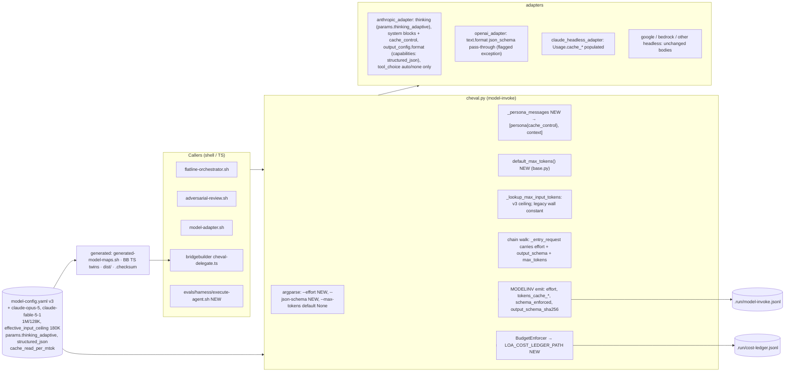
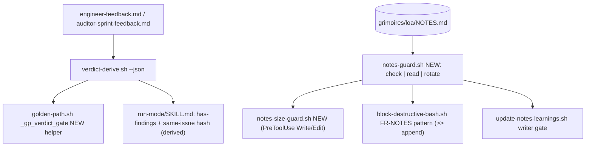

# Cycle-124 SDD — Model-Generation Floor

> **Version**: 1.0
> **Cycle**: `cycle-124-model-generation-floor`
> **PRD**: `grimoires/loa/prd.md` (FR-1 … FR-10, AC-n.m referenced below)
> **Design provenance**: four independent design panels (3 angles × 4 areas, 2 judges each, one synthesis per area — workflow `wf_dbac0c36-a2b`), every symbol grep-verified on `origin/main` 80be4b0f; **NEW** marks what does not exist yet. Lead decisions that override a panel recommendation are marked **LEAD**.
> **Design stance**: surgical, test-first, additive-only where a field is read by code that predates it; byte-identical request bodies for every provider and model not named by an FR; no fence weakened; no new config surface beyond the ones the PRD names.

---

## 1. Architecture

### 1.1 System overview

Loa's model traffic has one chokepoint — `cheval.py` (`model-invoke`) — fed by shell orchestrators and the Bridgebuilder TypeScript tool, and fanned out to provider adapters. This cycle changes (a) how cheval **shapes** an Anthropic request (thinking, output budget, cached system blocks, structured output), (b) the **catalog** that drives that shaping, (c) two **gates** that consume model output (`golden-path.sh`, run-mode), (d) the **observability** trail (MODELINV envelope, cost ledger, CLI JSON), (e) the **prompt surface** the skills load, and (f) the **memory file** every session reads.


```mermaid
flowchart LR
  subgraph callers["Callers (shell / TS)"]
    FL[flatline-orchestrator.sh]
    AR[adversarial-review.sh]
    MA[model-adapter.sh]
    BB[bridgebuilder cheval-delegate.ts]
    EV[evals/harness/execute-agent.sh NEW]
  end
  subgraph cheval["cheval.py (model-invoke)"]
    ARGS["argparse: --effort NEW, --json-schema NEW, --max-tokens default None"]
    PERSONA["_persona_messages NEW → [persona{cache_control}, context]"]
    DEF["default_max_tokens() NEW (base.py)"]
    GATE["_lookup_max_input_tokens: v3 ceiling; legacy wall constant"]
    CHAIN["chain walk: _entry_request carries effort + output_schema + max_tokens"]
    MI["MODELINV emit: effort, tokens_cache_*, schema_enforced, output_schema_sha256"]
    LEDGER["BudgetEnforcer → LOA_COST_LEDGER_PATH NEW"]
  end
  subgraph adapters
    AN["anthropic_adapter: thinking (params.thinking_adaptive), system blocks + cache_control, output_config.format (capabilities: structured_json), tool_choice auto/none only"]
    OA["openai_adapter: text.format json_schema pass-through (flagged exception)"]
    CH["claude_headless_adapter: Usage.cache_* populated"]
    OTH["google / bedrock / other headless: unchanged bodies"]
  end
  CAT[("model-config.yaml v3\n+ claude-opus-5, claude-fable-5-1\n1M/128K, effective_input_ceiling 180K\nparams.thinking_adaptive, structured_json\ncache_read_per_mtok")]
  GEN["generated: generated-model-maps.sh · BB TS twins · dist/ · .checksum"]
  callers --> cheval --> adapters
  CAT --> cheval
  CAT --> GEN --> BB
  cheval --> MI --> RUN[(.run/model-invoke.jsonl)]
  cheval --> LEDGER --> COST[(.run/cost-ledger.jsonl)]
```

Gates and memory (independent of the request path):


```mermaid
flowchart TB
  RF[engineer-feedback.md / auditor-sprint-feedback.md] --> VD[verdict-derive.sh --json]
  VD --> GP["golden-path.sh _gp_verdict_gate NEW helper"]
  VD --> RM["run-mode/SKILL.md: has-findings + same-issue hash (derived)"]
  NOTES[(grimoires/loa/NOTES.md)] --> NG["notes-guard.sh NEW: check | read | rotate"]
  NG --> HOOK["notes-size-guard.sh NEW (PreToolUse Write/Edit)"]
  NG --> FRN["block-destructive-bash.sh FR-NOTES pattern (>> append)"]
  NG --> UNL["update-notes-learnings.sh writer gate"]
```

### 1.2 Design principles applied

1. **One decision, one place.** Thinking → one catalog boolean read by one adapter line. Output budget → one function. Schema enforcement → one per-hop capability check in the adapter, one derived `schema_enforced` flag consumed everywhere else. Verdict gate → one helper in `golden-path.sh`.
2. **Back-compat by construction.** `_transform_messages` returns today's string unless a `cache_control` marker is present; `--json-schema` omitted ⇒ `output_schema=None` ⇒ body unchanged; `params.thinking_adaptive` absent ⇒ no `thinking` key; every new MODELINV field optional; other adapters merge N system messages back to today's string.
3. **Truthful telemetry.** `schema_enforced` is derived from the body the adapter actually sent; cache counts come from the parsed `usage`; effort is recorded as dispatched.
4. **Fences are added, never loosened.** `FR-NOTES` is a new pattern; the KF-002 legacy-transport wall survives as a constant; the pre-flight ceiling is unchanged at the probed value.
5. **Honest scope.** Live HTTP behavior is unverifiable here (no credential, `cli-only`); the design ships request-body tests and live scaffolds and names the operator step (PRD §7).

### 1.3 Component inventory (what changes, by unit)

| Unit | Component | Files | Lands |
|---|---|---|---|
| U3 | Ledger isolation (FR-6) | `cheval.py:1437`, `metering/ledger.py` helper, `tests/conftest.py` NEW, `tools/check-ledger-hygiene.sh` NEW, 4 bats + 1 TS test edits, `bats-tests.yml`, `git-hooks/pre-push-audit`, runbook NEW | Sprint 1, first |
| U0 | MODELINV payload schema (optional fields) + mixed-writer fixture | `model-invoke-complete.payload.schema.json`, `tests/fixtures/modelinv/mixed-writer-rows.jsonl` NEW, consumer runs | Sprint 1, before U2 |
| U1 | Catalog + defaults + ceiling (FR-2, FR-3) | `model-config.yaml` (+checksum, incl. `structured_json` tokens), `model-config-v3.schema.json`, generated maps/TS/dist, `.loa.config.yaml(.example)`, `providers/base.py`, `cheval.py` (argparse, request build, chain rebuild, `_lookup_max_input_tokens`), `adversarial-review.sh` budget, `lib-content.sh`, 2 CI grafts, `live-floor-check.yml` NEW (credential-gated) | Sprint 1 |
| U2 | Adapter shaping (FR-1, FR-4) | `anthropic_adapter.py`, `claude_headless_adapter.py`, `cheval.py` (persona messages, MODELINV capture, CLI JSON), `pricing.py`, `ledger.py`, `budget.py`, `modelinv.py`, live scaffold `tests/replay/test_cycle124_live_floor.py` | Sprint 1 |
| — | Verdict gates (FR-5) | `golden-path.sh`, `run-mode/SKILL.md`, `sprint-completion.md`, bats | Sprint 1 |
| S2 | Structured outputs (FR-7) | `types.py`, `anthropic_adapter.py`, `claude_headless_adapter.py` (`--json-schema` forwarding), `openai_adapter.py` (flagged hunk, own commit), `cheval.py`, `model-adapter.sh`, `adversarial-review.sh`, `flatline-orchestrator.sh`, `normalize-json.sh` (unchanged), `.claude/schemas/wire/*.wire.json` NEW, configs, fixtures | Sprint 2 |
| S3 | Prompt audit + review recall (FR-8, FR-9) | 13 `SKILL.md` + resources, `CLAUDE.loa.md`, protocols, personas, `karpathy-principles.md`, `protocols-summary.md`, `model-adapter.sh` effort, `flatline-orchestrator.sh` effort, `tools/check-prompt-budget.sh` NEW, `tools/prompt-keeplist.txt` NEW, evals executor/fixtures/graders NEW, CI workflow NEW | Sprint 3 |
| S4 | Memory gate (FR-10) | `notes-guard.sh` NEW, `notes-size-guard.sh` NEW, `block-destructive-bash.sh` (+pattern), `settings.json` (+entry), `update-notes-learnings.sh`, protocols/docs, memo NEW | Sprint 4 |

---

## 2. Data design

### 2.1 Catalog (`.claude/defaults/model-config.yaml`, schema v3)

New/changed keys on `providers.anthropic.models.*`:

| Key | Type | Meaning | Read by |
|---|---|---|---|
| `params.thinking_adaptive` | bool, NEW | emit `thinking: {type: adaptive}` | `anthropic_adapter.complete()` |
| `params.temperature_supported` | bool (exists) | now `false` on every `thinking_adaptive: true` entry | `anthropic_adapter.complete()` |
| `capabilities[]` gains `structured_json` | string token, NEW | entry accepts `output_config.format` | `anthropic_adapter.complete()` |
| `context_window` | int | 1,000,000 on the 4.6+ family | `enforce_context_window`, BB codegen |
| `max_output_tokens` | int | 128,000 on the 4.6+ family; now load-bearing as the default clamp | `default_max_tokens()` via `_lookup_max_output_tokens()` NEW |
| `effective_input_ceiling` + `ceiling_calibration` | int + object (v3 fields exist) | 180,000 probed; `{source: kf_derived, calibrated_at: null, stale_after_days: 90}` ⇒ non-stale | `_lookup_max_input_tokens`, pre-flight gate, AC-3.5 matrix |
| `max_input_tokens`, `streaming_max_input_tokens`, `legacy_max_input_tokens` | removed from Anthropic entries | — | (non-Anthropic entries keep theirs; the split tests stay live) |
| `pricing.cache_read_per_mtok` | int micro-USD, NEW | 0.1× input; `claude-fable-5-1` = 250,000; `claude-fable-5` = 1,000,000 | `pricing.find_pricing` |

Entries (values per the `claude-api` reference, model table cached 2026-06-24; `catalog-evidence.md` records `reference|probed` per value):

| Entry | ctx | out | thinking_adaptive | structured_json | pricing in/out (µ$/MTok) | cache read | fallback_chain |
|---|---|---|---|---|---|---|---|
| `claude-fable-5-1` NEW | 1M | 128K | absent | yes | 10,000,000 / 50,000,000 | 250,000 | fable-5 → opus-5 → headless |
| `claude-fable-5` | 1M | 128K | absent | yes | 10,000,000 / 50,000,000 | 1,000,000 | opus-4-8 → sonnet-5 → headless |
| `claude-opus-5` NEW | 1M | 128K | true | yes | 5,000,000 / 25,000,000 | 500,000 | opus-4-8 → sonnet-5 → headless |
| `claude-opus-4-8` | 1M | 128K | true | yes | 5,000,000 / 25,000,000 | 500,000 | opus-4-7 → sonnet-4-6 → headless |
| `claude-opus-4-7` | 1M | 128K | true | **no** | unchanged | 500,000 | unchanged |
| `claude-opus-4-6` | 1M | 128K | true | **no** | unchanged | 500,000 | unchanged |
| `claude-sonnet-5` | 1M | 128K | true | yes | **2,000,000 / 10,000,000** (was 3/15) | 200,000 | unchanged |
| `claude-sonnet-4-6` | 1M | 128K | true | **no** | unchanged | 300,000 | unchanged |
| `claude-sonnet-4-5-*`, `claude-haiku-4-5-*` | 200K | unchanged | absent | haiku: yes | unchanged | 0.1× | unchanged |
| `claude-headless` | 200K | — | absent | no | — | — | terminal |

Every Anthropic HTTP entry: `effective_input_ceiling = min(180000, context_window − default_max_tokens(entry))` — 180,000 for every current entry (the 200K entries declare no `max_output_tokens`, so their default is 4,096 and `200000 − 4096 > 180000`); the catalog test asserts the **computed** value per entry, not a constant. `ceiling_calibration` on each. **Bridgebuilder budgets follow the same ceiling**: `gen-bb-registry.ts` derives `maxInput` for an entry from `effective_input_ceiling − 20000` when the field is present and from `context_window` otherwise, so BB truncates at 160K for Anthropic voices instead of dispatching a 900K diff that cheval's pre-flight would reject with exit 7 (SDD Flatline SKP-003); the generated header comment says so and AC-3.5 gains "BB prepare output for a 900K fixture ≤ the cheval ceiling". Aliases: `opus → anthropic:claude-opus-5`, `fable → anthropic:claude-fable-5-1`; bare self-maps `claude-opus-5`, `claude-fable-5-1` in `backward_compat_aliases`. `.loa.config.yaml:36` and `.loa.config.yaml.example:2675` advisor → `claude-opus-5`.

Schema edits (`model-config-v3.schema.json`): `params.properties` gains typed `temperature_supported: boolean` and `thinking_adaptive: boolean`; `additionalProperties` stays open because non-Anthropic entries carry their own `params` keys (verified by a grep over the live yaml before the edit; if none exist, `false` is set) — a misspelt key is caught by the catalog invariant test (`thinking_adaptive` present on exactly the six adaptive entries) rather than by the schema; `model-config-v3-schema.bats` validates the full live yaml against v3. Nothing else changes (`capabilities` is a free string array; `pricing` an open object).

Catalog invariants (pytest over the live yaml, `test_anthropic_catalog_floor.py` NEW): the two new entries exist; the 4.6+ family is 1M/128K; no Anthropic entry carries a v2 input field; every Anthropic HTTP entry has a positive ceiling with the kill switch unset and set, and carries `ceiling_calibration` (an enforcement-critical field without provenance fails the test); `thinking_adaptive ⇒ temperature_supported == false`; `structured_json` exactly on the supported set; `effective_input_ceiling + default_max_tokens(entry) ≤ context_window`; `cache_read_per_mtok == input_per_mtok // 10` except entries listed in `catalog-evidence.md` as documented exceptions (`claude-fable-5-1` at 0.025× per the reference); Sonnet 5 priced 2/10; aliases retargeted; every `providers.anthropic.models.*` id appears in the adapter's effort-family table; every `fallback_chain` target exists (existing invariant suite).

Generated artifacts, regenerated in the same commit as the yaml by one deterministic script `tools/regen-model-artifacts.sh` NEW (sequence: `gen-adapter-maps.sh` → `npm run gen-bb-registry` → `npm run build` → checksum; `--check` runs the three drift checks; a bats case pins idempotence): `generated-model-maps.sh`, `config.generated.ts` / `core/truncation.generated.ts` / `lib/*.generated.ts`, `dist/*.generated.js` + `dist/.build-manifest.json` (`check-bb-dist-fresh.sh` excludes codegen outputs, so a bats case pins `dist/core/truncation.generated.js` ≡ the `.ts` twin), `model-config.yaml.checksum`. Model-not-found (404) on a primary id is classified chain-walkable in cheval's error taxonomy (pinned by a chain-walk test) so a newly named id that an account does not yet serve falls to the next hop. CI grafts: `cycle099-sprint-1e-tests.yml` smoke step flips to `--to-v3` + the v3 schema; `tests/integration/cheval-input-gate.bats` G7 updated to the v3 field and the file added to `bats-tests.yml`'s run list.

### 2.2 Request shape (canonical → Anthropic wire)

`CompletionRequest` (`types.py:13-26`) gains one field: `output_schema: Optional[Dict[str, Any]] = None`. A canonical `role: system` message may carry an optional `cache_control` key (dict) — no new dataclass; messages are plain dicts.

**Operator kill switch (LEAD, SDD Flatline round 2 SKP-001)**: one env var, `LOA_CHEVAL_LEGACY_WIRE=1`, read by `providers/base.py` next to `_streaming_disabled()` (same truthy set) and honored by the Anthropic adapter: when set, the adapter emits none of the new wire keys — no `thinking`, no `system` block array (plain string), no `output_config.format`, and `tool_choice` handling as today — so the body is byte-identical to the pre-cycle shape; `schema_enforced` reports `false`; MODELINV `kill_switch_active` (existing field) records it. It is the same class as `LOA_CHEVAL_DISABLE_STREAMING` — an operator backstop, not a rollback mechanism (rollback stays `git revert`) — and a golden-body test pins the legacy body under the switch. No other new config surface.

`anthropic_adapter.complete()` body construction order (after this cycle):

```
model, messages, max_tokens
[temperature]              if params.temperature_supported (default True) — dropped with a logged warning otherwise
[system]                   str  when no system message carries cache_control (today's shape)
                           list when one does: [{type:text,text:persona,cache_control:{type:ephemeral}}, {type:text,text:context}]
[tools]                    unchanged (no strict, no cache_control — render order tools→system→messages means the persona breakpoint already covers them)
[tool_choice]              {type:auto} | {type:none} only; "required"/unknown → InvalidInputError
[thinking]                 {type:adaptive} iff params.thinking_adaptive; never budget_tokens, never disabled
[output_config.effort]     unchanged precedence (request.effort > metadata.effort)
[output_config.format]     {type:json_schema, schema} iff request.output_schema and "structured_json" in model_config.capabilities
```

`CompletionResult.metadata` gains `schema_enforced: bool` (derived as `"format" in body.get("output_config", {})`) at both result sites (streaming `:289-310`, non-streaming `:396-415`). `Usage.cache_read_input_tokens/cache_creation_input_tokens` (exist) are populated on the non-streaming path and by `claude_headless_adapter.py:322-328` (today metadata-only).

`default_max_tokens()` NEW in `providers/base.py` beside `_streaming_disabled()` — **scoped to Anthropic hops** (LEAD, SDD Flatline SKP-001: a provider-agnostic default would change every OpenAI/Google/Bedrock body and multiply their worst-case spend; NFR-1 wins):

```python
_LEGACY_DEFAULT_MAX_TOKENS = 4096   # every non-Anthropic provider keeps today's literal

def default_max_tokens(*, provider, model_max_output):
    if provider != "anthropic":
        return _LEGACY_DEFAULT_MAX_TOKENS
    base = 16_000 if _streaming_disabled() else 64_000      # non-streaming capped regardless of effort
    if isinstance(model_max_output, int) and model_max_output > 0:
        return min(base, model_max_output)
    return _LEGACY_DEFAULT_MAX_TOKENS                        # no declared cap → today's value (all Anthropic entries declare one)
```

(No `effort` parameter: effort does not change the base — streaming is 64K for every level and the kill switch caps at 16K for every level — so the AC "`--effort xhigh` ⇒ ≥ 64,000" is satisfied by the streaming default.) `cheval.py` request build: `--max-tokens` default `None`; `max_tokens = args.max_tokens if args.max_tokens is not None else default_max_tokens(provider=<hop provider>, model_max_output=_lookup_max_output_tokens(provider, model_id, hounfour))`; `--max-tokens 0` ⇒ `INVALID_INPUT`; `effort=args.effort` and `output_schema` set on `base_request`; the `_entry_request` rebuild (`:1689-1696`) copies `effort`, `output_schema`, recomputes the default per hop, and **clamps an explicit `--max-tokens` to the hop's `max_output_tokens` with a logged clamp** (an explicit value above a fallback hop's cap would otherwise be a non-retryable 400 on exactly the hop meant to rescue the call). `_lookup_max_output_tokens()` NEW mirrors `_lookup_max_input_tokens` (raw-dict read, no `ModelConfig` change). Golden-body tests assert the literal `4096` on OpenAI, Google and Bedrock when `--max-tokens` is unset. Effort emission is per family too: entries that do not accept `output_config.effort` (`claude-sonnet-4-5-*`, `claude-haiku-4-5-*`, `claude-headless`) omit the key with a logged note, `claude-opus-4-6`/`claude-sonnet-4-6` downgrade `xhigh → high`, everything else passes all five levels — one lookup table in the adapter, one test row per family.

`_lookup_max_input_tokens` (`cheval.py:528-605`): the v3 branch stays first; a new constant `_LEGACY_TRANSPORT_INPUT_WALL = 36000` is applied as `min(v3, wall)` when `LOA_CHEVAL_DISABLE_STREAMING` is truthy (the kill-switch transport keeps its probed wall after the catalog field is removed); the v2 branch remains for non-Anthropic entries. The pre-flight gate (`_preflight_check`, `:482-525`) now fires for Anthropic entries (>180K ⇒ exit 7) — a harder failure than today's chain walk at the same threshold; pinned by an under-ceiling "still walks" case.

`_persona_messages(agent, system_override)` NEW in `cheval.py` (sibling of `_load_persona`, which stays for the string-returning callers): returns `[{role:system, content:persona, cache_control:{type:ephemeral}}, {role:system, content: CONTEXT_SEPARATOR + CONTEXT_WRAPPER_START + context + CONTEXT_WRAPPER_END + PERSONA_AUTHORITY}]`, or one **marked** message carrying the whole `--system` payload when there is no persona (PRD FR-4: "persona, or the whole `--system` payload when no persona exists" — Bridgebuilder's shape, `--agent reviewing-code` + a 9 KB stable system file; an earlier draft of this sentence said *unmarked* and was corrected in review round 1, decision SDD-R1-1); a call with neither persona nor `--system` sends no system block; `"".join(contents) == _load_persona(...)` is a pinned invariant. Non-Anthropic adapters' system transformers concatenate N system messages exactly as they concatenate today and ignore `cache_control` (golden body tests, AC-4.4).

### 2.3 Wire schemas (`.claude/schemas/wire/*.wire.json`, NEW)

Hand-authored to the strict subset both providers accept: every object `additionalProperties: false`, every property in `required`, nullable-and-required for conditional fields, no `minimum/maximum/multipleOf/minLength/maxLength/pattern`; string `format` allowed. **Field-set rule (SDD Flatline SKP-002)**: a wire schema carries the *complete* output contract its persona documents — every field the persona prompt asks for is present (optional ones nullable) — never a subset; if a field is to be dropped, the persona prompt and every downstream reader change in the same commit. The shapes below are therefore *minimums*; the authoritative field list is read from each persona's documented output schema at authoring time and pinned by the parity test.

| File | Top-level shape (minimum; full persona field set applies) | Consumer |
|---|---|---|
| `dissent-review.wire.json` | `{findings:[{id, severity: BLOCKING\|ADVISORY, category:<11 review enums>, description, failure_mode, anchor, anchor_type, scope, trigger_anchor, cross_file_justification, suggested_fix, …}]}` (optional ones nullable) | `adversarial-review.sh --type review` |
| `dissent-audit.wire.json` | same, `severity: CRITICAL\|HIGH\|MEDIUM\|LOW`, `category:<12 audit enums>` | `adversarial-review.sh --type audit` |
| `flatline-reviewer.wire.json` | `{improvements:[{id, description, priority, confidence, rationale, location, …}], summary, no_findings_reason, reviewed_sections:[string]}` | `call_model review` |
| `flatline-skeptic.wire.json` | `{concerns:[{id, concern, severity, severity_score, why_matters, location, recommendation, …}]}` | `call_model skeptic` |
| `flatline-scorer.wire.json` | `{scores:[{id, score, …}]}` per the scorer persona | `call_model score` |

Parity: `tests/unit/wire-schemas-api-safe.bats` (a) extracts the severity/category enums from the prompt text and from `validate_finding` via **anchored marker comments** added around those blocks in `adversarial-review.sh` (`# wire-enums:review:start/end`, not line numbers) and asserts equality with the wire enums, so a schema-valid finding is `validate_finding`-valid by construction; (b) extracts each Flatline persona's documented output fields (`.claude/skills/flatline-*/persona.md` schema blocks) and asserts every field is present and required in the wire twin. Constraints the subset cannot carry (≥ 40-char `no_findings_reason`, non-empty `reviewed_sections`, `length > 0` on description/failure_mode) stay in `validate_agent_response` / `validate_finding` post-response. The existing `.claude/schemas/*.schema.json` remain documentation contracts; `adversarial-finding.schema.json` `$defs/metadata` gains `parse_path` and `schema_enforced` (its `required` stays `[type, status]`).

Merge graph, commit labels, and per-unit gates: PRD §7 (the table there is normative; this SDD's §1.3 lists the files).

### 2.4 MODELINV envelope and cost ledger

`model-invoke-complete.payload.schema.json` (`additionalProperties: false`) gains optional properties: `tokens_cache_read` (int ≥ 0), `tokens_cache_creation` (int ≥ 0), `schema_enforced` (bool), `output_schema_sha256` (string, 64 hex). `output_schema_sha256` is computed over one canonical serialization — `json.dumps(schema, sort_keys=True, separators=(",", ":"))` (bash producers use `jq -cS .`) — so semantically identical schemas with different whitespace hash equal; one fixture hash is pinned in both pytest and bats. The OpenAI `text.format.name` is the schema file's basename without extension, sanitized to `[A-Za-z0-9_-]` and truncated to 64 characters. `payload.effort` already exists and is now set (`_modelinv_state["effort"]` seeded from `args.effort`). Consumers are tested against rows with the fields absent **and** rows with explicit `0`/`false`. **No `writer_version` bump** (LEAD, per D1: `tools/modelinv-rollup.sh:184,203` hard-pins `"1.2"` while the source-of-truth file reads 1.3; a bump would deepen a live strip-detector false positive — separate bead). Consumers read absent as 0/false; a committed mixed-log fixture (`tests/fixtures/modelinv/mixed-writer-rows.jsonl` NEW) exercises `economy.py`, `health.py`, `journal.py`, `modelinv-rollup.sh`, `modelinv-coverage-audit.py`.

Cost ledger rows (schemaless JSONL, additive): `tokens_cache_read`, `tokens_cache_creation`. `pricing.py`: `PricingEntry.cache_read_per_mtok: int = 0` (read in `find_pricing`), `CostBreakdown.cache_read_cost_micro` / `cache_creation_cost_micro`; `calculate_total_cost(..., cache_read_tokens=0, cache_creation_tokens=0)` bills reads at the entry rate (0 when absent → cost 0, pinned) and writes at `input_per_mtok * 5 // 4` (1.25×, the 5-minute TTL — the only TTL emitted; no config surface for the write rate). `budget.py:220-239` passes `result.usage.cache_*`; `ledger.py:33-99` gains the two kwargs. `pricing_snapshot` in MODELINV gains `cache_read_per_mtok`.

Ledger path resolution (FR-6): one helper `resolve_cost_ledger_path(metering_config)` NEW in `metering/ledger.py` — `LOA_COST_LEDGER_PATH` env > `metering.ledger_path` > `.run/cost-ledger.jsonl` — with path safety (sprint Flatline SKP-003): the result is canonicalized (`os.path.realpath`), a symlink at the target path is rejected (`INVALID_CONFIG`), the parent directory must exist, and absolute/relative/symlink/missing-parent/`..`-traversal cases are pinned in `test_ledger_isolation.py`; used by `cheval.py:1437` and by every reader: `economy.py`, `health.py`, `journal.py`, `cost-report.sh` (`--ledger` default) **and `rollup.py:44 default_ledger_path()`**, whose `cheval-cost-rollup.bats` pin is extended with an env-override case so writers and readers can never diverge.

### 2.5 State files and artifacts

| Artifact | Change |
|---|---|
| `.run/model-invoke.jsonl` | rotated via `audit-envelope.sh seal MODELINV` + `mv .run/archive/model-invoke-<UTC-ts>.jsonl`; fresh chain restarts at GENESIS (lib behavior, `audit-envelope.sh:184-203`) |
| `.run/cost-ledger.jsonl` | moved whole to `.run/archive/` after confirming every `mock-` row has `cost_micro_usd: 0` |
| `grimoires/loa/a2a/sprint-N/prompt-audit/` | per-file `<slug>.report.md` + `<slug>.patch`; `keep-list` lives in `tools/prompt-keeplist.txt` (repo-tracked, bats-read) |
| `grimoires/loa/a2a/sprint-N/ab/` | fixture manifest (sha256), `prompt_tree_sha` per arm, executor model id per trial, per-trial outputs, `compare.sh` result |
| `grimoires/loa/a2a/sprint-N/catalog-evidence.md` | value → `reference` (claude-api, cached 2026-06-24) or `probed` (`GET /v1/models`, when a credential exists; probed wins) |
| `grimoires/loa/archive/notes/NOTES-<UTC>.md` | rotation target (gitignored via `archive/`) |
| `grimoires/loa/archive/protocols/` NEW | the three archived protocols (`git mv`, history preserved) |
| `grimoires/loa/runbooks/ledger-hygiene-rotation.md` NEW; `grimoires/loa/reports/2026-09-17-notes-vs-memory-tool.md` NEW | runbook; decision memo |

---

## 3. Component designs

### 3.1 FR-6 — ledger isolation and tripwire (U3, first)

- `cheval.py:1437`: `ledger_path = resolve_cost_ledger_path(metering_config)`.
- `.claude/adapters/tests/conftest.py` NEW (~12 lines): function-scoped autouse fixture; `monkeypatch.setenv` `LOA_COST_LEDGER_PATH` and `LOA_MODELINV_LOG_PATH` under `tmp_path` **only when unset** (so `test_falls_back_to_config_when_env_unset` can clear them).
- `cheval-delegate-e2e.test.ts:44,81`: set both vars in `process.env` around the two spawn cases, restore after (no production change; `cheval-delegate.ts:175-179` spreads `process.env`).
- Four bats suites gain `export LOA_COST_LEDGER_PATH="$TMP_DIR/cost-ledger.jsonl"` beside their existing MODELINV export.
- `tools/check-ledger-hygiene.sh` NEW: `--root <dir>` (contract tests), `--quiet`, exit 0 clean / 1 violations (path + line to stderr) / 2 arg or IO error; `SKIP: <path> absent (nothing scanned)`; rules: cost ledger `.model|.agent|.provider` starting `mock-`; MODELINV row containing `/tmp/cheval-e2e-`. Structural companion (AC-6.4): `tests/unit/ledger-isolation-discovery.bats` greps every test source that spawns `cheval.py`, `model-adapter.sh` or `cheval-delegate` and asserts both env exports or the shared setup helper.
- CI: `bats-tests.yml` step **after** pytest/bats with positive/negative sentinel controls (`--root`), comment stating the ordering dependency; `.claude/scripts/git-hooks/pre-push-audit` gains one `--quiet` call.
- Runbook executed locally in this cycle (AC-6.3).

### 3.2 FR-2/FR-3 — catalog, defaults, ceiling (U1)

Order inside the unit: catalog + schema + generated artifacts + CI grafts → `default_max_tokens` + `_lookup_max_output_tokens` + argparse (`--effort`, `--max-tokens` None) + request build + chain rebuild → `_lookup_max_input_tokens` constant → `adversarial-review.sh` budget → KF-002 row.

**Output budgets and timeouts at the call sites** (sprint Flatline SKP-003): the 64K default exists for open-ended calls; every dispatcher whose output shape is bounded passes an explicit `--max-tokens` sized to it — `adversarial-review.sh` dissent 16,000, `flatline-orchestrator.sh` review/skeptic 16,000 and scorer 4,000, `cheval-delegate.ts` (BB) 16,000 — so `flatline_protocol.*.timeout_seconds: 600` and the delegate timeout never meet a 64K-output call; a `budget.py` per-call cost-ceiling test runs the mock fixture at the new pricing, and a timeout-audit table (worst-case output tokens × observed tokens/s vs each timeout) goes in the Sprint 1 report. `adversarial-review.sh:72`: `DEFAULT_PRIMARY_TOKEN_BUDGET=24000` becomes a function of the resolved dissenter model's company: Anthropic ⇒ `160000` (`_ANTHROPIC_DISPATCH_INPUT_BUDGET`, ceiling − 20K headroom), else 24000; the estimated input tokens are logged before dispatch. BB truncation follows `effective_input_ceiling − 20000` through codegen (§2.1). The AC-3.5 matrix (`tests/integration/input-size-consumers.bats` NEW) drives fixtures of 120K/160K/180K/200K/900K estimated tokens through the cheval pre-flight (`--dry-run`, with `LOA_CHEVAL_DISABLE_INPUT_GATE` and `LOA_CHEVAL_DISABLE_STREAMING` in all four combinations — both set together is allowed: the gate is off and the 16K default applies), `enforce_context_window` (pytest), BB `TOKEN_BUDGETS` (node one-liner over the generated twin; 900K fixture ⇒ output ≤ 160K) and `prepare_content`, asserting which gate fires first and that nothing above the ceiling is ever dispatched.

`--effort` validation: `choices=[low, medium, high, xhigh, max]`; the adapter keeps `_VALID_EFFORT`; for `claude-opus-4-6`/`claude-sonnet-4-6` (no `xhigh` per the reference) `xhigh` is downgraded to `high` with a logged warning inside the adapter's effort block (one dict lookup on `request.model`, tested per family) — no catalog key.

### 3.3 FR-1/FR-4 — adapter shaping (U2)

`anthropic_adapter.complete()`, immediately after the temperature gate:

```python
if params.get("thinking_adaptive", False):
    body["thinking"] = {"type": "adaptive"}
```

Temperature: when `temperature_supported` is false and the caller passed a non-default temperature, log `WARNING: temperature dropped for <model> (thinking-enabled / sampling params rejected)` — today's silent omission made visible.

`_transform_messages` (`:450-486`): accumulate `(content, cache_control)` per system message; return the joined string when no marker was seen, else `[{"type": "text", "text": content, **({"cache_control": cc} if cc else {})} ...]`; `complete()` assigns the result to `body["system"]` unchanged. Exactly one breakpoint per body (test). `_parse_response` populates the two cache fields on `Usage` for the non-streaming path; the streaming parser already does (`anthropic_streaming.py:167-169,320-321`) and gets a streaming fixture case in `cycle-124-cache-telemetry.bats`. `claude_headless_adapter.py:322-328` sets them on `Usage` as well as `metadata`. Thinking-bearing responses: `_parse_response` already selects blocks by `type` (`:359-382` — `thinking` blocks go to `thinking_parts`, `text` blocks to content) and the streaming parser already consumes `thinking_delta`/`signature_delta` (`test_anthropic_streaming.py` "cot then answer" case); both get an explicit fixture with a `thinking` block **preceding** the text block, since FR-1 makes that the common shape. The temperature gate also drops `top_p`/`top_k` on `temperature_supported: false` entries (same logged warning; pinned in `test_anthropic_thinking.py`).

cheval: `_persona_messages` at the messages assembly (`:1361-1375`); MODELINV capture of cache counts beside `tokens_input/tokens_output` (`:1939-1944`, same defensive `isinstance(int)` shape); CLI JSON `usage` (`:2028-2031`) gains both fields; `operator_visible_warn` set when a thinking-enabled response ends `stop_reason: max_tokens`.

Cache eligibility table (G-3) is a doc table in the sprint report and in `context-engineering.md`; no code decides eligibility — the marker is always emitted and the counts tell the truth.

### 3.4 FR-5 — verdict gates

`golden-path.sh`: one helper `_gp_verdict_gate <file> <gate>` (returns 0 pass / 1 deny) replaces the two duplicated bodies at `:112-116` and `:139-143`. Both call sites keep their `-f verdict-derive.sh && grep -q '<!-- LOA-VERDICT '` guard, so a file that reaches the helper **always contains a trailer marker**; therefore inside the helper **any exit 2 denies** (it can only mean a present-but-unparseable trailer or a usage error — `verdict-derive.sh:72,77,82,87` exit 2 before `emit_json`), `rc != 0` or `.consistent != true` denies and prints the violations, and only `rc == 0 ∧ consistent ∧ verdict == APPROVED` passes. Genuine legacy files (no marker) never enter the helper and keep today's prose fallback byte-for-byte. Call sites become `_gp_verdict_gate …; return $?`.

`run-mode/SKILL.md`: `:123`/`:127` "has findings" ⇒ "`verdict-derive.sh` exits 0 and `.verdict == APPROVED`; anything else — including an inconsistent trailer — counts as findings"; `:203-205` Issue-Hash Tracking ⇒ when a trailer exists hash `verdict-derive --json | jq -Sc '{verdict,counts}'`, else today's recipe verbatim (labelled fallback), `echo "none"` when absent; one sentence on coarseness. `sprint-completion.md:67-76` gains the trailer path + fail-closed rule.

### 3.5 FR-7 — structured outputs (S2)

Enforcement pipeline:

```
--json-schema <file> ──► cheval: read+json.loads once, size ≤ 64 KB, object ──► base_request.output_schema
                                                                      └─► _entry_request.output_schema (per hop)
anthropic_adapter:       "structured_json" in capabilities ? output_config.format : (omit) ──► metadata.schema_enforced (derived)
claude_headless_adapter: argv += ["--json-schema", json.dumps(schema)]; content = parsed["result"];
                         schema_enforced = parsed.get("structured_output") is not None      (probed on this host: structured_output returned)
openai_adapter:          text.format = {type:json_schema, name, strict:true, schema}      (flagged hunk, own commit)
codex/gemini headless, google, curl fallback: schema ignored ──► schema_enforced false
cheval envelope: schema_enforced, output_schema_sha256 ──► MODELINV (optional fields)
model-adapter.sh translate_output: + schema_enforced: (.schema_enforced // false)   ◄── without this the flag dies at the dissent hop
adversarial-review.sh / qualify_flatline_content:
   schema_enforced == true  → jq_strict parse only; failure or stop_reason ∉ {end_turn} → malformed_response; parse_path=schema_enforced; NO repair;
                              the raw content is written to the sidecar and the legacy normalize parser runs ONCE for telemetry only
                              (sidecar field would_have_recovered: true|false) — the verdict stays malformed_response/DEGRADED
   otherwise                → today's normalize path (fence strip + raw_decode) byte-for-byte; parse_path=normalized;
                              repair loop at CURRENT depth, always on (LEAD: flag removed, loop kept until the measured ratio retires it)
DEGRADED emit on rejected_count > 0: unconditional (flag removed)
schema_enforced ratio per voice AND per adapter kind (http vs cli) from .run/model-invoke.jsonl: documented jq one-liner,
   recorded in the sprint report over ≥ 20 calls (one Flatline run + one review dissent); the cli-only host cannot measure the http path
rows written before a response body exists (transport failure): schema_enforced/parse_path absent, never false
```

Call-site wiring: `flatline-orchestrator.sh call_model` gains a 7th positional `schema_file` appended as `--json-schema` **after** the D3 `if/else` (`:952-971`) so both argv branches carry it; review/skeptic/scorer sites (`:1567-1609`, `:1778-1815`) pass their wire schema; the three `run_inquiry` dispatches (`:1415-1421`) pass nothing (regression-locked). `adversarial-review.sh invoke_dissenter` gains an optional `schema_file` forwarded as `--json-schema`; the caller selects `dissent-${type}.wire.json`. `model-adapter.sh` gains the `--json-schema` case arm and forwards it.

Repair loop (`adversarial-review.sh:105,133,381-500,1063-1120,1148-1151`): `CONF_REPAIR_LOOP` and the `repair_loop:` key (`.loa.config.yaml:356`, `.example:1415`) are removed; **LEAD (skeptic SKP-002, KF-004 recurrence 28)**: the loop body (`_repair_finding_via_model`) is **kept at its current depth and runs unconditionally on the unenforced branch**; the enforced branch never enters it (a schema-valid payload has nothing to repair; an invalid one is `malformed_response`). `tests/unit/adversarial-review-repair-loop.bats` is updated for the flag-less behavior (no env toggle; the enforced-branch case asserts zero repair calls) and joined by `adversarial-review-schema-enforced.bats`, `adversarial-review-degraded-on-rejection.bats` and `repair-loop-flag-removed.bats` (greps `repair_loop|CONF_REPAIR_LOOP` → 0). Retirement of the loop is a follow-up bead keyed to the measured `schema_enforced` ratio (PRD FR-7 item 6).

`claude_headless_adapter.py` (`:184-234` argv builder, `:281-330` parser): the adapter probes flag support once per process (`claude --help` contains `--json-schema`, cached) and forwards `--json-schema <compact JSON>` only when supported — otherwise the call proceeds unenforced with `schema_enforced: false` (never an unknown-flag failure on an older CLI); on parse, when `structured_output` is present the content is `json.dumps(parsed["structured_output"], separators=(",", ":"))` (the `result` string may be prose or empty when the enforced payload lives in `structured_output`), else `result` as today; `metadata["schema_enforced"] = "structured_output" in parsed and parsed["structured_output"] is not None`. The stubbed-CLI unit test uses the **real captured CLI JSON** from this host's probe (`claude -p --output-format json --json-schema … ` → `structured_output: {"answer":"PONG","n":42}`, `result: "{\"answer\":\"PONG\",\"n\":42}"`, `stop_reason: tool_use`) plus an older-CLI stub that lacks the flag. Codex (`codex exec --output-schema <file>` exists) and Gemini headless stay unforwarded — follow-up bead, multi-provider. A chain hop that lacks `structured_json` (or a headless hop) continues **unenforced** with `schema_enforced: false`; no caller fails closed on that transition (the enforced-branch parser only runs when the flag is true).

`_transform_tool_choice`: `auto`/`none` unchanged; `required`, `any`, `tool`, `""` and unknown ⇒ `InvalidInputError`. `test_providers.py:215-216` updated.

OpenAI pass-through (flagged exception, isolated commit): in `_build_responses_body` where `text.format` is already set (`openai_adapter.py:399` region), when `request.output_schema` is set emit `text.format = {type: json_schema, name: <basename>, strict: true, schema}` and set `metadata.schema_enforced` the same way; body-capture test; documented in the PR as a droppable hunk.

### 3.6 FR-8/FR-9 — prompt audit, coverage-first review, effort (S3)

**Audit pipeline**: 49 units (13 oversized skills, `CLAUDE.loa.md`, 30 protocols, 5 personas); one Sonnet subagent per file dispatched as a **read-only agent type** (`loa-scout`/Explore — no Write/Edit tools, which is the mechanical write boundary; the subagent returns report + unified diff as structured text and the lead persists both under the audit dir), ≤ 6 concurrent; inputs: the file, `prompt-audit.md` Groups 1–4 + keep list, `model-migration.md` Fable 5.1 sections, `tools/prompt-keeplist.txt`; outputs under `grimoires/loa/a2a/sprint-N/prompt-audit/`. Lead gate (PRD FR-8) before any hunk lands; deletion rule for MUST/NEVER/ALWAYS.

**Byte routes**: skills — (1) registry-render shared blocks already duplicated ≥ 3× into `.claude/data/skill-includes/`; (2) move conditionally-read material to `resources/` behind a guarded one-line pointer (the budget check charges any *unguarded* read); (3) delete history narrative, NLEER scaffolds, choreography for judgment phases, generic virtues, emphasis. `CLAUDE.loa.md` — Karpathy kernel (~1,500 B) + pointer to `karpathy-principles.md`, self-description updated; sections collapsed to Reference-Files rows: Run Bridge, Flatline, Multi-Model, BUTTERFREEZONE, Agent Teams, Agent-Network L1–L7, Post-merge, Post-PR BB, Session-limit, Post-Compact, Invisible Prompt/Retrospective, Guardrails; kept verbatim: the 5 generated blocks, the Three-Zone table, Golden Path + Workflow tables, Reference Files table, the Agent-Network universal-invariants paragraph. Protocols — `git mv` `risk-analysis.md`, `upgrade-process.md`, `sprint-completion.md` to `grimoires/loa/archive/protocols/` with `protocols-summary.md` rows removed in the same commit (17,397 B); §3a-class cuts on the top 10; the budget check enforces ≤ 200,000 B (warn > 143,360) this cycle and the report lists the per-file residual.

**Provenance footer** (only place `cycle-NNN`/`#NNNN`/`KF-NNN` may appear): `## Provenance` + `<!-- provenance: … -->`. Exemption: `KF-NNN` pointers that are the instruction (Context Intake discipline, KF surface format).

**Coverage-first block** (replaces `reviewing-code/SKILL.md:94-101` floors and `:155` escalation; same block into `auditing-security/SKILL.md`, appended to `flatline-reviewer/persona.md` and `flatline-skeptic/persona.md`):

```markdown
### Coverage

Report every finding you actually observe. Do not withhold one because it looks minor,
because you are unsure, or because the sprint otherwise looks fine — a separate mechanical
step filters, and a finding you drop here is lost.

Each finding carries a `file:line`, a concrete failure scenario, a severity
(`critical|high|medium|low`) and a confidence (`high|medium|low`). Severity is the damage if
the scenario happens; confidence is how sure you are that it happens. They are independent.

`critical` and `high` findings go under `## Changes Required` and are counted in the
LOA-VERDICT trailer whatever their confidence. The only exception is a finding you mark
`speculative` with confidence `low`; it moves to `## Observations` and the trailer records it
under `excluded`. `medium` and `low` findings go under `## Observations`, which is not a
blocking heading and is not counted. Never emit a `## Findings` or `## Issues` heading —
`verdict-derive.sh` treats those as blocking on an approved file. You do not decide the
verdict; the counts do.
```

`verdict-derive.sh` change is additive and **mechanical, not model-chosen** (SDD Flatline round 2 SKP-001; sprint Flatline SKP-004): the trailer may carry `excluded: N` (int ≥ 0, default 0); `critical` findings are **never** excludable (a `critical` under `## Observations` or tagged `speculative` is a consistency violation, exit 1); a `high` finding may be excluded only when its Observations entry carries both the `speculative` tag and `confidence: low`; `excluded > 0` on an `APPROVED` review is allowed but emits a warning, `_gp_verdict_gate` surfaces the count, and the **audit gate must confirm each exclusion independently**: `auditor-sprint-feedback.md`'s trailer carries `excluded_confirmed: N`, `verdict-derive.sh --gate audit` (given `--review-file`) flags a mismatch with the review's `excluded` as inconsistent, and **`golden-path.sh`'s audit gate itself requires the match (fail closed; absent reads as 0)** — so a second voice, not the reviewer, clears every demoted high, and the golden path cannot advance on an unconfirmed exclusion. Both polarities and the audit cross-check are pinned in `verdict-observations-section.bats`. The one-way rule, the `All good` rule and the ritual string are untouched.

**Effort wiring** (zero new config): frontmatter `effort:` (validated today) — `reviewing-code` and `implementing-tasks` declare `xhigh`, `auditing-security` `high → medium`; `model-adapter.sh` `resolve_effort()` NEW beside the `--skill` forward (`:529-533`): `--effort` arg > `yq '.effort' .claude/skills/$skill/SKILL.md` > none; invalid ⇒ no flag; appends `--effort`; `flatline-orchestrator.sh` mode → effort case beside `PER_CALL_MAX_TOKENS` (`review|skeptic → xhigh`, `score → medium`); delete `.loa.config.yaml.example:213-224` and the `budget_ranges` sample in `docs/integration/runtime-contract.md:371-383`. Effort is a pure function of the skill (F5 cache safety).

**Eval A/B**: `evals/harness/execute-agent.sh` NEW at `run-eval.sh:379-380`, gated on `.agent.skill`; runs `claude -p --output-format json --model "$EVAL_MODEL" --effort "$EVAL_EFFORT" --allowed-tools Read,Grep,Glob,Write --permission-mode acceptEdits` with cwd = sandbox; records the CLI-echoed model id; env-isolated (`LOA_MODELINV_LOG_PATH`, `LOA_COST_LEDGER_PATH` into the sandbox). Fixtures `evals/fixtures/review-prs/pr-{01..10}/` built by `evals/fixtures/build-review-corpus.sh` NEW from this repo's `fix(...)` commits (inverted `git show` as `head.diff`, `git archive <sha>^` as `base/`; 24 seeded defects over pr-01..08 = 6 critical / 8 high / 6 medium / 4 low; pr-09/10 clean; hidden manifest with defect id, file, anchor line, `must_match`). Graders `recall-vs-defects.sh` NEW (match = same file within ±3 lines and `must_match`; emits `{pass, score, details:{recall, false_positives, model, effort}}`) and `verdict-consistency.sh` NEW (delegates to `verdict-derive.sh --gate review --require-trailer`); `evals/graders/allowlist.txt` updated. Arms: A = pre-audit prompts via `git worktree add` at the merge-base; B = audited tree; 10 × 3 trials; baseline `evals/baselines/review-recall.yaml` carries `prompt_tree_sha`; `compare.sh` refuses a baseline equal to the current tree. Gate: per-defect recall B ≥ A, false positives B ≤ A, audit planted-defect detection B ≥ A, audit tokens ≤ 0.5×; the prompt-diet arm runs at fixed effort; the effort arm is a second single-variable run (token dimension only in this sandbox).

**Constraint temp twins**: delete the 10 tracked `*.constraint-XXXXXX` files; `no-backup-files.yml:55` regex gains `\.constraint-[A-Za-z0-9]{6}$`.

**Reminder hooks**: unchanged (already one-shot); `tests/unit/reminder-hooks-one-shot.bats` NEW pins it; the 32 parity goldens stay byte-identical because no hook text is touched.

### 3.7 FR-10 — memory gate (S4)

`notes-guard.sh` NEW (~110 lines, bash, `set -euo pipefail`, `--file` on every subcommand):

| Subcommand | Behavior |
|---|---|
| `check` | `stat -c%s`; `< 102400` silent exit 0; `≥ 102400` `NOTES-WARN: <bytes> — run /compound or notes-guard.sh rotate` on stderr, exit 0; `≥ 204800` `NOTES-BLOCK: … appends refused` on stderr, exit 3. Optional `--delta <bytes>` lets the hook ask "would this write grow the file past the block line". |
| `read` | one `awk` pass over `^## ` boundaries; emits `## Blockers` (all such blocks, in file order — duplicates are concatenated, not deduplicated), the last `## Session Continuity*` block **by the date in its heading** (falling back to file position when no date parses), the 3 newest `## Decision Log*` blocks **by heading date** (the live file prepends, `update-notes-learnings.sh` appends, so position is not reliable; a mixed-direction fixture pins the rule); Blockers first so the highest-signal section survives the cap; hard cap 69,632 B (68 KiB ≤ 70,000 = 20k tokens × 3.5) with a footer naming `read --full`; if none of the three headings match, emits `NOTES-GUARD: no known sections (template drift) — showing head` then `head -c 69632`; never empty. `--full` = `cat`. `rotate` retains exactly the same selection in the same order. |
| `rotate` | copy → `grimoires/loa/archive/notes/NOTES-<UTC-%Y%m%dT%H%M%SZ>.md`; `sync -d` the archive; refuse an existing target (exit 4); write retained sections + `## Archive pointers` line via tmp-file + `mv`; never `git stash`. |

`notes-size-guard.sh` NEW (PreToolUse, 5th entry in the existing `Write|Edit|MultiEdit|NotebookEdit` array at `settings.json:560`, behind `hook-guard.sh`): parse `.tool_input.file_path`; `realpath -m` it and compare with `realpath -m "$(get_grimoire_dir)/NOTES.md"` (configurable dir); any other path, missing file or unparseable payload ⇒ exit 0 fast; compute the delta in **bytes** (`LC_ALL=C`, `${#var}` / `wc -c`) — Write: `bytes(content) − current_size`; Edit: `bytes(new_string) − bytes(old_string)` (× occurrences when `replace_all`); MultiEdit: the sum over its edits — and call `notes-guard.sh check --delta`; deny (`{"decision":"deny"}` with the repair text) only when the file is ≥ 200 KiB **and** the delta is > 0 (LEAD: deny, not ask — the escape hatch is tested open). `block-destructive-bash.sh`: new `FR-NOTES` pattern in the existing dispatch (pre-filter `*NOTES.md*`; match `>>[[:space:]]*[^;&|]*grimoires/loa/NOTES\.md`; block only when `check` exits 3; message names `rotate`). `update-notes-learnings.sh`: `check` before the appends (`:136-140`) and the rewrite (`:172-191`); exit 3 without writing on block.

Readers: `session-continuity.md:129` → `notes-guard.sh read`; `:141` → `read --full` (explicit request only); `translating-for-executives/SKILL.md:294` and `ride-translation.md:84` → `read`; `structured-memory.md` row + thresholds; `context-engineering.md:14` "Memory size gate" row; `NOTES.md.template` heading `## Decisions` → `## Decision Log`; `hooks-reference.md` accepted-bypass note. Decision memo per PRD FR-10 (5).

---

## 4. Interfaces

### 4.1 cheval CLI (additive)

| Flag | Type | Default | Notes |
|---|---|---|---|
| `--effort` | `low\|medium\|high\|xhigh\|max` | none | → `CompletionRequest.effort`; MODELINV `payload.effort` |
| `--json-schema PATH` | file | none | → `output_schema`; `INVALID_INPUT` on unreadable/unparseable/non-object/> 64 KB |
| `--max-tokens N` | int | **None** (was 4096) | `0` ⇒ `INVALID_INPUT`; unset ⇒ `default_max_tokens()` |

CLI JSON output gains `usage.cache_read_input_tokens`, `usage.cache_creation_input_tokens`, `schema_enforced`.

### 4.2 Shell contracts

- `model-adapter.sh`: `--json-schema PATH`, `--effort LEVEL` (or frontmatter resolution); `translate_output` adds `schema_enforced`.
- `flatline-orchestrator.sh call_model <model> <mode> <input> <phase> [context] [timeout] [schema_file]`.
- `adversarial-review.sh invoke_dissenter … [schema_file]`; metadata `parse_path`, `schema_enforced`.
- `golden-path.sh _gp_verdict_gate <file> <review|audit>` → 0 pass / 1 deny (no exit-2 path; legacy files never reach it).
- `notes-guard.sh {check [--delta N] | read [--full] | rotate} --file PATH`.
- `tools/check-ledger-hygiene.sh [--root DIR] [--quiet]`; `tools/check-prompt-budget.sh [--json] [--root DIR]`.
- `evals/harness/execute-agent.sh --task-yaml … --workspace … --model … --effort …` (called by `run-eval.sh`).

### 4.3 Environment

`LOA_COST_LEDGER_PATH` NEW (mirrors `LOA_MODELINV_LOG_PATH`); `LOA_RUN_LIVE_TESTS=1` gates every live scaffold (skip, not fail, otherwise); `LOA_CHEVAL_DISABLE_STREAMING` semantics unchanged (16K default, 36K input wall).

---

## 5. Error handling

| Situation | Behavior |
|---|---|
| `--max-tokens 0`, bad `--json-schema`, `tool_choice` `required`/unknown | `INVALID_INPUT` (exit 2), JSON on stderr; never silently rewritten |
| Provider 400 attributable to `output_config` on a hop | classified `INVALID_INPUT` (non-retryable), surfaced; not walked |
| Input > `effective_input_ceiling` (Anthropic) | pre-flight exit 7 (`CONTEXT_TOO_LARGE`) before adapter setup; under-ceiling still walks the chain |
| Non-streaming request with a large budget | default capped at 16K, cap logged |
| `temperature` on a `temperature_supported: false` entry | dropped with a logged warning |
| Thinking-enabled response ends `max_tokens` | `operator_visible_warn` in MODELINV |
| Schema-enforced content fails strict parse or `stop_reason ≠ end_turn` | `malformed_response` + sidecar; never clean-zero; DEGRADED emit |
| `verdict-derive.sh` usage error / empty JSON | gate denies (fail closed), stderr surfaced |
| NOTES.md ≥ 200 KiB growing write | denied with the remedy; `rotate` and shrinking writes allowed; hook fails open on its own parse error (hook-guard) |
| Ledger env override points at an unwritable path | same behavior as today's `ledger.py` open failure (surfaced), nothing falls back to the production ledger silently |

---

## 6. Testing strategy

Failing test first per task (PRD NFR-4). New/changed suites, by unit:

| Unit | pytest | bats / TS | Fixtures |
|---|---|---|---|
| U3 | `test_ledger_isolation.py` (env wins, config fallback, conftest isolates both, mock run leaves repo ledgers byte-identical) | `ledger-hygiene-tripwire.bats` (reject mock row, reject e2e path, accept clean, SKIP on absent, sealed+moved chain verifies), `ledger-isolation-discovery.bats`; `cheval-delegate-e2e.test.ts` "repo .run ledgers untouched" | sentinel dirs under `tests/fixtures/ledger-hygiene/` |
| U1 | `test_anthropic_catalog_floor.py` (computed ceiling per entry), `test_max_tokens_defaults.py` (Anthropic scope; literal 4096 for other providers; explicit value clamped per hop), extended `test_chain_walk_audit_envelope.py` | `cycle-124-anthropic-catalog.bats` (dry-run aliases, generated maps, `TOKEN_BUDGETS` ≤ ceiling per Anthropic entry, dist ≡ ts), `cycle-124-effort-flag.bats` (the literal `--effort xhigh` AC via `--dry-run`, MODELINV `payload.effort`, per-family effort emission), `input-size-consumers.bats` (AC-3.5 matrix incl. the env-toggle combinations), updated `cheval-input-gate.bats` G7, `model-config-v3-schema.bats` over the full live yaml | mock-fixture dirs; 120K–900K synthetic inputs generated at test time |
| U2 | `test_anthropic_thinking.py`, `test_anthropic_cache_control.py`, `test_cache_read_pricing.py`, edited `test_anthropic_effort.py`, Bedrock/OpenAI/Google golden-body tests (AC-1.2, AC-4.4) | `cycle-124-cache-telemetry.bats` (mock fixture with `cache_read_input_tokens: 4096` reaches MODELINV, CLI JSON, temp ledger) | `tests/fixtures/modelinv/mixed-writer-rows.jsonl` |
| FR-5 | — | extended `golden-path-c8-verdict-trailer.bats` (7 new cases incl. fail-closed and legacy), doc-lock on `run-mode/SKILL.md` | scratch `golden-path.sh` copy pattern from the existing suite |
| S2 | `test_anthropic_output_schema.py`, `test_tool_choice_no_forced_modes.py`, `test_cheval_json_schema_flag.py` (incl. the pinned `output_schema_sha256` fixture hash), OpenAI pass-through body test, stubbed-CLI headless `--json-schema` test | `wire-schemas-api-safe.bats` (enum + persona field-set parity), `model-adapter-json-schema-forwarding.bats`, `adversarial-review-schema-enforced.bats`, `adversarial-review-degraded-on-rejection.bats`, `repair-loop-flag-removed.bats`, updated `adversarial-review-repair-loop.bats`, `flatline-call-model-schema.bats`, extended `flatline-content-qualified-quorum.bats` | `tests/fixtures/structured-outputs/{kf004,kf023}/`; malformed-response records go to the existing per-sprint `adversarial-rejected-<type>.jsonl` sidecar (fields: `index`, `reason`, `schema_enforced`, `parse_path`, `stop_reason`; retention = the sprint's a2a dir) |
| S3 | — | `prompt-budget.bats`, `prompt-audit-keeplist.bats`, `no-history-in-rule-text.bats`, `prompt-audit-generated-blocks.bats`, `no-constraint-temp-files.bats`, `protocol-refs-resolve.bats`, `verdict-observations-section.bats`, `effort-dispatch.bats`, `reminder-hooks-one-shot.bats`, `skill-loop-golden-scope.bats`; `evals/tests/{execute-agent,recall-baseline-freshness,eval-recall-grader}.bats` | `evals/fixtures/review-prs/`, `tools/prompt-keeplist.txt` |
| S4 | — | `notes-guard.bats`, `notes-size-guard.bats`, extended `block-destructive-bash.bats` (FR-NOTES), extended `notes-template.bats` | `tests/fixtures/notes/make-large-notes.sh` (generates 100 KiB / 200 KiB / 250 KiB / 750 KB at test time) |

Live scaffolds (`LOA_RUN_LIVE_TESTS=1`, skipped otherwise): `tests/replay/test_cycle124_live_floor.py` — for each of Opus 5, Sonnet 5, Fable 5.1, Haiku 4.5: one call returns the expected `thinking` shape; two identical BB-voice calls show `cache_read_input_tokens > 0` on the second; one schema-enforced call returns strict JSON; `GET /v1/models` probe and `tools/ceiling-probe.py` → `catalog-evidence.md` (values flip `reference → probed`). Wired into `.github/workflows/live-floor-check.yml` NEW (`workflow_dispatch` + `pull_request`; secrets cannot be read in `if:` directly, so a job-level `env: HAS_KEY: ${{ secrets.ANTHROPIC_API_KEY != '' }}` gates every step with `if: env.HAS_KEY == 'true'`; fork PRs never see the secret, so the job is meaningful only on same-repo branches and manual dispatch — documented in the workflow header; retries ×2 per assertion; artifact upload of the outputs). The operator adds the secret and marks it required. Until then it is the named merge precondition in the draft PR. **Merge readiness vs implementation completeness** (SDD Flatline SKP-002/SKP-001): implementation is complete when the request-body tests and fixtures are green; merge readiness additionally requires the recorded live pass for U2 and Sprint 2 — no runtime feature flag is added (rollback policy is `git revert`; the gate sits at merge, and catalog values stay marked `reference` until probed).

Regression baselines: adapter pytest 1937 passed / 6 skipped (2026-09-17); verdict-gate bats 32/32; parity goldens 32/32.

Rollback proof (PRD §7): once per unit on a scratch branch — `git revert`, then drift gates + adapter suite + golden-path/verdict bats.

---

## 7. Development phases

| Sprint | Tasks (order) | Exit |
|---|---|---|
| 1 | U3 (FR-6) → U0 MODELINV schema + mixed-writer fixture → U1 catalog (incl. `structured_json`)/schema/generated/CI grafts + `live-floor-check.yml` → U1 defaults + `--effort` + chain rebuild + legacy wall + dispatch budget + KF-002 row → U2 thinking → U2 cache blocks + telemetry + pricing + live scaffold → FR-5 gates → local ledger rotation → rollback proof | PRD Sprint 1 exit gate; live scaffolds committed |
| 2 | wire schemas + lint → `output_schema` + gated Anthropic emission + `schema_enforced` → `claude_headless` `--json-schema` forwarding → tool_choice removal → cheval flag + envelope → model-adapter forwarding → enforced parse branch → repair-loop flag removal (loop kept on unenforced) + unconditional DEGRADED → flatline plumbing → `qualify_flatline_content` branch → fixture corpus → OpenAI pass-through (isolated commit) → configs + KF-004 attempt row + `schema_enforced` ratio measurement on this host | PRD Sprint 2 exit gate |
| 3 | budget check + keep list + provenance/generated/constraint-temp gates + CI → arm-A baseline (pre-audit worktree) → 49-unit audit with lead gate → 3 protocol archivals → coverage-first prompts + `excluded` trailer field → effort wiring → eval executor/fixtures/graders → arm B + compare + parity verify → report residual | PRD Sprint 3 exit gate |
| 4 | `notes-guard.sh` + fixtures → hook + FR-NOTES + writer gate → readers/docs → memo | PRD Sprint 4 exit gate |

Cross-cutting after every `.claude/` change: `repo-map-gen.sh`; after every catalog change: the three generated families + checksum; `REPO-MAP.md` checksum gate in CI.

---

## 8. Risks and mitigations (design-level)

| Risk | Mitigation |
|---|---|
| Wire-contract assumptions unverified live (thinking + format interaction, `system` array + `cache_control`, Fable rejecting explicit `thinking`) | Every shape follows the API reference verbatim; request-body tests pin them; draft PR with the credentialed live check as merge precondition |
| `enforce_context_window` headroom shrinks by the larger default on 200K entries | Anthropic-only scope; catalog clamp; 4096 fallback for undeclared caps; AC-2.4 invariant `ceiling + default ≤ window` |
| Generated artifacts and their source change in different diffs | the three drift gates fail the PR when only one side changes; the unit rule (§1.3) keeps source + generated in one commit |
| Pre-flight preempt converts >180K prompts from chain walk to exit 7 | same threshold as today; under-ceiling "still walks" test; noted in the report |
| Cache floors non-monotonic (4096 on Opus 4.6/Haiku) — marker no-ops on most Flatline voices | eligibility table; live check on the BB voice; no padding |
| Deleting the live-`true` repair loop removes the dissenter's only self-correction | loop kept at current depth on the unenforced branch (flag removed, always on); unconditional DEGRADED; claude-headless enforced; OpenAI enforcement pass-through (flagged); retirement keyed to the measured `schema_enforced` ratio |
| Wire-schema `additionalProperties: false` forbids a sibling `metadata` block a model could previously emit | today's parser ignores it; wire-visible change named in the PR |
| Prompt audit becomes a length contest | keep-list bats + lead gate + parity goldens byte-identical + A/B with clean PRs |
| `conftest.py` autouse across the whole adapter suite | set-only-if-unset + explicit fallback test |
| `rotate` rewrites an untracked, unrecoverable file | archive-then-fsync-then-write, ordering asserted |
| Tripwire vacuous on fresh CI checkout | post-test placement + sentinel controls + pre-push hook |
| MODELINV rotation restarts the chain; `modelinv-v1.3-backcompat.bats` passes vacuously | runbook points it at the archived file |

---

## 9. Flatline record (SDD)

| Round | Cohort | Outcome | Integration |
|---|---|---|---|
| 1 (2026-09-17T03:05Z) | opus (claude-headless) + gpt-5.5 (codex-headless), 2/2; Phase 2 ran, cross-scoring degraded | 0 HIGH_CONSENSUS, **6 BLOCKERs** (720–910), 24 medium | Accepted: Anthropic-only `max_tokens` default (SKP-001), BB budgets from the ceiling (SKP-003), full persona field set in wire schemas + parity (SKP-002), merge-readiness split restated (SKP-002/SKP-001). Not adopted with rationale: runtime feature flag for unverified shapes (rollback policy is `git revert`; gate is at merge), staged telemetry before `additionalProperties:false` (enforced output is schema-valid by construction). Medium items folded: canonical `output_schema_sha256`, OpenAI schema name sanitization, env-toggle combinations in AC-3.5, malformed sidecar location/fields, absent-and-zero consumer tests, `rotate` ordering/duplicates, per-entry computed ceiling, per-family effort emission, `params` schema scope, byte-based MultiEdit delta, `rollup.py` resolver, streaming cache fixture, `HAS_KEY` env gate + fork note, `_gp_verdict_gate` exit-2 denies, per-hop explicit `max_tokens` clamp, `effort` parameter removed from `default_max_tokens`, `repair-loop-flag-removed.bats` naming. |
| 2 (2026-09-17T03:25Z) | same cohort, 2/2, cross-scoring degraded | 0 HIGH_CONSENSUS, **5 BLOCKERs** (710–880), 26 medium | Accepted: `LOA_CHEVAL_LEGACY_WIRE` operator kill switch (SKP-001 880 — the streaming kill-switch precedent; not a rollback mechanism), mechanical `excluded` rules with audit cross-check (SKP-001 740), headless flag probe + `structured_output` preference + real captured fixture (SKP-002 710), telemetry-only legacy parse on enforced failures (SKP-003), provenance test on enforcement-critical fields (SKP-002 780). Medium folded: thinking-first parser fixtures, `top_p`/`top_k` drop, cache-rate rule + exceptions, gate contract 0/1, anchored enum markers, effort-table invariant, ratio per adapter kind + sample size, no-body rows, date-based NOTES selection, hop-without-schema continues unenforced, kill-switch signal in MODELINV, per-hop clamp + retry test, evidence owner = lead at the `live-floor-check` artifact. Not adopted: splitting Sprint 1 into two sprints (per-unit commits and the merge graph give the checkpoints; the framework reviews per sprint). Loop closed at round 2 for the SDD; residual theme (unverified wire facts) is owned by the PRD §7 merge precondition + the kill switch. |

## 10. Open decisions taken by the lead (recorded)

| # | Panel recommendation | Decision |
|---|---|---|
| D1-1 | keep `legacy_max_input_tokens: 36000` field + branch above v3 | field removed per the PRD; **wall kept as a constant** in the kill-switch branch (`_LEGACY_TRANSPORT_INPUT_WALL`) — same protection, no catalog field |
| D1-2 | flip `cycle099-sprint-1e-tests.yml` to v3 in T1.3 | accepted (AC-3.6) |
| D1-3 | accept pre-flight preempt at 180K | accepted, pinned |
| D2-1 | do **not** add the OpenAI `text.format` pass-through | **overridden**: added as an isolated, flagged hunk (the default dissenter is OpenAI; without it FR-7 is nominal for KF-004) |
| D2-2 | `run_inquiry` stays unenforced | accepted |
| D2-3 | DEGRADED on `> 0` | accepted; and the repair loop is **kept at current depth (always on) on the unenforced branch** — Flatline skeptic SKP-002 (CRITICAL) + KF-004 recurrence 28; retirement is a measured follow-up |
| D2-4 | (panel silent) headless enforcement | `claude-headless` forwards `--json-schema` (probed: `structured_output` returned) so the operator's live Anthropic path is enforced |
| D3-1 | protocols budget 200 KB this sprint, residual to a bead | accepted (fail 200 KB, warn 140 KB, report per file) |
| D3-2 | Karpathy kernel + pointer | accepted |
| D3-3 | audit `high → medium` gated on the A/B | accepted |
| D4-1 | deny (not ask) at 200 KiB | accepted, with direction-awareness (shrinking writes allowed) |
| D4-2 | leave frozen `translate-ride-v*` snapshots | accepted, grep-locked |
| D4-3 | rotate the operator's ledgers inside the cycle | accepted (runbook executed locally in Sprint 1) |
| SDD-FL-1 | Flatline SKP-001: scope the new `max_tokens` default | **accepted**: Anthropic hops only; other providers keep the literal 4096 (PRD Q3 amended) |
| SDD-FL-2 | Flatline SKP-003: BB budgets vs the cheval ceiling | **accepted**: BB codegen derives `maxInput` from `effective_input_ceiling − 20000` for Anthropic entries |
| SDD-FL-3 | Flatline SKP-002: wire schemas narrower than persona contracts | **accepted**: full persona field set + parity test |
| SDD-FL-4 | Flatline SKP-002/SKP-001: live verification as a hard gate / feature flag | **partially**: merge readiness split from implementation completeness via the draft PR + `live-floor-check.yml`; no runtime flag (rollback policy is `git revert`) |
| SDD-R1-1 | Review round-1 high #1: §2.2 said the persona-less `--system` payload travels **unmarked**, inverting PRD FR-4; Bridgebuilder (no persona.md) never cached | **corrected**: the whole payload carries the breakpoint (`cheval._persona_messages`), the AC-4.3 live scaffold builds its body through `_persona_messages` + `_transform_messages` with the real BB prefix, `context-engineering.md` gains the BB row |
| SDD-R1-2 | Review round-1 high #5: the cost-ledger resolver anchored relative config/default paths at the CWD while the MODELINV twin anchors at the repo root | **corrected**: config/default paths anchor at the project root; an env path stays CWD-relative (test/operator redirect, documented); existing non-regular targets are `INVALID_CONFIG` at resolve time |
| SDD-R1-3 | Review round-1 medium 8: `FLATLINE_SCORE_MAX_TOKENS=4000` on the retargeted `opus` voice shares the budget with adaptive thinking | **corrected**: 16 000 (same as review/skeptic); the per-call cost ceiling table in the report moves accordingly |
| SDD-FL-5 | Flatline SKP-003: staged telemetry before fail-closed `additionalProperties: false` | **not adopted**: an enforced response is schema-valid by construction (the provider guarantees it), so `additionalProperties: false` cannot reject model output after the fact; the residual risk was the narrow field set, fixed by SDD-FL-3; the sidecar + `schema_enforced` ratio are the telemetry |
