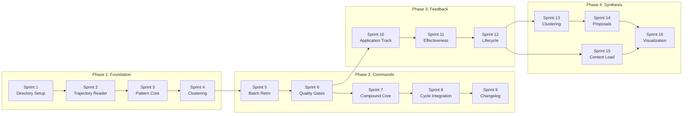

# Sprint Plan: Compound Learning System

**Version:** 1.0
**Date:** 2025-01-30
**Author:** Sprint Planner Agent
**PRD Reference:** grimoires/loa/prd.md
**SDD Reference:** grimoires/loa/sdd.md

---

## Executive Summary

The Compound Learning System extends Loa's continuous learning infrastructure to enable cross-session pattern detection, batch retrospectives, and an apply-verify feedback loop. This enables agents to genuinely get smarter over time by learning from patterns that span multiple sessions.

> From PRD: "The agent gets smarter every cycle because it reviews all work before starting the next PRD." (prd.md: Executive Summary)

**Total Sprints:** 16
**Sprint Duration:** 2.5 days each
**Estimated Completion:** ~8 weeks
**Development Phases:** 4 (aligned with SDD §10)

---

## Sprint Overview

| Sprint | Theme | Phase | Key Deliverables | Dependencies |
|--------|-------|-------|------------------|--------------|
| 1 | Foundation & Directory Setup | 1 | Compound directory structure, config schema | None |
| 2 | Trajectory Reader | 1 | Streaming JSONL reader, event parser | Sprint 1 |
| 3 | Pattern Detection Core | 1 | Keyword extraction, Jaccard similarity | Sprint 2 |
| 4 | Pattern Clustering | 1 | Cluster algorithm, pattern candidates | Sprint 3 |
| 5 | Batch Retrospective Command | 2 | `/retrospective --batch` MVP | Sprint 4 |
| 6 | Quality Gates & Skill Generation | 2 | 4-gate filter, skill file generation | Sprint 5 |
| 7 | Compound Command - Core | 2 | `/compound` command skeleton | Sprint 6 |
| 8 | Compound Command - Cycle Integration | 2 | Ledger integration, NOTES.md updates | Sprint 7 |
| 9 | Changelog & Archive | 2 | Cycle changelog, archive management | Sprint 8 |
| 10 | Learning Application Tracking | 3 | `learning_applied` events, tracking API | Sprint 6 |
| 11 | Effectiveness Scoring | 3 | Feedback signals, effectiveness calculation | Sprint 10 |
| 12 | Learning Lifecycle Management | 3 | Tier management, pruning logic | Sprint 11 |
| 13 | Synthesis Engine - Clustering | 4 | Skill clustering, similarity detection | Sprint 12 |
| 14 | Synthesis Engine - Proposals | 4 | AGENTS.md proposals, human approval | Sprint 13 |
| 15 | Context Loading | 4 | Morning context, next-cycle loading | Sprint 12 |
| 16 | Visualization & E2E Validation | 4 | Mermaid diagrams, goal validation | All |

---

## Phase 1: MVP Foundation (Sprints 1-4)

> From SDD: "Phase 1 (Week 1-2): MVP batch retrospective" (sdd.md: §10 Development Phases)

---

## Sprint 1: Foundation & Directory Setup

**Duration:** 2.5 days
**Dates:** Day 1 - Day 3 (morning)

### Sprint Goal
Establish the compound learning directory structure, configuration schema, and data file schemas required for all subsequent work.

### Deliverables
- [ ] Compound learning directory structure at `grimoires/loa/a2a/compound/`
- [ ] Configuration schema in `.loa.config.yaml`
- [ ] JSON schemas for patterns, learnings, and synthesis queue
- [ ] Trajectory event type definitions

### Acceptance Criteria
- [ ] Directory `grimoires/loa/a2a/compound/` exists with all subdirs
- [ ] Config schema validates with `yq`
- [ ] JSON schemas can be used to validate empty starter files
- [ ] New trajectory event types documented in SDD

### Technical Tasks

- [ ] Task 1.1: Create compound directory structure → **[G-1]**
  - Create `grimoires/loa/a2a/compound/`
  - Create `review-markers/` subdir
  - Create `.gitkeep` files
  - **Est:** 30 min

- [ ] Task 1.2: Define `patterns.json` schema and create empty file → **[G-1]**
  - Schema per SDD: id, type, signature, first_seen, occurrence_count, etc.
  - Create empty `{"version": "1.0", "patterns": []}`
  - **Est:** 1 hour

- [ ] Task 1.3: Define `learnings.json` schema and create empty file → **[G-4]**
  - Schema per SDD: id, source, effectiveness_score, applications array
  - Create empty starter file
  - **Est:** 1 hour

- [ ] Task 1.4: Define `synthesis-queue.json` schema and create empty file → **[G-3]**
  - Schema per SDD: proposals array with status, source_skills, proposed_text
  - Create empty starter file
  - **Est:** 1 hour

- [ ] Task 1.5: Add compound learning config section to `.loa.config.yaml` → **[G-1, G-2]**
  - `compound_learning.similarity` settings
  - `compound_learning.pattern_detection` settings
  - `compound_learning.visualization` settings
  - **Est:** 1.5 hours

- [ ] Task 1.6: Define new trajectory event types → **[G-1, G-4]**
  - Document: compound_review_start, compound_review_complete
  - Document: pattern_detected, learning_extracted
  - Document: learning_applied, learning_verified
  - Document: synthesis_proposed, synthesis_approved, synthesis_rejected
  - Add to SDD §4 Data Architecture
  - **Est:** 2 hours

- [ ] Task 1.7: Create helper script `detect-semantic-tools.sh` → **[G-1]**
  - Detect ck, Memory Stack, qmd availability
  - Export SEMANTIC_TOOLS variable
  - Per SDD §1 Semantic Search Integration
  - **Est:** 1.5 hours

### Dependencies
- None (first sprint)

### Risks & Mitigation
| Risk | Probability | Impact | Mitigation |
|------|-------------|--------|------------|
| Schema design conflicts with existing trajectory format | Low | High | Review existing JSONL files before finalizing |

### Success Metrics
- All 4 JSON files created and valid
- Config validates without errors
- Helper script detects tools correctly on test machine

---

## Sprint 2: Trajectory Reader

**Duration:** 2.5 days
**Dates:** Day 3 (afternoon) - Day 5

### Sprint Goal
Build a streaming JSONL reader that can efficiently process trajectory logs across date ranges without memory exhaustion.

### Deliverables
- [ ] Streaming trajectory reader script/module
- [ ] Event parser with typed output
- [ ] Date range filtering
- [ ] Agent filtering support

### Acceptance Criteria
- [ ] Can read 30 days of logs in < 2 minutes (per PRD NFR)
- [ ] Handles malformed JSONL lines gracefully
- [ ] Memory usage stays bounded (streaming, not loading all)
- [ ] Returns structured event objects

### Technical Tasks

- [ ] Task 2.1: Create `trajectory-reader.sh` base script → **[G-1]**
  - Accept date range parameters (--start, --end, --days)
  - Locate trajectory files in `grimoires/loa/a2a/trajectory/`
  - Stream JSONL lines
  - **Est:** 2 hours

- [ ] Task 2.2: Implement date range file selection → **[G-1]**
  - Parse filename dates (format: `{agent}-{date}.jsonl`)
  - Filter files within range
  - Handle missing days gracefully
  - **Est:** 1.5 hours

- [ ] Task 2.3: Implement event parsing with error handling → **[G-1]**
  - Parse JSON per line
  - Skip malformed lines with warning
  - Extract key fields: timestamp, agent, action, reasoning
  - **Est:** 2 hours

- [ ] Task 2.4: Add agent type filtering → **[G-1]**
  - Filter by agent name pattern
  - Support exclude list from config
  - **Est:** 1 hour

- [ ] Task 2.5: Create `get-trajectory-summary.sh` utility → **[G-1]**
  - Count events by type
  - Count events by agent
  - Return JSON summary
  - **Est:** 1.5 hours

- [ ] Task 2.6: Add streaming test with large synthetic log → **[G-1]**
  - Generate 10K event test file
  - Verify memory stays bounded
  - Benchmark performance
  - **Est:** 2 hours

### Dependencies
- Sprint 1: Directory structure and event type definitions

### Risks & Mitigation
| Risk | Probability | Impact | Mitigation |
|------|-------------|--------|------------|
| Large log files cause memory issues | Med | Med | Streaming architecture from start, test with large files |
| Date parsing edge cases | Low | Low | Use ISO date format, comprehensive tests |

### Success Metrics
- 30-day log processing < 2 minutes
- Zero memory growth during streaming
- 100% of well-formed events parsed

---

## Sprint 3: Pattern Detection Core

**Duration:** 2.5 days
**Dates:** Day 6 - Day 8 (morning)

### Sprint Goal
Implement the core pattern detection algorithm: keyword extraction and Jaccard similarity calculation.

> From SDD: "Jaccard similarity (threshold 0.6)" (sdd.md: §7 Algorithm Design)

### Deliverables
- [ ] Keyword extraction function
- [ ] Jaccard similarity calculator
- [ ] Error-solution pair extractor
- [ ] Similarity threshold configuration

### Acceptance Criteria
- [ ] Keywords extracted from error messages and solutions
- [ ] Jaccard similarity returns 0.0-1.0 score
- [ ] Similar events (> 0.6 threshold) correctly identified
- [ ] Works offline without external APIs

### Technical Tasks

- [ ] Task 3.1: Create `extract-keywords.sh` function → **[G-1]**
  - Strip common stop words
  - Normalize case and punctuation
  - Extract technical terms (camelCase, snake_case aware)
  - **Est:** 2 hours

- [ ] Task 3.2: Create `jaccard-similarity.sh` function → **[G-1, G-2]**
  - Calculate intersection / union of keyword sets
  - Return float 0.0-1.0
  - Handle empty sets gracefully
  - **Est:** 1.5 hours

- [ ] Task 3.3: Extract error-solution pairs from trajectory events → **[G-1]**
  - Identify error events (type contains "error", "fail", "exception")
  - Find subsequent solution events (type contains "fix", "resolve", "solution")
  - Pair them with session context
  - **Est:** 2.5 hours

- [ ] Task 3.4: Create `find-similar-events.sh` → **[G-1, G-2]**
  - Compare event against library of previous events
  - Return matches above threshold
  - Include similarity score in output
  - **Est:** 2 hours

- [ ] Task 3.5: Add layered similarity with ck/Memory Stack detection → **[G-1]**
  - Check SEMANTIC_TOOLS from Sprint 1
  - Use ck for code events if available
  - Use Memory Stack for text if available
  - Fall back to Jaccard
  - **Est:** 2 hours

- [ ] Task 3.6: Write similarity tests with known patterns → **[G-1]**
  - Test cases: identical events (1.0), no overlap (0.0), partial (0.4-0.8)
  - Verify threshold behavior
  - **Est:** 1.5 hours

### Dependencies
- Sprint 2: Trajectory reader to supply events

### Risks & Mitigation
| Risk | Probability | Impact | Mitigation |
|------|-------------|--------|------------|
| Keyword extraction misses technical terms | Med | Med | Whitelist common tech terms, iterate on stopwords |
| Jaccard too coarse for semantic similarity | Med | Med | Start conservative (0.6), adjust based on results |

### Success Metrics
- Keyword extraction captures 90%+ of technical terms
- Known similar events score > 0.6
- Known different events score < 0.4

---

## Sprint 4: Pattern Clustering

**Duration:** 2.5 days
**Dates:** Day 8 (afternoon) - Day 10

### Sprint Goal
Build the clustering engine that groups similar events into pattern candidates.

> From SDD: "Cluster similar events into pattern groups" (sdd.md: Component 2)

### Deliverables
- [ ] Event clustering algorithm
- [ ] Pattern candidate generation
- [ ] Confidence scoring based on occurrence count
- [ ] Pattern registry updates

### Acceptance Criteria
- [ ] Events with similarity > threshold clustered together
- [ ] Each cluster generates one pattern candidate
- [ ] Confidence increases with occurrence count
- [ ] Patterns written to `patterns.json`

### Technical Tasks

- [ ] Task 4.1: Implement naive clustering algorithm → **[G-1]**
  - For each event, find existing cluster with similarity > threshold
  - If found, add to cluster; else create new cluster
  - O(n²) acceptable for MVP
  - **Est:** 2.5 hours

- [ ] Task 4.2: Generate pattern candidates from clusters → **[G-1]**
  - Extract common keywords as pattern signature
  - Calculate occurrence count
  - Assign pattern type (repeated_error, convergent_solution, anti_pattern)
  - **Est:** 2 hours

- [ ] Task 4.3: Implement confidence scoring → **[G-1, G-2]**
  - Base confidence on occurrence count: 2=0.5, 3=0.7, 5+=0.9
  - Adjust for recency (recent patterns score higher)
  - Adjust for session diversity (same pattern across sessions = higher)
  - **Est:** 2 hours

- [ ] Task 4.4: Create `update-patterns-registry.sh` → **[G-1]**
  - Read existing `patterns.json`
  - Merge new patterns (deduplicate by signature)
  - Update occurrence counts for existing patterns
  - Write back atomically
  - **Est:** 2 hours

- [ ] Task 4.5: Add pattern filtering by age and count → **[G-1]**
  - `max_age_days` filter (default 90)
  - `min_occurrences` filter (default 2)
  - Apply during candidate generation
  - **Est:** 1.5 hours

- [ ] Task 4.6: Create test suite with synthetic clusters → **[G-1]**
  - Generate events with known clustering
  - Verify correct cluster assignment
  - Verify pattern candidate generation
  - **Est:** 1.5 hours

### Dependencies
- Sprint 3: Similarity calculation

### Risks & Mitigation
| Risk | Probability | Impact | Mitigation |
|------|-------------|--------|------------|
| O(n²) too slow for large event sets | Low | Med | Batch by session first, consider LSH later |
| Spurious clusters from noise | Med | Med | Require min_occurrences=2, human review |

### Success Metrics
- Clustering completes in < 30s for 1000 events
- Known patterns correctly identified
- False positive rate < 20%

---

## Phase 2: Compound Commands (Sprints 5-9)

> From SDD: "Phase 2 (Week 3-4): Compound cycle commands" (sdd.md: §10)

---

## Sprint 5: Batch Retrospective Command

**Duration:** 2.5 days
**Dates:** Day 11 - Day 13 (morning)

### Sprint Goal
Implement the `/retrospective --batch` command that analyzes trajectory logs across multiple sessions.

> From PRD FR-1b: "Extend `/retrospective` to support multi-session batch analysis" (prd.md)

### Deliverables
- [ ] `/retrospective --batch` command extension
- [ ] Multi-session analysis orchestration
- [ ] Pattern presentation with confidence scores
- [ ] Dry-run mode

### Acceptance Criteria
- [ ] `--batch` flag enables multi-session analysis
- [ ] `--days N` analyzes last N days
- [ ] `--dry-run` shows findings without writing
- [ ] Patterns presented with confidence and evidence

### Technical Tasks

- [ ] Task 5.1: Create `.claude/commands/retrospective-batch.md` command definition → **[G-1]**
  - Define command syntax and options
  - Document flags: --batch, --days, --sprint, --dry-run
  - **Est:** 1 hour

- [ ] Task 5.2: Create `batch-retrospective.sh` orchestrator → **[G-1, G-2]**
  - Parse command arguments
  - Call trajectory reader with date range
  - Call pattern detection
  - Format output
  - **Est:** 2.5 hours

- [ ] Task 5.3: Implement `--days N` date range handling → **[G-1]**
  - Calculate start date from N days ago
  - Pass to trajectory reader
  - Handle edge case: N > available logs
  - **Est:** 1 hour

- [ ] Task 5.4: Implement pattern presentation format → **[G-1, G-2]**
  - Show: pattern name, confidence (HIGH/MED/LOW), occurrence count
  - Show: sessions where pattern appeared
  - Show: sample error and solution
  - **Est:** 2 hours

- [ ] Task 5.5: Implement `--dry-run` mode → **[G-1]**
  - Run full analysis
  - Display what would be extracted
  - Skip writing to patterns.json and skills-pending/
  - **Est:** 1.5 hours

- [ ] Task 5.6: Add trajectory logging for batch retrospective → **[G-1]**
  - Log `compound_review_start` at beginning
  - Log `pattern_detected` for each pattern
  - Log `compound_review_complete` at end
  - **Est:** 1.5 hours

### Dependencies
- Sprint 4: Pattern clustering

### Risks & Mitigation
| Risk | Probability | Impact | Mitigation |
|------|-------------|--------|------------|
| Output too verbose for large pattern sets | Med | Low | Paginate output, summary first |
| Existing /retrospective conflicts | Low | Med | Extension, not replacement |

### Success Metrics
- Command runs successfully with `--batch --days 7`
- Patterns displayed with clear confidence levels
- Dry-run produces identical output minus writes

---

## Sprint 6: Quality Gates & Skill Generation

**Duration:** 2.5 days
**Dates:** Day 13 (afternoon) - Day 15

### Sprint Goal
Implement the 4-gate quality filter and automatic skill file generation from patterns.

> From PRD: "Applies quality gates (Discovery Depth, Reusability, Trigger Clarity, Verification)" (prd.md FR-1)

### Deliverables
- [ ] 4-gate quality filter implementation
- [ ] Skill markdown generator
- [ ] skills-pending/ file creation
- [ ] User approval workflow

### Acceptance Criteria
- [ ] All patterns pass through 4 quality gates
- [ ] Only qualified patterns become skills
- [ ] Skills written to `grimoires/loa/skills-pending/{name}/SKILL.md`
- [ ] User can approve/reject candidates

### Technical Tasks

- [ ] Task 6.1: Implement Discovery Depth gate → **[G-1, G-2]**
  - Check: Is solution non-trivial? (not just retry/restart)
  - Check: Does it contain actionable steps?
  - Score 0-10, require >= 5
  - **Est:** 1.5 hours

- [ ] Task 6.2: Implement Reusability gate → **[G-1, G-2]**
  - Check: Is pattern generalizable beyond single context?
  - Check: Keywords not hyper-specific to one file
  - Score 0-10, require >= 5
  - **Est:** 1.5 hours

- [ ] Task 6.3: Implement Trigger Clarity gate → **[G-1, G-2]**
  - Check: Can we clearly identify when this applies?
  - Check: Error signature is recognizable
  - Score 0-10, require >= 5
  - **Est:** 1.5 hours

- [ ] Task 6.4: Implement Verification gate → **[G-1, G-2]**
  - Check: Was solution actually verified to work?
  - Check: Task completed successfully after solution
  - Score 0-10, require >= 3 (lower bar)
  - **Est:** 1.5 hours

- [ ] Task 6.5: Create `generate-skill-from-pattern.sh` → **[G-1, G-2, G-3]**
  - Generate SKILL.md following existing template
  - Include: trigger, solution, provenance (sessions)
  - Write to skills-pending/{pattern-name}/SKILL.md
  - **Est:** 2.5 hours

- [ ] Task 6.6: Implement user approval prompt → **[G-1]**
  - Present qualified patterns
  - Allow Y/n/select response
  - Only generate skills for approved patterns
  - **Est:** 2 hours

- [ ] Task 6.7: Add `learning_extracted` trajectory logging → **[G-1]**
  - Log each skill extraction with pattern source
  - Include quality gate scores
  - **Est:** 1 hour

### Dependencies
- Sprint 5: Batch retrospective (provides patterns)

### Risks & Mitigation
| Risk | Probability | Impact | Mitigation |
|------|-------------|--------|------------|
| Quality gates too strict (few patterns pass) | Med | Med | Start lenient, tune based on results |
| Quality gates too loose (low-quality skills) | Med | Med | Human approval as safety net |

### Success Metrics
- 60-80% of patterns pass quality gates
- Generated skills follow template correctly
- No skills created without user approval

---

## Sprint 7: Compound Command - Core

**Duration:** 2.5 days
**Dates:** Day 16 - Day 18 (morning)

### Sprint Goal
Build the core `/compound` command that orchestrates end-of-cycle learning extraction.

> From PRD FR-1: "New end-of-cycle command that reviews all work from the current development cycle" (prd.md)

### Deliverables
- [ ] `/compound` command definition
- [ ] Core orchestration logic
- [ ] Subcommand support (--dry-run, --review-only)
- [ ] Basic cycle detection

### Acceptance Criteria
- [ ] `/compound` runs full cycle review
- [ ] `/compound --dry-run` previews without changes
- [ ] `/compound --review-only` extracts learnings without promotion
- [ ] Command detects current cycle from ledger

### Technical Tasks

- [ ] Task 7.1: Create `.claude/commands/compound.md` command definition → **[G-1, G-3]**
  - Define main command and subcommands
  - Document all flags
  - Include usage examples
  - **Est:** 1.5 hours

- [ ] Task 7.2: Create `compound-orchestrator.sh` main script → **[G-1, G-2, G-3]**
  - Parse arguments and flags
  - Call batch retrospective
  - Call skill generation
  - Coordinate output
  - **Est:** 2.5 hours

- [ ] Task 7.3: Implement cycle detection from ledger → **[G-1]**
  - Read `grimoires/loa/ledger.json`
  - Get active cycle and its sprints
  - Calculate date range from cycle sprints
  - **Est:** 1.5 hours

- [ ] Task 7.4: Implement `--dry-run` flag → **[G-1]**
  - Pass through to batch retrospective
  - Show summary of what would happen
  - Exit before any writes
  - **Est:** 1 hour

- [ ] Task 7.5: Implement `--review-only` flag → **[G-1]**
  - Run extraction but skip skill promotion
  - Skip changelog and archive
  - Useful for mid-cycle checks
  - **Est:** 1 hour

- [ ] Task 7.6: Implement `/compound status` subcommand → **[G-1]**
  - Show current cycle info
  - Show pending extractions count
  - Show skills in skills-pending/
  - **Est:** 1.5 hours

- [ ] Task 7.7: Add compound event logging → **[G-1]**
  - Log `compound_start` with cycle info
  - Log `compound_complete` with summary
  - **Est:** 1 hour

### Dependencies
- Sprint 6: Quality gates and skill generation

### Risks & Mitigation
| Risk | Probability | Impact | Mitigation |
|------|-------------|--------|------------|
| Ledger missing or malformed | Med | Med | Create ledger if missing, validate schema |
| Cycle detection fails | Low | Med | Fall back to --days 30 default |

### Success Metrics
- `/compound` completes without error
- Dry-run matches actual run output
- Status shows accurate counts

---

## Sprint 8: Compound Command - Cycle Integration

**Duration:** 2.5 days
**Dates:** Day 18 (afternoon) - Day 20

### Sprint Goal
Complete the `/compound` command with Sprint Ledger integration, NOTES.md updates, and skill promotion.

> From PRD: "Integrates with Sprint Ledger (`ledger.json`) for cycle tracking" (prd.md FR-1)

### Deliverables
- [ ] Sprint Ledger updates
- [ ] NOTES.md learnings section updates
- [ ] Skill promotion (pending → active)
- [ ] Fresh context preparation for next cycle

### Acceptance Criteria
- [ ] Ledger updated with compound completion
- [ ] NOTES.md ## Learnings section updated
- [ ] Approved skills promoted to skills/
- [ ] Context ready for next `/plan-and-analyze`

### Technical Tasks

- [ ] Task 8.1: Implement ledger update on compound completion → **[G-1, G-3]**
  - Add `compound_completed_at` to cycle
  - Add `learnings_extracted` count
  - Update cycle status if appropriate
  - **Est:** 1.5 hours

- [ ] Task 8.2: Implement NOTES.md learnings update → **[G-1, G-3]**
  - Find or create ## Learnings section
  - Append new learnings with dates
  - Include pattern summaries
  - **Est:** 2 hours

- [ ] Task 8.3: Implement skill promotion workflow → **[G-1, G-2, G-3]**
  - Move from skills-pending/ to skills/
  - Update any internal references
  - Archive promotion decision in trajectory
  - **Est:** 2 hours

- [ ] Task 8.4: Implement `--no-promote` flag → **[G-1]**
  - Skip skill promotion step
  - Leave skills in pending for later review
  - **Est:** 45 min

- [ ] Task 8.5: Prepare next-cycle context → **[G-1, G-3]**
  - Generate summary of learnings for next cycle
  - Store in compound state for retrieval
  - Clear cycle-specific caches
  - **Est:** 1.5 hours

- [ ] Task 8.6: Create `compound-summary.md` output → **[G-1, G-3]**
  - Human-readable summary of compound run
  - Include: patterns found, skills extracted, learnings added
  - Write to grimoires/loa/
  - **Est:** 1.5 hours

- [ ] Task 8.7: Write integration tests for full compound flow → **[G-1]**
  - Test with sample trajectory data
  - Verify ledger, NOTES.md, and skills/ updates
  - **Est:** 2 hours

- [ ] Task 8.8: Implement `/run sprint-plan` completion hook → **[G-1, G-3]** ⭐ NEW
  - Add `compound_review()` function to run-sprint-plan.sh
  - Hook after all sprints complete, before cleanup
  - Call batch-retrospective.sh with --sprint-plan flag
  - Extract skills (auto-approve configurable)
  - Update sprint-plan-state.json with learnings_extracted count
  - Include extracted skills in completion PR
  - Add --no-compound flag to skip
  - Non-blocking: failure logs warning, doesn't block PR
  - **Est:** 3 hours

- [ ] Task 8.9: Add compound hook configuration → **[G-1]**
  - Add `run_mode.sprint_plan.compound_on_complete` (default: true)
  - Add `run_mode.sprint_plan.compound_auto_approve` (default: false)
  - Add `run_mode.sprint_plan.compound_fail_action` (warn | fail)
  - **Est:** 1 hour

### Dependencies
- Sprint 7: Compound command core

### Risks & Mitigation
| Risk | Probability | Impact | Mitigation |
|------|-------------|--------|------------|
| NOTES.md format varies | Med | Low | Use flexible section detection |
| Skill promotion conflicts | Low | Med | Check for existing skill before move |
| Hook blocks run mode | Med | High | Non-blocking design, warn on failure |

### Success Metrics
- Ledger shows compound completion
- NOTES.md has new learnings
- Skills moved to skills/
- `/run sprint-plan` auto-triggers compound review
- Completion PR includes extracted skills

---

## Sprint 9: Changelog & Archive

**Duration:** 2.5 days
**Dates:** Day 21 - Day 23 (morning)

### Sprint Goal
Implement cycle changelog generation and archive management.

> From PRD FR-8: "Generate a comprehensive changelog summarizing what was built, learned, and improved" (prd.md)
> From PRD FR-9: "Archive cycle artifacts for historical reference" (prd.md)

### Deliverables
- [ ] Cycle changelog generator
- [ ] Archive directory management
- [ ] Retention policy implementation
- [ ] `/compound changelog` subcommand

### Acceptance Criteria
- [ ] Changelog includes tasks, skills, insights, PRs
- [ ] Archive created at `grimoires/loa/archive/cycle-N/`
- [ ] Retention policy configurable
- [ ] Standalone changelog generation available

### Technical Tasks

- [ ] Task 9.1: Create `generate-changelog.sh` → **[G-3]**
  - List features/tasks from ledger
  - List skills extracted (inline + batch)
  - List NOTES.md insights added
  - List PRs created (if git available)
  - **Est:** 2.5 hours

- [ ] Task 9.2: Implement changelog output formats → **[G-3]**
  - Markdown format (default)
  - JSON format (--output json)
  - Write to `grimoires/loa/CHANGELOG-cycle-N.md`
  - **Est:** 1.5 hours

- [ ] Task 9.3: Create `/compound changelog` subcommand → **[G-3]**
  - Standalone changelog generation
  - Works without full compound run
  - **Est:** 1 hour

- [ ] Task 9.4: Implement archive directory creation → **[G-3]**
  - Create `grimoires/loa/archive/cycle-{N}/`
  - Copy: PRD, SDD, sprint plans, trajectory subset
  - Copy: skills extracted during cycle
  - **Est:** 2 hours

- [ ] Task 9.5: Implement retention policy → **[G-3]**
  - Config: `compound_learning.archive.retention_cycles` (default 5)
  - Delete archives older than N cycles
  - Never delete current or previous cycle
  - **Est:** 1.5 hours

- [ ] Task 9.6: Implement `--no-archive` flag → **[G-3]**
  - Skip archive creation
  - Useful for /compound --review-only
  - **Est:** 30 min

- [ ] Task 9.7: Create `/compound archive` subcommand → **[G-3]**
  - Archive specific past cycle: `/compound archive --cycle N`
  - Useful for retroactive archiving
  - **Est:** 1.5 hours

### Dependencies
- Sprint 8: Compound cycle integration

### Risks & Mitigation
| Risk | Probability | Impact | Mitigation |
|------|-------------|--------|------------|
| Large archives consume disk | Med | Low | Compression option, retention limits |
| Missing artifacts in archive | Low | Med | Validate required files exist |

### Success Metrics
- Changelog covers all major cycle events
- Archive contains all essential artifacts
- Old archives cleaned per retention policy

---

## Phase 3: Feedback Loop (Sprints 10-12)

> From SDD: "Phase 3 (Week 5-6): Feedback loop" (sdd.md: §10)

---

## Sprint 10: Learning Application Tracking

**Duration:** 2.5 days
**Dates:** Day 23 (afternoon) - Day 25

### Sprint Goal
Implement tracking of when and how extracted learnings are applied during implementation.

> From PRD FR-3: "Track when extracted learnings are applied during implementation" (prd.md)

### Deliverables
- [ ] `learning_applied` event schema
- [ ] Application detection during /implement
- [ ] Query API for applications
- [ ] Explicit vs implicit detection

### Acceptance Criteria
- [ ] Application events logged to trajectory
- [ ] Skill ID, task context, type captured
- [ ] Query: "which learnings applied in session Y?"
- [ ] Both explicit and implicit detection work

### Technical Tasks

- [ ] Task 10.1: Define `learning_applied` event schema → **[G-4]**
  - Fields: timestamp, type, agent, skill_id, task_context
  - Fields: application_type (explicit/implicit/prompted)
  - Fields: confidence, code_location
  - **Est:** 1 hour

- [ ] Task 10.2: Implement explicit application detection → **[G-4]**
  - Detect phrases: "per skill X", "following skill X"
  - Extract skill_id from reference
  - Log with application_type="explicit"
  - **Est:** 2 hours

- [ ] Task 10.3: Implement implicit application detection → **[G-4]**
  - Compare code changes to skill solutions
  - Use similarity matching from Sprint 3
  - Log with application_type="implicit", lower confidence
  - **Est:** 2.5 hours

- [ ] Task 10.4: Create `query-applications.sh` API → **[G-4]**
  - Query by session ID
  - Query by skill ID
  - Query by date range
  - Return JSON list of applications
  - **Est:** 2 hours

- [ ] Task 10.5: Hook into /implement phase → **[G-4]**
  - Add tracking call after each implementation step
  - Detect skill references in agent reasoning
  - Minimal performance impact
  - **Est:** 2 hours

- [ ] Task 10.6: Create application tracking tests → **[G-4]**
  - Test explicit detection with sample text
  - Test implicit detection with code similarity
  - Verify query API returns expected results
  - **Est:** 1.5 hours

### Dependencies
- Sprint 6: Skills must exist to be applied

### Risks & Mitigation
| Risk | Probability | Impact | Mitigation |
|------|-------------|--------|------------|
| Implicit detection false positives | High | Med | Use higher similarity threshold (0.8) |
| Performance impact on /implement | Med | Med | Async logging, batch processing |

### Success Metrics
- Explicit applications detected 95%+ accuracy
- Implicit applications detected 60%+ accuracy
- Query API < 1s response time

---

## Sprint 11: Effectiveness Scoring

**Duration:** 2.5 days
**Dates:** Day 26 - Day 28 (morning)

### Sprint Goal
Implement the feedback signal collection and effectiveness scoring for applied learnings.

> From PRD FR-4: "Define 'helped' signals: task completed faster, fewer errors, no revert" (prd.md)

### Deliverables
- [ ] Feedback signal definitions
- [ ] Signal collection from task outcomes
- [ ] Effectiveness score calculation (0-100)
- [ ] `learning_verified` event logging

### Acceptance Criteria
- [ ] All 6 feedback signals implemented
- [ ] Effectiveness score calculated per learning
- [ ] Scores stored in learnings.json
- [ ] Verification events logged to trajectory

### Technical Tasks

- [ ] Task 11.1: Implement task completion signal → **[G-4]**
  - Detect task marked complete in trajectory
  - Weight: +3 for completion
  - **Est:** 1.5 hours

- [ ] Task 11.2: Implement no-errors signal → **[G-4]**
  - Check for error events during task
  - Weight: +2 for absence of errors
  - **Est:** 1.5 hours

- [ ] Task 11.3: Implement no-revert signal → **[G-4]**
  - Check git history for reverts
  - Weight: +2 for no revert within 24h
  - **Est:** 2 hours

- [ ] Task 11.4: Implement faster-completion signal → **[G-4]**
  - Compare task duration to similar tasks
  - Weight: +1 if faster than median
  - **Est:** 2 hours

- [ ] Task 11.5: Implement user feedback signals → **[G-4]**
  - Positive feedback: +3
  - Negative feedback: -5
  - Via explicit `/feedback` command
  - **Est:** 1.5 hours

- [ ] Task 11.6: Create `calculate-effectiveness.sh` → **[G-4]**
  - Aggregate signals for learning
  - Normalize to 0-100 scale
  - Update learnings.json
  - **Est:** 2 hours

- [ ] Task 11.7: Implement `learning_verified` logging → **[G-4]**
  - Log after effectiveness calculation
  - Include signal breakdown
  - **Est:** 1 hour

### Dependencies
- Sprint 10: Learning application tracking

### Risks & Mitigation
| Risk | Probability | Impact | Mitigation |
|------|-------------|--------|------------|
| Git history not available | Med | Low | Skip no-revert signal, document |
| Task comparison data sparse | Med | Med | Use absolute thresholds initially |

### Success Metrics
- All 6 signals collecting data
- Effectiveness scores distributed across range
- Known helpful learnings score > 70

---

## Sprint 12: Learning Lifecycle Management

**Duration:** 2.5 days
**Dates:** Day 28 (afternoon) - Day 30

### Sprint Goal
Implement learning tier management and pruning logic based on effectiveness.

> From SDD: "Learnings that consistently help: increase retrieval priority... Learnings that don't help: flag for review, eventual pruning" (sdd.md: Component 4)

### Deliverables
- [ ] Effectiveness tier system
- [ ] Retrieval priority adjustment
- [ ] Pruning logic for ineffective learnings
- [ ] Monthly effectiveness report

### Acceptance Criteria
- [ ] Learnings categorized into 4 tiers
- [ ] High-tier learnings retrieved preferentially
- [ ] Low-tier learnings flagged and eventually pruned
- [ ] Report shows top 5 helpful learnings

### Technical Tasks

- [ ] Task 12.1: Implement tier assignment → **[G-4]**
  - High (80-100): Increase priority
  - Medium (50-79): Normal
  - Low (20-49): Flag for review
  - Ineffective (0-19): Queue for pruning
  - **Est:** 1.5 hours

- [ ] Task 12.2: Update retrieval priority based on tier → **[G-4]**
  - High tier: 2x weight in retrieval
  - Ineffective tier: 0.5x weight
  - Store priority multiplier in learnings.json
  - **Est:** 1.5 hours

- [ ] Task 12.3: Implement pruning logic → **[G-4]**
  - Flag after 3+ ineffective applications
  - Move to skills-archived/ on prune
  - Log `learning_archived` event
  - **Est:** 2 hours

- [ ] Task 12.4: Create review queue for low-tier learnings → **[G-4]**
  - List learnings flagged for review
  - Allow manual override (keep/archive)
  - **Est:** 1.5 hours

- [ ] Task 12.5: Generate monthly effectiveness report → **[G-4]**
  - Top 5 most helpful learnings
  - Top 5 most applied learnings
  - Learnings queued for pruning
  - **Est:** 2 hours

- [ ] Task 12.6: Implement `/learning-report` command → **[G-4]**
  - Display monthly report
  - Options: --month, --top N
  - **Est:** 1.5 hours

### Dependencies
- Sprint 11: Effectiveness scoring

### Risks & Mitigation
| Risk | Probability | Impact | Mitigation |
|------|-------------|--------|------------|
| Aggressive pruning removes valuable learning | Med | High | Require 3+ failures, human review before archive |
| Tier thresholds wrong | Med | Med | Make configurable, tune based on data |

### Success Metrics
- Tier distribution: ~20% high, ~50% medium, ~30% low/ineffective
- Pruned learnings don't reappear as patterns
- Report accurately reflects helpful learnings

---

## Phase 4: Synthesis & Context (Sprints 13-16)

> From SDD: "Phase 4 (Week 7-8): Synthesis + context loading" (sdd.md: §10)

---

## Sprint 13: Synthesis Engine - Clustering

**Duration:** 2.5 days
**Dates:** Day 31 - Day 33 (morning)

### Sprint Goal
Build the skill clustering component of the synthesis engine.

> From PRD FR-5: "Cluster related skills by semantic similarity" (prd.md)

### Deliverables
- [ ] Skill similarity calculation
- [ ] Skill clustering algorithm
- [ ] Cluster quality assessment
- [ ] Minimum cluster size enforcement

### Acceptance Criteria
- [ ] Skills clustered by keyword/semantic similarity
- [ ] Clusters with 3+ skills identified for synthesis
- [ ] Cluster quality score calculated
- [ ] Clusters stored in synthesis-queue.json

### Technical Tasks

- [ ] Task 13.1: Implement skill-to-skill similarity → **[G-3]**
  - Extract keywords from SKILL.md content
  - Calculate Jaccard similarity (or embedding if available)
  - Threshold: 0.4 (lower than event matching)
  - **Est:** 2 hours

- [ ] Task 13.2: Implement skill clustering → **[G-3]**
  - Group skills with mutual similarity > threshold
  - Handle transitive relationships
  - **Est:** 2 hours

- [ ] Task 13.3: Filter clusters by minimum size → **[G-3]**
  - Require 3+ skills per cluster
  - Smaller groups remain individual skills
  - **Est:** 1 hour

- [ ] Task 13.4: Calculate cluster quality score → **[G-3]**
  - Average pairwise similarity
  - Total application count across skills
  - Average effectiveness score
  - **Est:** 1.5 hours

- [ ] Task 13.5: Store clusters in synthesis state → **[G-3]**
  - Add to synthesis-queue.json as candidates
  - Include source skill IDs
  - Include quality metrics
  - **Est:** 1.5 hours

- [ ] Task 13.6: Create `/synthesize-learnings --scan` command → **[G-3]**
  - Run clustering without generating proposals
  - Show potential synthesis candidates
  - **Est:** 1.5 hours

### Dependencies
- Sprint 12: Learning lifecycle (need active skills to cluster)

### Risks & Mitigation
| Risk | Probability | Impact | Mitigation |
|------|-------------|--------|------------|
| Insufficient skills for clustering | Med | Med | Works with even 6-9 skills, lower threshold |
| Unrelated skills clustered | Med | Med | Human review before synthesis |

### Success Metrics
- Related skills cluster together
- Unrelated skills remain separate
- Quality score predicts good proposals

---

## Sprint 14: Synthesis Engine - Merged Skills

**Duration:** 2.5 days
**Dates:** Day 33 (afternoon) - Day 35

### Sprint Goal
Generate merged skills from skill clusters with human approval workflow.

> From PRD FR-5: "Merge similar skills into single refined skill with combined triggers/solutions"
> **Design Decision**: Synthesis produces **merged skills**, not AGENTS.md updates. Skills are the atomic unit of knowledge.

### Deliverables
- [ ] Merged skill generation
- [ ] Skill naming and categorization
- [ ] Human approval workflow
- [ ] Source skill archival

### Acceptance Criteria
- [ ] Merged skills include combined triggers and solutions
- [ ] Merged skill name reflects combined content
- [ ] Human can approve/modify/reject merge
- [ ] Approved merges: new skill created, sources archived

### Technical Tasks

- [ ] Task 14.1: Generate merged skill from cluster → **[G-3]**
  - Extract common pattern across skills
  - Combine triggers from all source skills
  - Combine solutions with de-duplication
  - Include merged_from metadata
  - **Est:** 2.5 hours

- [ ] Task 14.2: Generate merged skill name and description → **[G-3]**
  - Analyze skill categories for naming
  - Generate concise description
  - Avoid overly generic names
  - **Est:** 1 hour

- [ ] Task 14.3: Create merge proposal presentation → **[G-3]**
  - Show: merged skill preview, source skills, confidence
  - Show: what will be archived
  - Buttons: [Approve] [Modify] [Reject]
  - **Est:** 1.5 hours

- [ ] Task 14.4: Implement modify workflow → **[G-3]**
  - Allow user to edit merged skill content
  - Allow changing merged skill name
  - Re-validate before applying
  - **Est:** 1.5 hours

- [ ] Task 14.5: Implement merged skill creation → **[G-3]**
  - Find target section
  - Insert/append proposal text
  - Maintain formatting
  - Backup original before change
  - **Est:** 2 hours

- [ ] Task 14.6: Log synthesis decisions to trajectory → **[G-3]**
  - `synthesis_proposed` when proposal created
  - `synthesis_approved` or `synthesis_rejected`
  - Include decision reasoning
  - **Est:** 1 hour

- [ ] Task 14.7: Optionally archive source skills → **[G-3]**
  - Config: archive_on_synthesis (default false)
  - Move to skills-archived if fully subsumed
  - **Est:** 1 hour

### Dependencies
- Sprint 13: Skill clustering

### Risks & Mitigation
| Risk | Probability | Impact | Mitigation |
|------|-------------|--------|------------|
| AGENTS.md formatting broken | Med | High | Backup, validate markdown after edit |
| Proposals too generic | Med | Med | Include specific skill examples |

### Success Metrics
- Proposals are useful guidance (subjective)
- AGENTS.md remains valid markdown
- Source skills properly cited

---

## Sprint 15: Context Loading

**Duration:** 2.5 days
**Dates:** Day 36 - Day 38 (morning)

### Sprint Goal
Implement morning context loading and next-cycle context loading.

> From PRD FR-6: "At session start, automatically load relevant learnings" (prd.md)
> From PRD FR-7: "When starting a new PRD cycle, automatically load learnings from previous cycle" (prd.md)

### Deliverables
- [ ] Morning context loader
- [ ] Next-cycle context integration
- [ ] Relevance ranking algorithm
- [ ] Dismissal handling

### Acceptance Criteria
- [ ] Top 5 relevant learnings loaded in < 5s
- [ ] Context considers task keywords
- [ ] Learnings from previous cycle available for new PRD
- [ ] User can dismiss if not relevant

### Technical Tasks

- [ ] Task 15.1: Implement task context extraction → **[G-2, G-4]**
  - Extract keywords from current task/PRD
  - Identify technical domain
  - **Est:** 1.5 hours

- [ ] Task 15.2: Query learnings by relevance → **[G-2, G-4]**
  - Match task keywords to learning keywords
  - Weight by effectiveness score
  - Weight by recency
  - **Est:** 2 hours

- [ ] Task 15.3: Generate "Before you begin" summary → **[G-2]**
  - Format top 5 learnings
  - Include confidence indicator
  - Keep concise (< 200 words total)
  - **Est:** 1.5 hours

- [ ] Task 15.4: Implement dismissal handling → **[G-2]**
  - Allow user to dismiss suggestions
  - Log dismissal for feedback loop
  - Don't show same learning if dismissed 3x
  - **Est:** 1.5 hours

- [ ] Task 15.5: Integrate with `/plan-and-analyze` → **[G-2, G-4]**
  - Detect previous cycle completion
  - Load cycle-level learnings
  - Present before PRD discovery
  - **Est:** 2 hours

- [ ] Task 15.6: Performance optimization for < 5s → **[G-2]**
  - Cache learning index
  - Limit query scope
  - Benchmark and optimize
  - **Est:** 2 hours

### Dependencies
- Sprint 12: Learning lifecycle (need scored learnings)

### Risks & Mitigation
| Risk | Probability | Impact | Mitigation |
|------|-------------|--------|------------|
| Context loading too slow | Med | Med | Caching, indexing, profiling |
| Irrelevant learnings suggested | Med | Med | Dismissal tracking, relevance tuning |

### Success Metrics
- Loading < 5s (per PRD NFR)
- 70%+ of suggestions not dismissed
- Next-cycle context aids PRD discovery

---

## Sprint 16: Visualization & E2E Validation

**Duration:** 2.5 days
**Dates:** Day 38 (afternoon) - Day 40

### Sprint Goal
Implement Mermaid visualization and validate all PRD goals end-to-end.

> From PRD FR-10: "Generate visual diagrams using Mermaid for compound learning outputs" (prd.md)

### Deliverables
- [ ] Pattern flowchart generator
- [ ] Sprint sequence diagram generator
- [ ] Learning map generator
- [ ] E2E goal validation

### Acceptance Criteria
- [ ] Mermaid diagrams render in GitHub/Notion
- [ ] ASCII fallback for terminal
- [ ] All 4 PRD goals validated with evidence

### Technical Tasks

- [ ] Task 16.1: Implement pattern flowchart generator → **[G-1]**
  - Show pattern relationships
  - Color by confidence level
  - Include session sources
  - **Est:** 2 hours

- [ ] Task 16.2: Implement sprint sequence diagram → **[G-1]**
  - Show session timeline
  - Show discovery events
  - Show skill extractions
  - **Est:** 2 hours

- [ ] Task 16.3: Implement learning map for morning context → **[G-2]**
  - Show task → learnings relationships
  - Color by effectiveness
  - **Est:** 1.5 hours

- [ ] Task 16.4: Implement ASCII fallback → **[G-1]**
  - Detect terminal-only environment
  - Generate text-based diagrams
  - **Est:** 1.5 hours

- [ ] Task 16.5: Add `--visual` flag to `/compound` → **[G-1]**
  - Generate all diagrams in single report
  - Save to grimoires/loa/diagrams/
  - **Est:** 1 hour

### Task 16.E2E: End-to-End Goal Validation

**Priority:** P0 (Must Complete)
**Goal Contribution:** All goals (G-1, G-2, G-3, G-4)

**Description:**
Validate that all PRD goals are achieved through the complete implementation.

**Validation Steps:**

| Goal ID | Goal | Validation Action | Expected Result |
|---------|------|-------------------|-----------------|
| G-1 | Enable cross-session pattern detection | Run `/retrospective --batch --days 7` with test data spanning 3 sessions | Patterns detected across sessions with correct provenance |
| G-2 | Reduce repeated investigations | Compare session-1 investigation time to session-N | Measurable reduction or learning application logged |
| G-3 | Automate knowledge consolidation | Run `/synthesize-learnings` with 4+ related skills | Valid AGENTS.md proposal generated |
| G-4 | Close the apply-verify loop | Track learning application through verification | `learning_applied` → `learning_verified` events in trajectory |

**Acceptance Criteria:**
- [ ] Each goal validated with documented evidence
- [ ] Integration points verified (data flows end-to-end)
- [ ] No goal marked as "not achieved" without explicit justification
- [ ] Test results documented in `grimoires/loa/validation-report.md`

**Est:** 4 hours

### Dependencies
- All previous sprints

### Risks & Mitigation
| Risk | Probability | Impact | Mitigation |
|------|-------------|--------|------------|
| Mermaid rendering issues | Low | Low | Test in multiple renderers |
| E2E test data insufficient | Med | Med | Generate comprehensive test fixtures |

### Success Metrics
- All diagrams render correctly
- All 4 goals pass validation
- Validation report documents evidence

---

## Risk Register

| ID | Risk | Sprint | Probability | Impact | Mitigation | Owner |
|----|------|--------|-------------|--------|------------|-------|
| R1 | Jaccard similarity insufficient for semantic matching | 3-4 | Med | Med | Start conservative, upgrade to embeddings later | Dev |
| R2 | Large trajectory files cause performance issues | 2, 5 | Med | Med | Streaming architecture, pagination | Dev |
| R3 | Quality gates filter out good patterns | 6 | Med | Med | Lenient initial thresholds, human review | Dev |
| R4 | Implicit application detection false positives | 10 | High | Med | Higher similarity threshold, explicit preferred | Dev |
| R5 | AGENTS.md corruption on synthesis | 14 | Med | High | Backup before edit, markdown validation | Dev |
| R6 | Context loading exceeds 5s | 15 | Med | Med | Caching, profiling, index optimization | Dev |

---

## Success Metrics Summary

| Metric | Target | Measurement Method | Sprint |
|--------|--------|-------------------|--------|
| Batch retrospective performance | < 2 min for 30 days | Benchmark | 5 |
| Pattern detection accuracy | > 80% true positives | Manual review of samples | 4 |
| Skill quality gate pass rate | 60-80% | Count passed/total | 6 |
| Learning application detection | > 90% explicit, > 60% implicit | Accuracy testing | 10 |
| Effectiveness scoring distribution | 20% high, 50% med, 30% low | Distribution analysis | 11 |
| Morning context loading | < 5 seconds | Performance benchmark | 15 |
| All PRD goals validated | 4/4 goals pass | E2E validation | 16 |

---

## Dependencies Map

---

## Appendix

### A. PRD Feature Mapping

| PRD Feature (FR-X) | Sprint | Status |
|--------------------|--------|--------|
| FR-1: Compound Command | 7, 8, 9 | Planned |
| FR-1b: Batch Retrospective | 5, 6 | Planned |
| FR-2: Cross-Session Pattern Detector | 3, 4 | Planned |
| FR-3: Learning Application Tracking | 10 | Planned |
| FR-4: Effectiveness Feedback Loop | 11, 12 | Planned |
| FR-5: Learning Synthesis Engine | 13, 14 | Planned |
| FR-6: Morning Context Loading | 15 | Planned |
| FR-7: Learning Context for Next Cycle | 15 | Planned |
| FR-8: Cycle Changelog Generation | 9 | Planned |
| FR-9: Cycle Archive Management | 9 | Planned |
| FR-10: Mermaid Visualization | 16 | Planned |

### B. SDD Component Mapping

| SDD Component | Sprint | Status |
|---------------|--------|--------|
| Batch Retrospective Engine | 5, 6 | Planned |
| Cross-Session Pattern Detector | 3, 4 | Planned |
| Learning Application Tracker | 10 | Planned |
| Effectiveness Feedback Loop | 11, 12 | Planned |
| Learning Synthesis Engine | 13, 14 | Planned |
| Morning Context Loader | 15 | Planned |
| Mermaid Visualization Engine | 16 | Planned |

### C. PRD Goal Mapping

| Goal ID | Goal Description | Contributing Tasks | Validation Task |
|---------|------------------|-------------------|-----------------|
| G-1 | Enable cross-session pattern detection | 1.1-1.7, 2.1-2.6, 3.1-3.6, 4.1-4.6, 5.1-5.6 | 16.E2E |
| G-2 | Reduce repeated investigations | 3.2, 4.3, 6.1-6.4, 15.1-15.4 | 16.E2E |
| G-3 | Automate knowledge consolidation | 1.4, 6.5, 8.1-8.6, 9.1-9.7, 13.1-13.6, 14.1-14.7 | 16.E2E |
| G-4 | Close the apply-verify loop | 1.3, 1.6, 10.1-10.6, 11.1-11.7, 12.1-12.6, 15.5 | 16.E2E |

**Goal Coverage Check:**
- [x] All PRD goals have at least one contributing task
- [x] All goals have a validation task in final sprint (16.E2E)
- [x] No orphan tasks (all tasks contribute to goals)

**Per-Phase Goal Contribution:**

- Phase 1 (Sprints 1-4): G-1 (foundation), G-2 (partial: similarity), G-4 (partial: schemas)
- Phase 2 (Sprints 5-9): G-1 (batch retro), G-2 (quality gates), G-3 (compound command, changelog)
- Phase 3 (Sprints 10-12): G-4 (complete: apply-verify loop)
- Phase 4 (Sprints 13-16): G-2 (context loading), G-3 (synthesis), G-1 (visualization)

---

*Generated by Sprint Planner Agent*
*Source: grimoires/loa/prd.md, grimoires/loa/sdd.md*
