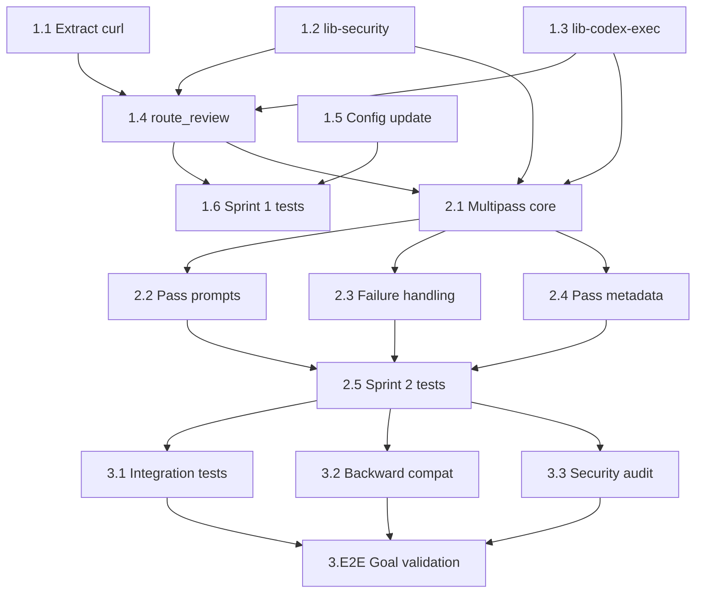

# Sprint Plan: Codex CLI Integration for GPT Review

> Cycle: cycle-033 | PRD: grimoires/loa/prd.md | SDD: grimoires/loa/sdd.md
> Sprints: 3 | Team: 1 developer (AI-assisted)
> Source: [#400](https://github.com/0xHoneyJar/loa/issues/400)

---

## Executive Summary

Replace direct curl-based API calls in `gpt-review-api.sh` (963 lines) with OpenAI Codex CLI (`codex exec`) as the primary execution backend. Introduces 4 extracted library files, a 3-pass reasoning sandwich orchestrator, and auth/security hardening. Targets ≤300 lines in the main script with full backward compatibility.

**Total scope:** 3 sprints, ~15 tasks, MEDIUM complexity per sprint.

---

## Sprint 1: Extraction + Codex Adapter (Foundation)

**Scope:** MEDIUM (6 tasks)
**Sprint Goal:** Extract curl logic into a library, create the Codex exec adapter with capability detection, implement execution routing, and establish auth + security foundations.

> Ground truth: SDD §3.1 (entry point), §3.2 (codex adapter), §3.4 (curl extraction), §3.5 (security)

### Deliverables

- [ ] `lib-curl-fallback.sh` — extracted curl/retry/parsing logic from current `gpt-review-api.sh`
- [ ] `lib-security.sh` — auth management (env-only), secret redaction (jq-based), log filtering
- [ ] `lib-codex-exec.sh` — capability detection, single `codex exec` invocation, workspace management
- [ ] Refactored `gpt-review-api.sh` with `route_review()` execution router
- [ ] `--fast` flag for single-pass codex mode
- [ ] Test suite for routing, capabilities, auth, and redaction

### Technical Tasks

- [ ] **Task 1.1:** Extract curl logic → `lib-curl-fallback.sh` → **[G2, G7]**
  - Move `call_api()`, `call_api_via_model_invoke()`, `normalize_json_response()`, `validate_agent_response()`, `parse_chat_completion()`, `parse_responses_api()` from `gpt-review-api.sh`
  - Add double-source guard (`_LIB_CURL_FALLBACK_LOADED`)
  - Preserve all retry logic (3 retries, exponential backoff)
  - **Remove** config-file auth pattern; migrate to env-only auth (`OPENAI_API_KEY`) consistent with SDD env-only mandate (Flatline SKP-001 resolution). `lib-security.sh:ensure_codex_auth()` becomes the single auth path for both codex and curl.
  - **AC:** Existing callers (review-sprint, audit-sprint) produce identical output
  - **AC:** All exit codes (0-5) unchanged
  - **AC:** `gpt-review-api.sh` sources `lib-curl-fallback.sh` and calls extracted functions

- [ ] **Task 1.2:** Create `lib-security.sh` → **[G7]**
  - `ensure_codex_auth()`: Env-only auth (never calls `codex login`). Return 0 if `OPENAI_API_KEY` set, 1 otherwise (SDD §3.5, SKP-003 resolution)
  - `redact_secrets()`: jq-based for JSON (redact string VALUES only, never keys), sed for text (SDD §3.5, SKP-004 resolution). Post-redaction structural diff: verify key count unchanged before/after (Flatline SKP-004 resolution). Load additional patterns from `flatline_protocol.secret_scanning.patterns`. Validate JSON integrity post-redaction.
  - `redact_log_output()`: Filter stderr before logging
  - `SENSITIVE_FILE_PATTERNS` deny list for output audit
  - **AC:** API keys matching `sk-...` and `sk-ant-...` are replaced with `[REDACTED]`
  - **AC:** JSON output remains valid after redaction
  - **AC:** Config patterns with >200 char length are skipped with warning

- [ ] **Task 1.3:** Create `lib-codex-exec.sh` → **[G1, G2]**
  - `CODEX_MIN_VERSION="0.1.0"` — minimum supported version; fail with actionable message if older (Flatline IMP-003)
  - `codex_is_available()`: `command -v codex` + version check against `CODEX_MIN_VERSION`
  - `detect_capabilities()`: Probe flags by running real no-op commands, parse stderr for "unknown option" (SDD §2.2, SKP-001 resolution). Version-pinned stderr expectations: document expected error format per `CODEX_MIN_VERSION` and add integration test validating probe against real binary (Flatline SKP-002 resolution). Cache to `/tmp/loa-codex-caps-<hash>-$$.json` (PID-scoped for concurrency, IMP-003)
  - `codex_has_capability(flag)`: Read from cache
  - `codex_exec_single()`: Execute single invocation with `--sandbox read-only`, `--ephemeral`, `--skip-git-repo-check`, `--output-last-message`. Wrap with `timeout` command (Flatline IMP-004)
  - `parse_codex_output()`: Normalize output — try JSON, markdown-fenced JSON, greedy JSON extraction (SDD §3.2, IMP-007)
  - `setup_review_workspace()` / `cleanup_workspace()`: Temp dir management
  - Default mode: diff-only (no `--cd` to repo root). `--tool-access` flag enables sandboxed repo access: copy only allowed files (source code, configs — NOT `.env`, `.git/config`, `*.pem`, credentials) to a temp workspace, then `--cd <temp-workspace>`. Deny list becomes allow list. (SDD SKP-002 resolution + Flatline SKP-006 resolution)
  - **AC:** `codex_is_available` returns 1 when codex not on PATH
  - **AC:** Capabilities cached per version+PID, not re-probed per review
  - **AC:** When `execution_mode=codex` and required flags missing, exit code 2 (hard fail)
  - **AC:** When `execution_mode=auto` and codex fails, silent fallback to curl

- [ ] **Task 1.4:** Implement `route_review()` in `gpt-review-api.sh` → **[G1, G3, G5]**
  - Add `--fast` CLI flag parsing
  - Read `gpt_review.execution_mode` from config (default: `auto`)
  - Routing: Hounfour → Codex → curl (SDD §3.1)
  - Source all 4 libraries at script top
  - Remove extracted functions, replace with library calls
  - Preserve all existing flags: `--expertise`, `--context`, `--content`, `--output`, `--iteration`, `--previous`, `--type`
  - **AC:** `gpt-review-api.sh` line count ≤300 (measured by `wc -l`)
  - **AC:** All 4 review types (code, prd, sdd, sprint) produce valid output via Codex path
  - **AC:** `--fast` produces single-pass output conforming to `gpt-review-response.schema.json`

- [ ] **Task 1.5:** Update `.loa.config.yaml.example` with new config → **[G5]**
  - Add `execution_mode: auto` under `gpt_review`
  - Add `reasoning_mode: multi-pass` under `gpt_review`
  - Add `tool_access: false` under `gpt_review`
  - Add `pass_budgets` section with defaults
  - Document all new options with inline comments
  - **AC:** Config example has all new options with descriptions
  - **AC:** Existing config without new options still works (defaults)

- [ ] **Task 1.6:** Sprint 1 tests → **[G3, G7]**
  - `test_routing.bats`: Hounfour route, codex route, curl fallback, execution_mode override
  - `test_codex_adapter.bats`: Capability detection, cache, version probe
  - `test_security.bats`: Auth (env present/absent, CI=true), redaction (API keys, custom patterns, JSON integrity), deny list
  - `test_curl_fallback.bats`: Extraction parity — same input/output as pre-refactor
  - Mock codex binary via `mock_codex.bash` on PATH
  - Test fixtures: sample diff, sample PRD, mock responses
  - **AC:** All bats tests pass
  - **AC:** ≥15 test cases covering routing, auth, redaction, and fallback

### Dependencies

- None (foundation sprint)

### Risks & Mitigation

| Risk | Mitigation |
|------|------------|
| Curl extraction introduces regressions | Before/after output comparison on real review |
| Codex not available in test environment | Mock binary covers all test paths |

### Success Metrics

- `gpt-review-api.sh` ≤ 300 lines
- All existing callers produce identical output
- ≥15 test cases passing

---

## Sprint 2: Multi-Pass Reasoning Orchestrator

**Scope:** MEDIUM (5 tasks)
**Sprint Goal:** Implement the 3-pass reasoning sandwich orchestrator with per-pass context budgets, failure handling, and intermediate output persistence.

> Ground truth: SDD §3.3 (multipass), PRD FR3 (multi-pass reasoning sandwich)

### Deliverables

- [ ] `lib-multipass.sh` — 3-pass orchestration with budget enforcement
- [ ] Pass-specific prompt builders (xhigh/high/xhigh)
- [ ] Per-pass failure handling (degrade, retry, skip)
- [ ] Intermediate pass files in `grimoires/loa/a2a/gpt-review/`
- [ ] `reasoning_mode` config integration
- [ ] Test suite for all pass success/failure combinations

### Technical Tasks

- [ ] **Task 2.1:** Create `lib-multipass.sh` core orchestrator → **[G6]**
  - `run_multipass()`: 3-pass execution loop with intermediate capture
  - Token budget constants: configurable via config + env override (SDD §3.3, IMP-001)
  - `enforce_token_budget()`: Truncate with priority (findings > context > metadata)
  - `estimate_token_count()`: Approximate token counting (chars/4 heuristic + `tiktoken` if available) for budget enforcement before codex invocation (Flatline IMP-001)
  - `check_budget_overflow()`: Auto-switch to --fast if remaining time < pass_timeout (IMP-005)
  - Per-pass timeout tracking with total budget (IMP-002). Wrap each `codex exec` invocation with `timeout(1)` command; configurable per-pass (`CODEX_PASS1_TIMEOUT`, etc.) with total ceiling (Flatline IMP-004)
  - Intermediate output to `grimoires/loa/a2a/gpt-review/<type>-pass-{1,2,3}.json` (PID-suffixed in CI)
  - CI concurrency isolation: use `$CI_JOB_ID` or `$$` prefix for all intermediate files and cache paths to prevent cross-job collisions (Flatline IMP-002)
  - **AC:** 3 passes execute sequentially, each producing output
  - **AC:** Token budgets enforced: Pass 1 output ≤4000, Pass 2 output ≤6000 tokens
  - **AC:** `estimate_token_count()` returns within 10% of actual for English text
  - **AC:** Budget overflow triggers auto-switch to single-pass with log warning
  - **AC:** Each pass respects its `timeout` ceiling; total 3-pass time ≤ configured maximum

- [ ] **Task 2.2:** Implement pass-specific prompt builders → **[G6]**
  - `build_pass1_prompt()`: xhigh — "Think step-by-step about the full codebase structure, dependencies, and change surface area before summarizing"
  - `build_pass2_prompt()`: high — "Focus on finding concrete issues efficiently. Do not over-analyze."
  - `build_pass3_prompt()`: xhigh — "Carefully verify each finding. Check for false positives. Validate file:line references exist."
  - `build_combined_prompt()`: For --fast single-pass mode (combines all three instructions)
  - Prompts embed the reasoning depth guidance since `codex exec` has no compute tier flags (PRD IMP-009)
  - **AC:** Each prompt includes the appropriate reasoning instruction
  - **AC:** Combined prompt includes condensed versions of all three instructions
  - **AC:** Document reviews use inline content; code reviews use file reference (when tool-access enabled)

- [ ] **Task 2.3:** Implement per-pass failure handling → **[G7]**
  - Pass 1 fails → fall back to single-pass (SDD §6.1, PRD IMP-002)
  - Pass 2 fails → retry once, then exit 1
  - Pass 3 fails → return Pass 2 output with `"verification": "skipped"` flag
  - Rate limit (429) → exponential backoff (5s, 15s, 45s) then fail the pass
  - `inject_verification_skipped()`: Add `verification` field to Pass 2 output
  - All failures logged with pass number, error type, fallback action
  - **AC:** Pass 1 failure degrades gracefully to single-pass (not error)
  - **AC:** Pass 3 failure produces valid schema-conformant output
  - **AC:** Rate limit backoff respects per-pass timeout

- [ ] **Task 2.4:** Add `pass_metadata` to response → **[G4, G6]**
  - Optional `pass_metadata` field: `passes_completed`, per-pass token counts, total duration, reasoning_mode
  - Optional `verification` field: "passed" | "skipped" | null
  - Backward-compatible with existing schema (new fields are optional)
  - Secret redaction applied to all pass outputs before persistence (SDD §3.3)
  - **AC:** Response includes `pass_metadata` when multi-pass is used
  - **AC:** Existing schema validation still passes (additive fields)

- [ ] **Task 2.5:** Sprint 2 tests → **[G3]**
  - `test_multipass.bats`: All 3 passes succeed, Pass 1 fail → single-pass, Pass 2 fail → retry → error, Pass 3 fail → verification skipped
  - Budget enforcement: oversized Pass 1 output gets truncated, context overflow triggers --fast
  - Token estimation accuracy check
  - Intermediate file creation and cleanup
  - Mock codex returning different responses per pass
  - **AC:** All bats tests pass
  - **AC:** ≥12 test cases covering all pass/failure combinations

### Dependencies

- Sprint 1 complete (lib-codex-exec.sh, lib-security.sh, route_review required)

### Risks & Mitigation

| Risk | Mitigation |
|------|------------|
| Token budget too restrictive for large reviews | Budgets configurable via config/env |
| 3x latency breaks autonomous run timeouts | --fast flag + budget overflow auto-switch |

### Success Metrics

- Multi-pass review produces findings with higher `file:line` rate than single-pass
- All failure degradation paths work correctly
- ≥12 test cases passing

---

## Sprint 3: Integration + Hardening

**Scope:** MEDIUM (4 tasks)
**Sprint Goal:** End-to-end integration testing, backward compatibility verification, Hounfour coexistence, and final security audit.

> Ground truth: SDD §7.3 (test matrix), §8 (security architecture), PRD G3-G5 (parity, schema, config compat)

### Deliverables

- [ ] End-to-end integration tests with mock codex
- [ ] Backward compatibility verification (exit codes, output format, CLI flags)
- [ ] Hounfour routing verification
- [ ] Security audit (redaction, deny list, no leaked secrets)
- [ ] E2E goal validation

### Technical Tasks

- [ ] **Task 3.1:** Integration tests → **[G3, G4, G5]**
  - `test_integration.bats`: Full end-to-end: `gpt-review-api.sh` → routing → codex/curl → response → validation
  - Test all 4 review types (code, prd, sdd, sprint) through codex path
  - Test all 4 review types through curl fallback path
  - Test Hounfour routing when `flatline_routing: true`
  - Test `--fast` + `--tool-access` flag combinations
  - Test iteration/re-review workflow (--iteration 2 --previous findings.json)
  - Verify output file format matches pre-refactor output
  - **AC:** All review types produce schema-valid output in all 3 execution modes
  - **AC:** Exit codes match spec (0-5) across all paths
  - **AC:** ≥20 integration test cases

- [ ] **Task 3.2:** Backward compatibility verification → **[G3, G4, G5]**
  - Run pre-refactor `gpt-review-api.sh` (from git) and post-refactor on same input
  - Compare: exit codes, output schema conformance, verdict consistency
  - Verify all existing flags work unchanged
  - Verify callers need zero changes: check review-sprint, audit-sprint, flatline for any hardcoded assumptions
  - Verify config without new options uses correct defaults
  - **AC:** Pre/post output is schema-equivalent (same verdict for same input)
  - **AC:** No caller script changes required
  - **AC:** Line count: `gpt-review-api.sh` ≤ 300 lines (final verification)

- [ ] **Task 3.3:** Security audit → **[G7]**
  - Run all redaction tests with real API key patterns
  - Verify no API keys in any output file (grep for `sk-` in `grimoires/loa/a2a/gpt-review/`)
  - Verify JSON integrity post-redaction (all output files valid JSON)
  - Verify `--tool-access` off by default (no repo-root access without explicit opt-in)
  - Verify CI mode (`CI=true`) never attempts codex login
  - Verify capability probe hard-fails for `execution_mode=codex` when flags missing
  - Test with sensitive file patterns in mock output (`.env`, `*.pem`)
  - **AC:** Zero secrets found in any persistent output file
  - **AC:** All security invariants from SDD §8.2 verified by test
  - **AC:** Deny list patterns trigger redaction in mock output

- [ ] **Task 3.E2E:** End-to-End Goal Validation → **[G1-G7]**
  - G1: `wc -l gpt-review-api.sh` ≤ 300
  - G2: `grep -c 'curl ' gpt-review-api.sh` = 0 (in primary path; curl is in lib-curl-fallback.sh)
  - G3: All 4 review types pass through codex path
  - G4: All output conforms to `gpt-review-response.schema.json`
  - G5: Config without new options works (all defaults)
  - G6: Multi-pass findings include more `file:line` references than single-pass (measured on test content)
  - G7: Remove codex from PATH → reviews still succeed via curl fallback
  - **AC:** All 7 goals validated with evidence
  - **P0 — Must Complete**

### Dependencies

- Sprint 1 and Sprint 2 complete

### Risks & Mitigation

| Risk | Mitigation |
|------|------------|
| Integration surface is large (3 modes × 4 types × 2 pass modes) | Structured test matrix covers critical paths |
| Pre/post comparison may differ due to model non-determinism | Compare schema structure, not content |

### Success Metrics

- All 7 PRD goals validated
- ≥20 integration test cases passing
- Zero secrets in output files
- Zero caller changes required

---

## Appendix A: Task Dependencies

## Appendix B: Risk Register

| ID | Risk | Sprint | Probability | Impact | Mitigation |
|----|------|--------|-------------|--------|------------|
| R1 | Curl extraction regressions | 1 | Low | High | Before/after output comparison |
| R2 | Codex not in test env | 1 | Medium | Low | Mock binary |
| R3 | Token budgets too restrictive | 2 | Medium | Low | Configurable via config/env |
| R4 | 3x latency in autonomous runs | 2 | Certain | Medium | --fast + auto-switch |
| R5 | Integration test matrix too large | 3 | Low | Medium | Focus on critical paths |
| R6 | Model non-determinism in comparison | 3 | High | Low | Compare schema, not content |

## Appendix C: Goal Traceability

| Goal | Description | Contributing Tasks |
|------|-------------|-------------------|
| G1 | ≤300 lines in gpt-review-api.sh | 1.1, 1.3, 1.4, 3.E2E |
| G2 | 0 curl calls in primary path | 1.1, 1.4, 3.E2E |
| G3 | All 4 review types work | 1.4, 1.6, 2.5, 3.1, 3.2, 3.E2E |
| G4 | Schema validation preserved | 2.4, 3.1, 3.2, 3.E2E |
| G5 | Config compatibility | 1.4, 1.5, 3.1, 3.2, 3.E2E |
| G6 | Review quality improvement | 2.1, 2.2, 3.E2E |
| G7 | Graceful degradation | 1.1, 1.2, 1.3, 2.3, 3.3, 3.E2E |

---

*Generated by Sprint Planner • Cycle: cycle-033 • Source: [#400](https://github.com/0xHoneyJar/loa/issues/400)*
