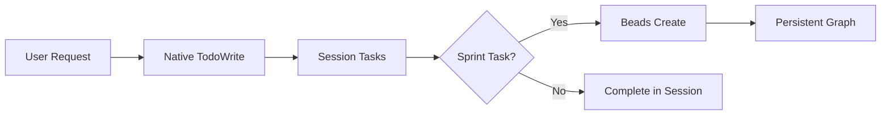

# Task System Comparison: Claude Code Native vs Beads

**Date**: 2026-01-29
**Version**: 1.0
**Status**: Research Complete

---

## Executive Summary

This document compares Claude Code's native task management system (TodoWrite/TaskUpdate) with the Beads integration used by Loa. The conclusion is that **both systems serve different purposes and should coexist**.

| Aspect | Claude Code Native | Beads (beads_rust) |
|--------|-------------------|-------------------|
| **Purpose** | Session-local task tracking | Persistent graph-based task management |
| **Persistence** | Session only | SQLite + JSONL (git-friendly) |
| **Scope** | Single conversation | Cross-session, cross-cycle |
| **Dependencies** | None | Full DAG support |
| **Recommendation** | Use for in-session todos | Use for sprint/cycle planning |

---

## 1. Claude Code Native Task System

### 1.1 Overview

Claude Code's native task system uses the `TodoWrite` tool to create and manage a task list during a conversation. Tasks are visible to the user and help organize multi-step work.

### 1.2 Capabilities

| Feature | Support | Notes |
|---------|---------|-------|
| Create tasks | Yes | Via TodoWrite tool |
| Update status | Yes | pending, in_progress, completed |
| Delete tasks | Yes | Remove from array |
| Parallel tracking | Yes | Multiple tasks at once |
| Dependencies | No | No dependency tracking |
| Persistence | No | Session-only |
| Cross-session | No | Lost on session end |

### 1.3 Task Schema

```json
{
  "content": "Task description",
  "status": "pending|in_progress|completed",
  "activeForm": "Present participle form"
}
```

### 1.4 Use Cases

- **Multi-step implementation**: Track steps during `/implement`
- **Bug fixing**: Track multiple fixes in a session
- **Research tasks**: Track exploration progress
- **User visibility**: Show progress to user

### 1.5 Limitations

1. **No persistence**: Tasks lost when session ends
2. **No dependencies**: Cannot model "A must complete before B"
3. **No cross-session**: Cannot resume task list from previous session
4. **No history**: No record of completed tasks over time
5. **Single context**: Cannot coordinate across parallel agents

---

## 2. Beads Integration (beads_rust)

### 2.1 Overview

Beads is a graph-based task management system using SQLite for fast queries and JSONL for git-friendly diffs. It provides persistent, dependency-aware task tracking.

### 2.2 Capabilities

| Feature | Support | Notes |
|---------|---------|-------|
| Create tasks | Yes | `br create` |
| Update status | Yes | open, in_progress, review, closed |
| Delete tasks | Yes | `br close --delete` |
| Dependencies | Yes | Full DAG with `br dep add` |
| Persistence | Yes | SQLite + JSONL |
| Cross-session | Yes | Full history preserved |
| Cross-cycle | Yes | Via Sprint Ledger |
| Comments | Yes | `br comments add` |
| Search | Yes | `br search`, `br list` |

### 2.3 Bead Schema

```yaml
id: beads-abc123
title: "Implement authentication"
status: in_progress
dependencies: [beads-xyz789]
metadata:
  sprint: sprint-1
  cycle: cycle-001
  goal_ids: [G-1, G-2]
created_at: 2026-01-29T10:00:00Z
```

### 2.4 Use Cases

- **Sprint planning**: Model task dependencies
- **Cycle tracking**: Persist across development cycles
- **Audit trail**: Full history of task changes
- **Cross-agent coordination**: Shared state between skills
- **Goal traceability**: Link tasks to PRD goals

### 2.5 Limitations

1. **External dependency**: Requires `br` CLI installed
2. **Complexity**: More overhead than simple todo list
3. **Sync required**: Must sync at session boundaries
4. **Learning curve**: Graph concepts not intuitive for everyone

---

## 3. Feature Comparison Matrix

| Feature | Native | Beads | Winner |
|---------|--------|-------|--------|
| **Setup complexity** | None | Install br CLI | Native |
| **Session tasks** | Simple | Overkill | Native |
| **Persistence** | No | Yes | Beads |
| **Dependencies** | No | Yes | Beads |
| **Cross-session** | No | Yes | Beads |
| **Git integration** | No | JSONL diffs | Beads |
| **User visibility** | Real-time | Query required | Native |
| **Parallel agents** | No | Yes | Beads |
| **Goal traceability** | No | Yes | Beads |
| **Sprint correlation** | No | Yes | Beads |

---

## 4. Overlap and Gaps

### 4.1 Overlap (Both Can Do)

- Create/update/complete tasks
- Track multiple tasks at once
- Filter by status

### 4.2 Native Gaps (Beads Fills)

- **Persistence**: Beads preserves across sessions
- **Dependencies**: Beads models task ordering
- **History**: Beads maintains full audit trail
- **Coordination**: Beads enables cross-agent work

### 4.3 Beads Gaps (Native Fills)

- **User visibility**: Native shows real-time in UI
- **Simplicity**: Native requires no setup
- **Session-local**: Native better for ephemeral tasks

---

## 5. Recommendation: Coexist (Different Purposes)

### 5.1 Strategy

Use both systems for their strengths:

| Scenario | Use Native | Use Beads |
|----------|------------|-----------|
| In-session todos | Yes | No |
| Sprint tasks | No | Yes |
| Bug fixing steps | Yes | No |
| Cycle planning | No | Yes |
| Goal tracking | No | Yes |
| User progress | Yes | No |
| Audit trail | No | Yes |

### 5.2 Integration Pattern



### 5.3 Workflow

1. **Session Start**: `br sync --import-only` loads Beads state
2. **During Session**: TodoWrite for ephemeral tracking
3. **Sprint Tasks**: Create Beads for persistent tracking
4. **Session End**: `br sync --flush-only` persists changes

### 5.4 Non-Integration (Avoid)

Do NOT try to:
- Sync every TodoWrite to Beads (overhead, noise)
- Replace Beads with native (loses persistence)
- Replace native with Beads queries (loses UI)

---

## 6. Migration Considerations

### 6.1 If Claude Code Native Gains Persistence

If Anthropic adds persistence to native tasks:
- Re-evaluate for simple workflows
- Beads still needed for dependencies/DAG
- Consider native for single-session sprints

### 6.2 If Beads Gains UI Integration

If Beads adds real-time UI:
- Could replace native for sprint tasks
- Still use native for quick ephemeral todos
- Integration would simplify workflow

---

## 7. Implementation Notes for Loa

### 7.1 Current State

- Native: Used by implementing-tasks for session tracking
- Beads: Used by planning-sprints for sprint graph

### 7.2 No Changes Needed

The current dual-system approach is correct:
- Native for `/implement` session todos
- Beads for `/sprint-plan` task graph
- Sprint Ledger for cycle correlation

### 7.3 Future Consideration

If Claude Code 2.2.0+ adds native persistence:
- Review this document
- Evaluate overlap increase
- Consider simplification

---

## 8. Conclusion

**Recommendation**: Keep both systems.

- **Claude Code Native**: Best for in-session, user-visible todos
- **Beads**: Best for persistent, dependency-aware sprint planning

They serve complementary purposes. Trying to use only one would degrade either:
- User experience (no native)
- Persistence/dependencies (no Beads)

The coexistence pattern documented here is the optimal approach.

---

## References

- [Claude Code TodoWrite Documentation](https://code.claude.com/docs/en/tools)
- [beads_rust Repository](https://github.com/0xHoneyJar/beads_rust)
- [Loa Sprint Ledger Protocol](../../.claude/protocols/sprint-ledger.md)
- [Loa Beads Integration Protocol](../../.claude/protocols/beads-integration.md)
